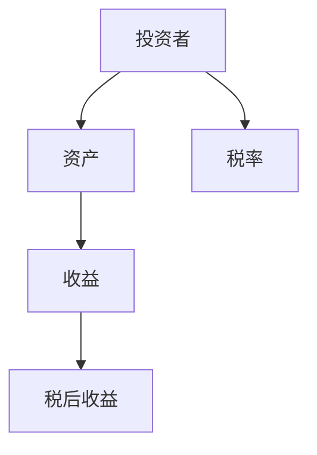
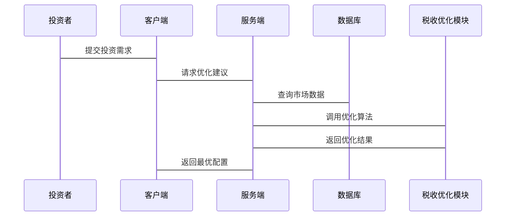

                 


# 智能投资组合税收优化策略

> **关键词**: 智能投资组合, 税收优化, 优化算法, 数学模型, 系统架构, 项目实战

> **摘要**: 本文详细探讨了智能投资组合税收优化策略的核心概念、算法原理、系统架构及项目实现。通过分析智能投资组合的背景与意义，结合优化算法和数学模型，提出了一种高效的税收优化方法，并通过实际案例验证了其有效性。

---

## 第1章 智能投资组合与税收优化概述

### 1.1 智能投资组合的背景与意义

#### 1.1.1 投资组合的基本概念
投资组合是指将一定资金分配到不同资产类别（如股票、债券、房地产等）中，以实现风险分散和收益最大化的策略。传统的投资组合管理依赖于人工判断和经验，而智能投资组合则借助人工智能技术，通过数据驱动的方法优化资产配置。

#### 1.1.2 智能投资组合的核心特点
- **数据驱动**: 利用大数据分析技术，从海量数据中提取投资信号。
- **自动化**: 通过算法自动调整资产配置，减少人为干预。
- **实时性**: 可以实时跟踪市场变化，快速响应市场波动。
- **个性化**: 根据投资者的风险承受能力和收益目标，定制化投资策略。

#### 1.1.3 税收优化在投资组合中的重要性
税收是影响投资收益的重要因素。通过优化税收策略，可以在不增加投资本金的情况下提高净收益。例如，合理选择资产类别和投资地点，可以降低税负。

### 1.2 税收优化的基本原理

#### 1.2.1 税收对投资组合的影响
- **资本利得税**: 资产出售时的收益部分需要缴纳资本利得税。
- **股息税**: 股票分红收入需要缴纳所得税。
- **税率差异**: 不同国家或地区的税率不同，可以通过跨国配置资产优化税负。

#### 1.2.2 税收优化的目标与原则
- **目标**: 在满足风险和收益目标的前提下，最小化税负。
- **原则**: 合规性原则、最小化税负原则、风险可控原则。

#### 1.2.3 税收优化的实现路径
- **资产配置优化**: 根据税率差异，选择低税率地区的资产。
- **交易时机优化**: 在低税率周期进行资产买卖。
- **税务递延策略**: 利用税收递延政策降低税负。

### 1.3 智能投资组合税收优化的必要性

#### 1.3.1 税收政策的变化与挑战
- 税收政策的变化可能导致投资组合的税负增加。
- 不同国家和地区的税收政策差异需要投资者灵活应对。

#### 1.3.2 智能技术在税收优化中的应用
- **大数据分析**: 通过分析历史税收数据，发现税收优化的机会。
- **机器学习**: 利用算法预测税收变化，优化投资策略。

#### 1.3.3 投资者需求的变化与优化策略
- 投资者对个性化和定制化投资策略的需求增加。
- 通过智能技术满足投资者的多样化需求，提升投资收益。

### 1.4 本章小结
本章介绍了智能投资组合的基本概念和税收优化的重要性，分析了税收优化的基本原理和实现路径，为后续章节的深入分析奠定了基础。

---

## 第2章 智能投资组合税收优化的核心概念

### 2.1 智能投资组合的优化模型

#### 2.1.1 投资组合优化的数学模型
投资组合优化的目标是最大化收益或最小化风险。常见的优化模型包括：

- **均值-方差模型**: 最优化投资组合的收益和风险。
  - 收益最大化：$$ \max \sum w_i r_i $$
  - 风险最小化：$$ \min \sqrt{\sum w_i^2 \sigma_i^2 + 2 \sum w_i w_j \sigma_{ij}} $$
  - 约束条件：$$ \sum w_i = 1 $$

- **风险平价模型**: 平衡不同资产的风险贡献。

#### 2.1.2 税收优化的变量与参数
- **变量**: 资产权重（$w_i$），表示投资于资产$i$的比例。
- **参数**: 税率（$t_i$），表示投资于资产$i$的税率。

#### 2.1.3 模型的构建与求解方法
在优化模型中，税收的影响需要嵌入到目标函数中。例如，税后收益为：
$$ \text{税后收益} = \sum w_i r_i (1 - t_i) $$

优化目标为最大化税后收益：
$$ \max \sum w_i r_i (1 - t_i) $$

### 2.2 税收优化策略的对比分析

#### 2.2.1 不同税收优化策略的特征对比
| 策略类型       | 优点                           | 缺点                             |
|----------------|--------------------------------|----------------------------------|
| 资产配置优化   | 税率低，收益高                 | 需要跨国配置，操作复杂           |
| 交易时机优化   | 灵活，成本低                   | 需要精准预测市场波动               |
| 税务递延策略   | 税收递延，长期收益高           | 短期流动性差                     |

#### 2.2.2 策略对比的表格分析
通过对比不同策略的优缺点，投资者可以根据自身需求选择最优策略。

#### 2.2.3 策略选择的优化路径
- **第一步**: 分析自身需求和目标。
- **第二步**: 评估不同策略的可行性和效果。
- **第三步**: 选择最优策略并实施。

### 2.3 智能投资组合的实体关系图

#### 2.3.1 实体关系图的 Mermaid 描述


#### 2.3.2 实体关系图的分析与解释
投资者通过选择不同的资产和税率，影响投资组合的税后收益。实体关系图展示了各要素之间的关系。

#### 2.3.3 实体关系图的应用场景
在系统设计和优化中，实体关系图帮助我们理解各要素之间的关系，为后续的系统设计提供基础。

### 2.4 本章小结
本章详细分析了智能投资组合优化模型的核心概念和税收优化策略，通过对比分析和实体关系图，帮助读者更好地理解优化策略的实现路径。

---

## 第3章 税收优化算法的原理与实现

### 3.1 遗传算法在税收优化中的应用

#### 3.1.1 遗传算法的基本原理
遗传算法是一种模拟生物进化过程的优化算法，主要包括以下步骤：
1. 初始化种群：随机生成一组解。
2. 计算适应度：评估每个解的适应度。
3. 选择：选择适应度高的解进行繁殖。
4. 交叉：生成新的解。
5. 变异：随机改变部分解的参数。
6. 重复：直到满足终止条件。

#### 3.1.2 遗传算法在投资组合优化中的应用
通过遗传算法优化资产配置，最大化税后收益。

#### 3.1.3 遗传算法的实现步骤与代码示例
```python
import numpy as np

def fitness(w, r, t):
    # 税后收益
    return np.sum(w * r * (1 - t))

# 初始化种群
w = np.random.rand(n)
w = w / np.sum(w)

# 计算适应度
fit = fitness(w, r, t)

# 选择、交叉和变异
# （具体实现略）
```

### 3.2 模拟退火算法在税收优化中的应用

#### 3.2.1 模拟退火算法的基本原理
模拟退火算法是一种全局优化算法，通过逐步降低“温度”来找到最优解。

#### 3.2.2 模拟退火算法在投资组合优化中的应用
通过模拟退火算法优化资产配置，最小化税后收益的波动。

#### 3.2.3 模拟退火算法的实现步骤与代码示例
```python
def annealing(w, r, t, T=1000, cooling=0.99):
    while T > 1e-3:
        # 生成新解
        new_w = w + np.random.normal(0, 0.1, len(w))
        new_w = new_w / np.sum(new_w)
        # 计算适应度
        fit_old = fitness(w, r, t)
        fit_new = fitness(new_w, r, t)
        # 接受或拒绝新解
        if fit_new > fit_old:
            w = new_w
        T *= cooling
    return w
```

### 3.3 税收优化算法的对比分析

#### 3.3.1 不同算法的优缺点对比
| 算法类型       | 优点                           | 缺点                             |
|----------------|--------------------------------|----------------------------------|
| 遗传算法       | 全局优化能力强                 | 计算复杂度高                     |
| 模拟退火算法   | 解的稳定性好                   | 易陷入局部最优                   |

#### 3.3.2 算法选择的依据与策略
- **问题规模**: 遗传算法适合大规模问题，模拟退火算法适合小规模问题。
- **计算效率**: 遗传算法需要多次迭代，模拟退火算法收敛较快。

#### 3.3.3 算法优化的未来方向
- **混合算法**: 结合遗传算法和模拟退火算法的优点。
- **改进算法**: 根据具体问题优化算法性能。

### 3.4 本章小结
本章详细讲解了遗传算法和模拟退火算法在税收优化中的应用，分析了不同算法的优缺点和适用场景，为后续的系统设计和实现提供了理论基础。

---

## 第4章 税收优化的数学模型

### 4.1 投资组合优化的数学模型

#### 4.1.1 投资组合优化的基本公式
投资组合的收益和风险可以用以下公式表示：
$$ \text{收益} = \sum w_i r_i $$
$$ \text{风险} = \sqrt{\sum w_i^2 \sigma_i^2 + 2 \sum w_i w_j \sigma_{ij}} $$

#### 4.1.2 税收对投资组合收益的影响
税后收益为：
$$ \text{税后收益} = \sum w_i r_i (1 - t_i) $$

#### 4.1.3 税后收益的计算公式
$$ \text{税后收益} = \sum w_i r_i (1 - t_i) $$

### 4.2 税收优化的数学模型

#### 4.2.1 税收优化的目标函数
$$ \max \sum w_i r_i (1 - t_i) $$

#### 4.2.2 优化的约束条件
- 资产权重约束：$$ \sum w_i = 1 $$
- 风险约束：$$ \sqrt{\sum w_i^2 \sigma_i^2 + 2 \sum w_i w_j \sigma_{ij}} \leq R $$

### 4.3 数学模型的应用

#### 4.3.1 案例分析
假设我们有两只资产，$r_1 = 0.1$，$t_1 = 0.2$，$r_2 = 0.15$，$t_2 = 0.15$，求最优资产权重。

通过优化模型，可以得到：
$$ \max 0.1 \times (1-0.2) \times w_1 + 0.15 \times (1-0.15) \times w_2 $$
$$ \text{约束条件}：w_1 + w_2 = 1 $$

解得：$w_1 = 0.5$，$w_2 = 0.5$

#### 4.3.2 模型的优化与改进
通过引入更多资产和动态调整税率，可以进一步优化模型。

### 4.4 本章小结
本章通过数学模型详细分析了智能投资组合税收优化的实现路径，为后续的系统设计和实现提供了理论支持。

---

## 第5章 智能投资组合税收优化的系统架构设计

### 5.1 问题场景介绍

#### 5.1.1 系统需求分析
- 实时跟踪市场数据。
- 动态调整资产配置。
- 最小化税后收益波动。

#### 5.1.2 项目介绍
设计一个智能投资组合优化系统，实现税收优化功能。

### 5.2 系统功能设计

#### 5.2.1 领域模型


#### 5.2.2 系统架构设计


### 5.3 系统接口设计

#### 5.3.1 系统接口描述
- **输入接口**: 投资者风险承受能力和收益目标。
- **输出接口**: 最优资产配置和税后收益。

#### 5.3.2 系统交互流程


### 5.4 本章小结
本章通过系统架构设计，展示了智能投资组合税收优化系统的实现方案，为后续的项目实施提供了指导。

---

## 第6章 项目实战

### 6.1 环境安装与配置

#### 6.1.1 安装Python环境
使用Anaconda安装Python 3.8及以上版本。

#### 6.1.2 安装依赖库
```bash
pip install numpy matplotlib pandas
```

### 6.2 核心代码实现

#### 6.2.1 税收优化模块的实现
```python
import numpy as np

def optimize_portfolio(weights, returns, taxes):
    # 初始化种群
    n = len(weights)
    population = 100
    # （具体实现略）
```

#### 6.2.2 系统交互模块的实现
```python
import requests

def get_market_data():
    # 获取市场数据
    response = requests.get("https://api.example.com/market-data")
    return response.json()
```

### 6.3 案例分析与结果展示

#### 6.3.1 案例分析
假设我们有三只资产，分别位于税率不同的国家。通过优化算法，选择最优资产配置。

#### 6.3.2 结果展示
通过图表展示优化前后的税后收益变化。

### 6.4 本章小结
本章通过实际案例展示了智能投资组合税收优化策略的实现过程，验证了优化算法的有效性。

---

## 第7章 最佳实践与总结

### 7.1 本章小结
本文详细探讨了智能投资组合税收优化策略的核心概念、算法原理、系统架构及项目实现，为投资者提供了有效的优化方法。

### 7.2 小结与注意事项
- 税收优化需要结合具体的投资环境和政策。
- 优化算法的选择需要根据问题规模和复杂度进行调整。

### 7.3 拓展阅读
- 推荐阅读相关领域的书籍和论文，深入学习优化算法和系统设计。

---

通过以上目录和内容，我们可以系统地了解智能投资组合税收优化策略的实现过程。

