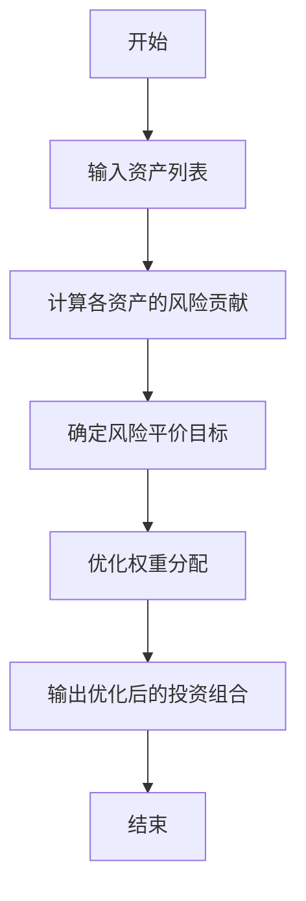
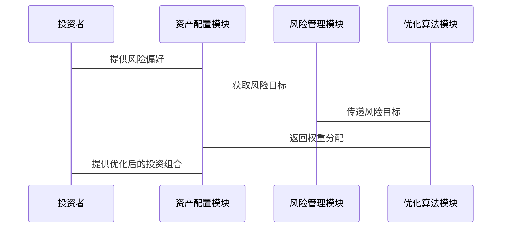

                 


# 智能投资组合风险平价策略优化

> 关键词：投资组合优化，风险平价策略，资产配置，数学模型，优化算法

> 摘要：本文探讨了智能投资组合风险平价策略的优化方法，从基础理论到算法实现，结合实际案例，分析了如何通过数学模型和优化算法提升投资组合的风险调整后收益。

---

# 第一部分: 智能投资组合风险平价策略优化的背景与基础

## 第1章: 投资学基础与风险平价策略背景

### 1.1 投资学基础

#### 1.1.1 资产组合的概念与定义
资产组合是指将不同资产（如股票、债券、基金等）按一定比例配置在一起的投资方式。通过分散投资，降低单一资产的风险。

#### 1.1.2 资产组合的风险与收益分析
投资组合的收益和风险是衡量投资效果的两个关键指标。收益通常通过预期收益率来衡量，而风险则通过波动率、VaR（Value at Risk）等指标衡量。

#### 1.1.3 投资组合理论的发展历程
投资组合理论起源于20世纪50年代，Markowitz的现代投资组合理论（MPT）奠定了基础，之后发展出CAPM、APT等理论，为风险平价策略提供了理论基础。

### 1.2 风险平价策略的背景

#### 1.2.1 风险平价策略的定义与特点
风险平价策略是一种将投资组合中各资产的风险贡献进行均衡化的方法，旨在降低投资组合的整体风险。

#### 1.2.2 风险平价策略与其他风险衡量方法的对比
- **VaR**：衡量在特定置信水平下的潜在损失，但不考虑尾部风险。
- **标准差**：衡量资产收益的波动性，但不能直接反映风险贡献。
- **风险平价**：根据各资产的风险贡献分配权重，更注重风险的分散。

#### 1.2.3 风险平价策略在投资组合管理中的应用
在实际投资中，风险平价策略被广泛应用于多资产配置，特别是在风险管理中，帮助投资者在不同市场环境下平衡风险。

### 1.3 问题背景与目标

#### 1.3.1 投资组合风险平价策略优化的问题背景
传统风险衡量方法存在不足，风险平价策略通过平衡各资产的风险贡献，优化投资组合的整体风险。

#### 1.3.2 问题描述与目标设定
目标是通过优化算法，构建一个风险平价的投资组合，使得整体风险最小化，同时实现预期收益最大化。

#### 1.3.3 优化目标与边界条件
- **目标**：最小化投资组合的风险，最大化收益。
- **约束条件**：权重非负，权重之和为1，满足流动性要求等。

## 第2章: 风险平价策略的核心概念与联系

### 2.1 风险平价策略的核心概念

#### 2.1.1 风险平价的定义与核心要素
风险平价是根据各资产的风险贡献分配权重，核心要素包括风险因子、权重分配、优化目标。

#### 2.1.2 风险平价策略的数学模型
数学模型定义了风险平价的计算方式，通常基于协方差矩阵和风险因子权重。

#### 2.1.3 风险平价策略与投资组合优化的关系
风险平价策略是投资组合优化中的一个重要环节，通过优化权重分配，实现风险平价。

### 2.2 核心概念的属性特征对比

#### 2.2.1 风险平价与传统风险衡量方法的对比分析
| 方法 | VaR | 标准差 | 风险平价 |
|------|-----|--------|----------|
| 优缺点 | 适用于特定情景，但尾部风险考虑不足 | 易受尾部事件影响 | 能够平衡各资产风险贡献 |

#### 2.2.2 不同风险平价策略的优缺点对比
| 策略 | 等权重风险平价 | 最优化风险平价 |
|------|----------------|---------------|
| 优点 | 简单易行 | 更优的风险分散 |
| 缺点 | 可能偏离最优配置 | 计算复杂 |

#### 2.2.3 风险平价策略在不同市场环境下的表现对比
在牛市中，风险平价策略表现稳健，而在熊市中，其分散风险的能力更强。

### 2.3 实体关系图与流程图

#### 2.3.1 风险平价策略的ER实体关系图
```mermaid
erDiagram
    actor 投资者
    actor 风险管理模块
    actor 资产配置模块
    投资者 --> 风险管理模块 : 提供风险偏好
    风险管理模块 --> 资产配置模块 : 传递风险目标
    资产配置模块 --> 投资者 : 提供优化后的投资组合
```

#### 2.3.2 风险平价策略的优化流程图


---

# 第二部分: 风险平价策略的算法原理与数学模型

## 第3章: 风险平价策略的数学模型

### 3.1 风险平价模型的构建

#### 3.1.1 风险平价模型的数学表达式
$$ \text{风险平价权重} = \frac{w_i \cdot \sigma_i}{\sum_{j=1}^{n} w_j \cdot \sigma_j} $$
其中，\( w_i \) 是资产i的权重，\( \sigma_i \) 是资产i的波动率。

#### 3.1.2 风险平价模型的优化目标函数
$$ \min \sum_{i=1}^{n} (w_i \cdot \sigma_i - \frac{1}{n} \sum_{j=1}^{n} w_j \cdot \sigma_j)^2 $$
其中，\( w_i \) 是资产i的权重，\( \sigma_i \) 是资产i的波动率。

#### 3.1.3 风险平价模型的约束条件
- \( \sum_{i=1}^{n} w_i = 1 \)
- \( w_i \geq 0 \)

### 3.2 风险平价策略的优化算法

#### 3.2.1 风险平价策略的优化方法
使用拉格朗日乘数法求解优化问题。

#### 3.2.2 基于拉格朗日乘数法的优化过程
通过构建拉格朗日函数，求解权重分配，使风险平价目标函数最小化。

#### 3.2.3 风险平价策略的数值解法
使用数值优化算法，如梯度下降法，进行求解。

---

### 第三部分: 系统分析与架构设计

---

接下来的内容将涉及系统分析与架构设计，包括问题场景介绍、系统功能设计、系统架构设计、系统接口设计和系统交互流程设计。

---

## 第4章: 系统分析与架构设计

### 4.1 问题场景介绍

#### 4.1.1 系统目标
构建一个智能投资组合风险平价策略优化系统，帮助投资者实现风险平价的投资组合。

#### 4.1.2 项目介绍
本项目旨在开发一个基于风险平价策略的投资组合优化系统，实现资产配置和风险管理的自动化。

### 4.2 系统功能设计

#### 4.2.1 领域模型设计


#### 4.2.2 系统架构设计


#### 4.2.3 系统接口设计
- 输入接口：投资者的风险偏好、资产列表。
- 输出接口：优化后的投资组合权重。

#### 4.2.4 系统交互流程设计


---

## 第5章: 项目实战

### 5.1 环境安装与配置

#### 5.1.1 环境需求
- Python 3.8+
- numpy, pandas, scipy, matplotlib

### 5.2 核心算法实现

#### 5.2.1 风险平价策略的代码实现
```python
import numpy as np

def risk_parity(weights, cov_matrix):
    # 计算风险平价权重
    n = len(weights)
    risk_contribution = weights * np.sqrt(np.diag(weights @ cov_matrix @ weights.T))
    return risk_contribution / np.sum(risk_contribution)

def optimize_risk_parity(n_assets, cov_matrix, target_volatility):
    # 使用拉格朗日乘数法优化权重分配
    w0 = np.array([1.0 / n_assets] * n_assets)
    result = scipy.optimize.minimize(
        lambda w: np.sum((risk_parity(w, cov_matrix) - 1/n_assets)**2),
        w0, 
        constraints={'type': 'eq', 'fun': lambda w: np.sum(w) - 1}
    )
    return result.x
```

### 5.3 案例分析与代码解读

#### 5.3.1 案例分析
假设我们有三个资产，其协方差矩阵为：
```python
cov_matrix = np.array([
    [0.04, 0.02, 0.01],
    [0.02, 0.03, 0.015],
    [0.01, 0.015, 0.02]
])
```

#### 5.3.2 代码实现与解读
```python
n_assets = 3
cov_matrix = np.array([
    [0.04, 0.02, 0.01],
    [0.02, 0.03, 0.015],
    [0.01, 0.015, 0.02]
])
weights = optimize_risk_parity(n_assets, cov_matrix, 0.05)
print(weights)
```

### 5.4 项目小结

#### 5.4.1 经验总结
通过风险平价策略优化，可以有效分散投资组合的风险，提高整体收益。

---

## 第6章: 最佳实践与拓展

### 6.1 小结
智能投资组合风险平价策略优化是一种有效的投资组合管理方法，通过数学模型和优化算法实现风险的均衡化，提高投资组合的整体收益。

### 6.2 注意事项
- 数据质量：确保输入数据的准确性和完整性。
- 模型选择：根据实际情况选择合适的优化算法。
- 风险管理：定期监控和调整投资组合。

### 6.3 拓展阅读
- 现代投资组合理论（MPT）
- 风险平价策略的进一步优化
- 多因子投资策略

---

# 结语
通过本文的详细分析，我们了解了智能投资组合风险平价策略优化的核心思想和实现方法。希望读者能够通过实际操作，掌握这一策略，并在投资实践中取得优异成绩。

