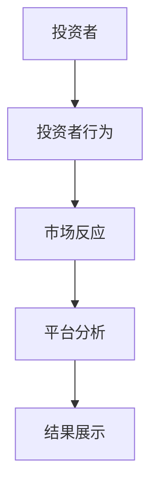
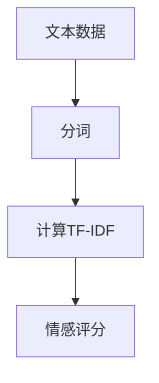
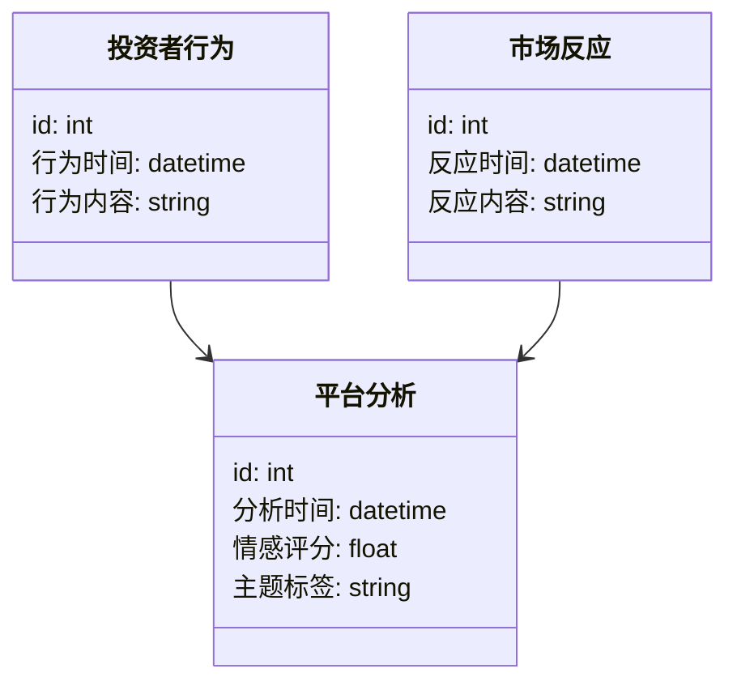
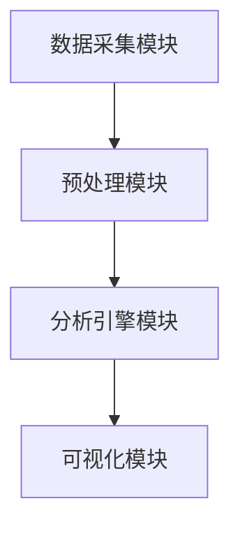
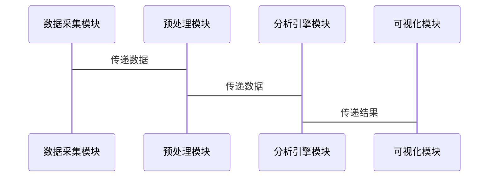

                 


# 智能投资者关系分析平台

> 关键词：智能投资者关系分析、人工智能、自然语言处理、情感分析、大数据分析、机器学习

> 摘要：智能投资者关系分析平台通过结合人工智能和大数据分析技术，能够实时监控和分析投资者情绪、市场动态和公司公告，为投资者和金融机构提供智能化的决策支持。本文将详细探讨该平台的核心概念、算法原理、系统架构以及项目实现过程。

---

## 第一部分: 智能投资者关系分析平台的背景与核心概念

### 第1章: 智能投资者关系分析平台的背景介绍

#### 1.1 问题背景与问题描述
##### 1.1.1 投资者关系管理的传统挑战
在传统的投资者关系管理中，企业通过电话、邮件、投资者会议等方式与投资者沟通，这种方式效率低下且难以捕捉投资者的真实情绪。同时，市场信息的海量增长使得人工分析变得越来越困难。

##### 1.1.2 AI技术在金融领域的应用潜力
人工智能（AI）技术在金融领域的应用日益广泛，尤其是在情感分析、自然语言处理和大数据分析方面。这些技术能够帮助我们从海量数据中提取有价值的信息，为投资决策提供支持。

##### 1.1.3 智能投资者关系分析平台的提出
为了应对传统投资者关系管理的挑战，结合AI技术的优势，提出智能投资者关系分析平台的概念。该平台能够实时监控市场动态，分析投资者情绪，提供智能化的决策支持。

#### 1.2 问题解决与边界定义
##### 1.2.1 平台的核心目标与功能
智能投资者关系分析平台的核心目标是通过AI技术实时分析投资者情绪、市场动态和公司公告，帮助投资者和金融机构做出更明智的投资决策。其主要功能包括数据采集、情感分析、主题建模和可视化展示。

##### 1.2.2 平台的边界与外延
该平台的边界包括数据源（如新闻、社交媒体、投资者评论）和目标用户（如投资者、金融机构）。外延则包括数据存储、模型训练和结果展示。

##### 1.2.3 核心要素与组成结构
平台的核心要素包括数据采集模块、预处理模块、分析引擎模块和可视化模块。这些模块共同构成了一个完整的智能分析系统。

### 第2章: 智能投资者关系分析平台的核心概念与联系

#### 2.1 核心概念的定义与原理
##### 2.1.1 投资者关系管理的定义
投资者关系管理是指通过有效沟通和管理投资者的期望，建立和维护良好的投资者关系的过程。

##### 2.1.2 智能分析的核心技术
智能分析的核心技术包括自然语言处理（NLP）、情感分析和主题建模。这些技术能够帮助我们从文本数据中提取情感信息和主题信息。

##### 2.1.3 平台的整体架构
平台的整体架构包括数据采集、预处理、分析引擎和可视化展示四个部分。每个部分都有其独特的功能和作用。

#### 2.2 核心概念的属性特征对比
##### 2.2.1 投资者关系管理的属性特征
| 属性 | 特征 |
|------|------|
| 目标 | 提高投资者满意度 |
| 方法 | 电话、邮件、会议 |
| 范围 | 与投资者的直接沟通 |

##### 2.2.2 智能分析技术的属性特征
| 属性 | 特征 |
|------|------|
| 方法 | 自然语言处理、情感分析 |
| 数据源 | 新闻、社交媒体、公司公告 |
| 输出 | 情感评分、主题标签 |

##### 2.2.3 平台架构的属性特征
| 属性 | 特征 |
|------|------|
| 模块 | 数据采集、预处理、分析引擎、可视化 |
| 输入 | 文本数据 |
| 输出 | 情感分析结果、主题分析结果 |

#### 2.3 实体关系图的构建与展示
##### 2.3.1 实体关系图的定义
实体关系图（ER图）用于描述系统中各个实体之间的关系。

##### 2.3.2 实体关系图的构建


##### 2.3.3 实体关系图的展示
通过上述实体关系图，我们可以清晰地看到投资者行为如何影响市场反应，市场反应如何被平台分析，并最终展示出结果。

### 第3章: 智能投资者关系分析平台的算法原理

#### 3.1 情感分析算法的原理与实现
##### 3.1.1 情感分析的定义
情感分析是指通过计算机算法对文本的情感倾向进行分析的过程。

##### 3.1.2 基于TF-IDF的情感分析算法


##### 3.1.3 情感分析的数学模型
$$\text{TF-IDF} = \frac{\text{词频}}{\text{逆文档频率}}$$

##### 3.1.4 情感分析的Python实现
```python
from sklearn.feature_extraction.text import TfidfVectorizer
vectorizer = TfidfVectorizer()
tfidf = vectorizer.fit_transform(texts)
```

#### 3.2 主题建模算法的原理与实现
##### 3.2.1 主题建模的定义
主题建模是指通过算法自动从文本数据中提取主题的过程。

##### 3.2.2 基于LDA的主题建模算法
$$\text{LDA} = \text{Latent Dirichlet Allocation}$$

##### 3.2.3 主题建模的Python实现
```python
from gensim import corpora, models
dictionary = corpora.Dictionary(texts)
corpus = [dictionary.doc2bow(text) for text in texts]
lda = models.LdaModel(corpus, num_topics=5, id2word=dictionary)
```

#### 3.3 算法原理的总结与展望
通过上述算法，我们可以实现对投资者情绪和市场动态的智能化分析，为投资决策提供有力支持。

---

## 第二部分: 智能投资者关系分析平台的系统架构与实现

### 第4章: 系统分析与架构设计方案

#### 4.1 问题场景介绍
##### 4.1.1 投资者情绪分析
分析投资者在社交媒体和新闻中的情绪，帮助企业了解投资者的满意度和市场信心。

##### 4.1.2 市场动态监控
实时监控市场动态，识别潜在的市场风险和投资机会。

#### 4.2 领域模型设计
##### 4.2.1 领域模型的定义
领域模型是指在特定领域内对问题进行建模的过程。

##### 4.2.2 领域模型的Mermaid类图


#### 4.3 系统架构设计
##### 4.3.1 系统架构的定义
系统架构设计是指对系统整体结构进行设计的过程。

##### 4.3.2 系统架构的Mermaid架构图


#### 4.4 系统接口设计
##### 4.4.1 接口设计的定义
系统接口设计是指对系统各模块之间的接口进行设计的过程。

##### 4.4.2 接口设计的Mermaid序列图


### 第5章: 项目实战与实现

#### 5.1 项目环境搭建
##### 5.1.1 系统环境要求
- 操作系统：Linux/Windows/MacOS
- Python版本：3.6+

##### 5.1.2 需要安装的库
- gensim
- sklearn
- pandas
- numpy

#### 5.2 系统核心实现
##### 5.2.1 数据采集模块的实现
```python
import requests
from bs4 import BeautifulSoup
def scrape_data(url):
    response = requests.get(url)
    soup = BeautifulSoup(response.text, 'html.parser')
    return [p.text for p in soup.find_all('p')]
```

##### 5.2.2 预处理模块的实现
```python
from sklearn.feature_extraction.text import TfidfVectorizer
def preprocess(texts):
    vectorizer = TfidfVectorizer()
    tfidf = vectorizer.fit_transform(texts)
    return tfidf
```

##### 5.2.3 分析引擎模块的实现
```python
from gensim import corpora, models
def train_model(texts):
    dictionary = corpora.Dictionary(texts)
    corpus = [dictionary.doc2bow(text) for text in texts]
    lda = models.LdaModel(corpus, num_topics=5, id2word=dictionary)
    return lda
```

##### 5.2.4 可视化模块的实现
```python
import matplotlib.pyplot as plt
def visualize_topics(lda_model):
    topics = lda_model.show_topics()
    for topic in topics:
        print(f"Topic {topic[0]}: {topic[1]}")
    plt.show()
```

#### 5.3 实际案例分析
##### 5.3.1 案例背景
分析某公司的投资者评论和社交媒体帖子，提取情感信息和主题信息。

##### 5.3.2 案例实现
```python
texts = scrape_data("https://example.com")
tfidf = preprocess(texts)
lda = train_model(texts)
visualize_topics(lda)
```

##### 5.3.3 案例结果
通过上述代码，我们可以得到投资者评论的情感评分和主题标签。

### 第6章: 总结与展望

#### 6.1 总结
智能投资者关系分析平台通过结合人工智能和大数据分析技术，能够实时监控和分析投资者情绪、市场动态和公司公告，为投资者和金融机构提供智能化的决策支持。

#### 6.2 展望
未来，随着AI技术的不断发展，智能投资者关系分析平台将更加智能化和个性化，能够更好地满足投资者和金融机构的需求。

---

## 结语

智能投资者关系分析平台是一个结合了人工智能和大数据分析技术的系统，能够为投资者和金融机构提供智能化的决策支持。通过本文的详细介绍，读者可以深入了解该平台的核心概念、算法原理、系统架构以及项目实现过程。未来，随着技术的不断进步，智能投资者关系分析平台将更加智能化和个性化，为投资决策提供更有力的支持。

