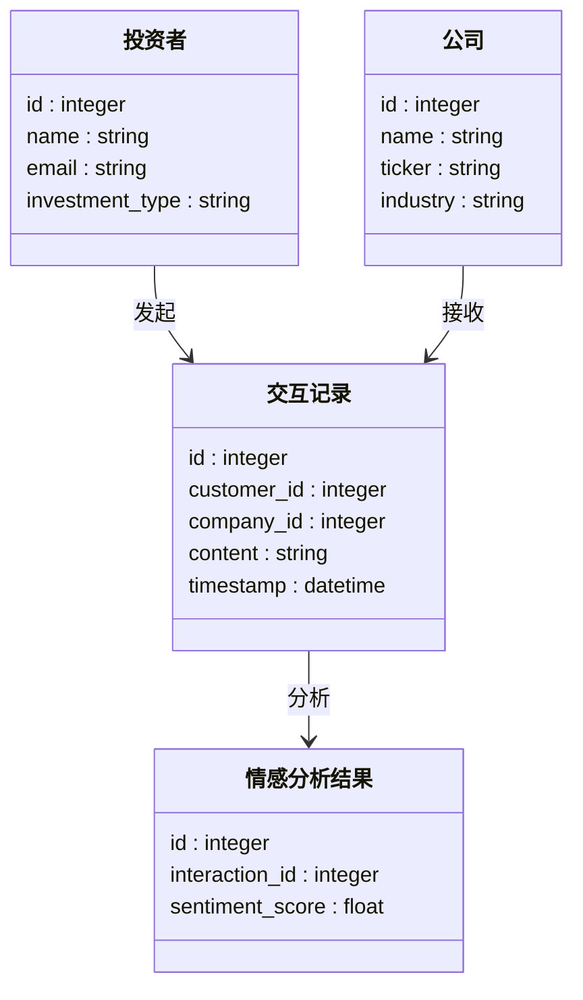
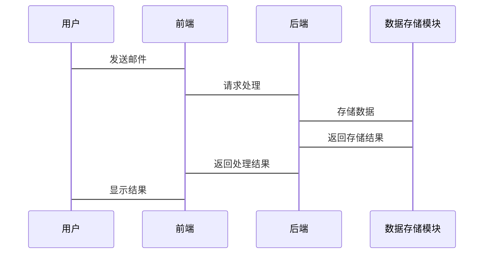

                 


# 智能投资者关系管理平台

## 关键词：智能投资者关系管理、人工智能、投资者关系管理、自然语言处理、机器学习、系统架构设计

## 摘要：智能投资者关系管理平台是一种结合人工智能技术的投资者关系管理系统，通过自然语言处理和机器学习算法，实现对投资者行为的智能分析、预测和管理。本文将从背景、核心概念、算法原理、系统架构设计、项目实战和最佳实践等多方面进行详细分析，帮助读者全面理解智能投资者关系管理平台的技术实现和应用价值。

---

# 第一部分: 智能投资者关系管理平台背景与概念

## 第1章: 智能投资者关系管理平台的背景与问题背景

### 1.1 问题背景

#### 1.1.1 投资者关系管理的传统模式
投资者关系管理（Investor Relations Management，IRM）是指企业通过与投资者保持良好的沟通，提升投资者对企业价值的认知，从而优化资本结构和企业形象的过程。传统的投资者关系管理主要依赖人工操作，包括定期发布财务报告、举办投资者会议、回复投资者邮件等。这种方式效率低下，难以满足投资者的个性化需求，也无法及时捕捉市场变化。

#### 1.1.2 传统投资者关系管理的局限性
- **信息处理能力有限**：传统IRM依赖人工处理投资者的邮件和查询，面对海量数据时效率低下，容易出现遗漏或错误。
- **缺乏实时反馈**：传统IRM无法实时分析投资者情绪和需求变化，导致企业难以及时调整沟通策略。
- **数据孤岛问题**：不同渠道的投资者数据分散，难以进行统一管理和分析。

#### 1.1.3 数字化转型的需求
随着人工智能技术的快速发展，企业开始寻求通过数字化手段提升投资者关系管理的效率和精准度。智能投资者关系管理平台应运而生，它利用机器学习、自然语言处理等技术，实现投资者数据的自动化采集、分析和反馈。

### 1.2 问题描述

#### 1.2.1 投资者关系管理的核心目标
- 提升投资者对企业价值的认知。
- 建立稳定的投资者基础，优化资本结构。
- 提高投资者沟通的效率和质量。

#### 1.2.2 当前投资者关系管理的主要挑战
- **数据量大且分散**：投资者通过多种渠道与企业互动，数据难以统一。
- **个性化需求难以满足**：投资者的需求和行为差异大，传统方式难以实现个性化服务。
- **信息处理效率低**：人工处理投资者邮件和查询的效率难以满足需求。

#### 1.2.3 智能化升级的必要性
为了应对上述挑战，企业需要通过智能化技术提升投资者关系管理的效率和精准度。智能投资者关系管理平台能够自动化处理投资者数据，实时分析投资者情绪，并根据分析结果优化沟通策略。

### 1.3 问题解决

#### 1.3.1 智能投资者关系管理的定义
智能投资者关系管理是一种结合人工智能技术的投资者关系管理方式，通过自动化数据处理、智能分析和实时反馈，提升投资者沟通的效率和精准度。

#### 1.3.2 智能投资者关系管理的核心功能
- **自动化数据采集**：通过自然语言处理技术自动提取投资者邮件、社交媒体评论中的信息。
- **智能分析与预测**：利用机器学习算法分析投资者情绪、行为模式，并预测市场趋势。
- **个性化沟通**：根据分析结果，生成个性化的投资者沟通方案，提升投资者体验。

#### 1.3.3 智能投资者关系管理的实现路径
1. 数据采集：通过API接口或爬虫技术获取投资者数据。
2. 数据清洗与预处理：对采集的数据进行去重、格式统一等处理。
3. 智能分析：利用机器学习算法对数据进行分析，生成投资者画像和行为报告。
4. 个性化沟通：根据分析结果生成沟通策略，并通过邮件、短信等方式与投资者互动。

### 1.4 边界与外延

#### 1.4.1 智能投资者关系管理的边界
智能投资者关系管理的边界包括投资者数据的采集、分析和沟通，但不包括企业的财务数据处理和内部管理。

#### 1.4.2 相关概念的对比与区分
| 概念                | 传统投资者关系管理 | 智能投资者关系管理 |
|---------------------|--------------------|---------------------|
| 核心工具            | 人工操作            | 人工智能技术        |
| 数据处理能力        | 有限               | 强大               |
| 沟通效率            | 低                 | 高                 |

#### 1.4.3 智能投资者关系管理的外延
智能投资者关系管理的外延包括与投资者相关的市场分析、舆情监控、竞争对手分析等功能。

### 1.5 核心要素组成

#### 1.5.1 数据采集与处理
智能投资者关系管理平台需要采集投资者的邮件、社交媒体评论、电话记录等数据，并对其进行清洗和预处理。

#### 1.5.2 智能分析与决策
利用机器学习算法对投资者数据进行分析，生成投资者画像和行为报告。

#### 1.5.3 人机交互与反馈
通过自然语言处理技术与投资者进行实时对话，根据分析结果提供个性化的沟通方案。

### 1.6 本章小结
本章介绍了智能投资者关系管理平台的背景、问题背景和核心概念，为后续章节的分析奠定了基础。

---

## 第2章: 智能投资者关系管理的核心概念与联系

### 2.1 核心概念原理

#### 2.1.1 数据驱动的投资者关系管理
数据驱动的投资者关系管理是指通过数据分析和挖掘，优化投资者沟通策略的过程。

#### 2.1.2 人工智能在投资者关系管理中的应用
人工智能技术在投资者关系管理中的应用包括自然语言处理、机器学习、情感分析等。

#### 2.1.3 智能投资者关系管理的系统架构
智能投资者关系管理的系统架构包括数据采集模块、智能分析模块和人机交互模块。

### 2.2 核心概念对比

#### 2.2.1 传统投资者关系管理与智能投资者关系管理的对比
| 特性                | 传统投资者关系管理 | 智能投资者关系管理 |
|---------------------|--------------------|---------------------|
| 数据处理能力        | 低                 | 高                 |
| 沟通效率            | 低                 | 高                 |
| 个性化支持          | 无                 | 有                 |

#### 2.2.2 不同类型投资者关系管理平台的对比
| 类型                | 传统平台            | 智能平台            |
|---------------------|--------------------|---------------------|
| 核心技术            | 人工操作            | 人工智能技术        |
| 功能                | 基础数据处理        | 数据分析、智能预测    |

#### 2.2.3 智能投资者关系管理与其他AI应用场景的对比
| 场景                | 智能投资者关系管理   | 其他AI应用场景       |
|---------------------|---------------------|---------------------|
| 核心技术            | 自然语言处理、机器学习 | 图像识别、语音识别   |

### 2.3 ER实体关系图
```mermaid
erDiagram
    customer[投资者] {
        <属性>
        id : integer
        name : string
        email : string
        investment_type : string
        }
    company[公司] {
        <属性>
        id : integer
        name : string
        ticker : string
        industry : string
        }
    interaction[交互记录] {
        <属性>
        id : integer
        customer_id : integer
        company_id : integer
        content : string
        timestamp : datetime
        }
    message[消息] {
        <属性>
        id : integer
        interaction_id : integer
        content : string
        timestamp : datetime
        }
    sentiment[情感分析结果] {
        <属性>
        id : integer
        interaction_id : integer
        sentiment_score : float
        }
    }
```

---

## 第3章: 智能投资者关系管理平台的算法原理

### 3.1 算法原理概述

#### 3.1.1 机器学习在投资者关系管理中的应用
机器学习在投资者关系管理中的应用包括投资者画像构建、市场趋势预测等。

#### 3.1.2 自然语言处理在投资者关系管理中的应用
自然语言处理在投资者关系管理中的应用包括情感分析、关键词提取等。

#### 3.1.3 算法选择与实现
常用的算法包括支持向量机（SVM）、随机森林（Random Forest）和长短期记忆网络（LSTM）。

### 3.2 算法实现步骤

#### 3.2.1 数据预处理
数据预处理包括分词、去停用词、词向量化等步骤。

#### 3.2.2 模型训练
利用训练数据训练机器学习模型，如情感分析模型。

#### 3.2.3 模型评估
通过准确率、召回率等指标评估模型性能。

#### 3.2.4 模型优化
通过调整超参数、优化数据特征等方法提升模型性能。

### 3.3 机器学习算法实现

#### 3.3.1 情感分析模型
情感分析模型用于分析投资者评论的情感倾向，分为正面、负面和中性。

#### 3.3.2 机器学习实现代码
```python
from sklearn.feature_extraction.text import TfidfVectorizer
from sklearn.svm import SVC
from sklearn.metrics import accuracy_score

# 数据预处理
vectorizer = TfidfVectorizer()
X = vectorizer.fit_transform(corpus)
y = [0 if sentiment == 'negative' else 1 if sentiment == 'positive' else 2 for sentiment in sentiments]

# 模型训练
model = SVC()
model.fit(X, y)

# 模型预测
test_corpus = ["I love this company"]
test_X = vectorizer.transform(test_corpus)
predicted = model.predict(test_X)
print(predicted)
```

### 3.4 算法数学模型与公式

#### 3.4.1 情感分析模型
情感分析模型可以基于概率论中的贝叶斯定理进行实现：
$$ P(\text{positive} | \text{words}) = \frac{P(\text{words} | \text{positive}) \cdot P(\text{positive})}{P(\text{words})} $$

---

## 第4章: 智能投资者关系管理平台的系统架构设计

### 4.1 系统分析与设计

#### 4.1.1 问题场景介绍
投资者关系管理平台需要处理大量的投资者数据，包括邮件、社交媒体评论等。

#### 4.1.2 系统功能设计
系统功能包括数据采集、智能分析、个性化沟通等模块。

#### 4.1.3 领域模型类图


#### 4.1.4 系统架构图
```mermaid
containerDiagram
    container 前端 {
        component 界面展示
        component 用户输入
    }
    container 后端 {
        component 数据采集模块
        component 数据分析模块
        component 智能分析模块
        component 数据存储模块
    }
    前端 --> 数据采集模块 : 发送数据
    数据采集模块 --> 数据存储模块 : 存储数据
    数据分析模块 --> 智能分析模块 : 分析数据
    智能分析模块 --> 界面展示 : 返回结果
```

#### 4.1.5 接口与交互设计
接口设计包括RESTful API，用于前后端的数据交互。

#### 4.1.6 序列图


### 4.2 本章小结
本章详细介绍了智能投资者关系管理平台的系统架构设计，包括功能模块、数据流和接口设计。

---

## 第5章: 智能投资者关系管理平台的项目实战

### 5.1 项目介绍

#### 5.1.1 项目背景
本项目旨在开发一个智能投资者关系管理平台，利用人工智能技术提升投资者沟通效率。

#### 5.1.2 项目目标
实现投资者数据采集、智能分析和个性化沟通功能。

### 5.2 环境搭建

#### 5.2.1 安装Python
安装Python 3.8及以上版本。

#### 5.2.2 安装依赖库
安装以下依赖库：
```bash
pip install numpy
pip install pandas
pip install scikit-learn
pip install nltk
```

### 5.3 核心代码实现

#### 5.3.1 数据采集模块
```python
import requests
from bs4 import BeautifulSoup

def scrape_investor_data(url):
    response = requests.get(url)
    soup = BeautifulSoup(response.text, 'html.parser')
    comments = soup.find_all('div', class_='comment')
    return [comment.text for comment in comments]
```

#### 5.3.2 智能分析模块
```python
from sklearn.feature_extraction.text import TfidfVectorizer
from sklearn.svm import SVC
from sklearn.metrics import accuracy_score

def train_sentiment_model(train_data, labels):
    vectorizer = TfidfVectorizer()
    X = vectorizer.fit_transform(train_data)
    model = SVC()
    model.fit(X, labels)
    return model, vectorizer

def predict_sentiment(model, vectorizer, test_data):
    X_test = vectorizer.transform(test_data)
    return model.predict(X_test)
```

#### 5.3.3 人机交互模块
```python
from nltk.chat import Chat
from nltk.chat.util import Refaq

# 定义聊天机器人
chat = Chat.respond('investor_bot')
```

### 5.4 代码解读与分析
- 数据采集模块通过爬虫技术获取投资者评论。
- 智能分析模块利用机器学习算法对评论进行情感分析。
- 人机交互模块通过自然语言处理技术与投资者进行实时对话。

### 5.5 实际案例分析
通过实际案例分析，展示智能投资者关系管理平台在实际应用中的效果。

### 5.6 项目小结
本章通过实际项目展示了智能投资者关系管理平台的核心实现，帮助读者理解技术细节和应用场景。

---

## 第6章: 智能投资者关系管理平台的最佳实践

### 6.1 小结

#### 6.1.1 核心知识点回顾
回顾本文的核心知识点，包括智能投资者关系管理的背景、算法原理和系统架构设计。

### 6.2 注意事项

#### 6.2.1 数据隐私保护
在处理投资者数据时，必须遵守数据隐私保护法规。

#### 6.2.2 模型优化
定期优化机器学习模型，提升预测准确率。

#### 6.2.3 系统维护
定期维护系统，确保其稳定运行。

### 6.3 拓展阅读

#### 6.3.1 推荐书籍
- 《机器学习实战》
- 《自然语言处理入门》

#### 6.3.2 推荐博客与资源
- 知乎专栏：人工智能入门
- GitHub项目：自然语言处理开源库

---

## 总结
智能投资者关系管理平台通过人工智能技术的引入，显著提升了投资者关系管理的效率和精准度。本文从背景、核心概念、算法原理、系统架构设计、项目实战和最佳实践等多个方面进行了详细分析，为读者提供了一个全面的技术视角。

---

**关键词：智能投资者关系管理、人工智能、投资者关系管理、自然语言处理、机器学习、系统架构设计**

**摘要：**智能投资者关系管理平台是一种结合人工智能技术的投资者关系管理系统，通过自然语言处理和机器学习算法，实现对投资者行为的智能分析、预测和管理。本文从背景、核心概念、算法原理、系统架构设计、项目实战和最佳实践等多方面进行详细分析，帮助读者全面理解智能投资者关系管理平台的技术实现和应用价值。

