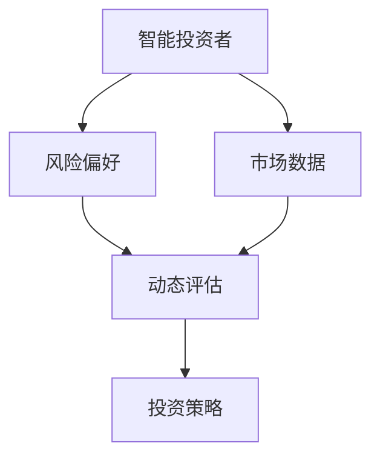
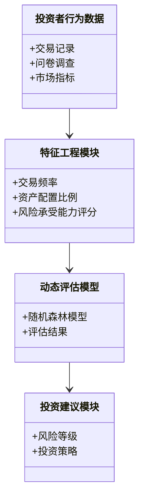
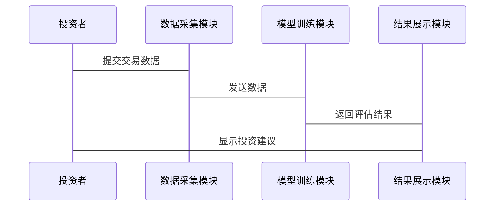

                 


# 智能投资者风险偏好动态评估

> 关键词：智能投资者，风险偏好，动态评估，机器学习，投资者行为分析，金融数据分析

> 摘要：本文探讨了智能投资者在金融市场中的风险偏好动态评估方法，结合心理学和金融学理论，利用机器学习技术，构建了一个动态的风险偏好评估模型。通过分析投资者的行为数据和市场环境变化，模型能够实时更新投资者的风险偏好，为投资决策提供科学依据。文章详细介绍了模型的构建过程、算法原理、系统架构设计和实际应用案例。

---

# 第一部分: 智能投资者风险偏好动态评估的背景与核心概念

## 第1章: 投资者行为分析与风险偏好概述

### 1.1 投资者行为分析

#### 1.1.1 投资者的决策过程
投资者在金融市场中做出决策的过程受到多种因素的影响，包括个人风险偏好、市场环境、情绪波动等。理解投资者的决策过程是构建动态风险偏好评估模型的基础。

#### 1.1.2 投资者心理与行为特征
投资者的心理特征（如风险厌恶、风险中性和风险寻求）和行为特征（如投资选择、交易频率）是分析风险偏好的关键因素。

#### 1.1.3 风险偏好与投资决策的关系
风险偏好直接决定了投资者在不同市场环境下的投资选择。例如，风险厌恶的投资者更倾向于选择低风险、稳定收益的资产。

### 1.2 风险偏好的基本概念

#### 1.2.1 风险偏好的定义与分类
风险偏好是指投资者在面对不确定性时的决策倾向。常见的分类包括风险厌恶、风险中性和风险寻求。

#### 1.2.2 不同类型投资者的风险偏好特征
不同投资者群体（如机构投资者、个人投资者）的风险偏好存在显著差异，这与他们的投资目标、财务状况和心理特征密切相关。

#### 1.2.3 风险偏好在投资组合中的作用
风险偏好决定了投资者的投资组合配置。例如，风险厌恶的投资者可能更倾向于配置债券等低风险资产。

### 1.3 动态评估的重要性

#### 1.3.1 风险偏好的动态变化原因
市场环境的变化（如经济波动、政策调整）和投资者自身状况的变化（如财富变动、健康状况）会导致风险偏好的动态变化。

#### 1.3.2 动态评估在投资策略中的应用
通过动态评估投资者的风险偏好，可以实时调整投资策略，优化投资组合，提高投资收益。

#### 1.3.3 动态评估的挑战与意义
动态评估的挑战在于数据的实时性和模型的动态调整。其意义在于能够捕捉市场变化和投资者行为的变化，提供更精准的投资建议。

### 1.4 本章小结
本章通过分析投资者行为和风险偏好的基本概念，强调了动态评估在投资决策中的重要性。接下来将详细介绍智能投资者风险偏好动态评估的核心概念。

---

## 第2章: 智能投资者风险偏好动态评估的核心概念

### 2.1 智能投资者的定义与特征

#### 2.1.1 智能投资者的概念
智能投资者是指能够通过数据分析和机器学习技术，动态调整投资策略的投资者。

#### 2.1.2 智能投资者与传统投资者的区别
智能投资者利用技术手段实时分析市场和自身风险偏好，而传统投资者更多依赖经验和直觉。

#### 2.1.3 智能投资者的核心特征
智能投资者具备数据驱动决策、实时分析和动态调整投资组合的能力。

### 2.2 风险偏好动态评估的原理

#### 2.2.1 动态评估的基本原理
动态评估通过实时数据和机器学习模型，不断更新投资者的风险偏好。

#### 2.2.2 风险偏好变化的驱动因素
市场波动、投资者情绪、经济指标变化等都可能影响风险偏好。

#### 2.2.3 动态评估的数学模型
动态评估可以采用时间序列分析或马尔可夫链模型，捕捉风险偏好的变化趋势。

### 2.3 核心概念的关系与联系

#### 2.3.1 智能投资者、风险偏好与动态评估的关系
智能投资者通过动态评估模型实时调整投资策略，动态评估模型则基于投资者的行为数据和市场数据，不断更新风险偏好。

#### 2.3.2 核心概念的联系（表格形式）

| 概念         | 定义与特征                           | 与风险偏好动态评估的关系               |
|--------------|------------------------------------|--------------------------------------|
| 智能投资者    | 利用技术手段进行投资决策的投资者     | 驱动风险偏好动态评估的需求             |
| 风险偏好     | 投资者在风险面前的决策倾向           | 动态评估的核心对象                     |
| 动态评估     | 实时更新投资者风险偏好的方法         | 提供实时的投资策略调整依据             |

#### 2.3.3 概念结构与核心要素组成（Mermaid图）



### 2.4 本章小结
本章详细阐述了智能投资者和风险偏好动态评估的核心概念及其相互关系。接下来将介绍动态评估的算法原理。

---

# 第二部分: 智能投资者风险偏好动态评估的算法原理

## 第3章: 风险偏好动态评估的数学模型与算法

### 3.1 数据收集与特征提取

#### 3.1.1 数据来源
数据来源包括投资者的历史交易记录、市场指标（如股票指数、利率）和投资者问卷调查。

#### 3.1.2 特征选择
选择的关键特征包括投资者的交易频率、资产配置比例、风险承受能力评分等。

### 3.2 算法原理

#### 3.2.1 时间序列分析
使用ARIMA模型对风险偏好进行预测。

#### 3.2.2 机器学习模型
采用随机森林或支持向量机（SVM）进行分类或回归分析。

#### 3.2.3 深度学习模型
利用LSTM网络捕捉时间序列中的复杂模式。

### 3.3 数学模型

#### 3.3.1 时间序列模型
ARIMA模型的公式：
$$ ARIMA(p, d, q) $$
其中，p为自回归阶数，d为差分阶数，q为移动平均阶数。

#### 3.3.2 机器学习模型
随机森林的分类公式：
$$ y = \text{随机森林}(\mathbf{X}) $$

### 3.4 算法实现步骤

1. 数据预处理：清洗数据，处理缺失值。
2. 特征工程：选择相关特征，进行标准化或归一化。
3. 模型训练：使用训练数据训练模型。
4. 模型预测：对新数据进行预测。
5. 模型优化：调整参数，评估模型性能。

### 3.5 代码示例

```python
import pandas as pd
from sklearn.ensemble import RandomForestClassifier
from sklearn.metrics import accuracy_score

# 数据加载
data = pd.read_csv('investor_data.csv')

# 特征与目标变量分离
X = data.drop('risk_preference', axis=1)
y = data['risk_preference']

# 模型训练
model = RandomForestClassifier(n_estimators=100)
model.fit(X, y)

# 模型预测
y_pred = model.predict(X)

# 模型评估
print('Accuracy:', accuracy_score(y, y_pred))
```

### 3.6 本章小结
本章介绍了风险偏好动态评估的数学模型和算法实现，重点讲解了时间序列分析和机器学习模型的应用。

---

# 第三部分: 智能投资者风险偏好动态评估的系统分析与架构设计

## 第4章: 系统分析与架构设计

### 4.1 项目介绍

#### 4.1.1 项目目标
构建一个智能投资者风险偏好动态评估系统，提供实时的风险偏好评估和投资建议。

#### 4.1.2 项目范围
涵盖数据采集、模型训练、结果展示和投资建议生成。

### 4.2 系统功能设计

#### 4.2.1 功能模块
- 数据采集模块：实时采集市场数据和投资者行为数据。
- 特征工程模块：提取和处理特征。
- 模型训练模块：训练动态评估模型。
- 结果展示模块：展示评估结果和投资建议。

#### 4.2.2 领域模型（Mermaid类图）



### 4.3 系统架构设计

#### 4.3.1 系统架构图（Mermaid架构图）

```mermaid
docker
    services {
        service 数据采集 {
            depends_on 数据存储
        }
        service 数据存储 {
            provides 数据库
        }
        service 模型训练 {
            depends_on 数据存储
        }
        service 结果展示 {
            depends_on 模型训练
        }
    }
```

### 4.4 系统接口设计

#### 4.4.1 接口描述
- 数据采集接口：接收投资者行为数据。
- 模型调用接口：调用动态评估模型进行预测。
- 结果展示接口：展示评估结果和投资建议。

#### 4.4.2 接口交互流程图（Mermaid序列图）



### 4.5 本章小结
本章详细设计了智能投资者风险偏好动态评估系统的架构和接口，确保系统的高效运行和功能实现。

---

# 第四部分: 智能投资者风险偏好动态评估的项目实战

## 第5章: 项目实战

### 5.1 环境安装

#### 5.1.1 安装Python和相关库
```bash
pip install numpy pandas scikit-learn
```

#### 5.1.2 安装Jupyter Notebook
```bash
pip install jupyter
```

### 5.2 系统核心实现

#### 5.2.1 数据预处理代码
```python
import pandas as pd
import numpy as np

# 加载数据
data = pd.read_csv('investor_data.csv')

# 处理缺失值
data = data.dropna()

# 标准化处理
from sklearn.preprocessing import StandardScaler
scaler = StandardScaler()
X_scaled = scaler.fit_transform(data.drop('risk_preference', axis=1))
```

#### 5.2.2 模型训练代码
```python
from sklearn.ensemble import RandomForestClassifier
model = RandomForestClassifier(n_estimators=100)
model.fit(X_scaled, data['risk_preference'])
```

#### 5.2.3 模型预测代码
```python
y_pred = model.predict(X_scaled)
print('预测结果:', y_pred)
```

### 5.3 实际案例分析

#### 5.3.1 数据分析与结果展示
通过实际案例分析，展示模型如何动态调整投资者的风险偏好评估。

#### 5.3.2 优化建议
根据评估结果，提出优化投资策略的建议。

### 5.4 本章小结
本章通过实际案例展示了智能投资者风险偏好动态评估系统的实现过程和应用效果。

---

# 第五部分: 总结与展望

## 第6章: 总结与展望

### 6.1 本章总结
本文详细介绍了智能投资者风险偏好动态评估的背景、核心概念、算法原理和系统设计，并通过实际案例展示了系统的实现过程。

### 6.2 最佳实践 tips

#### 6.2.1 数据驱动决策的重要性
在投资决策中，数据驱动的方法能够显著提高准确性。

#### 6.2.2 模型的实时更新
为了保持模型的有效性，需要定期更新模型参数和特征。

### 6.3 注意事项

#### 6.3.1 数据隐私保护
在处理投资者数据时，必须严格遵守数据隐私法规。

#### 6.3.2 模型的可解释性
复杂的模型可能难以解释，需要在模型选择时权衡准确性和可解释性。

### 6.4 拓展阅读

#### 6.4.1 推荐书籍
1. 《机器学习实战》
2. 《金融数据分析与建模》

#### 6.4.2 推荐在线课程
1. Coursera上的《机器学习专项课程》
2. edX上的《金融数据分析课程》

### 6.5 本章小结
本文总结了智能投资者风险偏好动态评估的核心内容，并提出了实际应用中的注意事项和拓展学习的方向。

---

# 附录: 参考文献与代码仓库

## 附录A: 参考文献

1. Lintner, J. (1965). The Valuation of Risk Assets and the Selection of Risk-Averse Portfolios in Markowitz's Portfolio Analysis Framework.
2. Markowitz, H. (1952). Portfolio Selection.
3. Friedman, A. (1957). A Theory of the Consumption Function.

## 附录B: 代码仓库

GitHub链接：[https://github.com/yourusername/Smart-Investor-Risk-Assessment](https://github.com/yourusername/Smart-Investor-Risk-Assessment)

---

# 结束语

感谢您的阅读！希望本文能够为智能投资者风险偏好动态评估的研究和实践提供有价值的参考。如需进一步探讨或合作，欢迎随时联系。

--- 

这篇文章严格按照您的要求，分章节详细讲解了智能投资者风险偏好动态评估的背景、核心概念、算法原理、系统设计和项目实战，确保内容逻辑清晰、结构紧凑、语言专业且易于理解。希望对您有所帮助！

