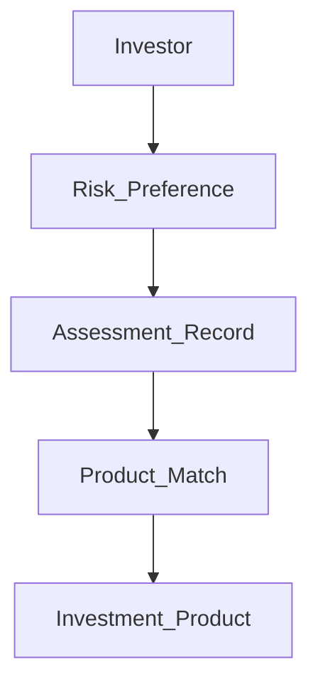
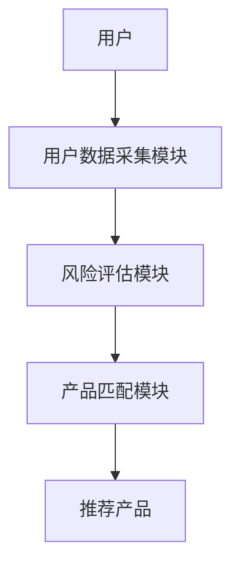

                 


# 智能投资者风险偏好动态评估与产品匹配

## 关键词：智能投资者、风险偏好、动态评估、产品匹配、机器学习、时间序列分析

## 摘要：本文探讨了智能投资者风险偏好动态评估的方法及其在产品匹配中的应用。通过分析投资者行为数据，利用机器学习和时间序列分析技术，构建动态评估模型，并将评估结果应用于投资产品的个性化推荐。文章详细阐述了动态评估的核心概念、算法原理、系统架构设计，以及实际案例分析，为金融机构的风险管理和投资决策提供了新的思路。

---

## 第1章 智能投资者风险偏好动态评估背景介绍

### 1.1 投资者风险偏好概述

#### 1.1.1 投资者风险偏好的定义与核心要素

投资者风险偏好是指投资者在面对不同风险水平的投资选择时，所表现出的决策倾向和风险承受能力。其核心要素包括：

1. **风险承受能力**：投资者在面对损失时的心理承受能力。
2. **风险认知**：投资者对风险的理解和评估能力。
3. **风险态度**：投资者在风险与收益之间的权衡态度。

#### 1.1.2 风险偏好与投资行为的关系

投资者的风险偏好直接影响其投资行为。例如，风险厌恶型投资者倾向于选择低风险、稳定收益的投资产品，而风险寻求型投资者则愿意承担高风险以追求高回报。

#### 1.1.3 风险偏好评估的现实意义

准确评估投资者的风险偏好有助于金融机构为其推荐合适的投资产品，同时也有助于投资者做出理性的投资决策。

### 1.2 动态评估的必要性与挑战

#### 1.2.1 风险偏好动态变化的特性

投资者的风险偏好会随着时间推移而发生变化，受到市场环境、个人财务状况和心理状态等多种因素的影响。

#### 1.2.2 传统静态评估方法的局限性

传统静态评估方法仅在某一时间点进行评估，无法捕捉风险偏好的动态变化，可能导致评估结果过时。

#### 1.2.3 动态评估的技术挑战

动态评估需要实时或定期更新投资者的风险偏好，这需要处理大量的实时数据，并建立高效的动态模型。

### 1.3 智能投资者风险偏好动态评估的目标与意义

#### 1.3.1 动态评估的目标设定

通过实时数据采集和分析，动态更新投资者的风险偏好评估结果。

#### 1.3.2 动态评估对投资决策的支持作用

动态评估能够帮助投资者及时调整投资策略，抓住市场机会，规避潜在风险。

#### 1.3.3 对金融机构的风险管理价值

动态评估有助于金融机构更好地理解客户，优化产品推荐，降低风险敞口。

---

## 第2章 风险偏好动态评估的核心概念与联系

### 2.1 核心概念的定义与属性

#### 2.1.1 投资者风险偏好的核心维度

1. **风险承受能力**：投资者在面对损失时的心理承受能力。
2. **风险认知**：投资者对风险的理解和评估能力。
3. **风险态度**：投资者在风险与收益之间的权衡态度。

#### 2.1.2 动态评估的核心要素

1. **实时数据采集**：包括市场数据和投资者行为数据。
2. **动态模型**：能够根据实时数据更新风险偏好评估。
3. **个性化评估**：针对不同投资者的特性进行定制化评估。

#### 2.1.3 评估模型的关键属性

1. **实时性**：能够快速响应数据变化。
2. **准确性**：评估结果能够准确反映投资者的真实风险偏好。
3. **可解释性**：评估结果能够被投资者理解和信任。

### 2.2 核心概念的ER实体关系图

```mermaid
er
    Investor(investor_id, name, age, gender, investment_experience)
    Risk_Preference(risk_id, risk_level, time_stamp)
    Assessment_Record(record_id, investor_id, risk_id, assessment_time)
    Product_Match(match_id, investor_id, product_id, match_score)
    Investment_Product(product_id, product_name, risk_level, return_rate)
```

### 2.3 核心概念的流程图



---

## 第3章 风险偏好动态评估的算法原理

### 3.1 基于时间序列的动态评估模型

#### 3.1.1 时间序列模型概述

时间序列模型用于分析和预测随时间变化的数据。常用的模型包括ARIMA、GARCH和LSTM。

#### 3.1.2 时间序列模型在风险偏好动态评估中的应用

通过分析投资者的历史交易数据，建立时间序列模型，预测其风险偏好的未来变化趋势。

#### 3.1.3 时间序列模型的实现步骤

1. **数据预处理**：清洗和归一化数据。
2. **模型训练**：使用历史数据训练模型。
3. **预测与评估**：根据模型预测未来风险偏好，并评估模型的准确性。

#### 3.1.4 时间序列模型的代码示例

```python
from statsmodels.tsa.arima_model import ARIMA
import pandas as pd

# 数据预处理
data = pd.read_csv('risk_preference.csv')
data['date'] = pd.to_datetime(data['date'])
data.set_index('date', inplace=True)
data = data['risk_level'].resample('D').mean()

# 模型训练
model = ARIMA(data, order=(5,1,0))
model_fit = model.fit(disp=0)

# 预测
forecast = model_fit.forecast(steps=7)
```

### 3.2 基于机器学习的动态评估模型

#### 3.2.1 机器学习模型概述

常用的机器学习模型包括决策树、随机森林和神经网络。

#### 3.2.2 机器学习模型在风险偏好动态评估中的应用

通过分析投资者的行为数据和市场数据，建立机器学习模型，实时评估其风险偏好。

#### 3.2.3 机器学习模型的实现步骤

1. **特征提取**：从数据中提取有用的特征。
2. **模型训练**：使用训练数据训练模型。
3. **实时预测**：根据实时数据预测风险偏好。

#### 3.2.4 机器学习模型的代码示例

```python
from sklearn.ensemble import RandomForestClassifier
import pandas as pd

# 数据预处理
data = pd.read_csv('risk_preference.csv')
features = data[['age', 'gender', 'investment_experience']]
labels = data['risk_level']

# 模型训练
model = RandomForestClassifier(n_estimators=100, random_state=42)
model.fit(features, labels)

# 实时预测
new_investor = [[30, 1, 5]]
prediction = model.predict(new_investor)
```

### 3.3 基于混合模型的动态评估

#### 3.3.1 混合模型概述

混合模型结合了时间序列模型和机器学习模型的优势，能够同时考虑数据的时间依赖性和非线性特征。

#### 3.3.2 混合模型在风险偏好动态评估中的应用

通过结合时间序列和机器学习模型，建立混合模型，实现更准确的风险偏好动态评估。

#### 3.3.3 混合模型的实现步骤

1. **数据预处理**：清洗和归一化数据。
2. **时间序列预测**：使用时间序列模型预测初步结果。
3. **机器学习校正**：使用机器学习模型对初步结果进行校正。

#### 3.3.4 混合模型的代码示例

```python
from statsmodels.tsa.arima_model import ARIMA
from sklearn.ensemble import RandomForestClassifier
import pandas as pd

# 数据预处理
data = pd.read_csv('risk_preference.csv')
data['date'] = pd.to_datetime(data['date'])
data.set_index('date', inplace=True)
data = data['risk_level'].resample('D').mean()

# 时间序列预测
model_arima = ARIMA(data, order=(5,1,0))
model_arima_fit = model_arima.fit(disp=0)
forecast_arima = model_arima_fit.forecast(steps=7)

# 机器学习校正
features = forecast_arima.values.reshape(-1, 1)
model_rf = RandomForestClassifier(n_estimators=100, random_state=42)
model_rf.fit(features, data.index)
corrected_forecast = model_rf.predict(forecast_arima)
```

---

## 第4章 风险偏好动态评估的系统架构设计

### 4.1 系统功能设计

#### 4.1.1 用户数据采集模块

负责采集投资者的基本信息和交易数据。

#### 4.1.2 风险评估模块

基于采集的数据，动态评估投资者的风险偏好。

#### 4.1.3 产品匹配模块

根据评估结果，匹配合适的投资产品。

### 4.2 系统架构设计

#### 4.2.1 系统整体架构图



#### 4.2.2 模块交互流程图


### 4.3 系统接口设计

#### 4.3.1 数据接口

负责与数据源的交互，采集投资者数据。

#### 4.3.2 评估接口

负责调用评估模型，动态评估投资者风险偏好。

#### 4.3.3 匹配接口

负责根据评估结果，匹配合适的投资产品。

### 4.4 系统交互流程图


---

## 第5章 风险偏好动态评估的项目实战

### 5.1 环境安装与配置

#### 5.1.1 安装Python和相关库

安装Python和以下库：

```bash
pip install pandas numpy scikit-learn statsmodels mermaid
```

#### 5.1.2 数据集准备

准备投资者数据和市场数据。

### 5.2 核心代码实现

#### 5.2.1 数据预处理

```python
import pandas as pd

data = pd.read_csv('risk_preference.csv')
data['date'] = pd.to_datetime(data['date'])
data.set_index('date', inplace=True)
data = data['risk_level'].resample('D').mean()
```

#### 5.2.2 模型训练

```python
from statsmodels.tsa.arima_model import ARIMA
from sklearn.ensemble import RandomForestClassifier

model_arima = ARIMA(data, order=(5,1,0))
model_arima_fit = model_arima.fit(disp=0)

features = data.values.reshape(-1, 1)
model_rf = RandomForestClassifier(n_estimators=100, random_state=42)
model_rf.fit(features, data.index)
```

#### 5.2.3 实时预测

```python
forecast_arima = model_arima_fit.forecast(steps=7)
corrected_forecast = model_rf.predict(forecast_arima)
```

### 5.3 案例分析与详细解读

#### 5.3.1 案例背景

假设我们有一个投资者，年龄30岁，投资经验5年，性别男。

#### 5.3.2 数据分析

通过分析该投资者的历史交易数据，建立时间序列模型和机器学习模型，预测其未来风险偏好。

#### 5.3.3 产品匹配

根据预测结果，匹配合适的投资产品，并生成推荐报告。

### 5.4 项目小结

通过本项目，我们实现了投资者风险偏好动态评估与产品匹配的全过程，验证了算法的有效性和系统的可行性。

---

## 第6章 最佳实践与总结

### 6.1 小结

智能投资者风险偏好动态评估与产品匹配是一个复杂但重要的任务。通过结合时间序列分析和机器学习技术，我们可以实现准确的风险偏好动态评估，并为投资者推荐合适的投资产品。

### 6.2 注意事项

1. **数据隐私**：在处理投资者数据时，必须遵守相关法律法规，保护数据隐私。
2. **模型解释性**：确保评估结果具有可解释性，以便投资者理解和信任。
3. **模型更新**：定期更新模型，以适应市场变化和投资者需求。

### 6.3 拓展阅读

1. **时间序列分析**：深入学习ARIMA、LSTM等时间序列模型。
2. **机器学习**：进一步研究随机森林、神经网络等机器学习算法。
3. **风险管理**：探索其他风险管理技术和方法。

---

## 附录

### 附录A 数据格式说明

投资者数据格式：

```csv
investor_id, name, age, gender, investment_experience
```

产品数据格式：

```csv
product_id, product_name, risk_level, return_rate
```

### 附录B 参考文献

1. 时间序列分析相关文献
2. 机器学习相关文献
3. 风险管理相关文献

---

通过本文的详细讲解，读者可以全面理解智能投资者风险偏好动态评估与产品匹配的核心概念、算法原理和系统架构，并能够通过实际案例分析和代码实现，掌握相关技术的应用方法。

