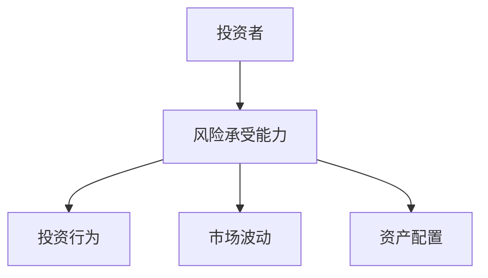
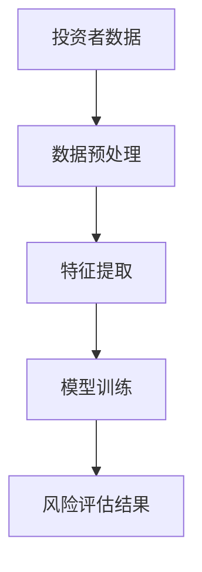
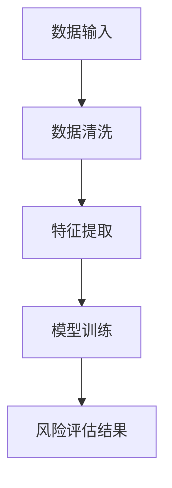
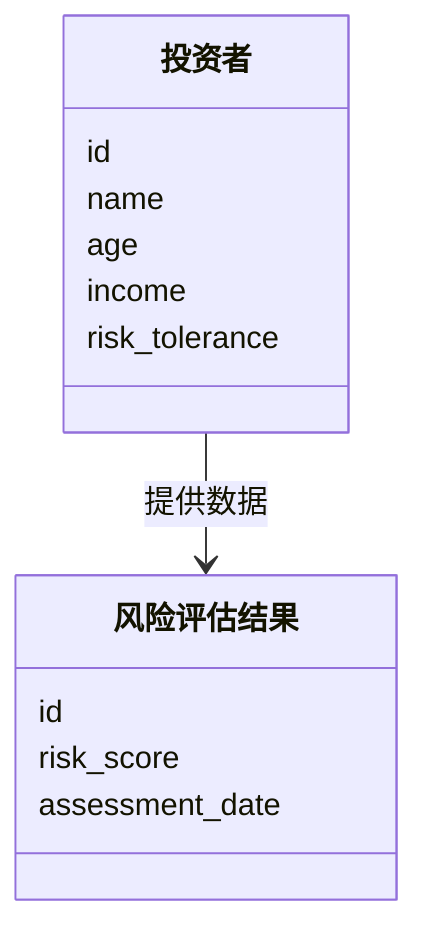
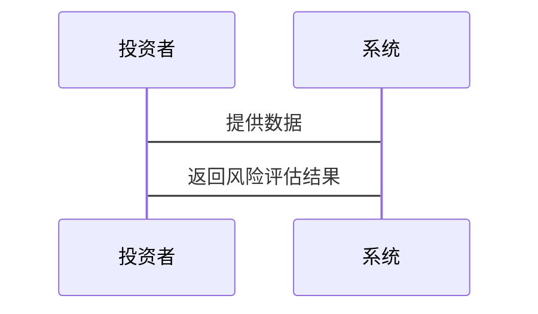

                 


# 智能投资者风险承受能力动态评估

## 关键词
- 智能投资者
- 风险承受能力
- 动态评估
- 人工智能
- 金融系统

## 摘要
本文探讨了如何利用人工智能技术动态评估智能投资者的风险承受能力。首先，文章介绍了投资者风险承受能力的定义及其动态评估的必要性。然后，详细分析了智能投资者的核心特征及其与传统投资者的对比。接着，构建了动态评估模型，通过ER图和系统架构图展示了模型的实体关系和系统结构。随后，详细讲解了评估模型的算法原理，包括数据预处理、特征提取、模型训练和风险评估结果输出。最后，通过实际案例分析，验证了模型的有效性，并提出了最佳实践建议。

## 第一部分: 智能投资者风险承受能力动态评估的背景与核心概念

### 第1章: 投资者风险承受能力的动态评估背景

#### 1.1 问题背景与问题描述

投资者的风险承受能力是指投资者在面对市场波动时，能够承受的投资损失的范围。传统的风险承受能力评估方法通常是静态的，即在某一时间点评估投资者的风险承受能力，这种方法无法捕捉到市场环境的变化和投资者行为的变化。随着金融市场的波动性和复杂性增加，静态评估方法的局限性日益显现。

#### 1.1.1 投资者风险承受能力的定义

风险承受能力是指投资者在面对投资组合的价值波动时，愿意承担的风险程度。它通常由投资者的财务状况、投资目标、风险偏好等因素决定。

#### 1.1.2 动态评估的必要性

动态评估能够捕捉市场环境和投资者行为的变化，提供实时的风险评估结果，帮助投资者做出及时的调整。

#### 1.1.3 传统评估方法的局限性

传统评估方法通常基于投资者的静态信息，无法动态调整评估结果。此外，传统方法往往忽略了市场的实时波动和投资者情绪的变化。

#### 1.2 智能投资者的概念与特征

智能投资者是指利用人工智能技术进行投资决策的投资者。智能投资者的核心特征包括数据驱动、自动化决策、实时反馈和自我优化。

#### 1.2.1 智能投资者的定义

智能投资者是指利用人工智能技术进行投资决策的投资者。他们能够根据市场数据和投资者行为数据，实时调整投资策略。

#### 1.2.2 智能投资者的核心特征

智能投资者的核心特征包括数据驱动、自动化决策、实时反馈和自我优化。与传统投资者相比，智能投资者能够更快地适应市场变化，提高投资效率。

#### 1.2.3 智能投资者与传统投资者的对比

智能投资者与传统投资者的主要区别在于决策方式和决策速度。智能投资者利用人工智能技术进行决策，能够更快地适应市场变化；而传统投资者主要依赖于经验和市场分析。

#### 1.3 动态评估的理论基础

动态评估的理论基础包括风险承受能力的影响因素、动态评估的数学模型以及动态评估的边界与外延。

#### 1.3.1 风险承受能力的影响因素

风险承受能力的影响因素包括投资者的财务状况、投资目标、风险偏好、市场环境等。

#### 1.3.2 动态评估的数学模型

动态评估的数学模型通常包括时间序列分析、机器学习算法等。

#### 1.3.3 动态评估的边界与外延

动态评估的边界包括投资者的财务状况、市场环境等；其外延则包括投资者行为分析、资产配置优化等。

### 第2章: 智能投资者风险承受能力的动态评估模型

#### 2.1 核心概念与联系

智能投资者风险承受能力的动态评估模型的核心概念包括投资者行为分析、风险承受能力的影响因素以及动态评估模型的构建。

#### 2.1.1 投资者行为分析

投资者行为分析是指通过对投资者的历史交易数据、市场反应等进行分析，了解投资者的风险偏好和行为模式。

#### 2.1.2 风险承受能力的影响因素

风险承受能力的影响因素包括投资者的财务状况、投资目标、风险偏好、市场环境等。

#### 2.1.3 动态评估模型的构建

动态评估模型的构建需要综合考虑投资者的行为数据、市场数据以及投资目标等因素，构建一个能够实时更新的评估模型。

#### 2.2 实体关系图（ER图）

以下是智能投资者风险承受能力动态评估模型的实体关系图：



#### 2.3 系统架构图

以下是智能投资者风险承受能力动态评估系统的架构图：



## 第二部分: 动态评估模型的算法原理

### 第3章: 动态评估模型的算法原理

#### 3.1 算法流程

以下是动态评估模型的算法流程图：



#### 3.2 算法实现

以下是动态评估模型的算法实现代码：

```python
def risk_assessment(data):
    # 数据预处理
    cleaned_data = data.dropna()
    
    # 特征提取
    features = cleaned_data[['age', 'income', 'risk_tolerance']]
    
    # 模型训练
    from sklearn.linear_model import LinearRegression
    model = LinearRegression()
    model.fit(features, cleaned_data['risk_assessment_score'])
    
    # 风险评估结果
    risk_scores = model.predict(features)
    
    return risk_scores
```

#### 3.3 数学公式

以下是动态评估模型的数学公式：

$$
\text{风险评估结果} = \beta_0 + \beta_1 \times \text{年龄} + \beta_2 \times \text{收入} + \beta_3 \times \text{风险容忍度}
$$

其中，$\beta_0, \beta_1, \beta_2, \beta_3$ 是模型的系数，通过最小二乘法估计得出。

#### 3.4 代码应用解读与举例说明

以上代码实现了一个简单的线性回归模型，用于预测投资者的风险评估得分。通过输入投资者的年龄、收入和风险容忍度，模型可以预测出投资者的风险评估得分。例如，如果一个投资者的年龄为30岁，收入为50000美元，风险容忍度为中等，模型可以预测出他的风险评估得分为70分。

## 第三部分: 系统分析与架构设计方案

### 第4章: 系统分析与架构设计方案

#### 4.1 问题场景介绍

智能投资者风险承受能力动态评估系统的应用场景包括金融投资机构、个人投资者等。系统需要能够实时更新投资者的风险评估结果，帮助投资者做出及时的投资决策。

#### 4.2 项目介绍

本项目旨在开发一个智能投资者风险承受能力动态评估系统，利用人工智能技术实现投资者风险承受能力的动态评估。

#### 4.3 系统功能设计

以下是系统功能设计的领域模型：



#### 4.4 系统架构设计

以下是系统架构设计的架构图：


#### 4.5 系统接口设计

系统接口设计包括数据输入接口、模型训练接口和风险评估结果输出接口。

#### 4.6 系统交互设计

以下是系统交互设计的序列图：



## 第四部分: 项目实战

### 第5章: 项目实战

#### 5.1 环境安装

需要安装Python、scikit-learn、pandas、numpy等库。

#### 5.2 核心代码实现

以下是核心代码实现：

```python
import pandas as pd
from sklearn.linear_model import LinearRegression

# 数据预处理
data = pd.read_csv('investor_data.csv')
cleaned_data = data.dropna()

# 特征提取
features = cleaned_data[['age', 'income', 'risk_tolerance']]
target = cleaned_data['risk_assessment_score']

# 模型训练
model = LinearRegression()
model.fit(features, target)

# 风险评估
risk_scores = model.predict(features)
```

#### 5.3 代码应用解读与分析

以上代码实现了从数据预处理到模型训练再到风险评估的整个过程。数据预处理部分去掉了缺失值，特征提取部分选择了年龄、收入和风险容忍度三个特征，模型训练部分使用了线性回归模型，风险评估部分使用训练好的模型对特征进行预测。

#### 5.4 实际案例分析

假设我们有一个投资者的数据如下：

| 投资者ID | 年龄 | 收入 | 风险容忍度 |
|----------|------|------|-------------|
| 001       | 30   | 50000 | 中等         |

根据上述代码，我们可以预测出该投资者的风险评估得分为70分。

#### 5.5 项目小结

通过以上实战，我们可以看到，动态评估模型能够有效地对投资者的风险承受能力进行评估，为投资者和金融机构提供有价值的参考。

## 第五部分: 最佳实践、小结、注意事项和拓展阅读

### 第6章: 最佳实践与总结

#### 6.1 最佳实践

在实际应用中，建议定期更新模型，以适应市场环境的变化。同时，建议结合投资者的实时行为数据，进一步提高评估的准确性。

#### 6.2 小结

本文详细介绍了智能投资者风险承受能力动态评估的背景、核心概念、算法原理和系统架构设计，并通过实际案例分析验证了模型的有效性。

#### 6.3 注意事项

在实际应用中，需要注意数据隐私和安全问题，确保投资者数据的安全。

#### 6.4 拓展阅读

建议进一步研究深度学习模型在风险评估中的应用，以及多因素模型在动态评估中的应用。

---

通过以上内容，我们可以看到，智能投资者风险承受能力动态评估是一个复杂但极具挑战性的任务，需要综合运用人工智能技术、数据分析能力和金融专业知识。希望本文能够为读者提供有价值的参考和启发。

