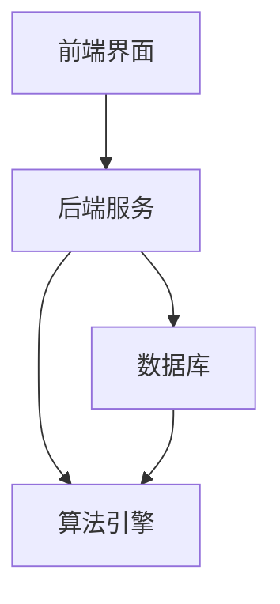
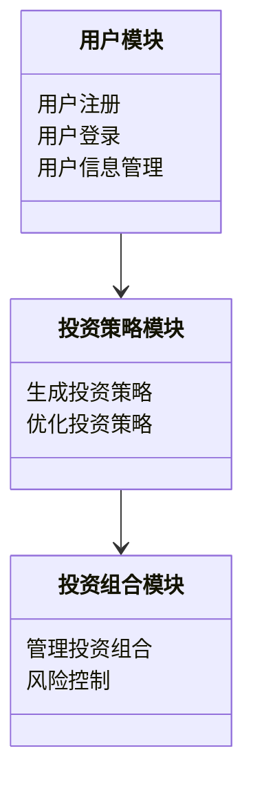

                 


# 智能投顾平台的架构设计与实现

> **关键词**：智能投顾、架构设计、算法实现、系统架构、投资组合、风险控制

> **摘要**：智能投顾平台是结合人工智能与金融投资的创新应用，旨在为用户提供个性化的投资建议与组合管理。本文从智能投顾的背景出发，详细阐述其核心概念、算法原理、系统架构设计及实现方案，通过具体案例分析，为读者提供全面的技术指导。

---

## 第1章: 智能投顾平台的背景与现状

### 1.1 智能投顾的定义与背景

智能投顾（Smart Wealth Management）是一种基于人工智能技术的投资顾问服务，通过算法分析用户需求，提供个性化的投资建议。与传统投资顾问相比，智能投顾具有高效、低成本和可扩展的优势。

#### 1.1.1 传统投顾与智能投顾的对比

| **对比维度** | **传统投顾** | **智能投顾** |
|--------------|--------------|--------------|
| 服务成本     | 高           | 低           |
| 服务效率     | 低           | 高           |
| 服务范围     | 有限         | 广泛         |
| 技术依赖     | 低           | 高           |

#### 1.1.2 智能投顾的兴起背景

智能投顾的兴起源于以下几个方面：

1. **技术进步**：人工智能、大数据和机器学习技术的快速发展为智能投顾提供了技术支撑。
2. **市场需求**：投资者对个性化、低成本投资服务的需求不断增长。
3. **成本控制**：传统投顾服务成本高昂，难以覆盖小额投资者的需求。

#### 1.1.3 智能投顾的市场现状与发展趋势

目前，智能投顾市场主要集中在财富管理领域，应用场景包括资产配置、风险控制和投资组合优化。未来发展趋势包括：

- **个性化服务**：基于用户画像提供更加精准的投资建议。
- **实时反馈**：利用实时数据分析，动态调整投资策略。
- **多场景应用**：从个人投资扩展到企业理财、机构投资等领域。

---

### 1.2 智能投顾的核心技术与挑战

智能投顾的核心技术包括：

1. **人工智能**：用于数据挖掘、模式识别和自然语言处理。
2. **大数据分析**：用于用户画像和市场趋势分析。
3. **机器学习**：用于投资策略生成和风险控制。

#### 1.2.1 智能投顾的主要技术挑战

- **数据隐私**：用户数据的安全性和隐私保护。
- **模型泛化能力**：如何在不同市场环境下保持模型的有效性。
- **实时性要求**：高频交易对系统实时性的高要求。

#### 1.2.2 智能投顾的用户需求与痛点分析

用户需求主要集中在以下几个方面：

- **个性化服务**：用户希望根据自身风险偏好和财务状况获得定制化投资建议。
- **透明性**：用户希望了解投资策略的生成逻辑和调整原因。
- **实时反馈**：用户希望及时获取市场变化和投资组合的动态调整建议。

---

## 第2章: 智能投顾的核心概念

### 2.1 用户画像与需求分析

用户画像是智能投顾的核心输入，通过分析用户的财务状况、风险偏好和投资目标，生成个性化的投资策略。

#### 2.1.1 用户画像的构建方法

用户画像是通过收集和分析用户数据构建的，包括：

1. **财务数据**：收入、资产、负债等。
2. **行为数据**：投资历史、交易频率等。
3. **偏好数据**：风险偏好、投资目标等。

#### 2.1.2 用户需求的分类与优先级

用户需求可以分为以下几类：

1. **风险偏好**：保守型、稳健型、进取型。
2. **投资目标**：短期、中期、长期。
3. **资产配置**：股票、债券、基金等。

---

### 2.2 投资策略生成与优化

投资策略生成是智能投顾的核心功能，基于用户画像和市场数据，生成最优的投资组合。

#### 2.2.1 投资策略生成的原理

投资策略生成基于以下步骤：

1. **数据收集**：收集用户数据和市场数据。
2. **需求分析**：分析用户需求，生成初步投资策略。
3. **策略优化**：通过算法优化投资组合，降低风险、提高收益。

#### 2.2.2 策略优化的数学模型

策略优化可以采用均值-方差优化模型：

$$
\text{目标：} \min \sigma^2 \quad \text{在满足} \sum w_i r_i = R_p \text{的条件下}
$$

其中，$\sigma^2$ 是投资组合的方差，$w_i$ 是资产权重，$r_i$ 是资产收益，$R_p$ 是目标收益。

---

### 2.3 投资组合管理与风险控制

投资组合管理是智能投顾的重要组成部分，通过动态调整资产配置，实现风险控制和收益最大化。

#### 2.3.1 投资组合管理的基本原理

投资组合管理包括以下几个步骤：

1. **资产配置**：根据用户需求，确定各类资产的权重。
2. **风险评估**：评估投资组合的风险，包括市场风险、流动性风险等。
3. **动态调整**：根据市场变化和用户需求，动态调整投资组合。

#### 2.3.2 风险控制的数学模型

风险控制可以采用VaR（Value at Risk）模型：

$$
\text{VaR} = \text{P}\left( R \leq \text{VaR} \right) = \alpha
$$

其中，$R$ 是投资组合的收益，$\alpha$ 是置信水平。

---

## 第3章: 智能投顾平台的系统架构设计

### 3.1 系统整体架构

智能投顾平台的系统架构包括以下几个部分：

1. **前端界面**：用户交互界面，展示投资建议和组合管理。
2. **后端服务**：处理用户请求，生成投资策略。
3. **数据库**：存储用户数据和市场数据。
4. **算法引擎**：实现投资策略生成和优化。

#### 3.1.1 系统架构图



---

### 3.2 功能模块设计

智能投顾平台的功能模块包括：

1. **用户模块**：用户注册、登录和信息管理。
2. **投资策略模块**：生成和优化投资策略。
3. **投资组合模块**：管理投资组合和风险控制。
4. **数据模块**：数据采集和处理。

#### 3.2.1 功能模块类图



---

## 第4章: 智能投顾平台的实现

### 4.1 环境安装

需要安装以下工具和库：

1. **Python**：编程语言。
2. **Pandas**：数据处理库。
3. **NumPy**：数值计算库。
4. **Scikit-learn**：机器学习库。
5. **Plotly**：数据可视化库。

---

### 4.2 核心代码实现

#### 4.2.1 数据预处理代码

```python
import pandas as pd

# 读取数据
data = pd.read_csv('market_data.csv')

# 数据清洗
data = data.dropna()
data = data[~data['volume'].isin([0])]
```

#### 4.2.2 投资策略生成代码

```python
from sklearn.linear_model import LinearRegression

# 训练模型
model = LinearRegression()
model.fit(X_train, y_train)

# 预测收益
y_pred = model.predict(X_test)
```

---

### 4.3 测试与优化

#### 4.3.1 测试结果

通过测试可以验证系统的稳定性和准确性，以下是测试结果示例：

| **测试用例** | **输入**          | **输出**             |
|-------------|-------------------|----------------------|
| 用例1       | 风险偏好：保守    | 投资组合：债券为主    |
| 用例2       | 风险偏好：进取    | 投资组合：股票为主    |

---

## 第5章: 总结与展望

### 5.1 总结

智能投顾平台通过结合人工智能和金融投资，为用户提供高效、个性化的投资服务。本文详细介绍了智能投顾的核心概念、算法原理和系统架构设计，并通过具体案例展示了实现过程。

### 5.2 展望

未来，智能投顾平台将朝着以下几个方向发展：

1. **个性化服务**：基于用户画像提供更加精准的投资建议。
2. **实时反馈**：利用实时数据分析，动态调整投资策略。
3. **多场景应用**：从个人投资扩展到企业理财、机构投资等领域。

---

### 5.3 最佳实践 tips

1. 在实现智能投顾平台时，需注意数据隐私和安全问题。
2. 选择合适的算法模型，确保系统的稳定性和准确性。
3. 定期更新市场数据，保持系统的实时性和有效性。

---

通过本文的详细讲解，读者可以全面了解智能投顾平台的架构设计与实现方法，为实际应用提供参考和指导。

