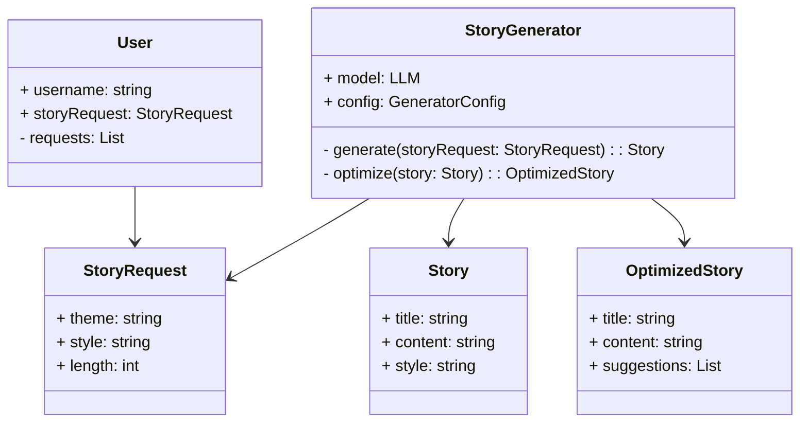
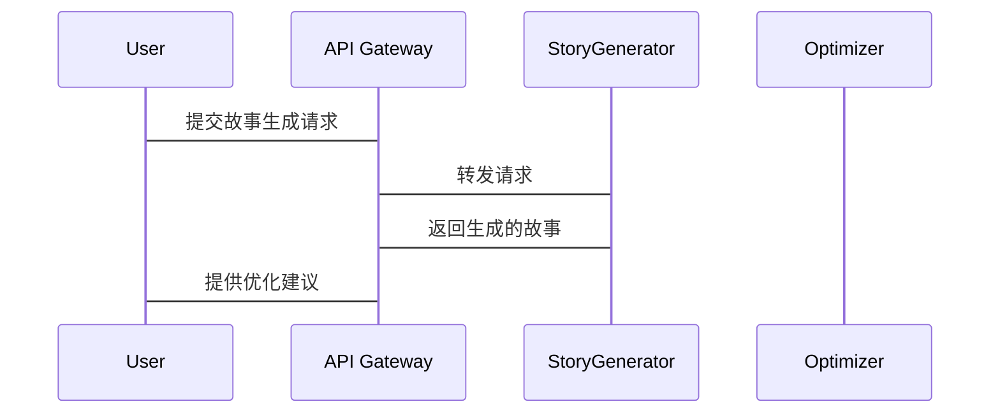

                 


# 智能故事生成 AI Agent：LLM 驱动的创意写作系统

> 关键词：智能故事生成，LLM，大语言模型，创意写作，AI代理

> 摘要：本文探讨了智能故事生成AI代理系统的构建，基于大语言模型（LLM）的技术实现，分析其在创意写作中的应用，详细讲解了系统架构、算法原理、项目实现及优化策略。

---

# 第一部分: 智能故事生成的背景与意义

## 第1章: 智能故事生成的背景与意义

### 1.1 智能故事生成的背景

#### 1.1.1 传统故事创作的挑战

传统故事创作是一个复杂且耗时的过程，涉及灵感捕捉、情节构思、人物塑造、语言表达等多个方面。创作者常常面临以下挑战：

- **创作瓶颈**：创作者可能会遇到灵感枯竭的情况，导致创作停滞。
- **效率问题**：从构思到成文的过程耗时较长，尤其是对于初学者来说。
- **多样性不足**：创作的风格和题材可能受到创作者自身经验的限制。

#### 1.1.2 AI技术在创意写作中的应用

随着AI技术的飞速发展，尤其是在自然语言处理领域，AI已经能够辅助甚至生成创意内容。AI在创意写作中的应用主要体现在以下几个方面：

- **灵感激发**：AI可以通过分析大量文本，为创作者提供新的创意和灵感。
- **情节生成**：AI能够根据用户提供的关键词或主题，生成复杂的情节和故事框架。
- **语言优化**：AI可以帮助创作者优化语言表达，提升文本的质量。

#### 1.1.3 LLM在智能故事生成中的优势

大语言模型（LLM）在智能故事生成中具有显著优势：

- **强大的文本生成能力**：LLM能够生成连贯且自然的文本，具备接近人类的写作能力。
- **多样化风格支持**：LLM可以根据需求调整故事的风格和语气，满足不同创作需求。
- **高效互动**：通过人机交互，创作者可以快速得到反馈和修改建议，显著提高创作效率。

### 1.2 智能故事生成的核心概念

#### 1.2.1 智能故事生成的定义

智能故事生成是指利用AI技术，特别是基于大语言模型的自然语言处理能力，自动生成或辅助生成符合特定主题、风格和结构的故事内容。

#### 1.2.2 LLM的基本原理

大语言模型（LLM）通过大量数据的预训练，掌握了语言的使用规则和语义理解能力。其基本原理是基于概率的预测模型，能够根据上下文生成最可能的后续文本。

#### 1.2.3 智能故事生成系统的组成与功能

智能故事生成系统通常包括以下几个组成部分：

- **输入模块**：接收用户的输入，如主题、关键词或初始情节。
- **生成模块**：利用LLM生成故事内容。
- **优化模块**：对生成的内容进行润色和优化，确保故事的连贯性和可读性。
- **输出模块**：将最终的故事内容呈现给用户。

### 1.3 智能故事生成的应用场景

#### 1.3.1 文学创作中的应用

在文学创作中，智能故事生成可以帮助作者快速生成情节框架，提供灵感，甚至协助完成初稿。

#### 1.3.2 教育领域的应用

在教育领域，智能故事生成可以作为教学工具，帮助学生学习写作技巧，激发他们的创造力。

#### 1.3.3 娱乐产业中的应用

在娱乐产业中，智能故事生成可以用于剧本创作、游戏情节设计等，为内容创作提供高效支持。

### 1.4 本章小结

本章介绍了智能故事生成的背景、核心概念和应用场景，强调了LLM在其中的重要作用，并为后续章节的深入探讨奠定了基础。

---

# 第二部分: LLM的基本原理与数学模型

## 第2章: 大语言模型（LLM）的基本原理

### 2.1 LLM的核心概念

#### 2.1.1 什么是大语言模型

大语言模型是一种基于深度学习的自然语言处理模型，通过大量数据的预训练，掌握了语言的使用规则和语义理解能力。

#### 2.1.2 LLM的基本架构

LLM通常基于Transformer架构，由编码器和解码器两部分组成，能够处理输入的序列数据，并生成相应的输出序列。

#### 2.1.3 LLM的训练过程

LLM的训练过程包括预训练和微调两个阶段：

- **预训练**：模型通过大量的通用文本数据进行训练，学习语言的结构和语义。
- **微调**：根据具体任务对模型进行进一步训练，使其适应特定的应用场景。

### 2.2 LLM的数学模型与公式

#### 2.2.1 Transformer模型的结构

Transformer模型由编码器和解码器堆叠而成，每个堆叠包含自注意力机制和前馈神经网络。

自注意力机制的计算公式如下：

$$
\text{Attention}(Q, K, V) = \text{softmax}\left(\frac{QK^T}{\sqrt{d_k}}\right)V
$$

其中，$Q$、$K$、$V$分别是查询、键和值向量，$d_k$是键的维度。

#### 2.2.2 概率语言模型

LLM作为概率语言模型，其目标是最大化生成文本的概率：

$$
P(w_1, w_2, ..., w_n) = \prod_{i=1}^{n} P(w_i | w_1, ..., w_{i-1})
$$

其中，$w_i$表示第$i$个词，条件概率$P(w_i | w_1, ..., w_{i-1})$通过模型计算得出。

### 2.3 LLM的训练与优化

#### 2.3.1 损失函数

通常使用交叉熵损失函数来衡量模型的预测与真实值之间的差异：

$$
\text{Loss} = -\sum_{i=1}^{n} \log P(w_i | w_1, ..., w_{i-1})
$$

#### 2.3.2 优化算法

常用的优化算法包括随机梯度下降（SGD）和Adam优化器。Adam优化器的更新公式为：

$$
m_t = \beta_1 m_{t-1} + (1 - \beta_1) g_t
$$

$$
v_t = \beta_2 v_{t-1} + (1 - \beta_2) g_t^2
$$

$$
\theta_{t+1} = \theta_t - \alpha \frac{m_t}{\sqrt{v_t} + \epsilon}
$$

其中，$m_t$和$v_t$分别是梯度的一阶矩和二阶矩估计，$\alpha$是学习率，$\epsilon$是防止除零的小量。

---

# 第三部分: 智能故事生成系统的架构设计

## 第3章: 智能故事生成系统的架构设计

### 3.1 系统需求分析

#### 3.1.1 功能需求

- 故事生成：根据用户输入生成完整的故事。
- 情节优化：对生成的故事进行优化，提升可读性和吸引力。
- 多风格支持：支持多种写作风格，如悬疑、科幻等。

#### 3.1.2 性能需求

- 响应时间：生成故事的速度要快，满足用户的实时需求。
- 稳定性：系统需要稳定运行，避免崩溃或错误。

### 3.2 领域模型设计

#### 3.2.1 类图设计

以下是系统的类图设计：



#### 3.2.2 实体关系图

以下是系统的核心实体关系图：

```mermaid
erDiagram
    actor User {
        <<提供故事请求>>
    }
    story_request {
        id : integer
        theme : string
        style : string
        length : integer
    }
    story {
        id : integer
        title : string
        content : string
        style : string
        request_id : integer
    }
    optimized_story {
        id : integer
        title : string
        content : string
        suggestions : string
        request_id : integer
    }
    User --> story_request
    story_request --> story
    story --> optimized_story
```

### 3.3 系统架构设计

#### 3.3.1 总体架构图

以下是系统的总体架构图：

```mermaid
graph TD
    User --> API Gateway
    API Gateway --> Load Balancer
    Load Balancer --> StoryGenerator
    StoryGenerator --> Database
    Database --> StoryRepository
    StoryGenerator --> Optimizer
    Optimizer --> Database
```

#### 3.3.2 模块划分

系统主要模块包括：

- **用户界面**：接收用户的输入并提交请求。
- **API Gateway**：接收请求并进行路由分发。
- **Load Balancer**：负载均衡，确保系统高效运行。
- **StoryGenerator**：生成故事内容。
- **Optimizer**：优化生成的故事。
- **Database**：存储故事请求和生成结果。

### 3.4 系统接口设计

#### 3.4.1 API接口

以下是故事生成的API接口：

```http
POST /api/generate-story
Content-Type: application/json

{
    "theme": "科幻",
    "style": "紧张",
    "length": 500
}
```

#### 3.4.2 返回格式

生成故事的返回格式如下：

```json
{
    "title": "科幻冒险",
    "content": "在一个遥远的星球上，...",
    "suggestions": ["可以增加更多悬念", "人物塑造可以更深入"]
}
```

### 3.5 交互流程图

以下是用户与系统之间的交互流程图：



---

# 第四部分: 智能故事生成系统的实现

## 第4章: 智能故事生成系统的实现

### 4.1 系统环境配置

#### 4.1.1 安装Python

安装Python 3.8或更高版本：

```bash
sudo apt-get install python3.8
```

#### 4.1.2 安装依赖库

安装必要的依赖库：

```bash
pip install transformers torch numpy
```

### 4.2 系统核心实现

#### 4.2.1 故事生成模块

故事生成模块的代码实现如下：

```python
from transformers import AutoTokenizer, AutoModelForCausalLM

class StoryGenerator:
    def __init__(self, model_name="gpt2"):
        self.tokenizer = AutoTokenizer.from_pretrained(model_name)
        self.model = AutoModelForCausalLM.from_pretrained(model_name)

    def generate(self, theme, style, length=500):
        # 构建输入
        input_text = f"Write a story with theme {theme} and style {style}."
        inputs = self.tokenizer.encode(input_text, return_tensors='pt')
        # 生成故事
        outputs = self.model.generate(inputs, max_length=length)
        story = self.tokenizer.decode(outputs[0], skip_special_tokens=True)
        return {"title": theme, "content": story}
```

#### 4.2.2 故事优化模块

故事优化模块的代码实现如下：

```python
class StoryOptimizer:
    def __init__(self):
        pass

    def optimize(self, story):
        # 假设我们有一个优化函数，返回优化后的文本和建议
        return {"optimized_content": story['content'], "suggestions": ["可以增加更多悬念", "人物塑造可以更深入"]}
```

### 4.3 项目实战

#### 4.3.1 实际案例分析

假设用户请求生成一个科幻风格的故事，主题为“外星人入侵”。

```python
generator = StoryGenerator(model_name="gpt2")
result = generator.generate(theme="外星人入侵", style="紧张", length=500)
print(result)
```

输出结果如下：

```json
{
    "title": "外星人入侵",
    "content": "在一个平静的夜晚，突然出现了外星人..."
}
```

#### 4.3.2 优化与调整

优化后的代码如下：

```python
optimized_story = StoryOptimizer().optimize(result)
print(optimized_story)
```

输出结果如下：

```json
{
    "optimized_content": "在一个平静的夜晚，突然出现了外星人...",
    "suggestions": ["可以增加更多悬念", "人物塑造可以更深入"]
}
```

### 4.4 项目小结

本章详细讲解了系统的实现过程，包括环境配置、核心模块的代码实现以及实际案例的分析。通过代码示例，读者可以更好地理解如何利用LLM生成智能故事。

---

# 第五部分: 智能故事生成系统的优化与扩展

## 第5章: 系统优化与扩展

### 5.1 系统优化策略

#### 5.1.1 模型优化

- **微调模型**：在特定领域上对模型进行微调，提升生成质量。
- **使用更大的模型**：采用更大参数量的模型，如GPT-3，提升生成能力。

#### 5.1.2 系统性能优化

- **并行计算**：利用多线程或分布式计算，提高生成效率。
- **缓存机制**：缓存常用的生成结果，减少重复计算。

### 5.2 系统扩展

#### 5.2.1 多语言支持

扩展系统支持多种语言，满足全球用户的需求。

#### 5.2.2 多模态扩展

将系统扩展为多模态，支持图像、音频等多种输入形式。

### 5.3 优化后的系统架构

以下是优化后的系统架构图：

```mermaid
graph TD
    User --> API Gateway
    API Gateway --> Load Balancer
    Load Balancer --> StoryGenerator
    StoryGenerator --> Cache
    StoryGenerator --> Optimizer
    Optimizer --> Cache
```

---

# 第六部分: 最佳实践与未来展望

## 第6章: 最佳实践与未来展望

### 6.1 最佳实践

#### 6.1.1 系统使用建议

- **选择合适的模型**：根据需求选择合适的LLM模型。
- **优化生成结果**：结合优化模块，提升故事质量。
- **定期更新模型**：保持模型的先进性，提升生成能力。

#### 6.1.2 开发者的注意事项

- **模型选择**：选择适合任务的模型，避免过度复杂的模型。
- **数据安全**：确保用户数据的安全性，遵守隐私保护法规。
- **性能监控**：实时监控系统性能，及时发现和解决问题。

### 6.2 未来展望

随着AI技术的不断发展，智能故事生成系统将更加智能化和个性化。未来的发展方向包括：

- **更强大的模型**：开发更大、更复杂的模型，提升生成质量。
- **多模态交互**：实现视觉、听觉等多种交互方式，提升用户体验。
- **智能化推荐**：基于用户偏好，智能推荐故事内容。

### 6.3 本章小结

本章总结了系统的最佳实践，并展望了未来的发展方向，为读者提供了进一步研究和实践的指导。

---

# 结语

通过本文的详细讲解，读者可以深入了解智能故事生成AI代理系统的构建与实现。从背景介绍到系统设计，从项目实战到优化策略，本文为读者提供了全面的知识体系。未来，随着技术的不断进步，智能故事生成系统将发挥更大的作用，为创意写作带来更多的可能性。

--- 

（完）

