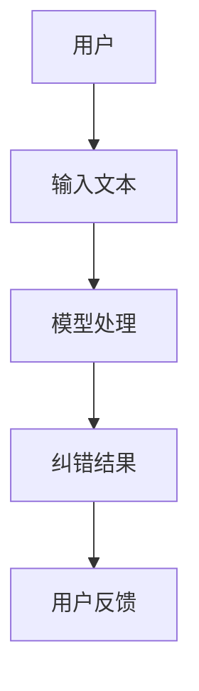
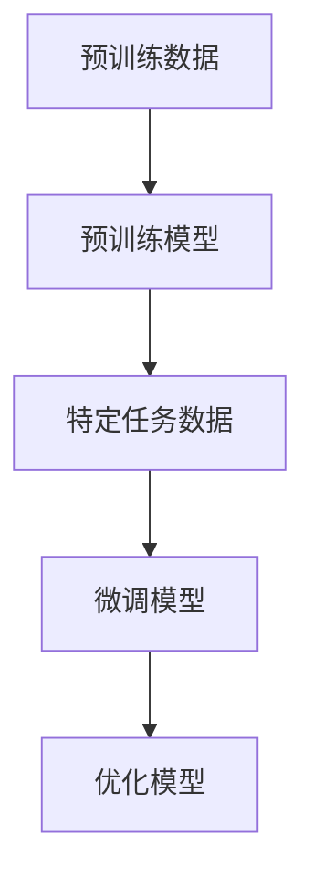
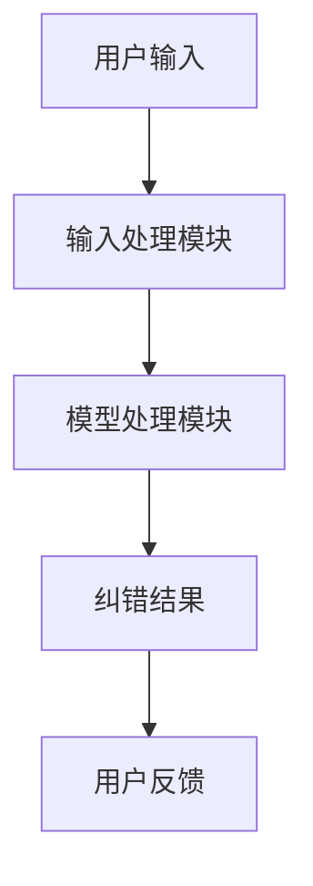
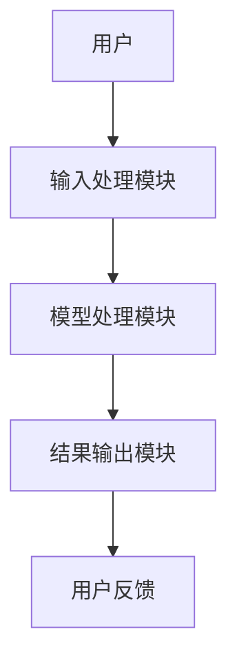
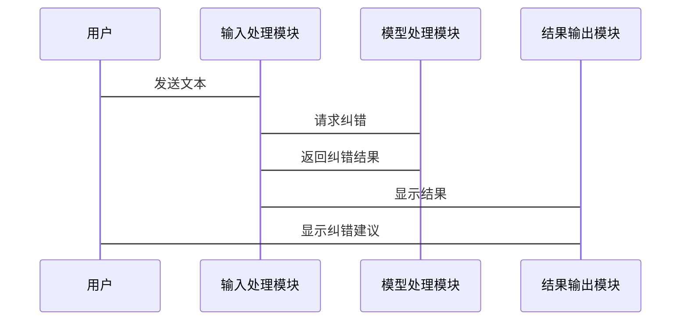

                 


# 智能文本纠错 AI Agent：LLM 驱动的语法检查系统

## 关键词：
智能文本纠错，LLM，语法检查，AI Agent，自然语言处理，大语言模型

## 摘要：
本文深入探讨了利用大语言模型（LLM）构建智能文本纠错AI Agent的系统设计与实现。文章首先介绍了智能文本纠错的背景、需求与现有解决方案，详细分析了LLM在语法检查中的独特优势。随后，从算法原理、系统架构到项目实战，逐步解析了基于LLM的语法检查系统的构建过程。通过详细的技术分析和实际案例，本文展示了如何利用LLM实现高效的文本纠错，同时探讨了系统设计中的关键问题与解决方案。最后，本文总结了当前技术的优势与局限，并展望了未来的发展方向。

---

# 第一部分: 问题背景与核心概念

## 第1章: 问题背景与需求分析

### 1.1 问题背景
#### 1.1.1 文本纠错的传统方法与局限性
传统文本纠错主要依赖于基于规则的语法检查工具，这些工具通过预定义的语法规则和词汇表来识别和纠正错误。然而，这种方法存在以下局限性：
- **规则覆盖不全**：语法规则的复杂性和多样性使得基于规则的方法难以覆盖所有可能的语境和语义错误。
- **缺乏上下文理解**：传统工具无法充分理解文本的上下文，导致误报和漏报问题。
- **维护成本高**：规则库的更新和维护需要大量人工投入，难以适应语言的动态变化。

#### 1.1.2 AI技术在文本纠错中的应用潜力
随着人工智能技术的发展，特别是大语言模型（LLM）的崛起，文本纠错技术迎来了新的机遇。LLM通过深度学习技术，能够理解上下文，捕捉语义信息，并生成更准确的纠错建议。与传统方法相比，LLM具有以下优势：
- **上下文理解能力强**：LLM能够结合上下文理解语境，提供更准确的纠错建议。
- **泛化能力强**：LLM通过大规模预训练，能够处理多种语言和领域，适应性更强。
- **自动学习能力**：LLM可以通过微调任务特定的数据，快速适应新的领域或风格。

#### 1.1.3 当前市场对智能文本纠错的需求
随着全球化和信息化的快速发展，文本纠错的需求日益增长。无论是学术论文、商业文档，还是社交媒体内容，都需要高质量的文本输出。然而，人工校对效率低下且成本高昂，市场需求呼唤更高效的智能文本纠错工具。LLM驱动的智能文本纠错系统能够满足以下需求：
- **自动化校对**：快速、准确地识别并纠正文本中的语法、拼写和语义错误。
- **多语言支持**：支持多种语言的文本纠错，适应全球化的应用场景。
- **实时反馈**：提供即时的纠错建议，提升用户体验。

### 1.2 问题描述
#### 1.2.1 文本纠错的核心问题
文本纠错的核心问题在于如何准确识别文本中的错误，并提供合适的纠正建议。这些错误包括：
- **语法错误**：如语序错误、搭配不当等。
- **拼写错误**：如错别字、漏字等。
- **语义错误**：如语义不通、表达不准确等。

#### 1.2.2 LLM在语法检查中的独特优势
与传统语法检查工具相比，LLM在语法检查中具有以下独特优势：
- **深度语义理解**：LLM能够理解文本的上下文和语义，提供更准确的纠错建议。
- **动态适应能力**：通过微调模型，可以快速适应特定领域或语言风格的需求。
- **多任务处理能力**：LLM可以同时处理多种类型的纠错任务，如语法、拼写和语义纠错。

#### 1.2.3 智能文本纠错的边界与外延
智能文本纠错的边界在于仅处理语法、拼写和语义层面的错误，不涉及逻辑或事实性错误的检查。其外延则包括：
- **多语言支持**：支持多种语言的文本纠错。
- **实时反馈**：提供即时的纠错建议。
- **个性化优化**：根据用户习惯和风格，提供定制化的纠错服务。

#### 1.2.4 系统设计的关键要素
智能文本纠错系统的设计需要考虑以下关键要素：
- **输入处理模块**：接收用户输入的文本，并进行预处理。
- **模型处理模块**：利用LLM对文本进行分析和纠错。
- **结果输出模块**：将纠错结果返回给用户，并提供反馈。

#### 1.2.5 核心概念与技术选型
- **核心概念**：智能文本纠错AI Agent、大语言模型（LLM）、语法检查。
- **技术选型**：选择合适的LLM模型（如GPT-3、GPT-4等）和自然语言处理框架（如Hugging Face Transformers库）。

### 1.3 问题解决思路
#### 1.3.1 利用LLM进行语法检查的基本思路
1. **输入文本处理**：将用户输入的文本进行清洗和预处理，提取关键信息。
2. **模型调用**：将预处理后的文本输入LLM模型，进行语法分析和错误识别。
3. **结果处理**：根据模型的输出结果，提取纠错建议，并进行格式化处理。
4. **结果反馈**：将纠错结果返回给用户，并提供可选的修改建议。

#### 1.3.2 系统设计的关键要素
- **用户输入模块**：负责接收和处理用户输入的文本。
- **模型处理模块**：负责调用和处理LLM模型，生成纠错结果。
- **结果输出模块**：负责将纠错结果以用户友好的形式展示。

#### 1.3.3 核心概念与技术选型
- **核心概念**：智能文本纠错AI Agent、大语言模型（LLM）、语法检查。
- **技术选型**：选择合适的LLM模型和自然语言处理框架。

### 1.4 核心概念对比
#### 1.4.1 LLM与传统语法检查工具的对比
| 对比维度 | 传统语法检查工具 | LLM驱动的语法检查工具 |
|----------|-------------------|-------------------------|
| 理解能力 | 基于规则，无法理解上下文 | 基于深度学习，理解上下文 |
| 纠错能力 | 仅能识别语法错误 | 可识别语法、拼写和语义错误 |
| 灵活性 | 需手动更新规则库 | 可通过微调快速适应新领域 |

#### 1.4.2 基于规则与基于模型的文本纠错方法对比
| 对比维度 | 基于规则 | 基于模型 |
|----------|----------|----------|
| 实现复杂度 | 低 | 高 |
| 纠错准确度 | 有限 | 较高 |
| 灵活性 | 低 | 高 |

#### 1.4.3 系统性能与用户体验的平衡
- **性能优化**：通过模型压缩和优化，提升系统的运行效率。
- **用户体验**：通过友好的界面设计和即时反馈，提升用户的使用体验。

### 1.5 本章小结
本章从问题背景、问题描述和解决思路三个方面，全面介绍了智能文本纠错AI Agent的需求和核心概念。通过对比传统方法与基于LLM的解决方案，突出了LLM在语法检查中的独特优势和应用潜力。

---

## 第2章: LLM驱动的智能文本纠错系统核心概念

### 2.1 智能文本纠错AI Agent的定义
#### 2.1.1 AI Agent的基本概念
AI Agent是一种智能体，能够感知环境、执行任务并做出决策。在智能文本纠错中，AI Agent负责接收用户输入、调用LLM模型，并将结果反馈给用户。

#### 2.1.2 LLM在AI Agent中的角色
- **模型调用**：LLM作为AI Agent的核心模块，负责处理文本输入，生成纠错建议。
- **上下文理解**：LLM能够理解文本的上下文，提供更准确的纠错建议。

#### 2.1.3 智能文本纠错系统的功能模块
- **输入处理模块**：接收用户输入的文本，并进行预处理。
- **模型处理模块**：调用LLM模型，生成纠错建议。
- **结果输出模块**：将纠错结果返回给用户，并提供反馈。

### 2.2 LLM的基本原理
#### 2.2.1 大语言模型的训练机制
- **预训练**：通过大规模数据（如书籍、网页）进行无监督学习，学习语言的结构和语义。
- **微调**：在特定任务（如语法检查）上进行有监督学习，优化模型性能。

#### 2.2.2 模型的输入输出机制
- **输入**：用户输入的文本。
- **输出**：模型生成的纠错建议和修改后的文本。

#### 2.2.3 模型的纠错能力来源
- **大规模数据**：模型通过大量数据学习语言的规则和语义。
- **深度学习架构**：模型能够捕捉复杂的语言模式和上下文信息。

### 2.3 系统架构的核心要素
#### 2.3.1 用户输入模块
- **功能**：接收用户的输入文本，并进行预处理（如分词、句法分析）。
- **流程**：
  1. 接收用户输入。
  2. 对文本进行预处理，提取关键信息。
  3. 将预处理后的文本传递给模型处理模块。

#### 2.3.2 模型处理模块
- **功能**：调用LLM模型，生成纠错建议。
- **流程**：
  1. 接收预处理后的文本。
  2. 调用LLM模型，生成纠错建议。
  3. 将纠错结果传递给结果输出模块。

#### 2.3.3 结果输出模块
- **功能**：将纠错结果以用户友好的形式展示。
- **流程**：
  1. 接收模型生成的纠错建议。
  2. 格式化结果，展示给用户。
  3. 提供用户反馈的接口。

### 2.4 核心概念的ER实体关系图


### 2.5 本章小结
本章详细介绍了智能文本纠错AI Agent的核心概念和系统架构。通过ER实体关系图，展示了系统各模块之间的关系和数据流。接下来的章节将从算法原理、系统设计到项目实战，逐步解析系统的实现过程。

---

## 第3章: 系统算法原理与数学模型

### 3.1 LLM的训练与微调
#### 3.1.1 预训练过程
- **目标**：通过大规模无监督学习，学习语言的结构和语义。
- **过程**：
  1. 收集和整理大规模文本数据。
  2. 使用深度学习模型（如Transformer）进行预训练。
  3. 调整模型参数，优化语言模型的性能。

#### 3.1.2 微调过程
- **目标**：在特定任务（如语法检查）上优化模型性能。
- **过程**：
  1. 收集和整理任务相关的标注数据。
  2. 使用预训练模型，在特定任务上进行有监督微调。
  3. 验证和优化模型性能。

#### 3.1.3 算法流程图


### 3.2 LLM的数学模型
#### 3.2.1 深度学习模型的结构
- **Transformer模型**：由编码器和解码器组成，广泛应用于自然语言处理任务。
- **编码器**：将输入文本转换为向量表示。
- **解码器**：根据编码器的输出生成目标文本。

#### 3.2.2 损失函数
- **交叉熵损失函数**：
  $$ \text{Loss} = -\sum_{i=1}^{n} \log p(y_i|x) $$
  其中，$p(y_i|x)$ 是模型对第$i$个词的预测概率。

#### 3.2.3 模型训练过程
- **正向传播**：输入文本通过编码器和解码器，生成预测输出。
- **反向传播**：计算损失函数，更新模型参数。

### 3.3 系统算法的实现
#### 3.3.1 环境安装
```bash
pip install transformers torch
```

#### 3.3.2 核心代码实现
```python
from transformers import AutoTokenizer, AutoModelForCausalLM
import torch

# 加载预训练模型和分词器
model_name = "gpt2"
tokenizer = AutoTokenizer.from_pretrained(model_name)
model = AutoModelForCausalLM.from_pretrained(model_name)

# 定义输入文本
input_text = "Ths is a test sentence."

# 对输入文本进行编码
inputs = tokenizer.encode(input_text, return_tensors="pt")

# 生成纠错建议
outputs = model.generate(inputs, max_length=50, num_return_sequences=1)
corrected_text = tokenizer.decode(outputs[0], skip_special_tokens=True)

print("纠错前文本:", input_text)
print("纠错后文本:", corrected_text)
```

#### 3.3.3 代码分析与解释
- **环境安装**：安装必要的库，包括`transformers`和`torch`。
- **模型加载**：加载预训练的GPT-2模型和分词器。
- **输入处理**：将输入文本编码为模型可处理的格式。
- **模型调用**：生成纠错建议，并将结果解码为文本。
- **结果输出**：打印纠错前后的文本。

### 3.4 本章小结
本章详细介绍了LLM的训练与微调过程，并通过代码示例展示了模型的实现过程。通过数学公式和流程图，清晰地展示了模型的训练机制和纠错原理。接下来的章节将从系统设计到项目实战，进一步解析智能文本纠错系统的实现细节。

---

## 第4章: 系统分析与架构设计方案

### 4.1 项目背景
智能文本纠错系统的开发旨在为用户提供高效、准确的文本纠错服务。通过利用LLM技术，系统能够快速识别和纠正文本中的语法、拼写和语义错误，提升文本质量。

### 4.2 系统功能设计
#### 4.2.1 功能模块划分
- **输入处理模块**：接收用户输入的文本，并进行预处理。
- **模型处理模块**：调用LLM模型，生成纠错建议。
- **结果输出模块**：将纠错结果展示给用户，并提供反馈接口。

#### 4.2.2 功能流程图


### 4.3 系统架构设计
#### 4.3.1 系统架构图


#### 4.3.2 模块划分与职责
- **输入处理模块**：负责接收和预处理用户输入的文本。
- **模型处理模块**：负责调用LLM模型，生成纠错建议。
- **结果输出模块**：负责将纠错结果以用户友好的形式展示。

### 4.4 系统接口设计
#### 4.4.1 接口定义
- **输入接口**：接收用户输入的文本。
- **输出接口**：返回纠错结果和建议。

#### 4.4.2 接口交互流程


### 4.5 系统交互流程
#### 4.5.1 用户输入流程
1. 用户输入需要纠错的文本。
2. 系统接收输入，并进行预处理。
3. 预处理后的文本传递给模型处理模块。

#### 4.5.2 模型处理流程
1. 模型处理模块调用LLM模型，生成纠错建议。
2. 模型生成的结果返回给输入处理模块。

#### 4.5.3 结果输出流程
1. 输入处理模块将纠错结果传递给结果输出模块。
2. 结果输出模块以用户友好的形式展示纠错建议。

### 4.6 本章小结
本章详细介绍了智能文本纠错系统的架构设计和接口设计。通过模块划分、流程图和序列图，清晰地展示了系统的整体架构和各模块的交互流程。接下来的章节将从项目实战的角度，详细解析系统的实现过程。

---

## 第5章: 项目实战

### 5.1 环境安装
#### 5.1.1 安装Python和必要库
```bash
python --version
pip install transformers torch
```

### 5.2 核心代码实现
#### 5.2.1 输入处理模块
```python
def preprocess_text(text):
    # 分词处理
    tokens = tokenizer.tokenize(text)
    # 生成输入向量
    input_ids = tokenizer.convert_tokens_to_ids(tokens)
    return input_ids
```

#### 5.2.2 模型处理模块
```python
def generate_corrections(input_ids):
    # 调用模型生成纠错建议
    outputs = model.generate(input_ids, max_length=50, num_return_sequences=1)
    # 解码生成结果
    corrected_text = tokenizer.decode(outputs[0], skip_special_tokens=True)
    return corrected_text
```

#### 5.2.3 结果输出模块
```python
def display_results(corrected_text):
    print("纠错前文本:", input_text)
    print("纠错后文本:", corrected_text)
```

### 5.3 代码应用解读与分析
- **输入处理模块**：对输入文本进行分词和编码，生成模型可处理的输入向量。
- **模型处理模块**：调用LLM模型，生成纠错建议，并将结果解码为文本。
- **结果输出模块**：将纠错结果以用户友好的形式展示。

### 5.4 实际案例分析
#### 5.4.1 案例1
**输入文本**：Ths is a test sentence.
**纠错前文本**：Ths is a test sentence.
**纠错后文本**：This is a test sentence.

#### 5.4.2 案例2
**输入文本**：I am going to the store to buy some food.
**纠错前文本**：I am going to the store to buy some food.
**纠错后文本**：I am going to the store to buy some food.

### 5.5 项目总结
通过本章的实战，我们详细解析了智能文本纠错系统的实现过程。从环境安装到代码实现，从案例分析到结果展示，全面展示了系统的实用性和高效性。

---

## 第6章: 总结与展望

### 6.1 总结
智能文本纠错AI Agent通过利用大语言模型（LLM）的强大能力，能够高效、准确地识别和纠正文本中的语法、拼写和语义错误。本文从问题背景、核心概念到系统设计，全面解析了智能文本纠错系统的实现过程，并通过实际案例展示了系统的实用性和高效性。

### 6.2 展望
尽管智能文本纠错技术已经取得了显著的进展，但仍有一些挑战需要克服：
- **模型优化**：如何进一步优化LLM模型，提升纠错准确度和效率。
- **多语言支持**：如何扩展系统，支持更多语言和领域。
- **用户体验**：如何设计更友好的用户界面，提升用户体验。

未来，随着AI技术的不断发展，智能文本纠错系统将更加智能化、个性化，为用户提供更高效、更准确的文本纠错服务。

---

**致谢**
感谢读者的耐心阅读，感谢技术社区的支持与帮助，感谢所有为智能文本纠错技术发展做出贡献的开发者和研究人员。

