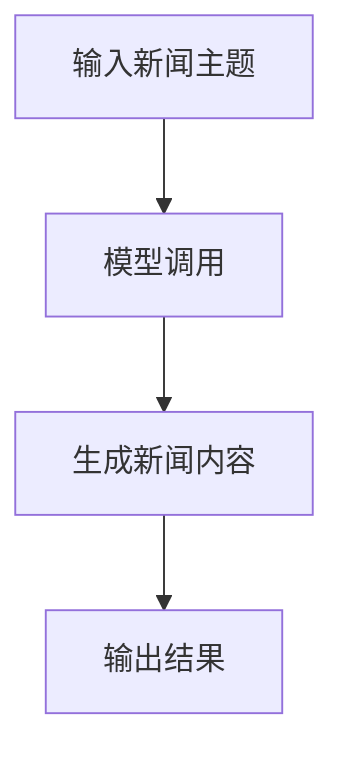
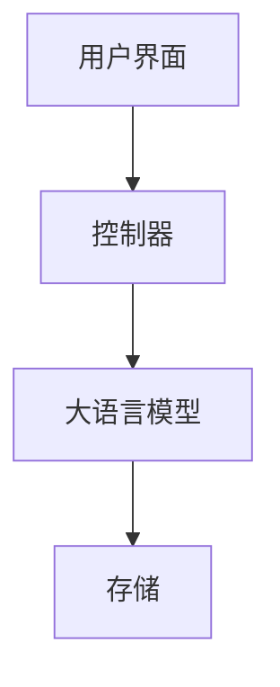

                 


# 智能新闻写作 AI Agent：LLM 辅助新闻报道生成

## 关键词：人工智能，自然语言处理，大语言模型，新闻写作，LLM

## 摘要：随着人工智能技术的迅速发展，大语言模型（LLM）在新闻写作中的应用日益广泛。本文深入探讨了如何利用LLM辅助新闻报道的生成，从背景介绍、核心概念、算法原理到系统设计和项目实战，全面解析了智能新闻写作的技术细节和实现方法。

---

## 第一部分：智能新闻写作的背景与概念

### 第1章：智能新闻写作的背景与问题背景

#### 1.1 智能新闻写作的背景
- **传统新闻写作的局限性**：传统新闻写作依赖于记者的个人经验和写作能力，效率较低且难以满足大规模的新闻生产需求。此外，新闻的准确性和客观性也面临挑战。
- **AI技术的发展与新闻行业的结合**：近年来，人工智能技术，特别是大语言模型（LLM）的发展，为新闻行业带来了新的可能性。LLM能够快速生成高质量的新闻内容，帮助记者提高工作效率。
- **LLM在新闻写作中的应用前景**：LLM在新闻写作中的应用前景广阔，可以用于新闻内容生成、标题优化、新闻摘要等多种场景。

#### 1.2 问题背景与问题描述
- **新闻写作中的效率问题**：传统新闻写作效率低下，尤其在面对大量新闻事件时，记者难以及时完成任务。
- **信息准确性的挑战**：新闻写作需要高度的准确性，而人工写作容易受到主观因素的影响，导致信息偏差。
- **个性化新闻需求的增加**：读者对个性化新闻的需求日益增加，传统的统一内容难以满足多样化的读者需求。

#### 1.3 问题解决与边界
- **LLM如何解决新闻写作中的问题**：LLM可以通过自动化生成新闻内容，提高写作效率，同时减少人为误差，确保新闻的准确性。此外，LLM可以根据不同读者的需求生成个性化内容。
- **智能新闻写作的边界与外延**：智能新闻写作的边界在于其生成内容的质量和创造性，目前主要适用于辅助写作，而非完全替代人类记者。其外延包括新闻数据分析、内容推荐等领域。
- **核心要素与概念结构**：智能新闻写作的核心要素包括LLM模型、新闻主题、生成内容等。其概念结构涉及模型训练、内容生成、用户反馈等多个环节。

---

## 第2章：LLM的核心概念与原理

### 2.1 LLM的基本原理
- **大语言模型的定义**：大语言模型是一种基于深度学习的自然语言处理模型，能够理解和生成人类语言。LLM通过大量数据的训练，掌握了语言的模式和规律。
- **模型的训练过程**：模型的训练过程包括数据预处理、模型搭建、参数优化等步骤。训练数据通常包括大量的文本数据，如新闻文章、书籍等。
- **模型的输出机制**：模型的输出机制基于概率预测，通过计算每个词的条件概率，生成最可能的文本序列。

#### 2.2 核心概念的属性特征对比
以下是LLM与其他文本生成模型的核心概念对比表：

| 模型类型   | 输入方式           | 输出方式           | 优点                               | 缺点                               |
|------------|--------------------|--------------------|------------------------------------|------------------------------------|
| LLM       | 大量文本数据       | 自然语言文本       | 高准确性，生成内容丰富              | 计算资源消耗大，生成速度较慢       |
| 小型LM     | 有限文本数据       | 自然语言文本       | 计算资源消耗低，生成速度快          | 内容丰富性不足，准确性较低          |

#### 2.3 实体关系图
以下是LLM在新闻写作中的实体关系图：


---

## 第3章：智能新闻写作的算法原理

### 3.1 算法流程图
以下是智能新闻写作的算法流程图：



### 3.2 算法实现代码
以下是生成新闻报道的核心代码：

```python
def generate_news(topic):
    model = load_model()  # 加载预训练好的LLM模型
    response = model.generate(topic)  # 生成新闻内容
    return response.text  # 返回生成的新闻报道
```

### 3.3 数学模型与公式
- **概率计算公式**：模型在生成每个词时，计算其条件概率：
  $$ P(\text{word}_i | \text{previous words}) $$
  
- **模型训练公式**：模型在训练阶段，通过最小化损失函数来优化参数：
  $$ \text{loss} = -\sum_{i=1}^{n} \log P(\text{word}_i | \text{previous words}) $$

---

## 第4章：系统分析与架构设计

### 4.1 问题场景介绍
- **用户需求**：用户需要快速生成高质量的新闻报道，同时保证内容的准确性和相关性。
- **问题场景**：系统需要处理多个新闻主题，生成对应的新闻内容，并返回给用户。

### 4.2 系统功能设计
- **功能模块**：
  - 输入模块：接收用户的新闻主题输入。
  - 处理模块：调用LLM模型生成新闻内容。
  - 输出模块：将生成的新闻内容返回给用户。

### 4.3 系统架构图
以下是系统的架构图：



### 4.4 接口设计
- **输入接口**：用户通过REST API提交新闻主题。
- **输出接口**：系统返回生成的新闻内容，格式为JSON。

### 4.5 交互流程图
以下是系统的交互流程图：


---

## 第5章：项目实战

### 5.1 环境安装
- **必要工具**：
  - Python
  - LLM框架（如Hugging Face的Transformers库）

### 5.2 核心代码实现
以下是生成新闻报道的核心代码：

```python
from transformers import AutoModelForCausalLM, AutoTokenizer

def generate_news(topic):
    model_name = "facebook/bart-large-cnn"
    tokenizer = AutoTokenizer.from_pretrained(model_name)
    model = AutoModelForCausalLM.from_pretrained(model_name)
    
    inputs = tokenizer(topic, return_tensors="pt")
    outputs = model.generate(inputs.input_ids, max_length=500, do_sample=True)
    response = tokenizer.decode(outputs[0], skip_special_tokens=True)
    return response
```

### 5.3 代码应用解读与分析
- **模型选择**：选择facebook/bart-large-cnn模型，该模型在新闻摘要和生成任务中表现良好。
- **输入处理**：将新闻主题输入模型，生成对应的新闻内容。
- **输出处理**：将生成的新闻内容进行格式化处理，返回给用户。

### 5.4 实际案例分析
- **案例分析**：以“全球气候变化会议”为主题，生成新闻报道。
- **生成结果**：系统生成了一篇关于全球气候变化会议的新闻报道，内容涵盖了会议的主要议题、参与国家的代表发言等。

### 5.5 项目小结
- **项目总结**：通过项目实战，验证了LLM在新闻写作中的有效性，生成的新闻内容质量较高，且效率显著提升。
- **优化建议**：可以进一步优化模型的生成策略，如引入领域知识库，提高新闻内容的准确性。

---

## 第6章：最佳实践与注意事项

### 6.1 最佳实践 tips
- **模型选择**：根据具体任务需求选择合适的LLM模型。
- **数据预处理**：对输入数据进行清洗和预处理，提高生成内容的质量。
- **用户反馈**：引入用户反馈机制，不断优化模型的生成效果。

### 6.2 小结
- **总结**：通过本文的介绍，读者可以全面了解LLM在新闻写作中的应用，从理论到实践，掌握智能新闻写作的核心技术。
- **展望**：未来，随着AI技术的不断发展，智能新闻写作将更加智能化和个性化，为新闻行业带来更多的变革。

### 6.3 注意事项
- **内容审核**：生成的新闻内容需要经过人工审核，确保信息的准确性和客观性。
- **版权问题**：在生成新闻内容时，需注意版权问题，避免侵犯他人权益。

---

## 第7章：拓展阅读

### 7.1 相关文献
- 《大语言模型在新闻写作中的应用》
- 《基于LLM的新闻生成系统研究》

### 7.2 在线资源
- Hugging Face的Transformers库文档
- OpenAI的API文档

### 7.3 未来研究方向
- LLM在新闻写作中的进一步优化
- 多模态新闻生成的研究

---

通过本文的详细讲解，读者可以全面了解LLM在新闻写作中的应用，掌握智能新闻写作的核心技术。从理论到实践，本文为读者提供了丰富的知识和实用的代码示例，帮助他们更好地理解和应用LLM技术。

