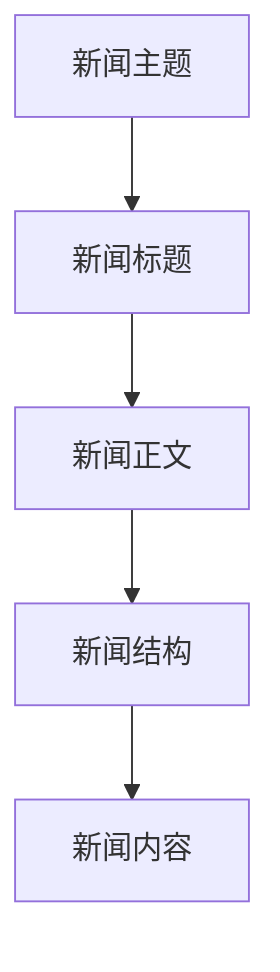
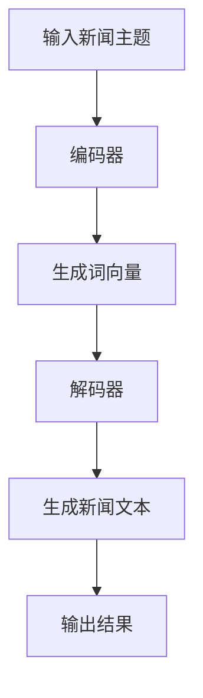
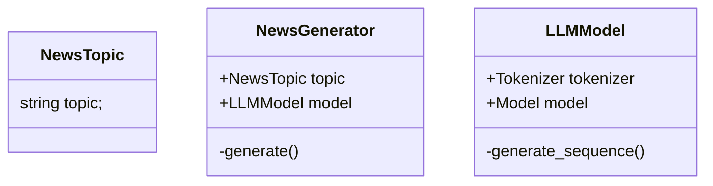
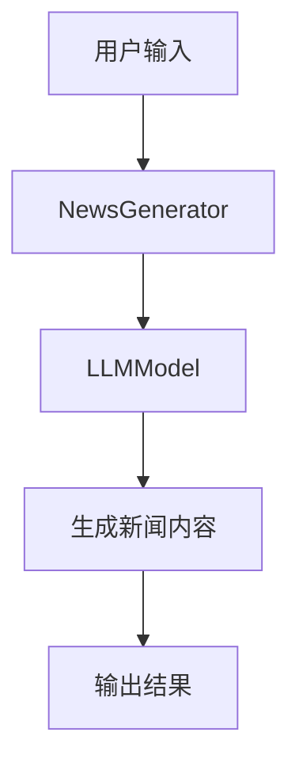
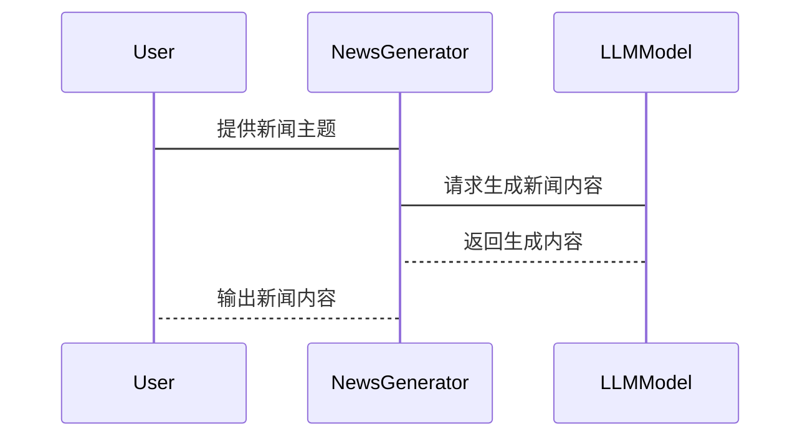

                 


# 智能新闻生成AI Agent：LLM驱动的自动化新闻写作

## 关键词：智能新闻生成，LLM，大语言模型，自动化新闻写作，AI新闻生成，自然语言处理，新闻内容生成

## 摘要：  
随着大语言模型（LLM）技术的迅速发展，新闻生成领域正在经历一场革命。本文将深入探讨LLM驱动的智能新闻生成AI Agent的原理、算法、系统架构及其实际应用。通过分析LLM在新闻生成中的优势与挑战，结合具体案例，展示如何利用LLM实现自动化新闻写作，并对未来的研究方向进行展望。

---

# 第1章: 智能新闻生成的背景与问题背景

## 1.1 智能新闻生成的背景

### 1.1.1 数字化新闻生产的历史演变  
新闻生产从传统的手工写作逐步向数字化、自动化方向发展。早期，新闻写作依赖记者的个人经验和技能；随着互联网的普及，数据量的激增，新闻生产需要更高效的工具来处理海量信息。  

### 1.1.2 大语言模型的崛起与应用  
近年来，大语言模型（LLM）如GPT系列模型的出现，为自然语言处理（NLP）任务带来了革命性的变化。LLM不仅能够理解上下文，还能生成高质量的文本内容，这为新闻生成提供了新的可能性。  

### 1.1.3 智能新闻生成的定义与边界  
智能新闻生成是指利用AI技术，通过LLM模型自动生成新闻内容的过程。其边界包括生成内容的质量、可定制性以及模型的可解释性。  

---

## 1.2 问题背景与现状

### 1.2.1 新闻写作的痛点与挑战  
传统新闻写作耗时长、效率低，尤其是在处理大量数据时，记者难以快速提取关键信息并组织成文。此外，新闻写作需要高度的专业知识，对新手记者而言门槛较高。  

### 1.2.2 传统新闻生产流程的效率瓶颈  
传统新闻生产流程包括选题、采访、写作、编辑等环节，每个环节都可能耗费大量时间。如何通过技术手段提高效率，是新闻行业亟待解决的问题。  

### 1.2.3 智能新闻生成的市场需求与技术可行性  
市场需求方面，新闻机构对自动化新闻生成的需求日益增长。技术方面，LLM模型的性能不断提升，为智能新闻生成提供了坚实的技术基础。  

---

# 第2章: 大语言模型（LLM）基础

## 2.1 LLM的基本概念

### 2.1.1 大语言模型的定义与特点  
大语言模型是一种基于深度学习的模型，通过大量数据的预训练，能够理解和生成自然语言文本。其特点包括通用性、可扩展性和高效率。  

### 2.1.2 LLM的核心技术原理  
LLM的核心技术包括编码器-解码器结构、注意力机制和优化算法。编码器将输入文本转化为向量表示，解码器根据向量生成输出文本。注意力机制帮助模型关注输入中的重要部分。  

### 2.1.3 LLM与传统NLP模型的区别  
与传统NLP模型相比，LLM具有更强的上下文理解和生成能力，能够处理更复杂的语言任务。  

---

## 2.2 LLM的训练与优化

### 2.2.1 LLM的训练数据与预训练目标  
LLM的训练数据通常包括大规模的文本数据，预训练目标是通过最小化预测与真实值的差异来优化模型参数。  

### 2.2.2 LLM的模型架构与优化策略  
常见的模型架构包括Transformer和BERT。优化策略包括Adam优化器和学习率调度。  

### 2.2.3 LLM的评估与基准测试  
评估指标包括准确率、BLEU分数和ROUGE分数。基准测试用于比较不同模型的性能。  

---

## 2.3 LLM在新闻生成中的应用潜力

### 2.3.1 LLM生成新闻文本的优势  
LLM能够快速生成高质量的新闻内容，减少人工写作的时间和成本。  

### 2.3.2 LLM生成新闻的局限性与挑战  
生成内容的可解释性不足，可能存在事实错误，且难以完全符合特定的新闻风格。  

### 2.3.3 LLM在新闻生成中的创新应用场景  
LLM可以用于新闻摘要、新闻标题生成和多语言新闻写作。  

---

# 第3章: 智能新闻生成的核心概念与联系

## 3.1 核心概念原理

### 3.1.1 LLM驱动的新闻生成流程  
输入新闻主题，LLM生成新闻标题和正文。  

### 3.1.2 新闻生成的语义理解与内容组织  
模型需要理解新闻主题的语义，并将其组织成合理的新闻结构。  

### 3.1.3 新闻生成的可解释性与质量评估  
通过分析生成文本的结构和内容，评估其可解释性和质量。  

---

## 3.2 核心概念属性对比

### 3.2.1 LLM生成文本的可控制性对比  
通过调整模型参数，可以控制生成文本的风格和长度。  

### 3.2.2 不同新闻类型生成的复杂度对比  
新闻类型不同，生成的复杂度也不同，如财经新闻比娱乐新闻更复杂。  

### 3.2.3 不同LLM模型的性能对比  
不同模型在生成新闻内容时的准确率和流畅度存在差异。  

---

## 3.3 ER实体关系图架构



---

## 3.4 本章小结

---

# 第4章: LLM驱动的新闻生成算法原理

## 4.1 算法原理概述

### 4.1.1 LLM的编码器-解码器结构  
编码器将输入文本转化为向量表示，解码器根据向量生成输出文本。  

### 4.1.2 注意力机制在新闻生成中的应用  
注意力机制帮助模型关注输入中的重要部分，提高生成文本的质量。  

### 4.1.3 梯度下降优化算法  
通过梯度下降优化算法，模型不断调整参数以最小化损失函数。  

---

## 4.2 算法流程图



---

## 4.3 算法实现代码

```python
def generate_news(topic):
    input_ids = tokenizer(topic, return_tensors='np')
    outputs = model.generate(input_ids.input_ids, max_length=500)
    return tokenizer.decode(outputs[0], skip_special_tokens=True)
```

---

## 4.4 数学模型与公式

### 4.4.1 损失函数  
交叉熵损失函数用于衡量生成文本与真实值的差异：  
$$ \text{Loss} = -\sum_{i=1}^{n} \text{log}(P(y_i|x_i)) $$  

### 4.4.2 注意力机制  
注意力机制的计算公式为：  
$$ \text{Attention}(Q, K, V) = \text{softmax}\left(\frac{QK^T}{\sqrt{d_k}}\right)V $$  

---

## 4.5 本章小结

---

# 第5章: 系统分析与架构设计方案

## 5.1 问题场景介绍  
新闻生成系统需要处理用户输入的新闻主题，并生成相应的新闻内容。  

## 5.2 系统功能设计

### 5.2.1 领域模型类图  


### 5.2.2 系统架构设计  


### 5.2.3 系统接口设计  
新闻生成系统提供API接口，用户可以通过API调用生成新闻内容。  

### 5.2.4 系统交互序列图  


---

## 5.3 本章小结

---

# 第6章: 项目实战

## 6.1 环境安装

### 6.1.1 安装Python和相关库  
安装Python和PyTorch、Hugging Face Transformers库。  

### 6.1.2 安装LLM模型  
使用Hugging Face提供的开源模型，如GPT-2或Bert。  

---

## 6.2 系统核心实现源代码

### 6.2.1 新闻主题输入与生成  
```python
from transformers import GPT2LMHeadModel, GPT2Tokenizer

model_name = "gpt2"
tokenizer = GPT2Tokenizer.from_pretrained(model_name)
model = GPT2LMHeadModel.from_pretrained(model_name)

def generate_news(topic):
    input_ids = tokenizer(topic, return_tensors='pt')
    outputs = model.generate(input_ids.input_ids, max_length=500, do_sample=True)
    return tokenizer.decode(outputs[0], skip_special_tokens=True)
```

### 6.2.2 代码解读与分析  
上述代码展示了如何使用GPT-2模型生成新闻内容，包括模型加载、输入处理和生成输出。  

---

## 6.3 案例分析与详细讲解

### 6.3.1 案例分析  
以“全球气候变化”为主题，生成一篇新闻报道。  

### 6.3.2 详细讲解  
分析生成内容的质量、结构和可读性，探讨模型在新闻生成中的表现。  

---

## 6.4 本章小结

---

# 第7章: 总结与展望

## 7.1 本章总结  
本文详细探讨了LLM驱动的智能新闻生成AI Agent的原理、算法、系统架构及其实际应用。  

## 7.2 未来展望  
未来的研究方向包括提高模型的可解释性、优化生成内容的质量以及探索多模态新闻生成的可能性。  

---

## 7.3 最佳实践 tips  
- 在使用LLM生成新闻时，建议结合人工审核以确保内容的准确性和客观性。  
- 定期更新模型参数，以适应新闻领域的最新发展。  

---

## 7.4 小结  
智能新闻生成是一项具有广阔前景的技术，通过不断的研究和实践，我们可以进一步推动新闻行业的自动化和智能化。  

---

# 结语

随着技术的不断进步，智能新闻生成将变得更加高效和精准。希望本文能够为读者提供关于LLM驱动的新闻生成的深入理解，并为未来的实践和研究提供有价值的参考。

--- 

# 附录

## 附录A: 术语表  
- LLM：大语言模型  
- NLP：自然语言处理  
- GPT：生成式预训练转换器  

## 附录B: 参考文献  
- [1] Radford, A. et al. "Language models are few-shot learners." arXiv preprint arXiv:1909.08899, 2019.  
- [2] Vaswani, A. et al. "Attention is all you need." arXiv preprint arXiv:1706.03798, 2017.  

--- 

# END

