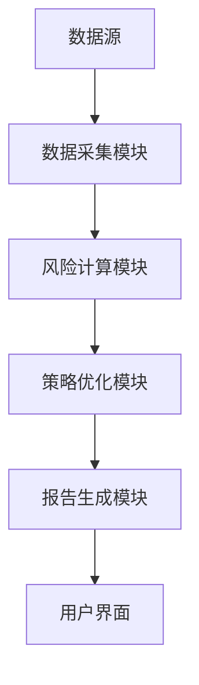

                 


# 智能期权组合Greeks管理系统

> 关键词：智能期权，Greeks，风险管理，量化交易，算法优化

> 摘要：智能期权组合Greeks管理系统是一种基于人工智能和复杂算法的金融工具，用于优化和管理期权组合的风险。本文将详细探讨Greeks的数学模型、系统架构设计、算法优化，以及如何通过实际案例实现智能管理。

---

# 第一部分：智能期权组合Greeks管理系统的背景与概念

## 第1章：期权与Greeks的基础

### 1.1 期权的基本概念

期权是一种金融衍生品，赋予买方在特定时间以特定价格买入或卖出标的资产的权利。期权分为看涨期权和看跌期权，分别对应买入和卖出标的资产的权利。期权的核心要素包括标的资产、执行价格、到期时间、波动率和利率。

### 1.2 Greeks的定义与作用

Greeks是一系列衡量期权价格对不同变量敏感度的指标，包括Delta、Gamma、Theta、Vega和Rho：

- **Delta**：衡量期权价格对标的资产价格变化的敏感度。
- **Gamma**：衡量Delta的变化率。
- **Theta**：衡量期权价格随时间流逝的变化。
- **Vega**：衡量期权价格对波动率变化的敏感度。
- **Rho**：衡量期权价格对利率变化的敏感度。

### 1.3 智能期权组合管理系统的必要性

传统期权组合管理依赖手动计算和简单模型，难以应对市场波动和复杂组合。智能系统通过自动化和实时数据分析，优化风险管理和收益。

---

## 第2章：智能期权组合Greeks管理系统的背景与需求

### 2.1 期权组合风险管理的挑战

市场波动、多因素影响和传统模型局限性使得期权组合管理复杂。传统模型难以实时跟踪和调整，特别是在剧烈波动时，传统方法显得不足。

### 2.2 智能化管理的需求分析

智能系统需具备实时监控、自动化调整和高效计算能力。数据驱动的实时监控和自动化调整是应对市场变化的关键。

### 2.3 系统设计的核心目标

智能系统的目标包括实时计算与动态调整、多目标优化与风险控制，以及可扩展性和灵活性。系统需适应不同市场条件和组合规模。

---

# 第二部分：智能期权组合Greeks管理系统的数学模型与算法原理

## 第3章：Greeks的数学模型

### 3.1 Delta的数学表达式

$$ \Delta = \frac{\partial C}{\partial S} $$

其中，\( C \) 是期权的价格，\( S \) 是标的资产的价格。

### 3.2 Gamma的数学表达式

$$ \Gamma = \frac{\partial \Delta}{\partial S} $$

### 3.3 Theta的数学表达式

$$ \Theta = -\frac{\partial C}{\partial T} $$

### 3.4 Vega的数学表达式

$$ \Vega = \frac{\partial C}{\partial \sigma} $$

### 3.5 Rho的数学表达式

$$ \Rho = \frac{\partial C}{\partial r} $$

### 3.6 Greeks之间的关系

通过数学推导，我们可以看出Greeks并非独立，而是相互关联。例如，Delta和Gamma共同影响期权价格的变化。

---

## 第4章：Greeks的算法实现

### 4.1 基于Black-Scholes模型的Delta计算

使用Black-Scholes公式计算Delta：

$$ \Delta = N(d_1) $$

其中，\( d_1 = \frac{\ln(S/K) + (r + \sigma^2/2)T}{\sigma \sqrt{T}} \)，\( N \) 是标准正态分布的累积分布函数。

### 4.2 Gamma的计算

$$ \Gamma = \frac{\partial \Delta}{\partial S} = \frac{N'(d_1)}{S \sigma \sqrt{T}} $$

### 4.3 Theta的计算

$$ \Theta = -\frac{S \sigma N'(d_1)}{2 \sqrt{T}} - rK e^{-rT} N(d_1) $$

### 4.4 Vega的计算

$$ \Vega = S \sqrt{T} N'(d_1) $$

### 4.5 Rho的计算

$$ \Rho = K T e^{-rT} N(d_1) - r K T e^{-rT} N(d_1) $$

---

# 第三部分：系统架构与实现

## 第5章：系统架构设计

### 5.1 系统模块划分

- 数据采集模块：实时获取市场数据。
- 风险计算模块：计算各项Greeks。
- 策略优化模块：根据Greeks结果优化组合。
- 报告生成模块：生成风险报告。

### 5.2 系统架构图



### 5.3 系统功能设计

- 数据采集：连接实时市场数据源。
- 风险计算：使用数学模型计算各项Greeks。
- 策略优化：基于Greeks结果优化组合。
- 报告生成：生成风险报告供决策参考。

---

## 第6章：项目实战

### 6.1 环境安装

安装必要的Python库，如numpy、pandas、scipy和matplotlib。

### 6.2 核心代码实现

```python
import numpy as np
from scipy.stats import norm

def delta(spot, strike, exp_time, risk_free_rate, volatility):
    d1 = (np.log(spot/strike) + (risk_free_rate + 0.5*volatility**2)*exp_time) / (volatility*np.sqrt(exp_time))
    return norm.cdf(d1)
```

### 6.3 案例分析

分析一个期权组合，计算各项Greeks，并根据结果调整组合以优化风险和收益。

---

## 第7章：最佳实践与小结

### 7.1 小结

智能期权组合Greeks管理系统通过实时计算和动态调整，优化风险管理和收益。系统架构设计和算法实现是关键。

### 7.2 注意事项

- 数据的准确性和及时性至关重要。
- 算法需定期更新以适应市场变化。
- 系统需具备足够的可扩展性。

### 7.3 拓展阅读

建议深入学习Black-Scholes模型、蒙特卡洛模拟和机器学习在金融中的应用。

---

通过以上结构，您可以详细构建智能期权组合Greeks管理系统的知识框架，涵盖背景、概念、算法、系统架构和项目实战，帮助读者系统地理解和掌握相关内容。

