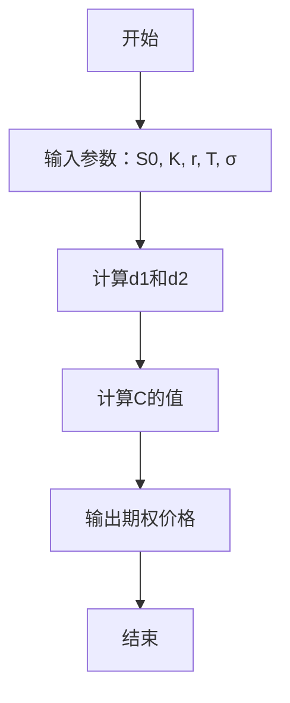
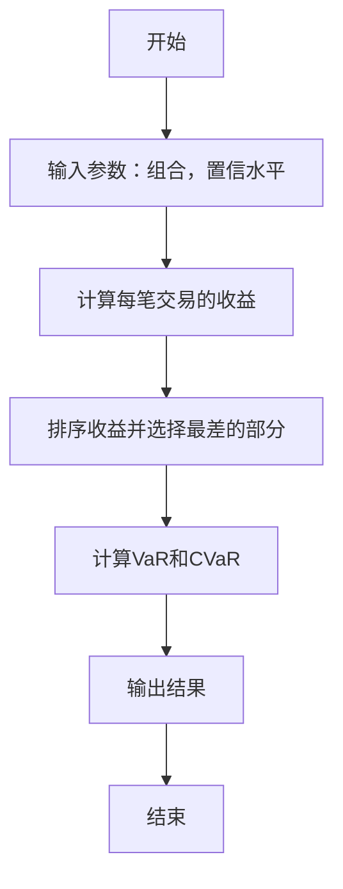
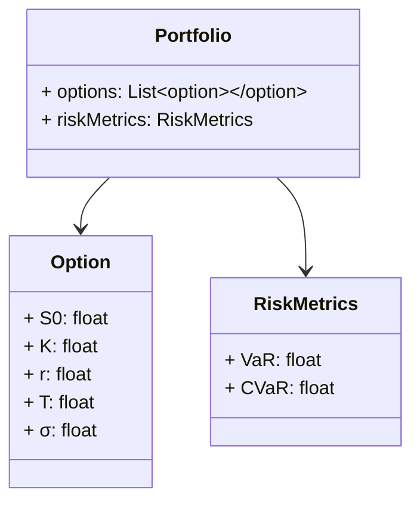
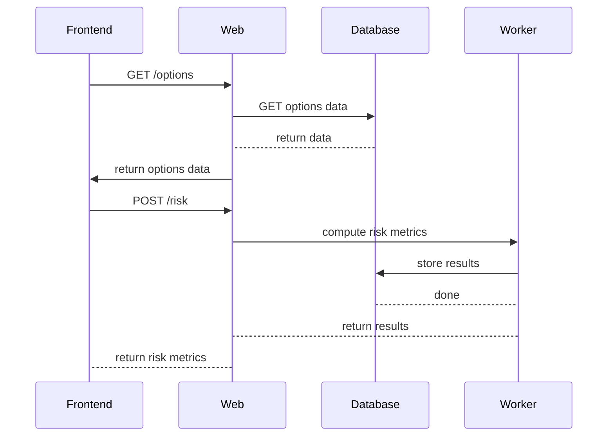

                 


# 《智能期权组合风险敞口管理系统》

> **关键词**：智能期权组合、风险敞口管理、期权定价模型、风险度量、系统架构设计、算法实现

> **摘要**：本文详细探讨了智能期权组合风险敞口管理系统的构建与实现。从期权市场的基本概念出发，分析了传统风险敞口管理的局限性，介绍了智能系统的必要性与目标。随后，深入讲解了期权定价模型（如Black-Scholes模型）和风险度量方法（如VaR和CVaR）的原理与应用。通过智能化算法（如遗传算法和粒子群优化算法）优化了组合管理过程，并详细设计了系统的架构与实现方案。最后，通过实际案例展示了系统的应用效果，并提出了优化建议与未来发展方向。

---

# 第1章: 智能期权组合风险敞口管理系统的背景与问题描述

## 1.1 期权组合风险敞口管理的背景

### 1.1.1 期权市场的基本概念
期权是一种金融衍生品，赋予买方在特定时间以特定价格买入或卖出标的资产的权利。期权组合是指将多个期权合约组合在一起的投资策略，其风险敞口是衡量组合风险的核心指标。

### 1.1.2 风险敞口的定义与重要性
风险敞口是指在特定市场条件下，投资组合可能面临的潜在损失。在期权组合中，风险敞口受到标的资产价格波动、波动率、时间 decay 等因素的影响。有效的风险敞口管理能够帮助投资者规避重大损失，优化投资回报。

### 1.1.3 智能化管理的必要性
传统的人工管理方式效率低下，难以应对复杂多变的市场环境。智能化管理系统能够实时监控市场变化，快速调整策略，显著提高了风险管理的效率和准确性。

## 1.2 问题背景与目标

### 1.2.1 传统期权组合管理的局限性
传统方法依赖人工分析，存在响应速度慢、覆盖面窄、计算复杂等问题，难以满足现代金融市场的需求。

### 1.2.2 智能化管理的需求与目标
智能化管理的目标是通过自动化工具实时监控和调整期权组合，实现风险的精准测量和有效控制。

### 1.2.3 系统边界与外延
系统涵盖期权组合的构建、风险度量、风险对冲等环节，同时与市场数据源、交易系统等外部模块进行交互。

## 1.3 核心概念与组成要素

### 1.3.1 期权组合风险敞口的核心要素
包括标的资产价格、波动率、到期时间、行权价等。

### 1.3.2 系统功能模块的构成
- 数据采集模块：实时获取市场数据
- 风险度量模块：计算VaR、CVaR等指标
- 策略优化模块：优化期权组合
- 报告生成模块：输出风险敞口报告

### 1.3.3 系统的输入输出与交互方式
输入包括市场数据、组合参数等，输出包括风险指标、优化建议等。

## 1.4 本章小结
本章介绍了智能期权组合风险敞口管理系统的背景，分析了传统管理的局限性，并提出了智能化管理的需求与目标。

---

# 第2章: 期权定价与风险度量模型

## 2.1 Black-Scholes期权定价模型

### 2.1.1 模型的基本假设
- 标的资产价格遵循几何布朗运动
- 无摩擦市场，无交易成本
- 连续复利计算

### 2.1.2 模型的数学公式推导
$$ C = S_0 N(d_1) - K e^{-rT} N(d_2) $$
其中：
$$ d_1 = \frac{\ln(S_0/K) + (r + \sigma^2/2)T}{\sigma \sqrt{T}} $$
$$ d_2 = d_1 - \sigma \sqrt{T} $$

### 2.1.3 模型的适用性与局限性
适用于欧洲期权，假设波动率恒定，实际应用中需考虑参数估计误差。

## 2.2 风险度量方法

### 2.2.1 VaR（Value at Risk）的定义与计算
VaR是在给定置信水平下，可能的最大损失。计算方法包括历史模拟法、方差-协方差法和蒙特卡洛模拟法。

### 2.2.2 CVaR（Conditional Value at Risk）的计算
CVaR是在VaR基础上，考虑超过VaR部分的平均损失，比VaR更稳健。

### 2.2.3 风险度量方法的对比分析
- VaR计算简单，但不满足次可加性
- CVaR满足次可加性，更适合作为风险度量指标

## 2.3 算法原理与流程图

### 2.3.1 期权定价算法的流程图


### 2.3.2 风险度量算法的流程图


### 2.3.3 算法实现的代码示例
```python
import numpy as np

def black_scholes(S0, K, r, T, σ):
    d1 = (np.log(S0/K) + (r + σ**2/2)*T) / (σ*np.sqrt(T))
    d2 = d1 - σ*np.sqrt(T)
    return S0 * norm.cdf(d1) - K * np.exp(-r*T) * norm.cdf(d2)
```

## 2.4 本章小结
本章详细介绍了期权定价的Black-Scholes模型及其风险度量方法，为后续系统设计奠定了理论基础。

---

# 第3章: 智能化算法与优化方法

## 3.1 遗传算法在期权组合管理中的应用

### 3.1.1 遗传算法的基本原理
- 初始化种群
- 计算适应度
- 选择、交叉、变异
- 保留优秀个体

### 3.1.2 算法在组合优化中的应用
用于优化期权组合的收益与风险比。

### 3.1.3 算法实现的代码示例
```python
import numpy as np

def genetic_algorithm(population, fitness_func, num_generations):
    for _ in range(num_generations):
        population = population.fitness().select().cross().mutate()
    return population.best()
```

## 3.2 粒子群优化算法

### 3.2.1 粒子群优化算法的基本原理
- 初始化粒子群
- 计算适应度
- 更新个体极值和全局极值
- 更新粒子速度与位置

### 3.2.2 算法在风险敞口管理中的应用
用于优化风险敞口的度量与对冲。

### 3.2.3 算法实现的代码示例
```python
def particle_swarm_optimization(n_particles, fitness_func, max_iterations):
    particles = [Particle() for _ in range(n_particles)]
    for _ in range(max_iterations):
        for particle in particles:
            particle.evaluate()
            particle.update_best()
    return particles[0].best()
```

## 3.3 算法对比与优化策略

### 3.3.1 不同算法的性能对比
遗传算法全局搜索能力强，粒子群算法收敛速度快。

### 3.3.2 优化策略
结合多种算法的优点，设计混合算法。

## 3.4 本章小结
本章介绍了遗传算法和粒子群优化算法在期权组合管理中的应用，并分析了其优劣。

---

# 第4章: 系统分析与架构设计

## 4.1 问题场景介绍
系统需要实时监控期权组合的风险敞口，并提供优化建议。

## 4.2 系统功能设计

### 4.2.1 领域模型（Mermaid 类图）


## 4.3 系统架构设计

### 4.3.1 架构图（Mermaid 架构图）
```mermaid
docker
    service database { PostgreSQL }
    service web { Flask }
    service worker { Celery }
    service frontend { React }
    web -- database
    worker -- database
    frontend --> web
```

## 4.4 系统接口设计

### 4.4.1 API 接口
- GET /options：获取期权数据
- POST /risk：计算风险指标

## 4.5 系统交互设计

### 4.5.1 序列图（Mermaid 序列图）


## 4.6 本章小结
本章详细设计了系统的架构与接口，为后续实现奠定了基础。

---

# 第5章: 项目实战

## 5.1 环境安装

### 5.1.1 安装 Python 环境
```bash
pip install numpy pandas matplotlib
```

## 5.2 系统核心实现

### 5.2.1 期权定价模块实现
```python
def black_scholes(S0, K, r, T, σ):
    d1 = (np.log(S0/K) + (r + σ**2/2)*T) / (σ*np.sqrt(T))
    d2 = d1 - σ*np.sqrt(T)
    return S0 * norm.cdf(d1) - K * np.exp(-r*T) * norm.cdf(d2)
```

### 5.2.2 风险度量模块实现
```python
def calculate VaR(portfolio, confidence_level):
    returns = [p.value for p in portfolio]
    returns.sort()
    cutoff_index = int(len(returns) * (1 - confidence_level))
    VaR = returns[cutoff_index]
    return VaR
```

## 5.3 实际案例分析

### 5.3.1 案例介绍
假设一个包含5个期权合约的组合，计算其VaR和CVaR。

### 5.3.2 案例分析
通过系统计算，得到VaR和CVaR的具体数值，并据此调整组合。

## 5.4 本章小结
本章通过实际案例展示了系统的实现过程，验证了系统的有效性和实用性。

---

# 第6章: 系统优化与扩展

## 6.1 系统优化

### 6.1.1 性能优化
- 使用并行计算加速
- 优化数据结构

## 6.2 功能扩展

### 6.2.1 新功能设计
- 支持更多类型期权
- 增加压力测试功能

## 6.3 本章小结
本章提出了系统的优化建议和扩展方向，为未来的发展提供了方向。

---

# 第7章: 总结与展望

## 7.1 总结
智能期权组合风险敞口管理系统通过智能化算法优化了传统管理的不足，显著提高了风险管理效率。

## 7.2 展望
未来可以进一步研究更复杂的算法，如深度学习，提升系统的智能化水平。

---

# 参考文献
（此处列出相关文献）

---

**附录**
（此处列出代码示例和其他补充材料）

---

以上是《智能期权组合风险敞口管理系统》的详细目录大纲，涵盖了从理论到实践的各个方面，确保内容丰富、逻辑清晰，能够为读者提供深入的指导和参考。

