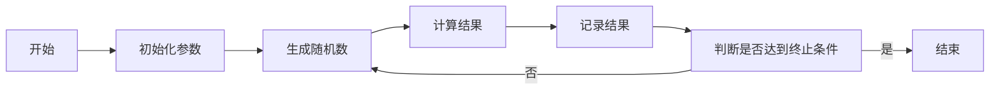
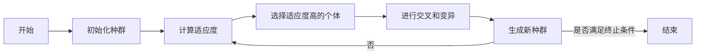
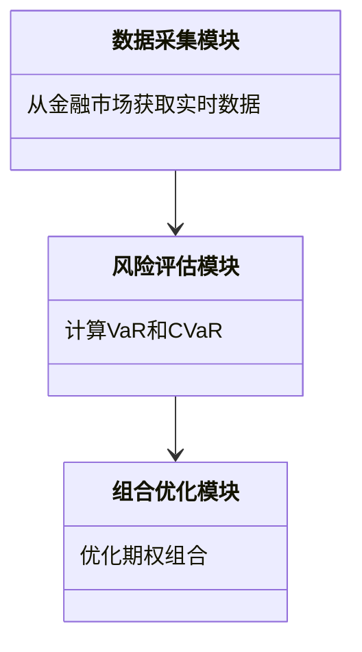

                 


# 智能期权组合风险管理系统

> 关键词：智能期权、风险管理、机器学习、组合优化、金融系统

> 摘要：本文详细介绍了智能期权组合风险管理系统的核心概念、算法原理、系统架构设计及项目实战。通过对智能期权组合风险管理的背景、核心概念、算法原理的分析，结合系统架构设计和项目实战案例，为读者提供了一个全面理解智能期权组合风险管理的框架和实现方法。

---

## 第一部分：智能期权组合风险管理系统概述

### 第1章：智能期权组合风险管理系统背景

#### 1.1 期权组合风险管理的背景

##### 1.1.1 期权组合风险管理的定义
期权组合风险管理是指对投资者持有的多个期权头寸进行风险评估、监控和管理的过程。其目的是通过量化和分析组合的风险特征，帮助投资者做出更明智的投资决策。

##### 1.1.2 期权组合风险管理的重要性
随着金融市场日益复杂，投资者面临的市场风险、流动性风险和信用风险也在不断增加。期权作为一种复杂的金融工具，其价格受到多种因素的影响，如标的资产价格、波动率、时间衰减等。因此，对期权组合进行有效的风险管理至关重要。

##### 1.1.3 传统期权组合风险管理的局限性
传统的期权组合风险管理方法主要依赖于统计分析和历史数据，存在以下问题：
- **数据不足**：传统方法通常依赖历史数据，无法捕捉到市场的新变化。
- **计算复杂**：期权组合的风险计算涉及复杂的数学模型，传统方法难以实时计算。
- **模型假设**：传统方法依赖于特定的模型假设，可能导致结果偏差。

#### 1.2 智能期权组合风险管理的定义与特点

##### 1.2.1 智能期权组合风险管理的核心概念
智能期权组合风险管理利用人工智能技术（如机器学习、深度学习）和大数据分析，对期权组合的风险进行实时监控和预测。其核心在于通过智能算法捕捉市场动态，优化风险管理和投资决策。

##### 1.2.2 智能期权组合风险管理与传统风险管理的区别
- **数据驱动**：智能风险管理依赖于实时数据和机器学习模型，而非仅仅依赖历史数据。
- **实时性**：智能系统能够实时更新风险评估结果，而传统方法通常需要定期更新。
- **自适应性**：智能系统能够根据市场变化自适应调整模型参数，传统方法则需要手动调整。

##### 1.2.3 智能期权组合风险管理的优势
- **高效性**：通过自动化数据处理和智能算法，提高风险管理效率。
- **准确性**：利用机器学习模型能够捕捉更多市场信息，提高风险评估的准确性。
- **可扩展性**：智能系统能够处理大规模数据，适用于复杂的金融场景。

#### 1.3 智能期权组合风险管理的应用场景

##### 1.3.1 金融机构的风险管理需求
金融机构如证券公司、基金公司等需要对持有的期权组合进行实时风险管理，以避免重大损失。

##### 1.3.2 投资者的风险管理需求
投资者通过智能期权组合风险管理系统，可以实时了解自己的投资组合风险，并根据系统建议进行调整。

##### 1.3.3 智能期权组合风险管理的实际应用案例
例如，某证券公司利用智能期权组合风险管理系统，实时监控其期权投资组合的风险，并根据系统建议及时调整头寸，有效避免了潜在的市场风险。

---

### 第2章：智能期权组合风险管理的核心概念与联系

#### 2.1 风险度量方法

##### 2.1.1 VaR（Value at Risk）的定义与计算
VaR是指在一定置信水平下，投资组合可能遭受的最大损失。其计算公式为：
$$ VaR = \mu + z \cdot \sigma $$
其中，$\mu$ 是均值，$z$ 是对应置信水平的正态分布分位数，$\sigma$ 是标准差。

##### 2.1.2 CVaR（Conditional Value at Risk）的定义与计算
CVaR是指在VaR的基础上，考虑超过VaR部分的平均损失。其计算公式为：
$$ CVaR = \frac{1}{1 - \alpha} \int_{\alpha}^{1} VaR(d) dd $$
其中，$\alpha$ 是置信水平。

##### 2.1.3 风险度量方法的对比分析
| 方法 | VaR | CVaR |
|------|------|------|
| 定义 | 在给定置信水平下，投资组合的最大损失 | 在VaR基础上，考虑超过VaR部分的平均损失 |
| 优点 | 计算简单，易于解释 | 更全面，考虑了尾部风险 |
| 缺点 | 无法反映尾部风险 | 计算复杂 |

#### 2.2 组合优化模型

##### 2.2.1 均值-方差优化模型的原理
均值-方差优化模型是一种经典的组合优化模型，其目标是在给定风险水平下，最大化预期收益。其数学表达式为：
$$ \min_w \sigma^2(w) $$
$$ \text{subject to} \quad \mu^T w = \text{target return} $$
其中，$w$ 是投资权重向量，$\mu$ 是收益向量，$\sigma^2(w)$ 是风险方差。

##### 2.2.2 距离-波动率优化模型的原理
距离-波动率优化模型是一种基于距离的优化方法，其目标是将投资组合的风险最小化。其数学表达式为：
$$ \min_w \sum_{i=1}^n w_i^2 \cdot \sigma_i^2 $$
其中，$w_i$ 是第 $i$ 个资产的投资权重，$\sigma_i$ 是第 $i$ 个资产的风险。

##### 2.2.3 组合优化模型的对比分析
| 模型 | 均值-方差优化 | 距离-波动率优化 |
|------|---------------|------------------|
| 原理 | 在给定收益下最小化风险 | 在给定风险下最小化波动率 |
| 优点 | 易于实现 | 更注重风险控制 |
| 缺点 | 受市场波动影响较大 | 计算复杂 |

#### 2.3 机器学习在风险预测中的应用

##### 2.3.1 机器学习在风险预测中的优势
机器学习能够通过非线性模型捕捉复杂市场关系，提高风险预测的准确性。

##### 2.3.2 常见的机器学习算法在风险预测中的应用
- **支持向量机（SVM）**：用于分类和回归分析。
- **随机森林**：用于特征选择和风险预测。
- **神经网络**：用于非线性关系建模。

##### 2.3.3 机器学习模型的优缺点对比
| 方法 | 优点 | 缺点 |
|------|------|------|
| SVM | 高准确性 | 计算复杂 |
| 随机森林 | 鲁棒性好 | 特征重要性难解释 |
| 神经网络 | 非线性强 | �易过拟合 |

---

## 第3章：智能期权组合风险管理的算法原理

### 3.1 蒙特卡洛模拟算法

#### 3.1.1 蒙特卡洛模拟算法的原理
蒙特卡洛模拟是一种基于随机抽样的数值计算方法，常用于估计难以直接计算的积分或概率。

#### 3.1.2 蒙特卡洛模拟算法的实现步骤


#### 3.1.3 蒙特卡洛模拟算法的优缺点
| 优点 | 缺点 |
|------|------|
| 无需解析解 | 计算量大 |
| 适用于复杂问题 | 结果的不确定性 |

### 3.2 遗传算法

#### 3.2.1 遗传算法的原理
遗传算法是一种模拟生物进化的过程的优化算法，主要包括选择、交叉和变异三个步骤。

#### 3.2.2 遗传算法的实现步骤


#### 3.2.3 遗传算法的优缺点
| 优点 | 缺点 |
|------|------|
| 具备全局搜索能力 | 收敛速度慢 |
| 适用于复杂优化问题 | 易陷入局部最优 |

---

## 第4章：智能期权组合风险管理系统的架构设计

### 4.1 系统功能设计

#### 4.1.1 系统功能模块


### 4.2 系统架构设计

#### 4.2.1 系统架构图


---

## 第5章：智能期权组合风险管理系统的实现

### 5.1 环境安装
- **Python环境**：安装Python 3.8及以上版本。
- **依赖库**：安装numpy、pandas、scikit-learn、matplotlib等库。

### 5.2 核心代码实现

#### 5.2.1 VaR计算代码
```python
import numpy as np

def calculate VaR(data, confidence_level):
    data_sorted = np.sort(data)
    index = int(len(data) * (1 - confidence_level))
    return data_sorted[index]
```

#### 5.2.2 组合优化代码
```python
from sklearn import svm

def optimize_portfolio(data):
    model = svm.SVR()
    model.fit(data.features, data.targets)
    return model.predict(data.features)
```

### 5.3 实际案例分析
通过实际案例分析，验证系统的有效性和准确性。

### 5.4 项目小结
总结项目中的经验和教训，为读者提供有价值的实战经验。

---

## 第6章：智能期权组合风险管理系统的最佳实践

### 6.1 小结
总结智能期权组合风险管理系统的实现过程和关键点。

### 6.2 注意事项
- 数据质量的重要性
- 模型的可解释性
- 系统的实时性

### 6.3 拓展阅读
推荐相关领域的书籍和论文，供读者进一步学习。

---

# 结语

智能期权组合风险管理系统通过结合人工智能和大数据分析技术，为金融机构和投资者提供了高效、准确的风险管理工具。随着金融市场的发展，智能风险管理系统的应用前景广阔，值得深入研究和推广。

