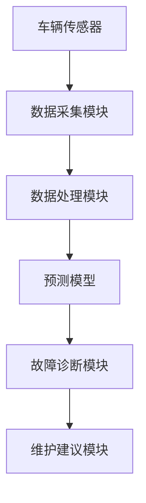

                 


# 智能汽车：AI Agent的预测性维护与故障诊断

---

## 关键词：
智能汽车、AI Agent、预测性维护、故障诊断、机器学习、深度学习、系统架构

---

## 摘要：
本文深入探讨了智能汽车中AI Agent在预测性维护和故障诊断中的应用。通过分析智能汽车的发展背景、AI Agent的核心原理、预测性维护与故障诊断的算法实现，以及系统的架构设计，本文为读者提供了全面的技术视角。文章结合实际案例，展示了AI Agent如何通过机器学习和深度学习算法实现预测性维护和故障诊断，并提出了系统的最佳实践和优化建议。

---

# 第一部分: 智能汽车与AI Agent的背景介绍

---

## 第1章: 智能汽车与AI Agent概述

### 1.1 智能汽车的发展历程

#### 1.1.1 传统汽车到智能汽车的演进
传统汽车通过机械和电子系统实现基本功能，而智能汽车则通过AI、大数据和物联网技术实现了智能化升级。从最初的车载娱乐系统到现在的自动驾驶和智能交互，智能汽车的演变体现了技术的飞速进步。

#### 1.1.2 智能汽车的核心特征
智能汽车的核心特征包括：
1. **智能化**：通过AI算法实现自动驾驶、智能交互和决策。
2. **网络化**：车辆与车辆、道路基础设施、云端数据中心的实时通信。
3. **数据驱动**：依赖大量传感器数据进行实时分析和决策。

#### 1.1.3 智能汽车的典型应用场景
智能汽车的应用场景包括自动驾驶、智能泊车、智能导航、故障预测与诊断、能源管理等。

---

### 1.2 AI Agent的基本概念

#### 1.2.1 什么是AI Agent
AI Agent（人工智能代理）是指能够感知环境、自主决策并执行任务的智能实体。在智能汽车中，AI Agent可以是车辆的控制系统、自动驾驶算法或故障诊断系统。

#### 1.2.2 AI Agent的核心功能
AI Agent的核心功能包括：
1. **感知**：通过传感器和数据采集系统获取车辆状态和环境信息。
2. **决策**：基于感知数据和预设规则，生成决策指令。
3. **执行**：通过执行机构（如电机、制动系统）实现决策指令。

#### 1.2.3 AI Agent与传统算法的区别
AI Agent的核心区别在于其自主性和适应性。传统算法依赖于固定的规则和数据，而AI Agent能够通过学习和优化不断改进性能。

---

### 1.3 预测性维护与故障诊断的背景

#### 1.3.1 预测性维护的定义
预测性维护是指通过分析设备的状态数据，预测设备的健康状态，并在故障发生前进行维护。与传统定期维护相比，预测性维护可以显著降低维护成本和延长设备寿命。

#### 1.3.2 故障诊断的重要性
故障诊断是智能汽车维护中的关键环节。通过及时诊断和定位故障，可以避免故障扩大化，提高车辆的可靠性和安全性。

#### 1.3.3 AI Agent在预测性维护中的作用
AI Agent通过实时分析车辆传感器数据，预测车辆部件的健康状态，并在潜在故障发生前发出预警。

---

### 1.4 本章小结
本章介绍了智能汽车的发展历程、AI Agent的基本概念及其在预测性维护中的作用。通过这些内容，读者可以理解AI Agent在智能汽车中的重要性。

---

# 第二部分: AI Agent的核心概念与联系

---

## 第2章: AI Agent的核心原理

### 2.1 AI Agent的感知与决策机制

#### 2.1.1 数据采集与处理
AI Agent通过多种传感器（如温度传感器、压力传感器、加速度传感器）采集车辆状态数据，并通过数据预处理（如去噪、归一化）提取有用信息。

#### 2.1.2 感知模型的构建
感知模型通常基于机器学习算法（如随机森林、支持向量机）构建，用于从传感器数据中提取特征。

#### 2.1.3 决策算法的实现
决策算法通常基于强化学习或监督学习，通过训练模型生成最优决策指令。

---

### 2.2 预测性维护的数学模型

#### 2.2.1 时间序列分析模型
时间序列分析模型（如ARIMA、LSTM）用于预测设备的剩余寿命。

#### 2.2.2 基于机器学习的预测模型
机器学习模型（如随机森林、XGBoost）通过历史数据训练，预测设备的健康状态。

#### 2.2.3 模型的评估与优化
模型的评估指标包括均方误差（MSE）、准确率、召回率等。通过超参数调优和交叉验证，可以优化模型性能。

---

### 2.3 故障诊断的算法原理

#### 2.3.1 基于规则的故障诊断
基于规则的故障诊断通过预定义的规则（如温度超过阈值时触发警报）实现故障检测。

#### 2.3.2 基于统计的故障诊断
基于统计的故障诊断（如孤立森林、Grubbs检验）通过统计分析识别异常数据。

#### 2.3.3 基于深度学习的故障诊断
深度学习模型（如卷积神经网络、循环神经网络）通过学习数据特征实现故障分类。

---

### 2.4 AI Agent与预测性维护的联系

#### 2.4.1 AI Agent在预测性维护中的角色
AI Agent通过实时数据采集、模型训练和决策生成，实现预测性维护的核心功能。

#### 2.4.2 预测性维护对AI Agent的依赖
预测性维护依赖AI Agent的感知能力和决策能力，AI Agent通过实时数据分析实现预测性维护。

#### 2.4.3 两者结合的实现方式
通过将AI Agent嵌入车辆控制系统，结合预测性维护算法，实现智能化的车辆维护。

---

### 2.5 本章小结
本章详细讲解了AI Agent的核心原理，包括感知与决策机制、预测性维护的数学模型和故障诊断的算法原理。

---

# 第三部分: AI Agent的算法原理与数学模型

---

## 第3章: AI Agent的算法实现

### 3.1 预测性维护的算法流程

#### 3.1.1 数据预处理
数据预处理包括数据清洗、特征提取和数据归一化。

#### 3.1.2 特征提取
特征提取可以通过主成分分析（PCA）或独立成分分析（ICA）实现。

#### 3.1.3 模型训练与优化
模型训练采用监督学习算法（如随机森林、XGBoost），并通过交叉验证优化模型参数。

---

### 3.2 故障诊断的算法实现

#### 3.2.1 基于逻辑回归的故障分类
逻辑回归是一种常用的分类算法，适用于二分类问题。

#### 3.2.2 基于支持向量机的故障分类
支持向量机（SVM）通过构建超平面实现数据分类。

#### 3.2.3 基于神经网络的故障分类
深度神经网络（DNN）通过多层非线性变换实现复杂特征的提取和分类。

---

### 3.3 算法的数学模型

#### 3.3.1 时间序列预测模型
时间序列预测模型可以通过LSTM网络实现：

$$
\text{LSTM}(t) = \text{f}(x_t, \text{LSTM}(t-1))
$$

其中，$x_t$ 是输入数据，$\text{LSTM}(t-1)$ 是前一时刻的状态。

#### 3.3.2 基于机器学习的分类模型
随机森林的分类模型可以通过以下公式实现：

$$
\text{预测结果} = \text{多数投票}(\text{决策树预测结果})
$$

其中，决策树预测结果是每个决策树的输出，多数投票用于选择最终结果。

---

## 第4章: 系统分析与架构设计方案

### 4.1 问题场景介绍
智能汽车的故障诊断系统需要实时采集车辆状态数据，并通过AI Agent实现故障预测和诊断。

### 4.2 系统功能设计
系统功能包括：
1. 数据采集与处理
2. 故障预测与诊断
3. 维护建议与执行

---

### 4.3 系统架构设计

#### 4.3.1 系统架构图
以下是一个典型的智能汽车故障诊断系统的架构图：



---

### 4.4 系统接口设计

#### 4.4.1 接口设计
系统接口包括：
1. 传感器接口：采集车辆状态数据
2. 数据处理接口：处理和预处理数据
3. 模型接口：调用预测模型进行故障预测
4. 诊断接口：输出故障诊断结果

---

### 4.5 系统交互流程

#### 4.5.1 交互流程
1. 车辆传感器采集数据
2. 数据处理模块进行数据预处理
3. 预测模型进行故障预测
4. 故障诊断模块输出诊断结果
5. 维护建议模块生成维护建议

---

## 第5章: 项目实战

### 5.1 环境安装
需要安装以下工具和库：
1. Python 3.8+
2. NumPy、Pandas、Scikit-learn
3. TensorFlow、Keras
4. Mermaid、PlantUML

---

### 5.2 核心代码实现

#### 5.2.1 数据预处理代码
```python
import numpy as np
import pandas as pd

# 加载数据
data = pd.read_csv('vehicle_data.csv')

# 数据清洗
data.dropna(inplace=True)

# 特征提取
from sklearn.decomposition import PCA
pca = PCA(n_components=5)
pca_features = pca.fit_transform(data)
```

---

#### 5.2.2 模型训练代码
```python
from sklearn.ensemble import RandomForestClassifier
from sklearn.metrics import accuracy_score

# 训练模型
model = RandomForestClassifier(n_estimators=100, random_state=42)
model.fit(pca_features, labels)

# 模型评估
预测 = model.predict(pca_features)
准确率 = accuracy_score(预测, labels)
print(f'准确率: {准确率:.2f}')
```

---

### 5.3 案例分析
通过实际案例分析，展示AI Agent在预测性维护和故障诊断中的应用效果。

---

## 第6章: 最佳实践、小结与注意事项

### 6.1 最佳实践
1. 数据质量是关键，需确保数据的完整性和准确性。
2. 模型的可解释性是实际应用中的重要考虑因素。
3. 系统的实时性和响应速度需满足实际需求。

---

### 6.2 小结
本文详细介绍了AI Agent在智能汽车预测性维护和故障诊断中的应用，通过理论分析和实际案例展示了AI Agent的技术优势。

---

### 6.3 注意事项
1. 数据隐私和安全问题需高度重视。
2. 模型的泛化能力需通过交叉验证进行评估。
3. 系统的可扩展性和可维护性需在设计阶段充分考虑。

---

### 6.4 拓展阅读
推荐阅读以下内容：
1. 《深度学习》——Ian Goodfellow
2. 《机器学习实战》——周志华
3. 《智能系统设计》——张钹

---

# 结语
通过本文的深入探讨，读者可以全面了解AI Agent在智能汽车中的应用，并为实际项目提供参考和指导。未来，随着AI技术的不断发展，智能汽车的预测性维护和故障诊断将更加智能化和高效化。

