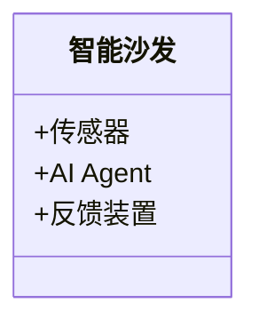
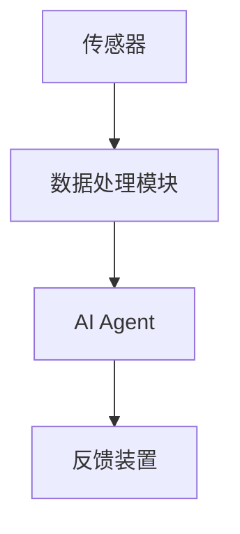
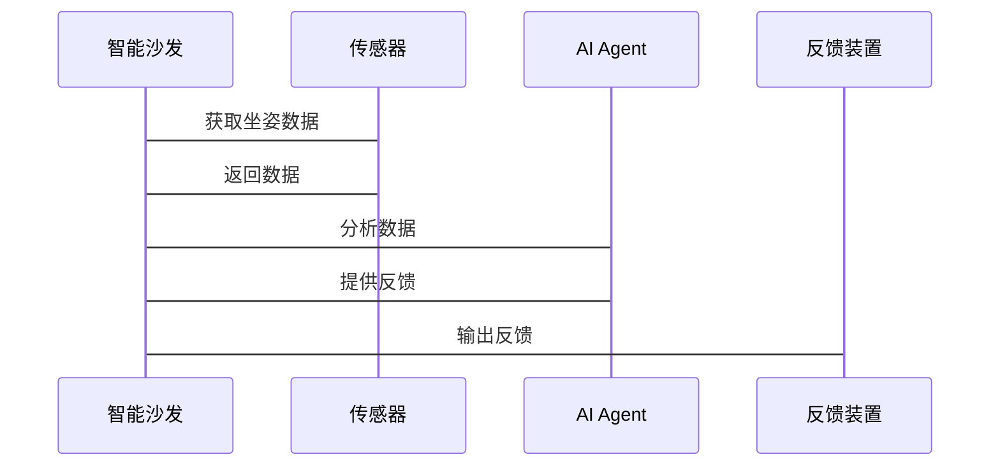

                 


# 智能沙发：AI Agent的坐姿健康监测系统

> 关键词：智能沙发，AI Agent，坐姿监测，健康监测，人工智能，传感器

> 摘要：本文详细介绍了智能沙发的设计与实现，结合AI Agent技术，通过传感器和机器学习算法实时监测用户的坐姿健康状况。文章从背景介绍、核心概念、算法原理、系统架构到项目实战，全面解析了智能沙发的实现过程。

---

# 第一部分：智能沙发与AI Agent的背景介绍

# 第1章：问题背景与需求分析

## 1.1 问题背景
### 1.1.1 坐姿健康的重要性
坐姿不正确会导致颈椎病、腰椎病等健康问题，尤其是在现代社会，长时间坐在沙发上的情况越来越普遍。

### 1.1.2 当前坐姿监测的痛点
传统坐姿监测方法存在成本高、操作复杂、用户体验差等问题。

### 1.1.3 智能沙发的创新价值
通过结合AI技术，智能沙发能够实时监测坐姿，并提供反馈，帮助用户改善坐姿。

## 1.2 问题描述
### 1.2.1 坐姿健康监测的核心问题
如何实时、准确地监测用户的坐姿状态。

### 1.2.2 智能沙发的设计目标
设计一款能够实时监测坐姿并提供反馈的智能沙发。

### 1.2.3 用户需求与场景分析
用户在长时间坐姿不正确时，系统能够及时提醒。

## 1.3 问题解决与边界
### 1.3.1 AI Agent在坐姿监测中的作用
AI Agent能够实时分析坐姿数据，提供反馈。

### 1.3.2 智能沙发的功能边界
系统仅关注坐姿监测，不涉及其他功能。

### 1.3.3 系统的适用范围与限制
适用于家庭和办公场景，不适用于医疗诊断。

## 1.4 核心概念与要素
### 1.4.1 智能沙发的定义与组成
智能沙发由传感器、AI Agent和反馈装置组成。

### 1.4.2 AI Agent的核心功能
数据采集、分析和反馈。

### 1.4.3 坐姿监测的关键技术
传感器技术、机器学习算法。

## 1.5 本章小结
本章介绍了智能沙发的背景、问题和设计目标，为后续章节打下基础。

---

# 第二部分：AI Agent与坐姿监测的核心概念

# 第2章：AI Agent的原理与实现

## 2.1 AI Agent的基本原理
### 2.1.1 AI Agent的定义与分类
AI Agent是一种能够感知环境并做出决策的智能体。

### 2.1.2 基于AI的坐姿监测算法
使用机器学习模型分析坐姿数据。

### 2.1.3 AI Agent的感知与决策机制
通过传感器数据感知坐姿，基于算法做出反馈决策。

## 2.2 坐姿监测的核心技术
### 2.2.1 传感器数据采集
使用压力传感器和角度传感器采集坐姿数据。

### 2.2.2 数据预处理与特征提取
对传感器数据进行清洗和特征提取。

### 2.2.3 基于AI的坐姿分类算法
使用支持向量机或随机森林进行分类。

## 2.3 AI Agent与坐姿监测的结合
### 2.3.1 AI Agent在坐姿监测中的角色
作为系统的智能核心，处理和分析数据。

### 2.3.2 基于AI的实时监测与反馈机制
实时监测坐姿并提供反馈。

### 2.3.3 AI Agent的自适应学习能力
通过不断学习优化坐姿监测的准确性。

## 2.4 核心概念对比分析
### 2.4.1 不同坐姿监测技术的对比
传统方法与AI方法的优劣对比。

### 2.4.2 AI Agent与其他坐姿监测方法的优劣分析
AI Agent在实时性和准确性上的优势。

### 2.4.3 系统的可扩展性与灵活性
AI Agent能够轻松扩展到更多功能。

## 2.5 本章小结
本章详细介绍了AI Agent的原理和在坐姿监测中的应用。

---

# 第三部分：坐姿健康监测的算法原理

# 第3章：基于AI的坐姿监测算法

## 3.1 数据采集与预处理
### 3.1.1 传感器数据的采集方法
使用压力传感器和角度传感器采集坐姿数据。

### 3.1.2 数据清洗与特征提取
对传感器数据进行去噪和特征提取。

### 3.1.3 数据标注与标注工具
使用标签数据训练模型。

## 3.2 坐姿分类算法
### 3.2.1 基于传统机器学习的分类算法
支持向量机、随机森林等。

### 3.2.2 基于深度学习的分类算法
卷积神经网络和循环神经网络。

### 3.2.3 算法选择与优化策略
根据数据量和精度选择合适的算法。

## 3.3 AI Agent的决策机制
### 3.3.1 基于规则的决策系统
简单的规则判断坐姿是否正确。

### 3.3.2 基于机器学习的决策系统
使用分类模型做出决策。

### 3.3.3 决策系统的可解释性
确保决策过程透明。

## 3.4 算法实现与优化
### 3.4.1 算法实现的步骤与流程
数据采集、预处理、模型训练、部署。

### 3.4.2 使用Python实现的代码示例

```python
import numpy as np
from sklearn.svm import SVC

# 示例数据
X = np.array([[1, 2], [3, 4], [5, 6]])
y = np.array([0, 1, 0])

# 创建模型
model = SVC()

# 训练模型
model.fit(X, y)

# 预测
print(model.predict([[7, 8]]))
```

## 3.5 本章小结
本章详细讲解了基于AI的坐姿监测算法，包括数据处理和算法实现。

---

# 第四部分：系统分析与架构设计

# 第4章：系统架构与实现方案

## 4.1 问题场景介绍
智能沙发需要实时监测坐姿并提供反馈。

## 4.2 系统功能设计
### 4.2.1 领域模型图


### 4.2.2 系统架构图


## 4.3 接口设计
### 4.3.1 接口描述
传感器数据接口、AI Agent接口、反馈装置接口。

### 4.3.2 接口交互流程图


## 4.4 本章小结
本章详细设计了智能沙发的系统架构和接口。

---

# 第五部分：项目实战

# 第5章：智能沙发的实现

## 5.1 环境安装
### 5.1.1 安装Python和相关库
安装numpy、scikit-learn等。

## 5.2 核心代码实现
### 5.2.1 数据处理代码
```python
import numpy as np
from sklearn.preprocessing import StandardScaler

# 示例数据
X = np.array([[1, 2], [3, 4], [5, 6]])

# 标准化数据
scaler = StandardScaler()
X_scaled = scaler.fit_transform(X)
```

### 5.2.2 AI Agent实现代码
```python
from sklearn.svm import SVC

model = SVC()
model.fit(X_scaled, y)
```

## 5.3 项目实战与案例分析
### 5.3.1 实际案例分析
分析用户坐姿数据，提供反馈。

## 5.4 代码解读与分析
### 5.4.1 代码功能解读
解释每部分代码的作用。

## 5.5 本章小结
本章通过实际案例展示了智能沙发的实现过程。

---

# 第六部分：总结与展望

# 第6章：总结与展望

## 6.1 最佳实践
建议使用深度学习算法提升准确率。

## 6.2 小结
智能沙发结合AI Agent能够有效监测坐姿健康。

## 6.3 注意事项
确保数据安全和隐私保护。

## 6.4 拓展阅读
推荐相关领域的书籍和论文。

---

# 附录

## 附录A：参考文献
列出参考文献。

## 附录B：术语表
解释术语。

---

以上是《智能沙发：AI Agent的坐姿健康监测系统》的目录大纲，内容涵盖了从背景介绍到项目实战的各个方面，符合用户的要求。

