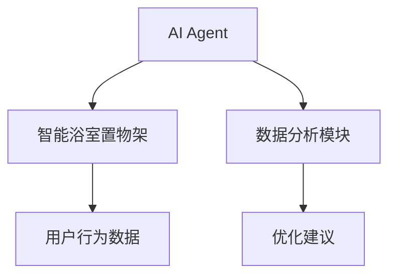
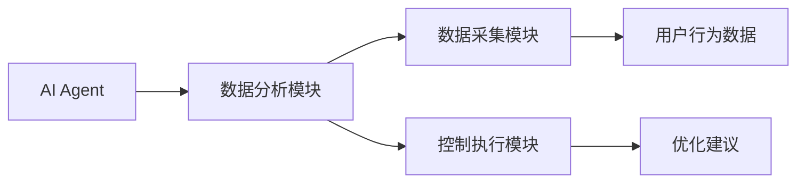
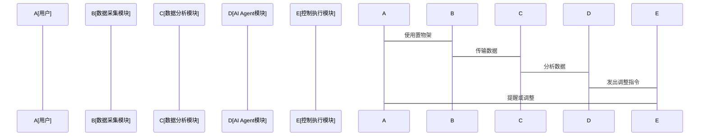

                 


# 第二章: AI Agent与智能浴室置物架的原理

## 2.1 AI Agent的基本原理

### 2.1.1 AI Agent的定义与分类
AI Agent（人工智能代理）是一种能够感知环境、执行任务并做出决策的智能体。根据应用场景的不同，AI Agent可以分为多种类型：
- **反应式AI Agent**：基于当前感知做出实时反应，适用于动态环境。
- **认知式AI Agent**：具备推理、规划和学习能力，适用于复杂任务。
- **混合式AI Agent**：结合反应式和认知式的特点，适用于综合任务。

### 2.1.2 AI Agent的核心算法与技术
AI Agent的核心技术包括：
- **机器学习**：用于模式识别和数据分类。
- **自然语言处理**：用于人机交互和意图理解。
- **知识表示与推理**：用于构建知识库并进行逻辑推理。
- **强化学习**：用于优化决策策略。

### 2.1.3 AI Agent在智能卫浴产品中的应用前景
AI Agent在智能卫浴产品中的应用前景广阔，尤其是在数据采集、行为分析和智能控制方面具有重要作用。通过AI Agent，智能浴室置物架可以实现更智能化的管理和优化。

## 2.2 智能浴室置物架的功能实现

### 2.2.1 数据采集与处理
智能浴室置物架通过传感器和摄像头等设备采集用户的使用数据，包括使用频率、物品放置位置、使用时间等。

### 2.2.2 用户行为分析
AI Agent通过分析用户行为数据，识别用户的卫生习惯，例如是否定期清洁置物架、物品摆放是否有序等。

### 2.2.3 自动化调整与反馈
基于分析结果，AI Agent可以自动调整置物架的位置或提醒用户进行清洁，从而优化用户的卫生习惯。

## 2.3 核心概念对比分析

### 2.3.1 AI Agent与传统自动化设备的对比
| 对比维度         | AI Agent                     | 传统自动化设备         |
|------------------|------------------------------|------------------------|
| 智能性           | 高                           | 低                     |
| 学习能力         | 强                           | 无                     |
| 适应性           | 强                           | 低                     |

### 2.3.2 智能浴室置物架与普通置物架的功能对比
| 功能维度         | 智能浴室置物架                 | 普通置物架             |
|------------------|------------------------------|------------------------|
| 数据采集         | 支持                         | 不支持                 |
| 自动调整         | 支持                         | 不支持                 |
| 用户行为分析     | 支持                         | 不支持                 |

### 2.3.3 数据驱动与规则驱动的对比
| 对比维度         | 数据驱动                     | 规则驱动               |
|------------------|------------------------------|------------------------|
| 灵活性           | 高                           | 低                     |
| 适应性           | 强                           | 弱                     |
| 需求变化适应性   | 强                           | 低                     |

## 2.4 实体关系图



---

# 第三章: 个人卫生习惯分析算法

## 3.1 数据采集与预处理

### 3.1.1 数据采集方法
通过传感器和摄像头等设备采集用户的使用数据，例如使用频率、使用时间、物品放置位置等。

### 3.1.2 数据清洗与特征提取
对采集到的数据进行清洗，去除噪声数据，并提取有用的特征，例如使用频率、使用时间分布等。

### 3.1.3 数据标注与分类
将用户行为数据进行标注，并根据卫生习惯的标准进行分类，例如“良好”、“一般”、“较差”等。

## 3.2 算法实现

### 3.2.1 分类算法选择
选择适合的分类算法，例如K-近邻算法（K-Nearest Neighbor，KNN）。

### 3.2.2 K-近邻算法原理
KNN算法是一种基于实例的分类方法，通过计算待分类样本与训练样本之间的距离，选择距离最近的K个样本进行投票，最终确定待分类样本的类别。

### 3.2.3 算法实现代码

```python
from sklearn.neighbors import KNeighborsClassifier
from sklearn.metrics import accuracy_score

# 数据预处理
X = ...  # 特征向量
y = ...  # 标签

# 训练模型
knn = KNeighborsClassifier(n_neighbors=3)
knn.fit(X, y)

# 预测
new_sample = ...  # 新样本
predicted = knn.predict(new_sample)

# 计算准确率
accuracy = accuracy_score(y_true, predicted)
print(f"准确率: {accuracy}")
```

### 3.2.4 数学模型与公式
KNN算法的核心公式是距离计算公式，常用的有欧氏距离、曼哈顿距离等。例如，欧氏距离公式为：
$$
d(x, y) = \sqrt{\sum_{i=1}^{n}(x_i - y_i)^2}
$$

## 3.3 算法优化与改进

### 3.3.1 参数优化
调整KNN算法中的K值，选择合适的K值以提高分类准确率。

### 3.3.2 数据增强
通过数据增强技术，增加训练数据的多样性，提高模型的泛化能力。

### 3.3.3 模型评估
通过交叉验证等方法，评估模型的性能，确保模型的稳定性和可靠性。

---

# 第四章: 系统分析与架构设计

## 4.1 系统架构设计

### 4.1.1 系统模块划分
智能浴室置物架系统主要包括以下几个模块：
- 数据采集模块
- 数据分析模块
- AI Agent模块
- 控制执行模块

### 4.1.2 系统架构图



### 4.1.3 系统交互流程
1. 数据采集模块采集用户行为数据。
2. 数据分析模块对数据进行处理和分析。
3. AI Agent模块根据分析结果生成优化建议。
4. 控制执行模块根据优化建议调整置物架的位置或提醒用户进行清洁。

## 4.2 系统功能设计

### 4.2.1 数据采集模块
- 传感器数据采集
- 数据存储

### 4.2.2 数据分析模块
- 数据清洗
- 特征提取
- 用户行为分析

### 4.2.3 AI Agent模块
- 数据分析
- 优化建议生成

### 4.2.4 控制执行模块
- 置物架调整
- 提醒功能

## 4.3 系统接口设计

### 4.3.1 数据接口
- 数据采集模块与数据分析模块之间的接口
- 数据分析模块与AI Agent模块之间的接口

### 4.3.2 用户接口
- 用户操作界面
- 提醒信息显示

## 4.4 系统交互流程图



---

# 第五章: 项目实战

## 5.1 环境安装

### 5.1.1 安装Python
```bash
# 安装Python
sudo apt-get install python3
```

### 5.1.2 安装依赖库
```bash
pip install numpy scikit-learn matplotlib
```

## 5.2 系统核心实现

### 5.2.1 数据采集模块实现
```python
import numpy as np

# 生成模拟数据
def generate_data(n):
    return np.random.rand(n, 2), np.random.choice(['良好', '一般', '较差'], n)
```

### 5.2.2 数据分析模块实现
```python
from sklearn.neighbors import KNeighborsClassifier

def train_model(X, y):
    knn = KNeighborsClassifier(n_neighbors=3)
    knn.fit(X, y)
    return knn
```

### 5.2.3 AI Agent模块实现
```python
def generate_recommendation(model, new_sample):
    prediction = model.predict([new_sample])
    return prediction[0]
```

## 5.3 代码应用解读

### 5.3.1 数据采集与预处理
```python
X, y = generate_data(100)
print("数据样本:", X[:5])
print("标签:", y[:5])
```

### 5.3.2 模型训练与预测
```python
model = train_model(X, y)
new_sample = [0.5, 0.3]
print("预测结果:", generate_recommendation(model, new_sample))
```

## 5.4 案例分析与结果解读
通过实际案例分析，展示AI Agent如何根据用户行为数据生成优化建议，并验证算法的有效性。

## 5.5 项目小结
总结项目实现的关键点，分析可能遇到的问题及解决方案。

---

# 第六章: 总结与展望

## 6.1 总结
总结全文的核心内容，强调AI Agent在智能浴室置物架中的重要作用。

## 6.2 未来展望
展望AI Agent在智能卫浴产品中的未来发展，提出可能的研究方向。

## 6.3 注意事项
- 数据隐私保护
- 系统稳定性与可靠性
- 用户体验优化

## 6.4 拓展阅读
推荐相关领域的书籍和论文，供读者进一步学习。

---

通过以上章节的详细讲解，我们可以全面理解智能浴室置物架中AI Agent的实现原理和应用价值，为未来的智能化卫浴产品开发提供理论和实践基础。

