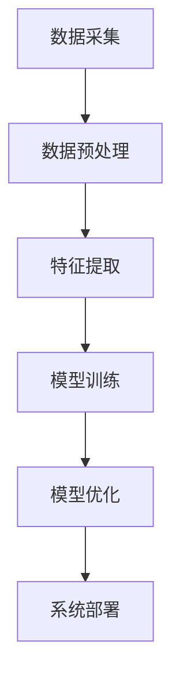
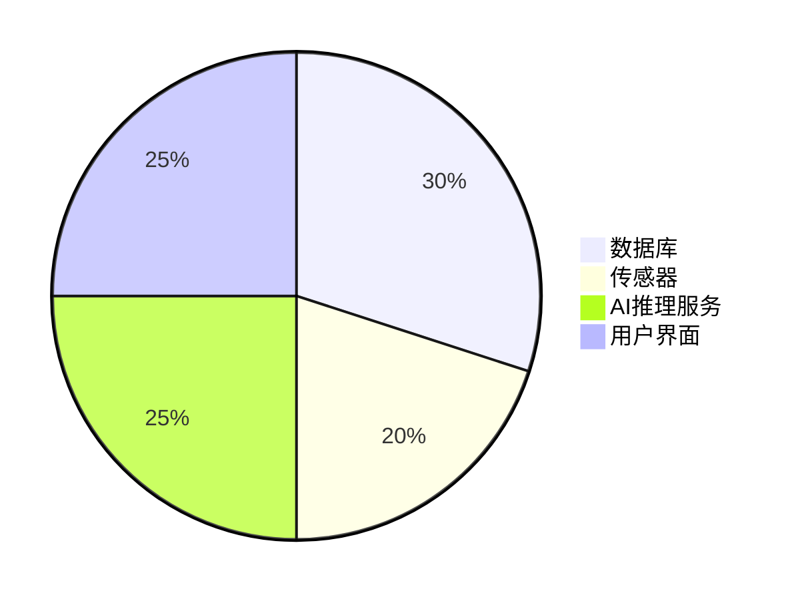
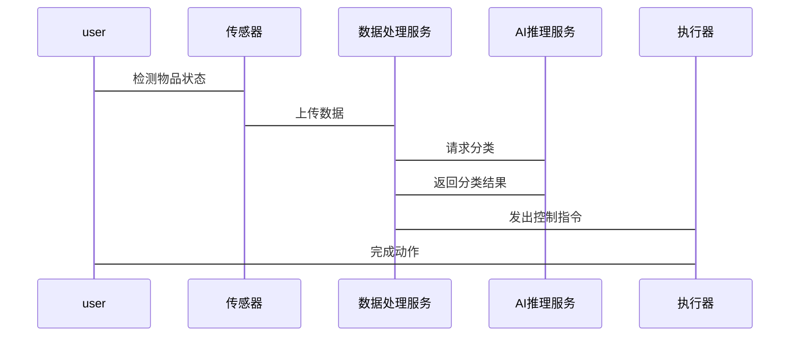

                 


# 智能浴室置物架：AI Agent的洗护用品管理

> 关键词：智能浴室置物架，AI Agent，物联网技术，洗护用品管理，自动化控制

> 摘要：本文将详细介绍智能浴室置物架的设计与实现，通过AI Agent技术优化洗护用品的管理流程，结合物联网技术实现智能化控制。文章从背景分析、核心概念、算法原理、系统架构到项目实战，全面解析智能浴室置物架的设计思路与实现方案。

---

# 第一部分: 背景介绍与问题分析

# 第1章: 问题背景与需求分析

## 1.1 问题背景

### 1.1.1 浴室空间管理的痛点
现代家庭中，浴室空间有限，洗护用品种类繁多，传统的置物架管理方式效率低下，容易导致物品混乱、取用不便等问题。此外，浴室环境潮湿，物品管理不当可能导致腐蚀或霉变。

### 1.1.2 洗护用品管理的复杂性
洗护用品包括 shampoo、洗面奶、牙膏等，每种物品的使用周期、用量、更换频率各不相同，传统的被动式管理方式难以满足个性化需求。

### 1.1.3 智能化管理的必要性
随着人工智能和物联网技术的发展，通过智能化管理可以提高浴室空间利用率，优化用户体验，同时降低管理成本。

## 1.2 问题描述

### 1.2.1 浴室置物架的功能需求
- 自动识别物品
- 智能存储与取用
- 实时监控物品状态
- 提供使用建议

### 1.2.2 用户使用中的常见问题
- 物品摆放混乱，取用不便
- 物品过期或损坏未及时提醒
- 空间利用率低
- 清洁维护困难

### 1.2.3 智能化管理的边界与外延
智能化管理的边界包括物品的存储、取用和监控，外延则扩展到与家庭其他智能设备的联动。

## 1.3 问题解决的思路

### 1.3.1 利用AI技术优化管理
通过AI技术实现物品的自动识别、分类和推荐，提升管理效率。

### 1.3.2 基于物联网的智能控制
利用物联网技术实现设备间的互联互通，实时感知和控制物品状态。

### 1.3.3 用户体验的提升策略
优化用户交互界面，提供个性化服务，提升用户满意度。

## 1.4 本章小结
本章通过分析浴室置物架管理的痛点和用户需求，提出了利用AI Agent和物联网技术实现智能化管理的解决方案。

---

# 第二部分: 核心概念与技术原理

# 第2章: AI Agent的核心概念与原理

## 2.1 AI Agent的基本定义

### 2.1.1 什么是AI Agent
AI Agent（智能代理）是一种能够感知环境、执行任务的智能实体，能够根据输入的信息做出决策并采取行动。

### 2.1.2 AI Agent的核心特征
- 自主性：能够在没有外部干预的情况下自主运行。
- 反应性：能够实时感知环境并做出反应。
- 社会性：能够与其他智能体或人类进行交互和协作。

### 2.1.3 AI Agent的分类与应用场景
AI Agent可以分为简单反射型、基于模型的反射型、目标驱动型和效用驱动型。在智能浴室置物架中，目标驱动型AI Agent适用于物品分类和推荐场景。

## 2.2 物联网技术与智能设备

### 2.2.1 物联网的基本概念
物联网（IoT）通过传感器、网络和智能设备，实现物体之间的互联互通和智能控制。

### 2.2.2 智能浴室置物架的物联网架构
- 传感器：用于检测物品的存在、重量和使用状态。
- 执行器：用于调整置物架的结构，如旋转、伸缩等。
- 网络：用于设备间的通信和数据传输。

### 2.2.3 传感器与执行器的作用
传感器负责采集环境数据，执行器根据AI Agent的决策执行具体动作。

## 2.3 AI Agent与物联网的结合

### 2.3.1 数据采集与处理
AI Agent通过物联网设备采集物品的状态数据，如重量、位置等。

### 2.3.2 AI算法的决策过程
基于采集的数据，AI Agent利用机器学习模型进行分类和推荐，优化物品的存储和取用顺序。

### 2.3.3 系统的协同工作原理
物联网设备提供数据支持，AI Agent负责决策，执行器完成动作，三者协同完成智能化管理。

## 2.4 核心概念对比分析

### 2.4.1 AI Agent与传统自动化控制的对比
| 特性         | AI Agent          | 传统自动化控制 |
|--------------|-------------------|----------------|
| 决策方式     | 基于模型预测      | 基于固定规则    |
| 灵活性       | 高                | 低              |
| 学习能力     | 强                | 无              |

### 2.4.2 物联网技术与传统设备管理的对比
| 特性         | 物联网技术        | 传统设备管理    |
|--------------|-------------------|----------------|
| 数据采集     | 实时、精准        | 离散、有限      |
| 通信方式     | 无线、高效        | 有线、低效      |
| 控制能力     | 智能化            | 简单化          |

### 2.4.3 用户交互方式的对比分析
传统的交互方式依赖手动操作，而基于AI Agent的系统支持语音、手势等多种交互方式，提升了用户体验。

## 2.5 本章小结
本章详细介绍了AI Agent和物联网技术的核心概念，并分析了两者结合在智能浴室置物架中的应用。

---

# 第三部分: 算法原理与数学模型

# 第3章: AI Agent的算法原理

## 3.1 算法概述

### 3.1.1 基于规则的AI Agent
基于预设规则进行决策，适用于简单场景，但灵活性较低。

### 3.1.2 基于机器学习的AI Agent
通过训练模型，AI Agent能够从数据中学习规律，适用于复杂场景。

### 3.1.3 基于深度学习的AI Agent
利用深度神经网络进行决策，具有更高的灵活性和学习能力。

## 3.2 算法实现流程

### 3.2.1 数据采集与预处理
- 数据采集：通过传感器获取物品的重量、位置等信息。
- 数据预处理：去除噪声，归一化处理。

### 3.2.2 模型训练与优化
- 特征提取：将原始数据转换为模型可识别的特征。
- 模型训练：使用训练数据训练分类模型。
- 模型优化：通过交叉验证和超参数调整提升模型性能。

### 3.2.3 系统部署与运行
- 部署模型到云端或本地，实时接收传感器数据，进行分类和推荐。

## 3.3 算法流程图



## 3.4 算法实现代码示例

```python
import numpy as np
from sklearn import svm

# 数据预处理
def preprocess(data):
    # 数据标准化处理
    return (data - np.mean(data)) / np.std(data)

# 模型训练
def train_model(X, y):
    model = svm.SVC()
    model.fit(X, y)
    return model

# 预测
def predict(model, X_test):
    return model.predict(X_test)
```

## 3.5 算法的数学模型与公式

### 3.5.1 分类模型的数学表达
分类模型的目标是最小化损失函数：
$$ L = \sum_{i=1}^{n} (y_i - \hat{y_i})^2 $$

其中，$y_i$ 是真实标签，$\hat{y_i}$ 是预测标签。

### 3.5.2 特征提取的数学模型
特征提取可以使用主成分分析（PCA），其数学表达为：
$$ X_{\text{PCA}} = X \cdot W $$

其中，$W$ 是 PCA 转换矩阵。

---

# 第四部分: 系统分析与架构设计方案

# 第4章: 系统分析与架构设计

## 4.1 项目介绍

### 4.1.1 项目场景
智能浴室置物架系统旨在通过AI Agent优化洗护用品的管理，提升用户体验。

### 4.1.2 系统功能设计
- 数据采集与处理
- 物品分类与推荐
- 自动控制与调整
- 用户交互与反馈

## 4.2 系统架构设计

### 4.2.1 数据层
- 数据来源：传感器、用户输入
- 数据存储：数据库、缓存

### 4.2.2 服务层
- 数据处理服务：数据清洗、特征提取
- AI推理服务：模型训练、预测

### 4.2.3 应用层
- 用户界面：Web端、移动端
- 控制接口：与执行器通信

## 4.3 系统架构图



## 4.4 系统接口设计

### 4.4.1 数据接口
- 输入：传感器数据
- 输出：处理后的数据

### 4.4.2 控制接口
- 输入：控制指令
- 输出：执行器动作

## 4.5 系统交互流程图



---

# 第五部分: 项目实战

# 第5章: 项目实战

## 5.1 环境搭建

### 5.1.1 硬件设备
- 传感器：重量传感器、位置传感器
- 执行器：电机、舵机
- 通信模块：Wi-Fi、蓝牙

### 5.1.2 软件环境
- 开发工具：Python、Jupyter
- 框架：TensorFlow、Scikit-learn
- 数据库：MySQL、MongoDB

## 5.2 核心功能实现

### 5.2.1 数据采集与预处理
```python
import numpy as np
import pandas as pd

# 读取传感器数据
data = pd.read_csv('sensor_data.csv')
# 数据预处理
processed_data = preprocess(data)
```

### 5.2.2 模型训练与部署
```python
# 训练模型
model = train_model(processed_data[['重量', '位置']], data['类别'])
# 部署模型到Flask服务
from flask import Flask, request, jsonify

app = Flask(__name__)

@app.route('/predict', methods=['POST'])
def predict():
    data = request.json['data']
    result = model.predict(np.array(data).reshape(1, -1))
    return jsonify({'result': str(result[0])})

if __name__ == '__main__':
    app.run()
```

### 5.2.3 系统控制与反馈
```python
# 执行器控制代码
import serial

ser = serial.Serial('COM3', 9600)
ser.write(b'rotate\n')  # 发送控制指令
```

## 5.3 项目测试与优化

### 5.3.1 功能测试
- 测试物品分类的准确率
- 测试系统的响应时间

### 5.3.2 性能优化
- 优化模型的训练速度
- 提高系统的抗干扰能力

## 5.4 项目小结
通过项目实战，验证了AI Agent在智能浴室置物架中的可行性，并总结了实现中的经验和教训。

---

# 第六部分: 最佳实践与总结

# 第6章: 最佳实践

## 6.1 实施中的注意事项
- 数据隐私保护
- 系统稳定性保障
- 用户体验优化

## 6.2 小结与展望
通过AI Agent和物联网技术的结合，智能浴室置物架实现了高效的洗护用品管理，未来可以进一步扩展到更多场景。

## 6.3 扩展阅读
- 推荐书籍：《人工智能：一种现代的方法》
- 推荐论文：《基于深度学习的智能推荐系统》

---

# 作者简介

> 作者：[您的姓名]
> 职位：[您的职位]
> 专业领域：[您的专业领域]
> 联系方式：[联系方式]

---

# 致谢

感谢读者的支持！如果文章内容有帮助，欢迎点赞、收藏和分享！

