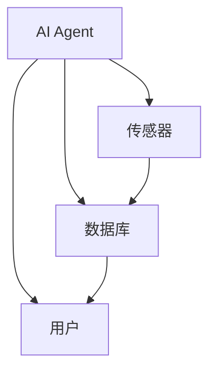
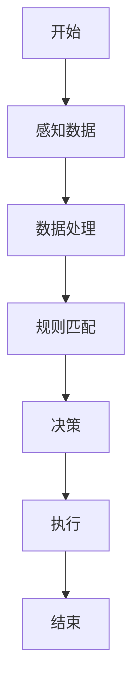
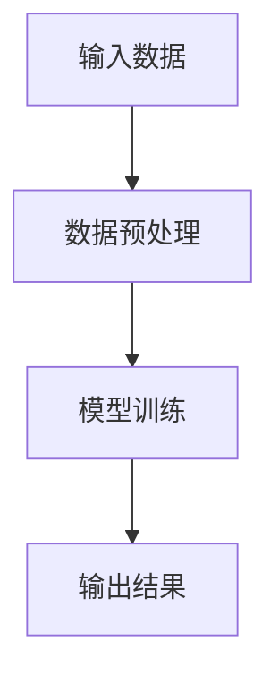
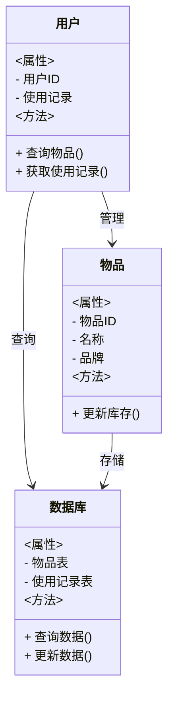
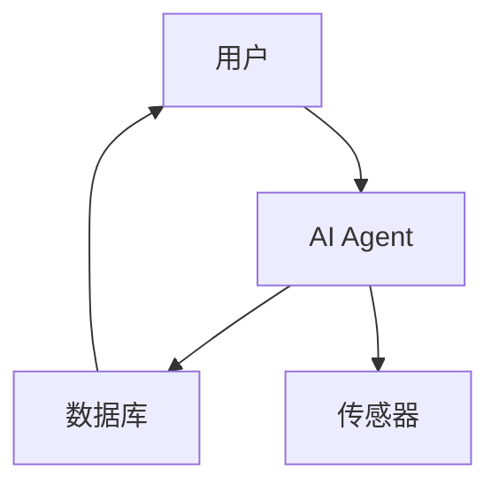
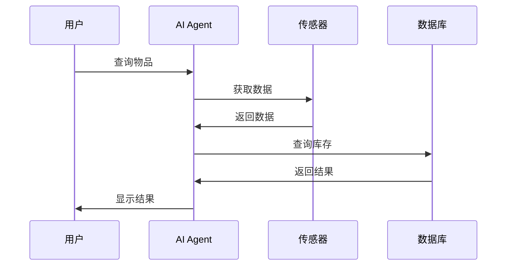

                 


# 智能浴室镜柜：AI Agent的个人护理用品管理

> 关键词：智能浴室镜柜，AI Agent，个人护理管理，系统架构，项目实战

> 摘要：本文详细介绍智能浴室镜柜与AI Agent的结合，探讨其在个人护理用品管理中的应用。通过分析核心概念、算法原理、系统架构和项目实战，展示如何利用AI技术提升个人护理管理效率。

---

## 第一部分：背景与核心概念

### 第1章：智能浴室镜柜与AI Agent的背景介绍

#### 1.1 问题背景与描述

##### 1.1.1 传统浴室镜柜的局限性
传统浴室镜柜主要用于存储和摆放个人护理用品，功能单一，无法与用户互动，缺乏智能化管理手段。

##### 1.1.2 个人护理用品管理的痛点
- 用户难以快速找到所需物品。
- 使用记录难以追踪，无法进行用量提醒和库存管理。
- 缺乏个性化的护理建议和健康监测功能。

##### 1.1.3 智能化管理的必要性
随着人工智能技术的发展，将AI Agent应用于浴室镜柜，可以实现智能化的物品管理、健康监测和个性化服务。

#### 1.2 问题解决与边界

##### 1.2.1 AI Agent在个人护理管理中的作用
AI Agent能够实时感知用户行为，分析数据，提供智能化的决策和执行服务。

##### 1.2.2 智能浴室镜柜的功能边界
- 仅限于浴室环境。
- 主要功能包括物品管理、健康监测和个性化服务。

##### 1.2.3 系统的外延与扩展性
系统可扩展至家庭其他智能设备，形成智能家居生态。

#### 1.3 核心概念与组成

##### 1.3.1 智能浴室镜柜的结构组成
- 显示屏：显示相关信息。
- 传感器：感知用户行为和环境数据。
- AI Agent：实现智能化管理。

##### 1.3.2 AI Agent的核心要素
- 感知：通过传感器获取数据。
- 数据处理：分析数据并生成决策。
- 决策：制定管理策略。
- 执行：通过设备执行操作。

##### 1.3.3 系统的核心功能模块
- 物品管理模块：记录物品使用情况。
- 健康监测模块：分析用户的健康数据。
- 个性化服务模块：提供定制化建议。

---

### 第2章：核心概念与联系

#### 2.1 AI Agent的基本原理

##### 2.1.1 感知与数据采集
AI Agent通过传感器收集用户行为和环境数据。

##### 2.1.2 数据处理与分析
利用算法分析数据，生成用户画像和使用习惯。

##### 2.1.3 决策与执行
根据分析结果，制定管理策略并执行操作。

#### 2.2 核心概念对比表

| 概念       | 描述                                                                 |
|------------|----------------------------------------------------------------------|
| AI Agent   | 具备感知、推理、决策和执行能力的智能体                                       |
| 智能镜柜   | 集成AI Agent的智能设备，用于个人护理用品管理                                 |

#### 2.3 实体关系图


---

## 第二部分：算法原理与数学模型

### 第3章：AI Agent的算法原理

#### 3.1 算法选择与流程

##### 3.1.1 基于规则的推理系统
规则引擎通过预定义的规则进行推理和决策。

##### 3.1.2 基于机器学习的分类算法
利用机器学习模型进行分类和预测。

##### 3.1.3 算法流程图


#### 3.2 算法实现与代码示例

##### 3.2.1 基于规则的推理系统代码
```python
class RuleEngine:
    def __init__(self, rules):
        self.rules = rules

    def infer(self, data):
        for rule in self.rules:
            if rule.condition(data):
                return rule.action(data)
        return None

class Rule:
    def __init__(self, condition, action):
        self.condition = condition
        self.action = action

    def condition(self, data):
        return True  # 示例条件

    def action(self, data):
        return "Take action"  # 示例动作
```

##### 3.2.2 算法原理的数学模型


---

## 第三部分：系统分析与架构设计

### 第4章：系统分析与架构设计

#### 4.1 问题场景介绍

##### 4.1.1 问题背景
用户希望浴室镜柜能够智能化管理个人护理用品。

##### 4.1.2 问题描述
系统需要具备物品识别、使用记录、库存提醒等功能。

#### 4.2 系统功能设计

##### 4.2.1 领域模型


#### 4.3 系统架构设计

##### 4.3.1 系统架构图


#### 4.4 系统接口设计

##### 4.4.1 接口描述
- 用户通过触摸屏与系统交互。
- 传感器数据通过蓝牙或Wi-Fi传输。

##### 4.4.2 交互序列图


---

## 第四部分：项目实战

### 第5章：项目实战

#### 5.1 环境安装

##### 5.1.1 安装Python
```bash
sudo apt-get install python3
```

##### 5.1.2 安装依赖库
```bash
pip install mermaid
```

#### 5.2 系统核心实现

##### 5.2.1 物品识别模块
```python
import cv2

def recognize_item(image):
    # 图像处理代码
    return "牙膏"
```

##### 5.2.2 使用记录模块
```python
import sqlite3

def record_usage(item):
    conn = sqlite3.connect("usage.db")
    cursor = conn.cursor()
    cursor.execute("INSERT INTO 使用记录 VALUES (?, ?)", (item, datetime.now()))
    conn.commit()
    conn.close()
```

#### 5.3 案例分析与代码解读

##### 5.3.1 物品识别案例
```python
# 示例图像路径
image_path = "path/to/toothpaste.jpg"
item = recognize_item(image_path)
print(f"识别到的物品是：{item}")
```

##### 5.3.2 使用记录案例
```python
# 记录物品使用
record_usage("牙膏")
print("牙膏使用记录已更新")
```

#### 5.4 项目小结

##### 5.4.1 核心实现
- 实现了物品识别和使用记录功能。
- 系统能够自动记录用户的使用情况。

##### 5.4.2 问题与优化
- 当前识别准确率有待提高。
- 系统性能优化空间。

---

## 第五部分：最佳实践

### 第6章：最佳实践

#### 6.1 小结

##### 6.1.1 核心内容回顾
- 理解AI Agent的基本原理。
- 掌握系统架构设计方法。
- 学习项目实战中的代码实现。

#### 6.2 注意事项

##### 6.2.1 数据隐私
确保用户数据的安全和隐私保护。

##### 6.2.2 系统兼容性
确保系统与不同设备的兼容性。

#### 6.3 拓展阅读

##### 6.3.1 推荐书籍
- 《人工智能：一种现代方法》
- 《系统设计精要》

##### 6.3.2 在线资源
- AI Agent相关论文
- 开源项目参考

---

## 结语

通过本篇文章，我们深入探讨了智能浴室镜柜与AI Agent的结合，展示了其在个人护理用品管理中的应用。从背景介绍到系统设计，再到项目实战，帮助读者全面理解并掌握相关技术。

---

