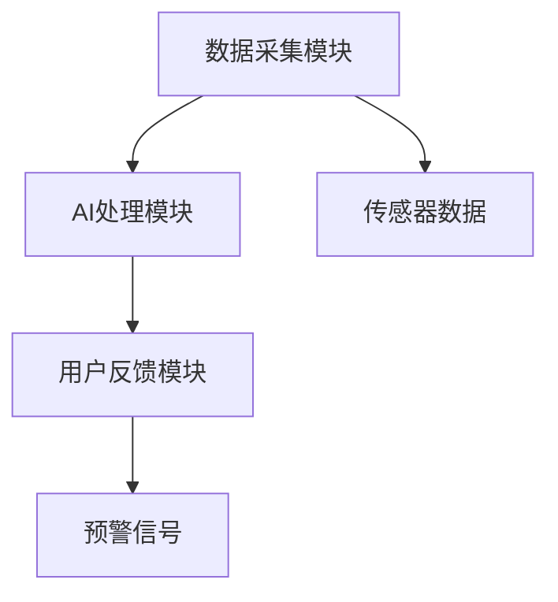
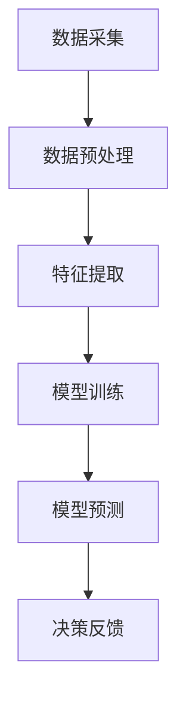
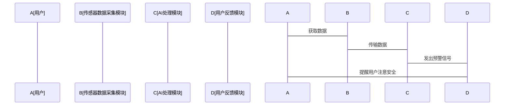

                 


# 智能浴室防滑垫：AI Agent的洗浴安全监护

## 关键词：
智能防滑垫, AI Agent, 洗浴安全, 老年人护理, 滑倒预防, 传感器技术

## 摘要：
智能浴室防滑垫结合AI代理技术，实时监测浴室环境和用户动作，预防滑倒事故，尤其适用于老年人和行动不便人群。本文详细介绍了防滑垫的物理特性、AI代理的感知与反馈机制、滑倒风险预测算法、系统架构设计及项目实战，最后给出最佳实践建议。

---

# 第一部分：背景与需求

## 第1章：智能浴室防滑垫的背景与需求

### 1.1 老年人洗浴安全问题
#### 1.1.1 老年人洗浴安全的核心问题
- 老年人身体机能下降，平衡能力减弱。
- 浴室环境湿滑，增加了滑倒风险。
- 传统防滑垫仅提供物理防滑，缺乏实时监测和反馈。

#### 1.1.2 老年人洗浴环境的特殊性
| 特性 | 描述 |
|------|------|
| 湿滑环境 | 浴室地面易积水，增加滑倒风险 |
| 行动不便 | 老年人步态缓慢，平衡能力差 |
| 独居情况 | 老年人独自洗浴时，无人及时发现危险 |

#### 1.1.3 老年人洗浴事故的统计数据
- 全球每年因滑倒导致的骨折病例中，60%以上为老年人。
- 据统计，浴室是老年人滑倒事故的高发区域。

### 1.2 智能浴室防滑垫的出现
#### 1.2.1 智能防滑垫的概念
- 智能防滑垫：结合传感器和AI代理，实时监测并预防滑倒的防滑垫。

#### 1.2.2 智能防滑垫的技术优势
| 技术 | 优势 |
|------|------|
| 传感器 | 实时监测环境和用户动作 |
| AI代理 | 智能分析数据，主动发出预警 |

#### 1.2.3 智能防滑垫的目标用户群体
- 老年人
- 行动不便者
- 独居人士

### 1.3 AI Agent在防滑垫中的应用
#### 1.3.1 AI Agent的基本概念
- AI Agent：智能体，能够感知环境、做出决策并采取行动的实体。

#### 1.3.2 AI Agent在防滑垫中的作用
- 数据采集：通过传感器收集环境和用户数据。
- 环境感知：分析数据，识别潜在危险。
- 反馈机制：通过震动或声音提醒用户潜在危险。

### 1.4 本章小结
本章介绍了老年人洗浴安全的核心问题，传统防滑垫的不足，以及智能防滑垫的技术优势和目标用户群体。AI代理在防滑垫中的应用，为解决老年人洗浴安全问题提供了新的思路。

---

# 第二部分：核心概念与原理

## 第2章：智能浴室防滑垫的核心概念与原理

### 2.1 防滑垫的物理特性
#### 2.1.1 防滑垫的材料特性
- 高弹性材料：提供缓冲和防滑效果。
- 抗菌材料：防止细菌滋生，保持卫生。

#### 2.1.2 防滑垫的结构设计
- 多层结构：底层防滑，表层防滑设计。
- 穿孔设计：增加排水性能，防止积水。

#### 2.1.3 防滑垫的力学特性
- 弹性模量：材料的弹性系数，影响防滑效果。
- 摩擦系数：材料表面与人脚底的摩擦力，影响防滑性能。

### 2.2 AI Agent的感知与反馈机制
#### 2.2.1 AI Agent的传感器数据采集
- 压力传感器：监测用户体重分布。
- 湿度传感器：监测环境湿度。

#### 2.2.2 AI Agent的环境感知能力
- 数据融合：整合多传感器数据，提高感知准确性。
- 实时分析：快速判断环境和用户状态。

#### 2.2.3 AI Agent的反馈机制
- 震动反馈：当检测到潜在危险时，震动提醒用户。
- 声音反馈：语音提示用户注意安全。

### 2.3 防滑垫与AI Agent的结合
#### 2.3.1 防滑垫与AI Agent的物理结合
- 传感器集成：将传感器嵌入防滑垫，实时采集数据。
- 数据传输：通过无线方式传输数据到AI代理。

#### 2.3.2 AI Agent对防滑垫的智能控制
- 自动调整防滑性能：根据环境和用户动作，动态调整防滑效果。
- 智能预警：当检测到滑倒风险时，立即发出预警信号。

#### 2.3.3 防滑垫与AI Agent的协同工作
- 协同感知：防滑垫提供环境数据，AI代理进行分析和决策。
- 协同反馈：AI代理通过防滑垫发出预警信号，提醒用户注意安全。

### 2.4 本章小结
本章详细讲解了防滑垫的物理特性，AI代理的感知与反馈机制，以及防滑垫与AI代理的结合方式。通过协同工作，智能防滑垫能够实时监测环境和用户动作，预防滑倒事故的发生。

---

# 第三部分：算法原理

## 第3章：智能浴室防滑垫的算法原理

### 3.1 数据采集与处理
#### 3.1.1 传感器数据的采集
- 压力传感器：采集用户体重分布数据。
- 湿度传感器：采集环境湿度数据。
- 温度传感器：采集环境温度数据。

#### 3.1.2 数据预处理与特征提取
- 数据清洗：去除噪声和异常值。
- 特征提取：提取关键特征，如体重分布的重心位置、湿度变化率等。

#### 3.1.3 数据的标准化与归一化
- 标准化：将数据缩放到相同范围内。
- 归一化：将数据转换为0-1范围，便于模型训练。

### 3.2 滑倒风险预测模型
#### 3.2.1 滑倒风险预测的数学模型
- 概率模型：基于历史数据，计算滑倒概率。
- 逻辑回归模型：预测滑倒风险。
- 支持向量机模型：分类滑倒风险。

#### 3.2.2 滑倒风险预测的算法选择
- 机器学习算法：随机森林、神经网络等。
- 模型选择：根据数据特征和实际需求选择最优算法。

#### 3.2.3 滑倒风险预测的实现步骤
1. 数据采集：收集用户动作和环境数据。
2. 数据预处理：清洗和特征提取。
3. 模型训练：训练滑倒风险预测模型。
4. 模型评估：验证模型的准确性和可靠性。
5. 模型部署：将模型部署到智能防滑垫中，实时预测滑倒风险。

### 3.3 AI Agent的决策机制
#### 3.3.1 基于概率的决策模型
- 计算滑倒概率，根据概率阈值决定是否发出预警。

#### 3.3.2 基于规则的决策模型
- 预定义规则，如“湿度超过80%且用户重心偏移”，则发出预警。

#### 3.3.3 基于强化学习的决策模型
- 使用强化学习算法，通过奖励机制优化决策策略。

### 3.4 本章小结
本章详细讲解了滑倒风险预测模型的算法原理，AI代理的决策机制，以及模型的实现步骤。通过机器学习和数据处理技术，AI代理能够实时分析数据，预测滑倒风险，并采取相应的措施。

---

# 第四部分：系统分析与架构设计

## 第4章：智能浴室防滑垫的系统架构与设计

### 4.1 系统整体架构
#### 4.1.1 系统模块划分
- 传感器数据采集模块：负责采集环境和用户数据。
- AI处理模块：负责数据处理和滑倒风险预测。
- 用户反馈模块：负责发出预警信号。

#### 4.1.2 系统模块之间的关系
- 数据采集模块向AI处理模块传输数据。
- AI处理模块根据数据做出决策，并将结果传送给用户反馈模块。
- 用户反馈模块根据决策结果，发出震动或声音预警。

#### 4.1.3 系统架构的优缺点分析
- 优点：模块化设计，便于维护和升级。
- 缺点：系统复杂度较高，需要协调多个模块。

### 4.2 系统功能设计
#### 4.2.1 用户界面设计
- 图形化界面：显示滑倒风险等级和预警信息。
- 设置界面：用户可以调整预警阈值和反馈方式。

#### 4.2.2 数据采集与处理功能
- 实时采集环境和用户数据。
- 数据存储：保存历史数据，便于分析和回溯。

#### 4.2.3 AI Agent的智能控制功能
- 实时分析数据，预测滑倒风险。
- 根据风险等级，动态调整防滑性能。

### 4.3 系统接口设计
#### 4.3.1 硬件接口设计
- 传感器接口：与压力、湿度、温度传感器连接。
- 无线通信接口：通过Wi-Fi或蓝牙与手机或其他设备通信。

#### 4.3.2 软件接口设计
- API接口：与其他系统（如智能家居）集成。
- 用户界面接口：与图形化界面交互。

#### 4.3.3 接口的标准化与兼容性
- 标准化接口：确保不同模块之间的兼容性。
- 兼容性设计：支持多种传感器和通信协议。

### 4.4 本章小结
本章详细讲解了智能防滑垫系统的整体架构，功能设计，接口设计等。通过模块化设计和标准化接口，系统能够协同工作，实现智能监测和预警。

---

# 第五部分：项目实战

## 第5章：智能浴室防滑垫的项目实战

### 5.1 环境安装
#### 5.1.1 硬件安装
- 传感器安装：将压力、湿度、温度传感器安装在防滑垫上。
- 无线通信模块安装：连接Wi-Fi或蓝牙模块。

#### 5.1.2 软件安装
- 安装Python环境：安装Python和相关库（如numpy、scikit-learn）。
- 安装AI处理框架：如TensorFlow或PyTorch。

### 5.2 系统核心实现源代码
#### 5.2.1 数据采集模块
```python
import numpy as np

class Sensor:
    def __init__(self):
        self.pressure_sensor = PressureSensor()
        self.humidity_sensor = HumiditySensor()
        self.temperature_sensor = TemperatureSensor()
    
    def get_data(self):
        pressure = self.pressure_sensor.read()
        humidity = self.humidity_sensor.read()
        temperature = self.temperature_sensor.read()
        return {'pressure': pressure, 'humidity': humidity, 'temperature': temperature}
```

#### 5.2.2 滑倒风险预测模型
```python
from sklearn.ensemble import RandomForestClassifier

class SlipRiskPredictor:
    def __init__(self):
        self.model = RandomForestClassifier()
    
    def train(self, X, y):
        self.model.fit(X, y)
    
    def predict(self, X):
        return self.model.predict(X)
```

#### 5.2.3 AI Agent决策模块
```python
class AI-Agent:
    def __init__(self):
        self.slip_predictor = SlipRiskPredictor()
        self.feedback_module = FeedbackModule()
    
    def decide(self, data):
        risk = self.slip_predictor.predict(data)
        if risk > 0.8:
            self.feedback_module.alert()
```

### 5.3 代码应用解读与分析
- 数据采集模块：实时采集环境和用户数据。
- 滑倒风险预测模型：训练模型并预测滑倒风险。
- AI Agent决策模块：根据预测结果，决定是否发出预警信号。

### 5.4 实际案例分析
- 案例背景：一位老年人在洗澡时，系统检测到地面湿滑且用户重心偏移，发出预警信号，避免滑倒。
- 数据分析：压力传感器检测到用户体重分布异常，湿度传感器检测到地面湿滑。
- 预警机制：系统发出震动提醒，用户及时调整站姿，避免滑倒。

### 5.5 项目小结
本章通过实际案例，展示了智能防滑垫的项目实现过程，包括环境安装、核心代码实现、案例分析等。通过实际操作，读者可以理解智能防滑垫的设计与应用。

---

# 第六部分：最佳实践与总结

## 第6章：最佳实践与总结

### 6.1 最佳实践 tips
- 定期检查传感器：确保传感器正常工作。
- 系统维护：定期更新软件和模型，确保系统稳定运行。
- 用户教育：指导用户正确使用智能防滑垫，避免误操作。

### 6.2 小结
智能浴室防滑垫结合了AI代理技术，能够实时监测环境和用户动作，预防滑倒事故的发生。通过传感器数据采集、AI算法分析和智能反馈，系统能够有效提升老年人和行动不便人群的洗浴安全。

### 6.3 注意事项
- 系统安装：确保传感器安装牢固，避免松动。
- 数据隐私：保护用户数据，防止泄露。
- 系统兼容性：确保不同模块之间兼容，避免冲突。

### 6.4 拓展阅读
- 传感器技术：深入学习各种传感器的工作原理和应用。
- AI算法：研究更先进的算法，提高滑倒风险预测的准确性。

### 6.5 结语
智能浴室防滑垫是科技与人文关怀的结合，通过技术手段解决实际问题，提升人们的生活质量。未来，随着AI技术的发展，智能防滑垫将更加智能化，为更多人提供安全的洗浴环境。

---

# 附录

## 附录A：相关数学公式

### 1. 概率模型公式
$$ P(\text{滑倒}) = \frac{\text{滑倒次数}}{\text{总次数}} $$

### 2. 逻辑回归模型公式
$$ \text{logit}(p) = \beta_0 + \beta_1 x_1 + \beta_2 x_2 + \dots + \beta_n x_n $$

### 3. 支持向量机模型公式
$$ y = \text{sign}(\sum_{i=1}^n \alpha_i y_i e^{w_i x_i} + b) $$

---

## 附录B：系统架构图



---

## 附录C：算法流程图



---

## 附录D：系统交互序列图



---

通过以上详细的内容，智能浴室防滑垫的设计与应用得到了全面的阐述。从背景到技术实现，再到实际应用，读者可以系统地了解智能防滑垫的工作原理和实际价值。

