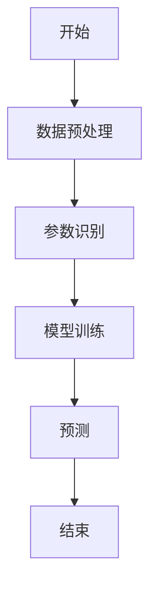
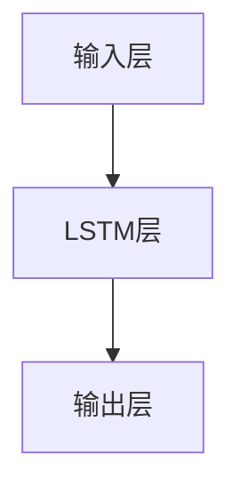
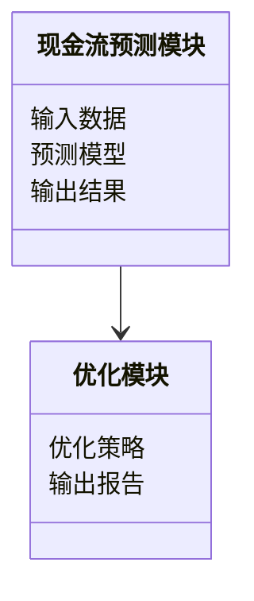
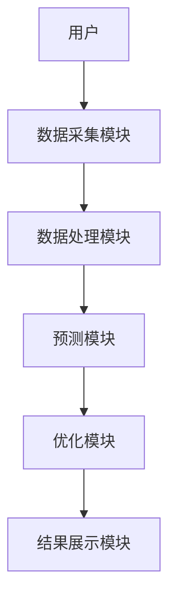
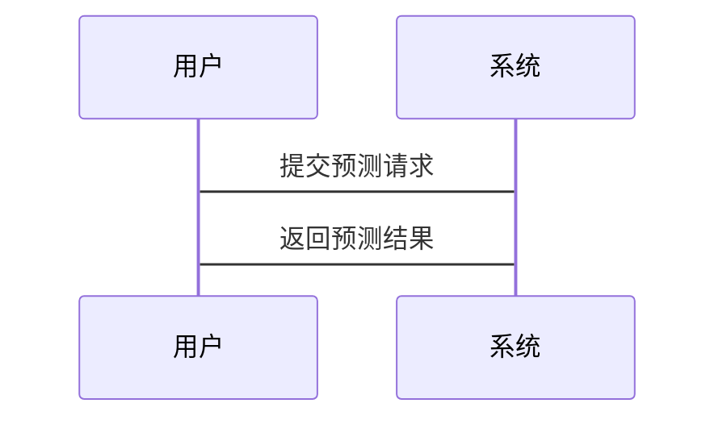

                 


# 智能现金流预测与优化管理平台

> 关键词：智能现金流预测，现金流优化，机器学习，时间序列分析，LSTM模型

> 摘要：本文详细探讨智能现金流预测与优化管理平台的构建，涵盖背景介绍、核心概念、算法原理、系统架构设计、项目实战及总结。文章通过对比分析传统方法与智能平台的优势，结合ARIMA和LSTM模型，展示如何利用机器学习技术提升现金流预测的准确性与优化效率，为企业财务管理提供创新解决方案。

---

# 第一章: 智能现金流预测与优化管理平台概述

## 1.1 现金流预测与优化管理的背景

现金流预测与优化管理是企业财务管理的核心任务之一。准确预测现金流可以帮助企业合理安排资金，优化资源配置，降低财务风险。然而，传统的方法往往依赖于人工经验，存在数据量不足、预测精度低等问题。

### 1.1.1 现金流预测与优化管理的定义

现金流预测是指通过历史数据和相关模型，预测未来某一时间段内企业的现金流入和流出情况。优化管理则是基于预测结果，调整企业运营策略，以实现现金流的最大化或风险最小化。

### 1.1.2 现金流预测与优化管理的重要性

现金流是企业的生命线，直接关系到企业的生存与发展。准确的现金流预测可以帮助企业规避资金链断裂的风险，优化投资决策，提升整体财务健康状况。

### 1.1.3 现金流预测与优化管理的边界与外延

现金流预测的边界包括企业的日常运营、投资活动和筹资活动。外延则涉及宏观经济环境、行业趋势和政策变化等外部因素。

## 1.2 智能现金流预测与优化管理平台的核心概念

### 1.2.1 现金流预测的核心要素

- 数据来源：销售数据、历史财务报表、市场数据等。
- 预测方法：时间序列分析、机器学习、深度学习等。
- 输出结果：预测值、置信区间、风险评估。

### 1.2.2 智能优化管理的关键技术

- 数据预处理：清洗、特征提取。
- 模型训练：机器学习算法、深度学习模型。
- 优化策略：基于预测结果的资源配置优化。

### 1.2.3 平台的功能结构与核心要素组成

智能现金流预测与优化管理平台由数据采集模块、预测模块、优化模块和决策支持模块组成，实现从数据输入到结果输出的全链路管理。

---

# 第二章: 智能现金流预测的原理与模型

## 2.1 智能现金流预测的原理

现金流预测依赖于数据的特征提取和模型的训练。通过分析历史数据，识别潜在的模式和趋势，利用机器学习技术预测未来现金流。

### 2.1.1 时间序列分析的基本原理

时间序列分析是一种基于历史数据预测未来趋势的方法，常用模型包括ARIMA、SARIMA等。

### 2.1.2 机器学习在现金流预测中的应用

机器学习通过特征提取和模型训练，捕捉数据中的非线性关系，提高预测精度。

### 2.1.3 深度学习在现金流预测中的优势

深度学习模型如LSTM能够捕捉长序列中的依赖关系，适合处理复杂的时序数据。

## 2.2 现金流预测模型的对比分析

### 2.2.1 常见现金流预测模型的分类

- 统计模型：ARIMA、SARIMA。
- 机器学习模型：随机森林、支持向量机。
- 深度学习模型：LSTM、Transformer。

### 2.2.2 各种模型的优缺点对比

| 模型类型       | 优点                               | 缺点                               |
|----------------|------------------------------------|------------------------------------|
| ARIMA         | 简单易实现，适合线性数据           | 无法捕捉非线性关系                 |
| LSTM          | 能捕捉长序列依赖，适合复杂数据     | 训练时间长，计算资源消耗大           |
| 随机森林       | 鲁棒性强，易于解释                 | 无法捕捉时间序列中的长期依赖关系     |

### 2.2.3 选择合适模型的策略

根据数据特征和预测目标选择模型，通常需要进行实验对比。

## 2.3 现金流预测的数据预处理

### 2.3.1 数据清洗与标准化

- 数据清洗：处理缺失值、异常值。
- 数据标准化：归一化或标准化处理。

### 2.3.2 数据特征提取

- 时间特征：日期、星期、季度。
- 历史特征：过去N天的现金流数据。
- 外部特征：市场指数、政策变化。

### 2.3.3 数据分训练集与测试集

通常将数据按时间顺序分为训练集和测试集，比例为7:3或8:2。

## 2.4 本章小结

智能现金流预测结合了时间序列分析和机器学习技术，通过数据预处理和模型选择，能够有效提升预测精度。

---

# 第三章: 现金流预测算法原理讲解

## 3.1 ARIMA模型

### 3.1.1 ARIMA模型的基本原理

ARIMA模型通过自回归和移动平均部分，捕捉数据中的趋势和季节性。

### 3.1.2 ARIMA模型的数学公式

$$ARIMA(p, d, q) = y_t - \phi_1 y_{t-1} - \dots - \phi_p y_{t-p} = \theta_1 \epsilon_{t-1} + \dots + \theta_q \epsilon_{t-q}$$

### 3.1.3 ARIMA模型的实现流程



## 3.2 LSTM模型

### 3.2.1 LSTM模型的基本原理

LSTM通过细胞状态和门控机制，有效捕捉长期依赖关系。

### 3.2.2 LSTM模型的结构



### 3.2.3 LSTM模型的数学公式

$$f_t = \sigma(W_f \cdot [h_{t-1}, x_t] + b_f)$$
$$i_t = \sigma(W_i \cdot [h_{t-1}, x_t] + b_i)$$
$$o_t = \sigma(W_o \cdot [h_{t-1}, x_t] + b_o)$$
$$c_t = f_t \cdot c_{t-1} + i_t \cdot tanh(W_c \cdot [h_{t-1}, x_t] + b_c)$$
$$h_t = o_t \cdot tanh(c_t)$$

## 3.3 本章小结

ARIMA和LSTM各有优缺点，适用于不同场景。在实际应用中，可以根据数据特征选择合适的模型。

---

# 第四章: 系统分析与架构设计

## 4.1 问题场景介绍

企业面临现金流预测不准、优化策略单一等问题，亟需智能化解决方案。

## 4.2 系统功能设计

### 4.2.1 领域模型设计



### 4.2.2 系统架构设计



## 4.3 系统接口设计

### 4.3.1 API接口设计

- 数据接口：数据录入、数据查询。
- 预测接口：模型训练、预测请求。
- 优化接口：策略调整、结果输出。

### 4.3.2 系统交互设计



---

# 第五章: 项目实战

## 5.1 环境安装

安装Python、TensorFlow、Keras、Pandas等工具。

## 5.2 核心代码实现

### 5.2.1 数据预处理代码

```python
import pandas as pd
import numpy as np

# 数据加载
data = pd.read_csv('cash_flow.csv')

# 数据清洗
data.dropna(inplace=True)
data = data[~data['date'].isnull()]

# 数据转换
data['date'] = pd.to_datetime(data['date'])
data.set_index('date', inplace=True)
```

### 5.2.2 LSTM模型实现

```python
from keras.models import Sequential
from keras.layers import LSTM, Dense, Dropout

model = Sequential()
model.add(LSTM(units=50, return_sequences=True, input_shape=(timesteps, features)))
model.add(Dropout(0.2))
model.add(LSTM(units=50, return_sequences=False))
model.add(Dense(1))
model.compile(loss='mean_squared_error', optimizer='adam')
```

### 5.2.3 训练与预测

```python
model.fit(X_train, y_train, epochs=50, batch_size=32)
y_pred = model.predict(X_test)
```

## 5.3 代码解读与分析

- 数据预处理：清洗、转换。
- 模型训练：构建网络、编译、训练。
- 模型预测：生成预测结果。

## 5.4 实际案例分析

通过具体企业案例，展示平台的实际应用效果。

## 5.5 项目小结

详细总结项目实施过程中的经验与教训。

---

# 第六章: 总结与展望

## 6.1 总结

智能现金流预测与优化管理平台结合了先进的机器学习技术，能够有效提升预测精度和优化效率。

## 6.2 展望

未来，随着技术进步，平台将进一步优化，拓展更多应用场景，为企业财务管理提供更多支持。

---

# 结语

智能现金流预测与优化管理平台是企业财务管理的重要工具，通过技术创新，为企业创造更大的价值。

