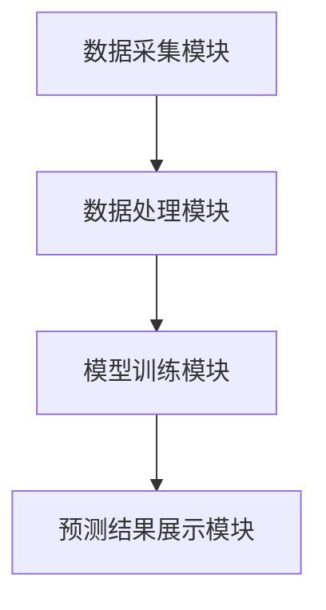
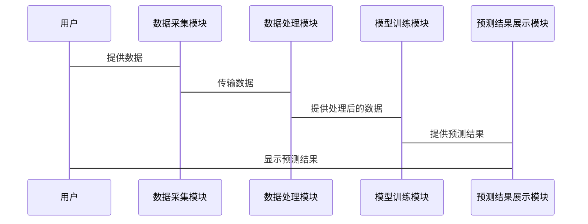

                 


# 智能现金流预测与管理平台

## 关键词：
智能现金流预测，机器学习，深度学习，时间序列分析，系统架构设计，现金流管理

## 摘要：
本文系统地探讨了智能现金流预测与管理平台的设计与实现，从背景与意义、核心概念、算法原理、系统架构设计、项目实战到最佳实践，全面剖析了智能现金流预测的理论与实践。文章首先介绍了现金流预测的重要性及其智能化的必要性，接着详细阐述了智能预测的核心算法与数学模型，包括时间序列分析和机器学习算法，并通过实际案例展示了如何构建智能现金流预测系统。最后，文章总结了智能现金流预测的关键点与未来发展方向，为读者提供了全面的技术参考。

---

## 第1章: 智能现金流预测与管理平台的背景与意义

### 1.1 现金流预测的重要性

#### 1.1.1 现金流预测的定义与作用
现金流预测是指通过历史数据和市场信息，利用数学模型和算法，对未来的现金流进行估算和预测。它是企业财务管理的重要组成部分，能够帮助企业提前规划资金使用、优化资源配置、降低财务风险。

#### 1.1.2 现金流预测在企业中的应用场景
现金流预测在企业中的应用场景非常广泛，包括：
- **财务规划**：帮助企业制定长期财务目标和预算。
- **风险管理**：识别现金流波动风险，制定应对策略。
- **投资决策**：评估投资项目可行性，优化投资组合。
- **贷款与融资**：为金融机构提供企业信用评估依据。

#### 1.1.3 智能化现金流预测的优势
传统的现金流预测方法通常依赖人工经验，存在数据处理复杂、预测精度低、效率低等问题。而智能化的现金流预测通过引入机器学习、深度学习等技术，能够提高预测精度，降低预测成本，实现自动化、实时化预测。

### 1.2 现金流管理的核心问题

#### 1.2.1 现金流波动的不确定性
现金流的波动性是企业财务管理的核心挑战之一。市场需求变化、经济环境波动、企业内部管理等多种因素都会影响现金流的波动。

#### 1.2.2 传统现金流预测方法的局限性
传统方法通常基于简单的线性回归模型或人工经验，难以捕捉数据中的复杂规律，预测精度有限。

#### 1.2.3 智能预测与管理的必要性
智能化预测能够通过大数据分析和先进算法，捕捉数据中的非线性关系，提高预测精度，降低管理成本。

---

## 第2章: 智能现金流预测的核心概念

### 2.1 现金流预测的关键要素

#### 2.1.1 现金流的分类与特征
现金流可以分为以下几类：
- **经营性现金流**：来自企业日常经营活动的现金流。
- **投资性现金流**：来自企业投资活动的现金流。
- **融资性现金流**：来自企业融资活动的现金流。

不同类型的现金流具有不同的特征，例如经营性现金流通常与企业的收入和支出直接相关，而投资性现金流则与资本支出相关。

#### 2.1.2 数据来源与处理方法
现金流预测的数据来源包括：
- 企业的财务报表数据。
- 市场数据，如行业指数、宏观经济指标。
- 企业内部数据，如销售数据、成本数据。

数据处理方法包括数据清洗、特征提取、数据标准化等。

#### 2.1.3 预测模型的输入与输出
预测模型的输入通常包括历史现金流数据、市场数据、企业内部数据等；输出是未来某一时间段内的现金流预测值。

### 2.2 智能预测的核心算法

#### 2.2.1 时间序列分析的基本原理
时间序列分析是一种基于历史数据预测未来趋势的方法。常用的时间序列模型包括ARIMA（自回归积分滑动平均模型）和LSTM（长短期记忆网络）。

#### 2.2.2 机器学习在现金流预测中的应用
机器学习算法，如随机森林、支持向量机等，也可以用于现金流预测。这些算法能够捕捉数据中的非线性关系，提高预测精度。

#### 2.2.3 深度学习模型的优势
深度学习模型，如LSTM，能够处理复杂的时间序列数据，具有较强的捕捉长期依赖关系的能力。

---

## 第3章: 现金流预测的数学模型与算法原理

### 3.1 时间序列分析模型

#### 3.1.1 ARIMA模型的原理与公式
ARIMA（Autoregressive Integrated Moving Average）模型是一种常用的时间序列预测模型，其基本公式为：
$$ ARIMA(p, d, q) $$
其中：
- $p$ 是自回归阶数。
- $d$ 是差分阶数。
- $q$ 是移动平均阶数。

#### 3.1.2 LSTM网络的结构与优势
LSTM（长短期记忆网络）是一种特殊的RNN（循环神经网络），能够有效处理长序列数据。其核心思想是通过门控机制来控制信息的流动。

### 3.2 机器学习算法在现金流预测中的应用

#### 3.2.1 线性回归模型的简单实现
线性回归模型是最简单的预测模型之一，其数学公式为：
$$ y = \beta_0 + \beta_1x + \epsilon $$
其中，$\beta_0$ 是截距，$\beta_1$ 是回归系数，$\epsilon$ 是误差项。

#### 3.2.2 支持向量回归的基本原理
支持向量回归（SVR）是一种基于支持向量机的回归算法，能够处理非线性关系。其核心思想是通过找到一个超平面，使得数据点尽可能接近该超平面。

#### 3.2.3 随机森林算法的特征重要性分析
随机森林是一种基于决策树的集成算法，能够处理高维数据。通过随机森林，可以分析特征的重要性，从而找到影响现金流预测的关键因素。

---

## 第4章: 系统分析与架构设计

### 4.1 现金流预测系统的需求分析

#### 4.1.1 系统功能需求
现金流预测系统需要实现以下功能：
- 数据采集与预处理。
- 模型训练与预测。
- 预测结果展示与分析。

#### 4.1.2 系统性能需求
系统需要满足实时性、高可用性和可扩展性。

### 4.2 系统架构设计

#### 4.2.1 系统模块划分
现金流预测系统可以划分为以下几个模块：
- 数据采集模块。
- 数据处理模块。
- 模型训练模块。
- 预测结果展示模块。

#### 4.2.2 系统架构图


### 4.3 接口设计与交互流程

#### 4.3.1 接口设计
系统需要提供以下接口：
- 数据接口：用于数据的导入和导出。
- 模型接口：用于模型的训练和预测。
- 展示接口：用于结果的可视化。

#### 4.3.2 交互流程


---

## 第5章: 项目实战

### 5.1 环境安装与配置

#### 5.1.1 安装Python环境
需要安装Python 3.6及以上版本，并安装以下库：
- numpy
- pandas
- scikit-learn
- keras
- tensorflow

#### 5.1.2 数据集准备
需要准备企业的历史现金流数据，以及其他相关数据（如市场数据）。

### 5.2 核心代码实现

#### 5.2.1 数据处理代码
```python
import pandas as pd
import numpy as np

# 读取数据
data = pd.read_csv('cash_flow.csv')

# 数据清洗
data.dropna(inplace=True)
data = data.astype(float)
```

#### 5.2.2 模型训练代码
```python
from sklearn.ensemble import RandomForestRegressor
from sklearn.metrics import mean_squared_error

# 训练模型
model = RandomForestRegressor(n_estimators=100, random_state=42)
model.fit(X_train, y_train)

# 预测结果
y_pred = model.predict(X_test)
print('均方误差:', mean_squared_error(y_test, y_pred))
```

### 5.3 实际案例分析

#### 5.3.1 数据分析与特征提取
通过分析数据，提取关键特征，如历史现金流、销售收入增长率等。

#### 5.3.2 模型优化与评估
通过交叉验证等方法，优化模型参数，评估模型性能。

---

## 第6章: 最佳实践与总结

### 6.1 项目小结
智能现金流预测与管理平台的实现，能够显著提高现金流预测的精度和效率，为企业财务管理提供有力支持。

### 6.2 注意事项
在实际应用中，需要注意数据质量和模型的可解释性，避免因数据偏差导致的预测错误。

### 6.3 拓展阅读
建议读者进一步学习时间序列分析和深度学习技术，探索更多现金流预测的方法和应用。

---

以上是《智能现金流预测与管理平台》的技术博客文章，涵盖了从背景介绍到系统实现的各个方面，通过理论与实践相结合的方式，全面剖析了智能现金流预测的核心技术和实现方法。

