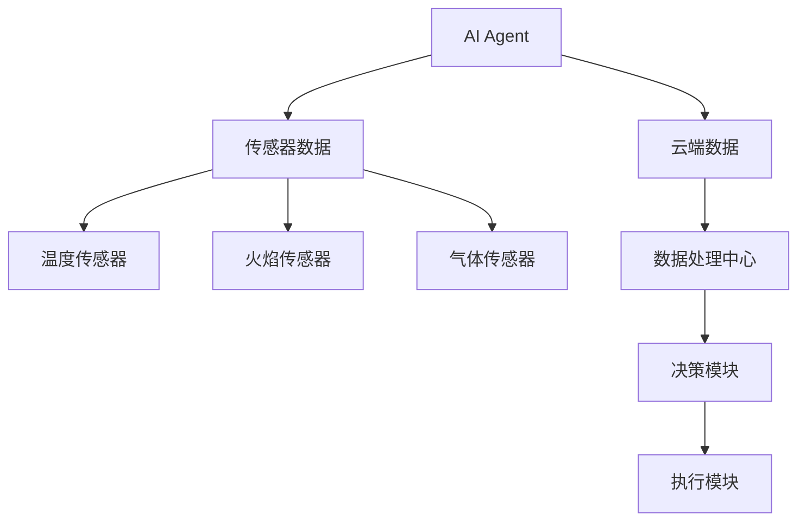
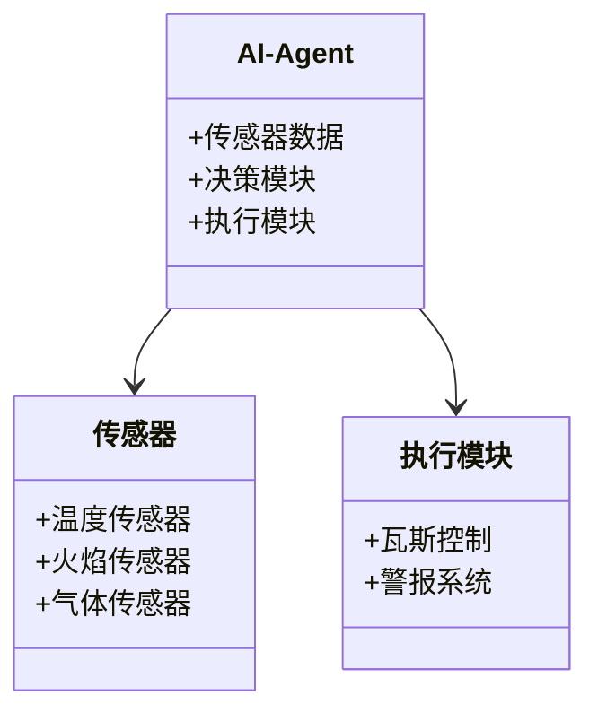

                 


# 智能瓦斯炉：AI Agent的烹饪安全监控系统

## 关键词：AI Agent, 物联网, 智能瓦斯炉, 烹饪安全, 状态机模型, 传感器, 自动化监控

## 摘要：  
智能瓦斯炉结合了AI Agent和物联网技术，通过实时监控烹饪过程中的各项参数，能够有效预防和处理烹饪中的安全隐患。本文将从背景、核心概念、算法原理、系统架构到项目实战，全面解析智能瓦斯炉的设计与实现，展示其在现代厨房中的应用价值。

---

# 第一部分: 智能瓦斯炉与AI Agent的背景介绍

## 第1章: 传统瓦斯炉的局限性

### 1.1 烹饪安全问题的现状
传统的瓦斯炉在家庭烹饪中扮演着重要角色，但其安全性却存在诸多隐患。例如，火焰意外熄灭可能导致未燃烧的燃气泄漏，高温烹饪可能引发火灾，老年人或粗心用户的操作失误也可能导致意外发生。这些问题凸显了传统瓦斯炉在安全监控方面的不足。

### 1.2 传统瓦斯炉的安全隐患
- **火焰监控不足**：传统瓦斯炉通常依赖手动关闭，无法实时监控火焰状态。
- **燃气泄漏风险**：缺乏对燃气浓度的实时检测，可能导致严重事故。
- **操作失误**：用户在烹饪过程中可能忘记关闭瓦斯，尤其是对于不熟悉烹饪的用户。

### 1.3 现有安全监控系统的不足
- **被动响应**：传统监控系统通常只能在检测到危险信号后发出警报，无法主动采取措施。
- **数据处理能力有限**：现有系统难以整合多种传感器数据，无法进行深度分析。
- **用户体验差**：复杂的操作界面和低效的响应机制降低了用户的使用体验。

---

## 第2章: AI Agent的核心概念

### 2.1 AI Agent的基本定义
AI Agent（智能体）是指能够感知环境、自主决策并执行任务的智能系统。在智能瓦斯炉中，AI Agent负责实时监控烹饪过程中的各项参数，如火焰状态、温度、气体浓度等，并根据这些数据做出相应的决策，如调整火焰大小、关闭瓦斯或发出警报。

### 2.2 AI Agent在智能瓦斯炉中的应用
- **实时监控**：AI Agent通过整合温度传感器、火焰传感器和气体传感器的数据，实时监控烹饪过程中的各项指标。
- **智能决策**：基于传感器数据，AI Agent能够识别潜在的安全隐患，并采取相应的措施，如关闭瓦斯、调整火力或发出警报。
- **学习与优化**：通过机器学习算法，AI Agent能够不断优化其决策模型，提高烹饪效率和安全性。

### 2.3 AI Agent与传统监控系统的区别
| 特性                | 传统监控系统                  | AI Agent                      |
|---------------------|-------------------------------|-------------------------------|
| 数据处理能力        | 基于简单的规则进行判断        | 基于机器学习模型进行深度分析  |
| 决策能力            | 被动响应，仅发出警报          | 主动决策，能够采取具体措施    |
| 学习能力            | 无法学习                     | 可通过数据训练不断优化性能    |

---

## 第3章: AI Agent与物联网的结合

### 3.1 物联网技术在智能瓦斯炉中的应用
物联网技术通过传感器和无线通信模块，将瓦斯炉的实时数据传输到AI Agent中。例如：
- **传感器数据采集**：温度传感器监测烹饪温度，火焰传感器检测火焰状态，气体传感器监控燃气浓度。
- **数据传输**：通过Wi-Fi或蓝牙将传感器数据传输到AI Agent或云端，进行进一步分析。

### 3.2 AI Agent与物联网的协同工作
AI Agent通过整合物联网数据，能够实时感知烹饪环境的变化，并做出相应的决策。例如：
- 当检测到燃气浓度异常时，AI Agent会立即关闭瓦斯并发出警报。
- 根据烹饪温度的变化，AI Agent会自动调整火焰大小，以保持烹饪过程的稳定。

### 3.3 系统架构设计
以下是智能瓦斯炉的系统架构图：



---

## 第4章: 算法原理与数学模型

### 4.1 状态机模型
AI Agent的状态机模型用于描述其在不同状态下的行为。例如：

```mermaid
stateDiagram
    [*] --(start)--> S1: 等待状态
    S1 --> S2: 检测到火焰
    S2 --> S3: 火焰异常
    S3 --> S4: 关闭瓦斯并发出警报
    S4 --> [*]: 任务完成
```

### 4.2 行为决策算法
AI Agent的行为决策算法可以通过机器学习模型实现。例如，基于回归算法预测烹饪温度：

$$ y = \beta_0 + \beta_1 x + \epsilon $$

其中，\( y \) 为预测温度，\( x \) 为当前温度，\( \beta_0 \) 和 \( \beta_1 \) 为模型参数，\( \epsilon \) 为误差项。

### 4.3 事件驱动机制
AI Agent通过事件驱动机制，实时响应烹饪过程中的各种事件。例如，当检测到火焰熄灭时，触发警报事件并执行关闭瓦斯的操作。

---

## 第5章: 系统分析与架构设计

### 5.1 系统功能设计
智能瓦斯炉的系统功能包括：
1. 实时监控：通过传感器实时采集烹饪过程中的各项参数。
2. 智能决策：基于传感器数据和机器学习模型，做出相应的决策。
3. 人机交互：提供友好的用户界面，方便用户操作和监控。

### 5.2 系统架构设计
以下是智能瓦斯炉的系统架构图：



---

## 第6章: 项目实战

### 6.1 环境安装
智能瓦斯炉的开发环境包括：
- 硬件：温度传感器、火焰传感器、气体传感器、Wi-Fi模块。
- 软件：Python编程语言，机器学习库（如scikit-learn）。

### 6.2 核心代码实现
以下是AI Agent的核心代码实现：

```python
import numpy as np
from sklearn.linear_model import LinearRegression

# 传感器数据
temperature = np.array([50, 60, 70, 80, 90]).reshape(-1, 1)
target = np.array([1, 2, 3, 4, 5])

# 训练模型
model = LinearRegression()
model.fit(temperature, target)

# 预测温度
predicted = model.predict([[75]])
print(predicted)
```

### 6.3 代码解读与分析
上述代码通过机器学习模型实现了对烹饪温度的预测。训练好的模型能够根据当前温度预测未来的温度变化，从而帮助AI Agent做出更准确的决策。

### 6.4 实际案例分析
在实际烹饪过程中，AI Agent能够根据传感器数据实时调整火焰大小，确保烹饪过程的高效和安全。例如，在高温烹饪时，AI Agent会自动降低火焰以防止食物烧焦。

---

## 第7章: 最佳实践

### 7.1 小结
智能瓦斯炉通过AI Agent和物联网技术的结合，能够实时监控烹饪过程中的各项参数，并做出智能决策，从而有效预防和处理安全隐患。

### 7.2 注意事项
- 确保传感器的准确性和可靠性。
- 定期更新AI Agent的决策模型，以提高其智能化水平。
- 提供友好的用户界面，方便用户操作和监控。

### 7.3 拓展阅读
- 探索AI Agent在其他智能家居设备中的应用。
- 研究更先进的机器学习算法，进一步优化烹饪监控系统的性能。

---

通过以上分析，智能瓦斯炉的设计和实现不仅提升了烹饪的安全性，还为智能家居的发展提供了新的思路。未来，随着技术的不断进步，智能瓦斯炉将变得更加智能化和人性化，为用户的烹饪体验带来更多的便利和安全保障。

