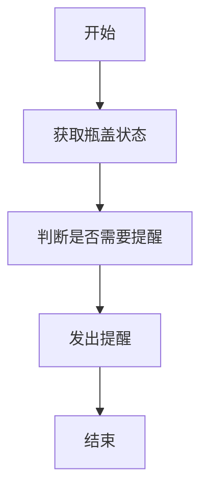
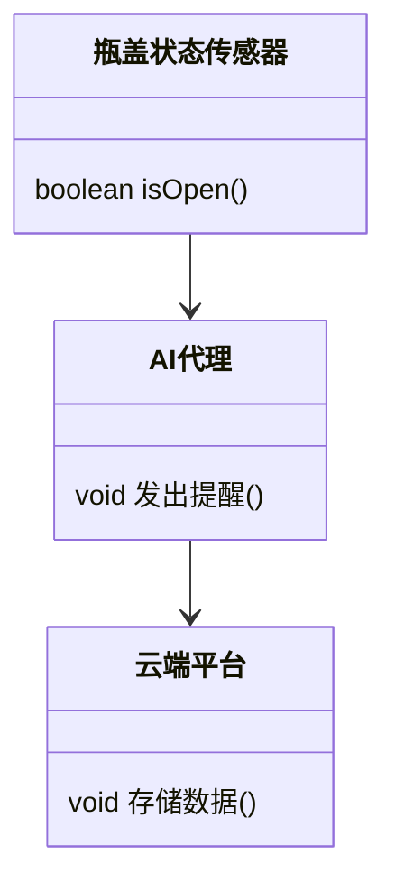
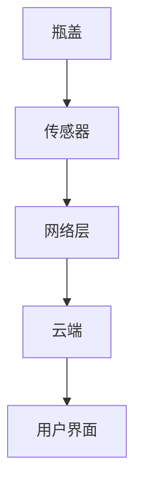

                 


# 智能瓶盖：AI Agent的药物服用提醒

## 关键词：智能瓶盖、AI Agent、物联网、药物提醒、健康监测

## 摘要：智能瓶盖是一种结合了人工智能代理和物联网技术的智能设备，用于提醒用户按时服用药物。本文详细介绍了智能瓶盖的背景、核心概念、算法原理、系统架构、项目实战及最佳实践，帮助读者全面理解其技术实现和应用场景。

---

# 第一部分：智能瓶盖的背景与核心概念

## 第1章：智能瓶盖的背景与问题背景

### 1.1 智能瓶盖的背景介绍

#### 1.1.1 老龄化社会与健康问题的加剧

随着全球人口老龄化的加剧，慢性病患者数量急剧增加。老年人往往需要服用多种药物，但记忆力减退和生活能力下降导致他们容易忘记服药或误服药物，这对健康造成严重威胁。

#### 1.1.2 药物误服的危害与现状

药物误服可能导致药效不佳、副作用增加甚至中毒。据统计，每年因药物误服导致的医疗事故占比高达5%以上，给家庭和社会带来沉重负担。

#### 1.1.3 智能瓶盖的出现与意义

智能瓶盖通过AI代理和物联网技术，实时监测用户用药情况，提醒按时服药，确保用药安全和效果。这不仅提高了老年人生活质量，也减轻了家庭和社会的负担。

### 1.2 问题背景与问题描述

#### 1.2.1 药物误服的主要问题

- 老年人记忆力减退导致漏服或误服。
- 多种药物的复杂服用方案难以记忆。
- 家庭成员无法实时监督用药情况。

#### 1.2.2 智能瓶盖的目标与应用场景

智能瓶盖的目标是通过自动化提醒和监测，确保用户按时按量服药。应用场景包括家庭护理、医院用药管理、远程医疗等。

### 1.3 问题解决与边界外延

#### 1.3.1 智能瓶盖的核心功能

- 自动监测药物存量。
- 实时提醒用药时间。
- 连接家庭成员或医护人员的通知功能。
- 记录用药数据，生成报告。

#### 1.3.2 边界与外延：智能瓶盖的适用范围与限制

- 适用于需要长期服药的慢性病患者。
- 适用于老年人、儿童等特殊群体。
- 无法解决药物过敏或副作用问题。

### 1.4 核心要素与概念结构

#### 1.4.1 智能瓶盖的组成要素

- 物联网传感器：监测瓶盖开启状态。
- AI代理：处理数据，发出提醒。
- 用户界面：显示信息，接收反馈。
- 云端平台：存储数据，提供支持。

#### 1.4.2 核心概念的结构化分析

智能瓶盖由硬件设备、AI代理、物联网网络和用户交互界面组成，各部分协同工作，实现药物服用提醒功能。

---

## 第2章：智能瓶盖的核心概念与联系

### 2.1 AI代理的基本原理

#### 2.1.1 AI代理的定义与特点

AI代理是能够感知环境并采取行动以实现目标的智能实体。它具有自主性、反应性、目标导向性和社会性等特点。

#### 2.1.2 AI代理的核心功能与实现方式

- 数据采集：通过传感器获取瓶盖状态。
- 信息处理：分析数据，判断是否需要提醒。
- 决策与执行：触发提醒动作或通知相关人员。

### 2.2 物联网技术在智能瓶盖中的应用

#### 2.2.1 物联网的基本概念与组成部分

物联网由感知层、网络层和应用层组成，通过传感器、通信技术和数据处理平台实现物物相连。

#### 2.2.2 智能瓶盖中的物联网实现

- 感知层：使用RFID或蓝牙传感器监测瓶盖状态。
- 网络层：通过Wi-Fi或移动网络传输数据。
- 应用层：云端平台处理数据，生成提醒指令。

### 2.3 核心概念的联系与对比

#### 2.3.1 AI代理与物联网的联系

AI代理依赖物联网获取数据，物联网则通过AI代理进行智能决策，两者相辅相成，共同实现智能瓶盖的功能。

#### 2.3.2 智能瓶盖中的实体关系分析

- 用户：通过智能瓶盖获取用药提醒。
- 瓶盖：作为数据采集的源头。
- AI代理：处理数据，发出提醒。
- 云端平台：存储数据，支持远程访问。

---

# 第二部分：智能瓶盖的算法与系统架构

## 第3章：AI代理的算法原理

### 3.1 数据采集与处理

#### 3.1.1 传感器数据的采集

智能瓶盖中的传感器实时监测瓶盖的开启状态，记录每次开启的时间和次数。

#### 3.1.2 数据预处理与特征提取

对采集到的数据进行清洗，提取关键特征，如用药时间间隔、用药频率等。

### 3.2 AI代理的决策算法

#### 3.2.1 基于规则的决策算法

根据预设规则，如“每天早上的8点提醒用药”，触发提醒。

#### 3.2.2 基于机器学习的决策算法

使用历史数据训练模型，预测用户可能忘记用药的时间点，提前发出提醒。

### 3.3 算法实现与流程

#### 3.3.1 算法流程图



#### 3.3.2 算法实现的代码示例

```python
import time

def monitor_bottle():
    while True:
        status = get_bottle_status()  # 获取瓶盖状态
        if status == 'opened':
            time.sleep(60)  # 等待一分钟
            send_reminder()  # 发出提醒
        else:
            time.sleep(5)  # 等待五秒

monitor_bottle()
```

### 3.4 算法的数学模型和公式

#### 基于机器学习的分类模型

$$ P(y|x) = \frac{P(x|y)P(y)}{P(x)} $$

其中，P(y|x)是后验概率，表示在给定特征x的情况下，事件y发生的概率。

---

## 第4章：智能瓶盖的系统架构设计

### 4.1 系统设计概述

智能瓶盖系统由设备层、网络层、云端处理层和用户界面层组成，各层协同工作，实现智能提醒功能。

### 4.2 系统功能设计

#### 4.2.1 用户管理

- 注册与登录：用户通过云端平台注册，管理用药计划。
- 数据同步：用药记录同步到云端，供医生和家人查看。

#### 4.2.2 数据采集与传输

- 传感器数据采集：监测瓶盖状态，采集时间戳。
- 数据传输：通过物联网网络将数据传送到云端。

#### 4.2.3 提醒与通知

- AI代理分析数据，触发提醒。
- 提供多种通知方式：声音、震动、手机通知。

### 4.3 系统架构设计

#### 4.3.1 领域模型



#### 4.3.2 系统架构图



### 4.4 接口设计与交互流程

#### 4.4.1 接口设计

- 瓶盖传感器接口：提供API，返回瓶盖状态。
- 云端平台接口：提供用户管理、数据存储功能。
- 用户界面接口：提供提醒设置、数据查看功能。

#### 4.4.2 交互流程图

```mermaid
sequenceDiagram
    用户打开瓶盖 --> 发送信号到传感器
    传感器 --> AI代理：通知瓶盖状态
    AI代理 --> 云端平台：存储数据
    AI代理 --> 用户界面：发出提醒
```

---

## 第5章：项目实战

### 5.1 环境安装与配置

#### 5.1.1 Python环境安装

安装Python 3.8以上版本，安装必要的库如`paho-mqtt`用于与物联网设备通信。

#### 5.1.2 物联网开发工具安装

安装Arduino IDE或其他物联网开发工具，用于配置传感器。

### 5.2 核心代码实现

#### 5.2.1 传感器数据采集

```python
import paho.mqtt.client as mqtt

def on_connect(client, userdata, flags, rc):
    print("连接到 MQTT 服务器")

client = mqtt.Client()
client.on_connect = on_connect
client.connect("localhost", 1883)
client.loop_start()
```

#### 5.2.2 AI代理实现

```python
def send_reminder():
    import time
    print("发出用药提醒")
    time.sleep(3)
```

### 5.3 代码解读与分析

- 传感器数据采集部分使用MQTT协议与物联网设备通信。
- AI代理部分负责接收数据并触发提醒功能。

### 5.4 实际案例分析

通过实际案例分析，展示智能瓶盖如何帮助用户正确服用药物，减少误服风险。

---

## 第六部分：最佳实践与总结

### 6.1 最佳实践

- 定期校准传感器，确保数据准确性。
- 设置备用提醒方式，以防遗漏。
- 定期更新AI模型，提高提醒准确性。

### 6.2 小结

智能瓶盖结合了AI代理和物联网技术，通过实时监测和智能提醒，显著提高了用药安全性和效果。

### 6.3 注意事项

- 确保数据安全，防止用户隐私泄露。
- 定期维护设备，确保传感器正常工作。
- 提供用户友好的界面设计，方便操作。

### 6.4 拓展阅读

推荐阅读相关技术书籍和论文，深入了解AI代理和物联网的应用与发展。

---

通过以上内容，读者可以系统地了解智能瓶盖的技术实现和应用场景，掌握其背后的算法和系统架构设计。

