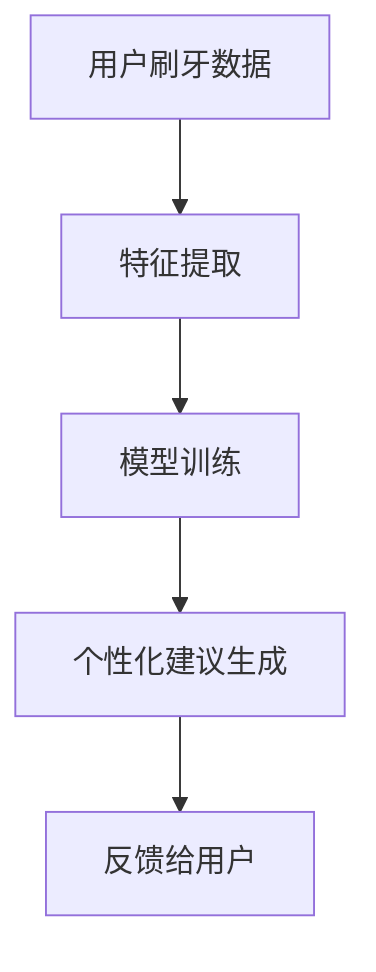

                 


# 智能电动牙刷：AI Agent的个性化刷牙指导

## 关键词：智能牙刷，AI Agent，个性化指导，机器学习，传感器技术

## 摘要：  
随着人工智能技术的快速发展，智能电动牙刷逐渐从单一的清洁工具演变为具备智能感知、数据采集和个性化指导功能的智能设备。本文将深入探讨AI Agent在智能电动牙刷中的应用，从技术原理到系统设计，再到实际实现，全面解析如何通过AI技术实现个性化的刷牙指导。文章将结合传感器技术、机器学习算法和系统架构设计，为读者呈现一个完整的智能电动牙刷AI解决方案。

---

## 第一部分: 背景与概念

### 第1章: 智能电动牙刷的发展历程  
#### 1.1 传统电动牙刷的局限性  
传统电动牙刷虽然具备定时、压力监测等功能，但其功能相对单一，无法根据用户的个性化需求提供定制化的刷牙方案。用户在使用过程中可能因为刷牙时间不足、力度过大或不足、清洁区域不均匀等问题，导致刷牙效果不佳。  

#### 1.2 智能化技术的引入  
随着物联网和人工智能技术的普及，智能电动牙刷开始引入智能化功能，如蓝牙连接、手机APP控制、数据记录等。这些功能使得用户可以更方便地监控自己的刷牙习惯，并通过数据反馈优化刷牙方式。  

#### 1.3 AI Agent在牙刷中的应用  
AI Agent（人工智能代理）是一种能够感知环境、自主决策并执行任务的智能实体。在智能电动牙刷中，AI Agent可以通过传感器数据采集用户的刷牙习惯，结合机器学习算法生成个性化的刷牙建议，并通过反馈机制优化用户的刷牙行为。  

---

### 第2章: AI Agent的核心概念  
#### 2.1 AI Agent的基本定义  
AI Agent是一种能够感知环境、执行任务的智能系统。在智能电动牙刷中，AI Agent通过传感器获取数据，分析用户的刷牙行为，并提供个性化的指导建议。  

#### 2.2 AI Agent的核心功能与属性  
AI Agent在智能电动牙刷中的核心功能包括：  
- 数据采集与处理：通过传感器获取刷牙时间、力度、角度等数据。  
- 用户行为分析：基于历史数据，分析用户的刷牙习惯和偏好。  
- 个性化建议生成：根据分析结果，生成适合用户的刷牙方案。  
- 自适应优化：通过反馈机制不断优化建议，提高刷牙效果。  

#### 2.3 AI Agent与传统牙刷的对比  
| 特性 | 传统牙刷 | 智能牙刷中的AI Agent |  
|------|-----------|------------------------|  
| 数据采集 | 无 | 传感器采集刷牙数据 |  
| 用户反馈 | 无 | 提供实时反馈与建议 |  
| 个性化 | 无 | 根据用户习惯定制方案 |  

---

## 第二部分: 技术原理与算法

### 第3章: AI Agent的传感器与数据采集  
#### 3.1 传感器类型与功能  
智能电动牙刷中的传感器主要包括：  
- 时间传感器：记录刷牙时长。  
- 压力传感器：监测刷牙力度。  
- 位置传感器：检测刷牙角度。  
- 加速度传感器：分析刷牙动作的频率和幅度。  

#### 3.2 数据采集的流程与特点  
数据采集流程包括：  
1. 传感器采集刷牙数据。  
2. 数据预处理（去噪、归一化）。  
3. 数据特征提取（时间、力度、角度等）。  

#### 3.3 数据预处理与特征提取  
- 数据预处理：去除噪声，确保数据的准确性。  
- 特征提取：从原始数据中提取关键特征，如刷牙时间、力度变化率、动作频率等。  

---

### 第4章: AI算法与个性化指导  
#### 4.1 基于机器学习的个性化算法  
机器学习算法是实现个性化刷牙指导的核心技术。常用的算法包括：  
- 决策树：用于分类用户的刷牙习惯。  
- 支持向量机（SVM）：用于预测刷牙效果。  
- 神经网络：用于复杂模式的识别与预测。  

#### 4.2 算法流程图（Mermaid）  


#### 4.3 数学模型与公式  
- 特征提取公式：  
$$ y = f(x) $$  
其中，$x$ 是原始数据，$y$ 是提取的特征。  

- 模型训练公式：  
$$ y = w x + b $$  
其中，$w$ 是权重，$b$ 是偏置，$x$ 是输入特征，$y$ 是输出预测值。  

---

### 第5章: 系统架构与设计  
#### 5.1 系统功能模块划分  
智能电动牙刷系统主要包括以下模块：  
- 数据采集模块：负责采集刷牙数据。  
- 数据处理模块：对数据进行预处理和特征提取。  
- 算法模块：基于机器学习算法生成个性化建议。  
- 用户反馈模块：将建议反馈给用户。  

#### 5.2 系统架构图（Mermaid）  


#### 5.3 接口设计与交互流程  
- 接口设计：通过蓝牙或Wi-Fi与手机APP连接，实现数据传输与用户交互。  
- 交互流程：  
  1. 用户开始刷牙，传感器采集数据。  
  2. 数据传输到手机APP，算法模块生成建议。  
  3. 用户收到反馈，调整刷牙方式。  

---

## 第三部分: 项目实战与实现

### 第6章: 项目环境与工具安装  
#### 6.1 开发环境配置  
- 操作系统：Windows/Mac/Linux  
- 开发工具：PyCharm、VS Code  
- 传感器：集成到智能牙刷中的各类传感器  

#### 6.2 传感器与硬件连接  
- 使用Arduino或Raspberry Pi连接传感器。  
- 通过蓝牙或Wi-Fi模块与手机APP通信。  

#### 6.3 开源AI框架的选择与安装  
- 常用框架：TensorFlow、Keras、Scikit-learn  
- 安装命令：  
  ```bash
  pip install tensorflow scikit-learn
  ```

---

### 第7章: 核心算法实现  
#### 7.1 数据采集与预处理代码  
```python
import numpy as np
data = np.array([...])  # 假设data为传感器采集的数据
def preprocess(data):
    # 数据预处理代码
    return processed_data
```

#### 7.2 个性化算法实现  
```python
def personalized_algorithm(data):
    # 算法实现代码
    return suggestion
```

#### 7.3 算法测试与优化  
- 测试数据：随机抽取1000条刷牙记录。  
- 优化方法：通过交叉验证调整模型参数。  

---

### 第8章: 系统集成与部署  
#### 8.1 系统集成步骤  
1. 集成传感器模块。  
2. 配置AI算法模块。  
3. 测试系统功能。  

#### 8.2 系统性能优化  
- 优化传感器采样频率。  
- 优化算法运行速度，确保实时反馈。  

---

## 第四部分: 总结与展望

### 第9章: 总结与展望  
#### 9.1 总结  
本文详细介绍了智能电动牙刷中AI Agent的应用，从技术原理到系统设计，再到实际实现，全面解析了如何通过AI技术实现个性化的刷牙指导。  

#### 9.2 未来展望  
未来，智能电动牙刷可以进一步结合更多的AI技术，如图像识别、语音交互等，提供更智能、更个性化的刷牙体验。  

---

### 最佳实践 Tips  
- 在开发过程中，建议使用开源框架，降低开发门槛。  
- 数据采集阶段，确保数据的准确性和完整性。  
- 算法优化阶段，注重模型的泛化能力，避免过拟合。  

---

通过本文的详细讲解，读者可以全面了解智能电动牙刷中的AI Agent技术，并能够根据实际需求进行开发和优化。

