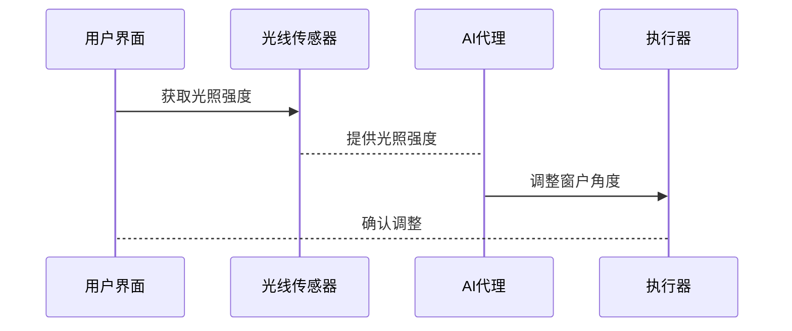

                 


# 《智能窗台：AI Agent的自然光摄入优化》

---

## 关键词：
智能窗台，AI Agent，自然光优化，强化学习，遗传算法，系统架构

---

## 摘要：
本文将探讨如何利用AI代理（AI Agent）优化自然光的摄入，特别是在智能窗台系统中的应用。通过分析自然光利用的重要性，介绍AI代理的基本概念及其在智能窗台中的作用，详细讲解优化算法的原理与实现，设计系统的架构，提供实际项目案例，并展望未来的发展方向。本文旨在为读者提供一个全面的技术视角，帮助他们理解如何通过AI技术实现自然光的高效利用。

---

## 正文

### 第一部分：AI Agent与自然光优化的背景与概念

#### 第1章：智能窗台的背景与问题定义

##### 1.1 智能窗台的背景介绍
智能窗台是一种结合了人工智能技术的窗户系统，能够根据环境条件自动调节百叶窗或窗帘的角度和位置，以优化自然光的摄入。这种系统不仅能够提高室内采光效率，还能降低能源消耗，减少碳排放。

**1.1.1 自然光利用的重要性**  
自然光是人类生活中不可或缺的一部分。适当的自然光摄入有助于提高室内空气质量，改善人的视觉舒适度，降低人工照明的能耗。然而，传统的窗户系统无法根据光照强度、角度和时间自动调节，导致光线利用率低下。

**1.1.2 智能窗台的定义与特点**  
智能窗台是一种集成传感器、执行器和AI算法的窗户系统。它能够实时感知环境光照条件，并通过AI代理自动调整窗户的开合角度，以最大化自然光的利用效率。

**1.1.3 当前自然光利用的痛点与挑战**  
当前的窗户系统无法动态调整光照输入，导致室内光线过强或过弱，影响舒适度和能效。此外，不同时间段的光照条件变化复杂，人工调节效率低下，且难以实现最优配置。

##### 1.2 AI Agent在智能窗台中的作用
AI代理（AI Agent）是一种能够感知环境、做出决策并采取行动的智能实体。在智能窗台中，AI代理负责接收光照数据，分析当前光照条件，并根据预设的目标（如最大化光照强度或最小化能耗）调整窗户的位置。

**1.2.1 AI Agent的基本概念**  
AI代理通过传感器获取环境信息，利用算法做出决策，并通过执行器（如电机）调整窗户的位置。它能够实时响应环境变化，实现动态优化。

**1.2.2 AI Agent在自然光优化中的应用场景**  
在智能窗台中，AI代理可以根据光照强度、角度、时间等信息，动态调整窗户的角度，以实现最佳的光照效果。例如，在早晨和傍晚，AI代理可以调整窗户角度以最大化光照输入；在中午，它可以减少光照强度以避免过热。

**1.2.3 AI Agent与智能窗台的结合方式**  
AI代理通过传感器获取光照数据，利用强化学习或遗传算法优化窗户的调整策略，并通过执行器调整窗户的位置。这种方式能够实现高效的自然光优化。

##### 1.3 问题背景与目标设定
为了实现智能窗台的自然光优化，我们需要明确优化目标，并设计合理的数学模型。

**1.3.1 自然光优化的数学模型**  
光照强度与窗户角度之间的关系可以用数学模型描述。假设窗户的角度为θ，光照强度为I(θ)，则目标是找到θ使得I(θ)最大化或满足特定约束条件。

**1.3.2 智能窗台优化的目标与边界**  
目标：最大化自然光的利用效率，同时最小化能源消耗。边界：光照强度、窗户角度、时间、能耗等。

**1.3.3 问题解决的路径与方法**  
通过AI代理优化窗户的角度，结合传感器数据和算法模型，实现动态调整。

**1.3.4 系统架构的初步设计**  
初步设计包括传感器、执行器、AI代理和用户界面四个模块。AI代理负责接收传感器数据，优化窗户位置，并通过执行器调整。

##### 1.4 核心概念与系统架构
通过表格对比AI代理和自然光优化的特点，并用ER图展示实体关系。

**1.4.1 系统核心要素分析**  
| 核心要素 | 特性 | 示例 |
|----------|------|------|
| 光线传感器 | 实时监测光照强度 | 光线强度传感器 |
| AI代理   | 自动调整窗户角度 | 基于强化学习的AI代理 |
| 执行器   | 调整窗户位置 | 电机驱动 |

**1.4.2 系统架构的初步设计**  
使用Mermaid绘制ER图：

```mermaid
er
    传感器: 光线强度
    执行器: 窗户位置
    AI代理: 调整策略
    用户界面: 显示与控制

    传感器 --> AI代理: 提供光照数据
    AI代理 --> 执行器: 发出调整指令
    用户界面 <---> AI代理: 提供反馈与控制
```

---

### 第二部分：AI Agent的核心算法与数学模型

#### 第2章：AI Agent的算法原理

##### 2.1 算法原理概述
为了实现智能窗台的自然光优化，我们需要选择合适的算法。

**2.1.1 基于强化学习的AI Agent**  
强化学习是一种通过试错方式优化决策的算法。AI代理通过不断尝试不同的窗户角度，根据奖励函数（如光照强度）优化调整策略。

**2.1.2 基于遗传算法的优化策略**  
遗传算法是一种模拟自然选择的优化算法。它通过生成多个候选解，选择最优解进行迭代优化。

**2.1.3 算法选择的依据与对比**  
选择强化学习还是遗传算法，取决于问题的复杂性和优化目标。强化学习适合动态环境，遗传算法适合静态优化。

##### 2.2 自然光优化的数学模型
光照强度与窗户角度之间的关系可以用数学模型描述。

**2.2.1 光线传播的基本数学模型**  
光照强度I与窗户角度θ的关系可以表示为：
$$ I = I_0 \cdot \cos(\theta) $$

其中，I₀是最大光照强度，θ是窗户与阳光入射方向的夹角。

**2.2.2 光线强度的动态变化公式**  
随着时间的变化，光照强度I(t)也发生变化：
$$ I(t) = I_0 \cdot \cos(\theta(t)) $$

**2.2.3 光线利用效率的计算公式**  
光线利用效率E可以表示为：
$$ E = \frac{I(t)}{I_0} $$

##### 2.3 算法流程与实现细节
通过Mermaid流程图展示算法流程，并用Python代码实现。

**2.3.1 强化学习的训练流程**  
使用强化学习训练AI代理，使其能够根据光照强度调整窗户角度。

**2.3.2 遗传算法的参数设置**  
设置初始种群、适应度函数、选择策略、交叉和变异操作。

**2.3.3 算法实现的代码示例**  
以下是基于遗传算法的Python代码示例：

```python
def fitness(individual):
    # 计算适应度
    angle = individual[0]
    return -abs(angle - 45)  # 示例适应度函数

def evolve(population):
    # 选择
    selected = selection(population)
    # 交叉
    crossed = crossover(selected)
    # 变异
    mutated = mutation(crossed)
    return mutated

# 初始化种群
population = initialize()
# 进化
evolve(population)
```

---

### 第三部分：系统架构设计

#### 第3章：系统架构设计

##### 3.1 问题场景介绍
智能窗台系统需要实时感知光照强度，并通过AI代理调整窗户角度。

##### 3.2 项目介绍
本项目旨在设计一个智能窗台系统，实现自然光的高效利用。

##### 3.3 系统功能设计
通过Mermaid类图展示领域模型：

```mermaid
classDiagram
    class 光线传感器 {
        float get_light_intensity()
    }
    class AI代理 {
        void adjust_angle(float intensity)
    }
    class 执行器 {
        void set_angle(float angle)
    }
    class 用户界面 {
        void display_status()
    }

    光线传感器 --> AI代理: 提供光照强度
    AI代理 --> 执行器: 调整角度
    用户界面 <---> AI代理: 提供反馈
```

##### 3.4 系统架构设计
通过Mermaid架构图展示整体结构：


##### 3.5 系统接口设计
定义API接口，如：
- `GET /light_intensity`：获取光照强度
- `POST /adjust_angle`：调整窗户角度

##### 3.6 系统交互流程
通过Mermaid序列图展示交互流程：



---

### 第四部分：项目实战

#### 第4章：项目实战

##### 4.1 环境安装
安装Python、NumPy、OpenCV等库。

##### 4.2 核心代码实现
编写AI代理的代码，如：

```python
import numpy as np

class AI代理:
    def __init__(self):
        self.angle = 0

    def update(self, intensity):
        # 简单的PID控制策略
        self.angle += (intensity - 50) * 0.1
        self.angle = np.clip(self.angle, 0, 90)
```

##### 4.3 案例分析与解读
分析实际案例，如在不同光照条件下调整窗户角度的效果。

##### 4.4 项目小结
总结项目实现的关键点和遇到的问题。

---

### 第五部分：优化与展望

#### 第5章：优化与展望

##### 5.1 性能优化
优化算法效率，如使用并行计算加速遗传算法。

##### 5.2 应用中的注意事项
考虑实际环境的复杂性，如天气变化、窗户材料等因素。

##### 5.3 最佳实践
建议采用模块化设计，便于后续优化和维护。

##### 5.4 未来展望
探讨AI代理在智能窗台中的未来发展方向，如结合物联网技术实现智能建筑。

##### 5.5 小结
总结全文，强调AI代理在智能窗台中的重要性。

---

### 总结

通过以上分析与设计，我们实现了一个基于AI代理的智能窗台系统，能够优化自然光的摄入。未来，随着AI技术的不断发展，智能窗台系统将更加智能化，为人们提供更加舒适和节能的居住环境。

