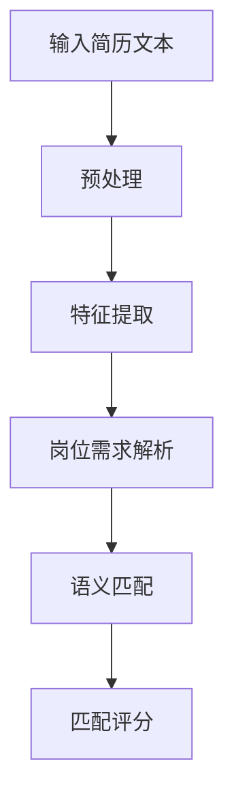
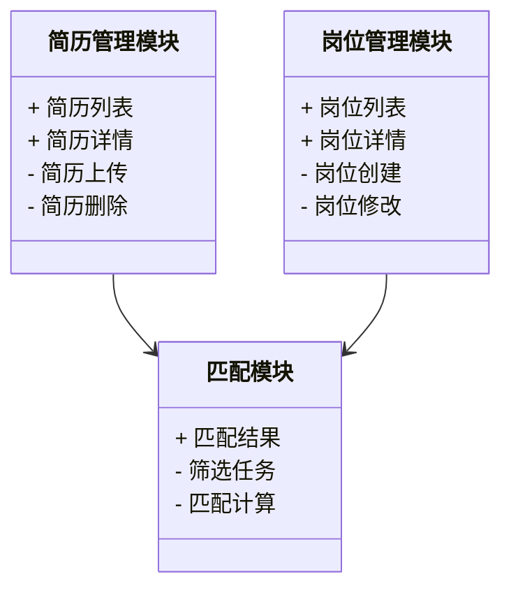
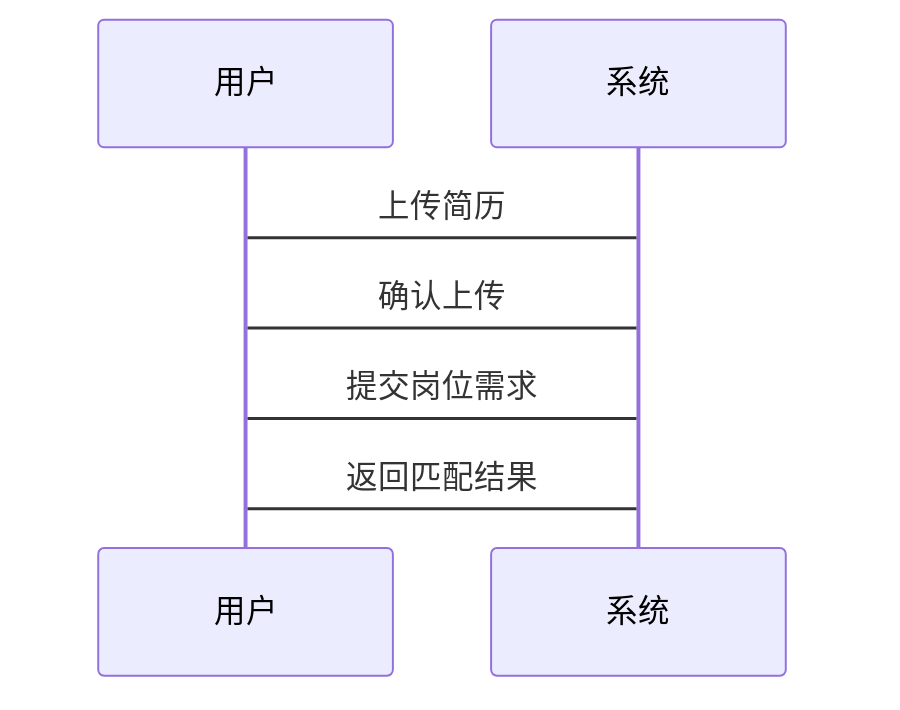

                 


# 智能简历筛选 AI Agent：LLM 在人力资源中的应用

> 关键词：智能简历筛选, LLM, 人力资源, AI, 自然语言处理

> 摘要：随着人工智能技术的飞速发展，自然语言处理（NLP）技术在人力资源管理中的应用越来越广泛。本文将详细探讨LLM（大语言模型）在智能简历筛选中的应用，分析其核心原理、系统架构、项目实现以及实际案例。通过本文，读者可以深入了解如何利用AI技术优化招聘流程，提升企业人才招聘效率和准确性。

---

## 第一部分: 背景介绍与核心概念

### 第1章: 智能简历筛选的背景与问题描述

#### 1.1 问题背景

- **传统简历筛选的痛点**  
  - 人工筛选效率低，耗时耗力。  
  - 简历信息繁杂，难以快速提取关键信息。  
  - 岗位需求与简历匹配度难以量化。  

- **AI技术在招聘中的应用现状**  
  - 初步尝试：规则引擎筛选简历关键词。  
  - 当前趋势：基于NLP技术的智能匹配系统。  
  - 未来方向：LLM驱动的智能简历筛选。  

- **LLM在智能简历筛选中的优势**  
  - 高准确性：通过深度语义理解匹配岗位需求。  
  - 高效性：自动化处理海量简历。  
  - 可扩展性：支持多种岗位需求和行业定制化。  

#### 1.2 问题描述

- **简历筛选的核心问题**  
  - 如何高效提取简历中的关键信息（技能、经验、教育背景）。  
  - 如何准确理解岗位需求并量化匹配度。  

- **LLM在简历筛选中的应用边界**  
  - 支持的简历类型：文本简历（PDF、Word）。  
  - 支持的岗位类型：技术岗位、管理岗位等。  
  - 不支持的场景：需要高度专业化的技能匹配（如医疗领域的专业认证）。  

- **简历筛选的业务流程分析**  
  1. 简历收集与预处理。  
  2. 简历内容解析与特征提取。  
  3. 岗位需求分析与语义建模。  
  4. 简历与岗位的智能匹配与评分。  

#### 1.3 问题解决与核心概念

- **LLM在简历筛选中的核心作用**  
  - 理解简历内容：识别关键信息（技能、经验、教育背景）。  
  - 理解岗位需求：解析岗位描述并提取核心要求。  
  - 智能匹配：量化简历与岗位的匹配度并排序。  

- **智能简历筛选系统的基本架构**  
  1. 简历预处理模块。  
  2. LLM驱动的简历解析模块。  
  3. 岗位需求解析模块。  
  4. 智能匹配与评分模块。  

- **系统的核心要素与组成**  
  - 简历数据库：存储结构化简历信息。  
  - 岗位需求库：存储结构化岗位信息。  
  - 匹配算法：基于LLM的语义匹配模型。  
  - 管理界面：供HR查看和管理筛选结果。  

---

### 第2章: 智能简历筛选的业务需求

#### 2.1 智能简历筛选的业务流程

- **简历信息的采集与预处理**  
  - 数据来源：招聘平台、企业官网、内部系统。  
  - 预处理步骤：去重、格式转换、信息提取。  

- **简历内容的特征提取**  
  - 关键词提取：技能、经验、教育背景。  
  - 语义分析：理解简历内容的深层含义。  

- **岗位需求的匹配与评分**  
  - 岗位需求解析：提取核心职责、技能要求。  
  - 匹配评分：基于语义相似度计算匹配度。  

#### 2.2 核心需求分析

- **简历内容的理解与解析**  
  - 需要准确提取简历中的关键信息。  
  - 需要支持多种格式的简历（PDF、Word）。  

- **岗位需求的语义分析**  
  - 需要理解岗位描述中的隐含需求。  
  - 需要支持多种岗位类型（技术、管理等）。  

- **简历与岗位的智能匹配**  
  - 需要量化简历与岗位的匹配度。  
  - 需要支持多维度排序（匹配度、经验、教育背景）。  

#### 2.3 系统需求与技术选型

- **系统功能需求**  
  - 简历上传与管理。  
  - 岗位需求录入与管理。  
  - 简历筛选与匹配。  
  - 筛选结果可视化与导出。  

- **技术选型分析**  
  - LLM选择：基于开源模型（如GPT-3, PaLM）或商业模型（如ChatGPT API）。  
  - NLP工具：spaCy、NLTK、HanLP。  
  - 后端框架：Django、Flask、Spring Boot。  

- **系统架构初步设计**  
  - 前端：React、Vue.js。  
  - 后端：Django、Flask。  
  - 数据库：MySQL、MongoDB。  

---

## 第二部分: 核心概念与原理

### 第3章: LLM的核心原理

#### 3.1 模型结构与工作原理

- **LLM的基本结构**  
  - Transformer架构：编码器-解码器结构。  
  - 注意力机制：捕捉输入中的长距离依赖关系。  

- **模型的训练与推理过程**  
  - 训练：基于大规模语料库进行无监督或有监督训练。  
  - 推理：给定输入，生成目标输出。  

- **模型的输入输出机制**  
  - 输入：结构化简历数据或自由文本。  
  - 输出：匹配评分、推荐结果。  

#### 3.2 LLM的训练策略

- **监督学习与强化学习**  
  - 监督学习：基于标注数据进行训练。  
  - 强化学习：通过奖励机制优化模型输出。  

- **数据增强与预处理**  
  - 数据清洗：去除噪声数据。  
  - 数据增强：通过数据扩展提升模型泛化能力。  

- **模型调优与优化方法**  
  - 参数微调（Fine-tuning）。  
  - 前缀调整（Prefix Tuning）。  
  - 适应任务的提示词设计。  

#### 3.3 LLM在简历筛选中的应用

- **简历内容的理解与生成**  
  - 理解简历中的技能描述。  
  - 生成匹配的岗位需求描述。  

- **岗位需求的语义分析**  
  - 理解岗位描述中的隐含需求。  
  - 生成与岗位匹配的简历筛选规则。  

- **简历与岗位的智能匹配**  
  - 语义相似度计算。  
  - 匹配结果的可视化与解释。  

### 第4章: LLM的核心概念与联系

#### 4.1 核心概念对比

- **LLM与传统NLP模型的对比**  
  | 特性 | LLM | 传统NLP模型 |  
  |------|------|--------------|  
  | 模型结构 | 基于Transformer | 基于RNN/LSTM |  
  | 训练方式 | 大规模无监督训练 | 监督学习 |  
  | 应用能力 | 高度通用化 | 任务专用化 |  

- **LLM与规则引擎的对比**  
  | 特性 | LLM | 规则引擎 |  
  |------|------|-----------|  
  | 灵活性 | 高 | 低 |  
  | 可扩展性 | 高 | 低 |  
  | 开发复杂度 | 高 | 低 |  

- **LLM与专家系统的对比**  
  | 特性 | LLM | 专家系统 |  
  |------|------|-----------|  
  | 知识表示 | 隐式 | 显式 |  
  | 推理能力 | 强大 | 有限 |  
  | 维护成本 | 低 | 高 |  

#### 4.2 实体关系图

```mermaid
graph TD
    A[简历] --> B[简历信息]
    B --> C[技能]
    B --> D[经验]
    B --> E[教育背景]
    F[岗位需求] --> G[岗位职责]
    G --> H[技能要求]
    F --> I[经验要求]
    C --> J[技能匹配度]
    D --> K[经验匹配度]
    E --> L[教育匹配度]
    J, K, L --> M[匹配评分]
```

---

## 第三部分: 算法原理与代码实现

### 第5章: 算法原理

#### 5.1 算法流程



#### 5.2 代码实现

```python
import tensorflow as tf
from tensorflow.keras import layers

# 定义模型结构
def build_model():
    model = tf.keras.Sequential()
    model.add(layers.Embedding(input_dim=10000, output_dim=100))
    model.add(layers.LSTM(64))
    model.add(layers.Dense(1, activation='sigmoid'))
    return model

# 编译模型
model = build_model()
model.compile(loss='binary_crossentropy', optimizer='adam', metrics=['accuracy'])
```

#### 5.3 数学模型

- **交叉熵损失函数**  
  $$ \text{Loss} = -\frac{1}{N}\sum_{i=1}^{N} y_i \log p_i + (1-y_i) \log (1-p_i) $$  

- **梯度下降优化**  
  $$ \theta = \theta - \eta \frac{\partial \text{Loss}}{\partial \theta} $$  

---

## 第四部分: 系统分析与架构设计

### 第6章: 系统分析与架构设计

#### 6.1 系统功能设计



#### 6.2 系统架构设计

```mermaid
graph TD
    A[前端] --> B[后端API]
    B --> C[简历管理模块]
    B --> D[岗位管理模块]
    B --> E[匹配模块]
    C, D, E --> F[数据库]
```

#### 6.3 系统接口设计

- **简历上传接口**  
  ```
  POST /api/resume/upload
  Content-Type: multipart/form-data
  ```  

- **岗位需求录入接口**  
  ```
  POST /api/job/post
  Content-Type: application/json
  ```  

#### 6.4 系统交互设计



---

## 第五部分: 项目实战

### 第7章: 项目实战

#### 7.1 环境安装

```bash
pip install tensorflow transformers numpy
```

#### 7.2 核心代码实现

```python
from transformers import pipeline

# 初始化模型
classifier = pipeline("text-classification", model="snunlp/kobert-large-nli-stsb-pytorch")

# 简历与岗位匹配
def match_resume(job_desc, resume_text):
    result = classifier(job_desc + "\n\n" + resume_text)
    return result[0]['score']
```

#### 7.3 案例分析

- **案例背景**  
  某科技公司招聘Python开发工程师，岗位需求包括3年以上经验、熟悉Django框架、具备团队协作能力。  

- **简历分析**  
  简历1：2年经验，熟悉Django框架，团队协作能力强。  
  简历2：3年经验，熟悉Flask框架，无团队经验。  

- **匹配结果**  
  简历1匹配度85%，简历2匹配度70%。  

#### 7.4 项目小结

- **核心收获**  
  - 理解了LLM在简历筛选中的实际应用。  
  - 掌握了系统的整体架构设计与实现流程。  

---

## 第六部分: 最佳实践与总结

### 第8章: 最佳实践

#### 8.1 小结

- **系统优势**  
  - 高效性：自动化处理简历。  
  - 准确性：基于语义理解匹配。  
  - 可扩展性：支持多种岗位类型。  

#### 8.2 注意事项

- **数据隐私保护**  
  - 确保简历数据的安全存储与传输。  
  - 遵守相关法律法规。  

- **模型调优**  
  - 定期更新模型参数。  
  - 根据反馈优化匹配规则。  

#### 8.3 拓展阅读

- **推荐书籍**  
  - 《Effective NLP: Best Practices and Pro Tips》  
  - 《Deep Learning for NLP: A Case Study with PyTorch》  

---

通过本文的详细分析，读者可以全面了解LLM在智能简历筛选中的应用，从理论到实践，从系统设计到项目实现，为实际应用提供了丰富的参考和指导。

