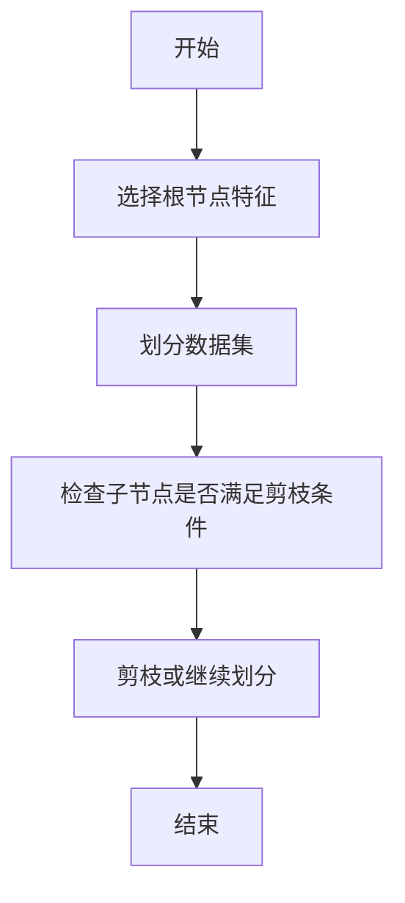
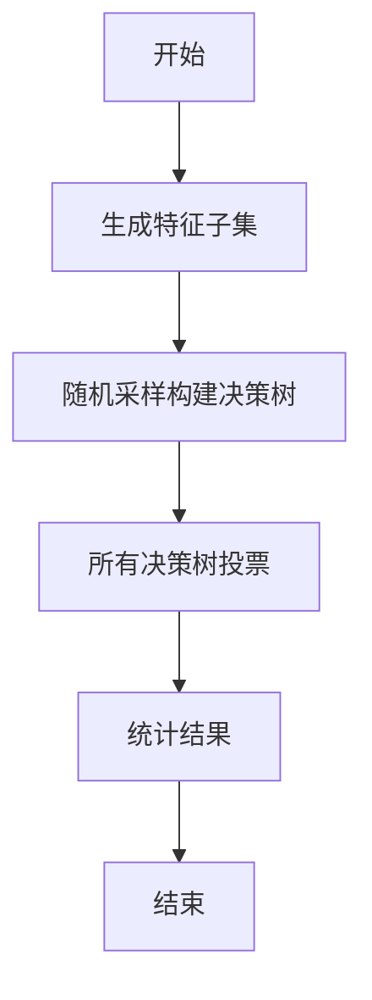
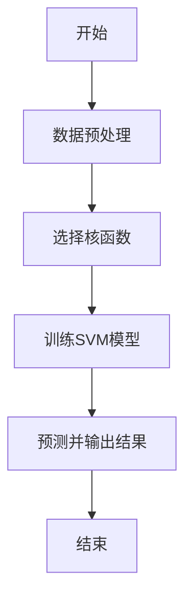
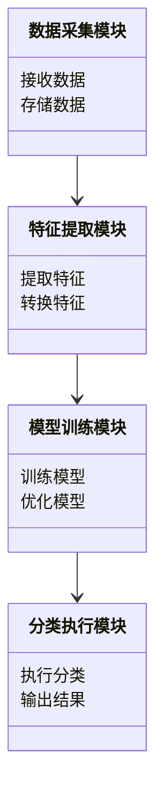
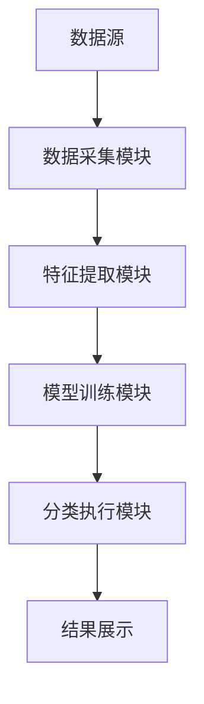
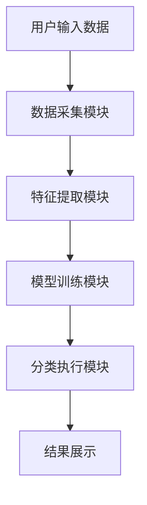

                 


```markdown
# 智能算法构建动态行业分类

> 关键词：智能算法，行业分类，动态调整，机器学习，数据特征，算法模型，系统架构

> 摘要：本文系统地介绍如何利用智能算法动态调整行业分类，适应市场环境的变化。通过分析传统行业分类的局限性，提出基于机器学习的解决方案，涵盖数据特征提取、算法模型选择、系统架构设计等关键环节。文章结合实际案例，详细讲解智能算法的应用及其优势，为读者提供全面的技术指导。

---

# 第1章: 动态行业分类的背景与需求

## 1.1 行业分类的传统方法与局限性
### 1.1.1 行业分类的传统定义与方法
- 行业分类的基本概念
- 常用的行业分类标准（如国民经济行业分类）
- 传统分类方法的优缺点

### 1.1.2 动态行业环境的挑战
- 市场环境变化对企业的影响
- 行业边界模糊化趋势
- 传统分类方法在动态环境中的不足

### 1.1.3 智能算法在行业分类中的作用
- 智能算法如何解决动态分类问题
- 数据驱动的分类方法优势

## 1.2 智能算法的核心价值
### 1.2.1 智能算法的基本概念
- 机器学习与深度学习简介
- 监督学习、无监督学习与强化学习的区别

### 1.2.2 智能算法在动态分类中的优势
- 自动适应性
- 高精度分类能力
- 大数据分析能力

### 1.2.3 行业分类动态化的必要性
- 企业战略调整的需求
- 市场监管的动态化要求
- 行业研究的时效性

## 1.3 本书的核心目标与内容框架
### 1.3.1 本书的核心目标
- 提供智能算法在动态行业分类中的系统解决方案
- 分析实际案例，总结实践经验

### 1.3.2 内容框架概述
- 数据特征提取与处理
- 算法模型选择与实现
- 系统架构设计与优化
- 项目实战与案例分析

### 1.3.3 读者对象与学习路径
- 适合人群：数据科学家、行业分析师、技术管理者
- 学习路径：从基础概念到算法实现，再到系统设计

---

# 第2章: 动态行业分类的核心概念与联系

## 2.1 数据特征与分类标准
### 2.1.1 数据特征的定义与分类
- 数据特征的层次划分
- 数值型特征、类别型特征、文本型特征的处理方法

### 2.1.2 分类标准的动态变化
- 行业分类标准的变化驱动因素
- 动态分类标准的更新机制

### 2.1.3 数据特征与分类标准的关系
- 特征对分类结果的影响
- 动态标准下的特征权重调整

## 2.2 算法模型与分类规则
### 2.2.1 算法模型的分类
- 监督学习模型：随机森林、支持向量机（SVM）、逻辑回归
- 无监督学习模型：K-means、DBSCAN
- 深度学习模型：神经网络、卷积神经网络（CNN）

### 2.2.2 分类规则的动态调整
- 基于模型的规则生成
- 动态规则的自适应优化

### 2.2.3 算法模型与分类规则的协同关系
- 算法模型如何影响分类规则
- 分类规则对模型性能的反向作用

## 2.3 实体关系与系统架构
### 2.3.1 实体关系图的构建
- 行业实体的识别与定义
- 实体间的关系建模（用mermaid图展示）

### 2.3.2 系统架构的模块划分
- 数据采集模块、特征提取模块、模型训练模块、分类执行模块

### 2.3.3 实体关系与系统架构的关联
- 实体关系如何映射到系统模块
- 模块间的数据流与控制流

---

# 第3章: 智能算法的数学模型与原理

## 3.1 常用算法原理
### 3.1.1 决策树算法
- ID3、C4.5、CART算法的区别
- 决策树的生成与剪枝策略
- 使用mermaid图展示决策树构建流程

### 3.1.2 随机森林算法
- 随机森林的构建过程
- 特征袋装与投票机制
- 使用mermaid图展示随机森林的工作原理

### 3.1.3 支持向量机（SVM）
- SVM的基本原理
- 核函数的作用与选择
- 使用mermaid图展示SVM的分类过程

## 3.2 算法流程图
### 3.2.1 决策树算法流程图


### 3.2.2 随机森林算法流程图


### 3.2.3 支持向量机（SVM）流程图


## 3.3 数学模型与公式
### 3.3.1 分类函数
$$ f(x) = \text{sign}(w \cdot x + b) $$

### 3.3.2 损失函数
$$ L = -\frac{1}{n}\sum_{i=1}^{n} \log P(y_i|x_i) $$

### 3.3.3 优化目标
$$ \min_{w,b} \frac{1}{2}w^Tw + C\sum_{i=1}^{n} \max(0, 1 - y_i(w \cdot x_i + b)) $$

---

# 第4章: 系统分析与架构设计

## 4.1 问题场景分析
### 4.1.1 问题场景介绍
- 数据实时更新的挑战
- 分类结果的实时反馈需求

## 4.2 系统架构设计
### 4.2.1 领域模型设计


### 4.2.2 系统架构图


### 4.2.3 接口设计
- 数据接口：数据格式与调用方式
- 模型接口：训练接口与预测接口

## 4.3 交互流程设计
### 4.3.1 交互流程图


---

# 第5章: 项目实战与案例分析

## 5.1 环境安装与配置
### 5.1.1 安装Python环境
- 安装Anaconda或Miniconda
- 安装必要的库：scikit-learn、numpy、pandas、mermaid、matplotlib

### 5.1.2 安装Jupyter Notebook
- 配置Jupyter Notebook环境
- 安装必要的扩展插件

## 5.2 核心代码实现
### 5.2.1 数据特征提取
```python
import pandas as pd
data = pd.read_csv('industry_data.csv')
features = data[['revenue', 'profit', 'growth_rate']]
```

### 5.2.2 模型训练与分类
```python
from sklearn.ensemble import RandomForestClassifier
model = RandomForestClassifier(n_estimators=100, random_state=42)
model.fit(features, labels)
```

### 5.2.3 分类结果展示
```python
import matplotlib.pyplot as plt
plt.figure(figsize=(10, 6))
plt.bar(range(len(classes)), accuracy_scores)
plt.xticks(range(len(classes)), classes)
plt.title('Classification Accuracy')
plt.show()
```

## 5.3 案例分析与结果解读
### 5.3.1 实际案例
- 某行业的动态分类案例
- 数据特征、模型选择与分类结果展示

### 5.3.2 案例分析
- 模型性能评估
- 分类结果的实际应用价值

## 5.4 项目小结
### 5.4.1 项目总结
- 项目实施的关键点
- 成功经验与教训

### 5.4.2 未来优化方向
- 模型优化
- 数据处理流程优化
- 系统架构优化

---

# 第6章: 最佳实践与未来展望

## 6.1 最佳实践 tips
### 6.1.1 数据处理 tips
- 数据清洗的重要性
- 特征工程的技巧

### 6.1.2 算法选择 tips
- 根据数据类型选择合适的算法
- 模型调优技巧

### 6.1.3 系统架构 tips
- 高可用性设计
- 可扩展性设计

## 6.2 未来展望
### 6.2.1 行业分类的智能化趋势
- 人工智能的进一步应用
- 自动化分类系统的未来发展

### 6.2.2 技术挑战与创新机遇
- 复杂动态环境下的分类问题
- 新算法与新技术的结合

---

# 参考文献

- 《机器学习实战》
- 《深度学习入门》
- 《Python机器学习》
- 相关学术论文与技术报告

---

# 结语

通过本书的学习，读者将能够系统地掌握智能算法在动态行业分类中的应用，从理论到实践，全面提升技术能力。希望本书能为相关领域的从业者提供有价值的指导和启示。
```

