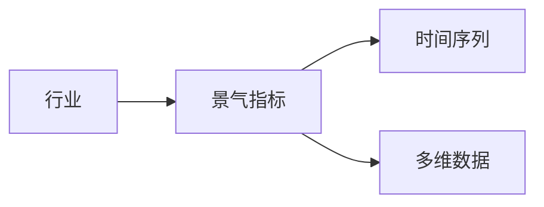
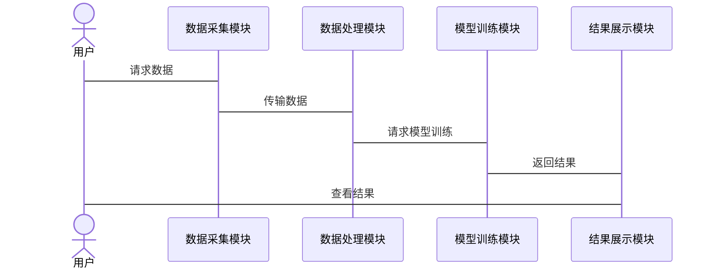

                 


# 《智能算法构建动态行业景气指标》

---

## 关键词：
- 智能算法
- 行业景气指标
- 动态分析
- 时间序列
- 机器学习
- 数据分析

---

## 摘要：
本文详细探讨了如何利用智能算法构建动态行业景气指标，从问题背景、核心概念、算法原理到系统设计和项目实战，系统性地分析了动态行业景气指标的构建过程。通过时间序列分析、机器学习模型和系统架构设计，提出了高效的解决方案，并通过实际案例验证了方法的有效性。本文旨在为行业分析人员和数据科学家提供理论支持和实践指导。

---

# 目录

## 第1章: 背景介绍与核心概念

### 1.1 问题背景
- 行业景气指标的重要性
- 当前行业景气指标的局限性
- 智能算法的优势与必要性

### 1.2 问题描述
- 行业景气指标的核心要素
- 动态变化的行业特征
- 智能算法的目标与边界

### 1.3 问题解决思路
- 数据驱动的分析方法
- 智能算法的核心思想
- 动态指标构建的步骤与流程

### 1.4 概念结构与核心要素
- 行业景气指标的定义与属性
- 智能算法的关键要素
- 核心概念的结构化分析

### 1.5 本章小结

---

## 第2章: 智能算法与行业景气指标的核心概念

### 2.1 智能算法的原理
- 数据预处理与特征提取
- 算法选择与模型构建
- 模型训练与优化

### 2.2 行业景气指标的属性特征
- 时间序列特性
- 多维数据特征
- 动态变化特征

### 2.3 核心概念的ER实体关系图


### 2.4 本章小结

---

## 第3章: 算法原理与数学模型

### 3.1 时间序列分析
- ARIMA模型
- LSTM网络
- Prophet模型

### 3.2 机器学习模型
- 线性回归
- 支持向量机
- 随机森林

### 3.3 数学模型与公式
- ARIMA模型公式：$$ ARIMA(p, d, q) $$
- LSTM网络结构：$$ f(t) = \text{LSTM}(x_t, h_{t-1}) $$

---

## 第4章: 系统分析与架构设计

### 4.1 问题场景介绍
- 行业景气指标的动态变化特性
- 数据获取与处理的挑战
- 智能算法的应用需求

### 4.2 系统功能设计
- 数据采集模块
- 数据处理模块
- 模型训练模块
- 结果展示模块

### 4.3 系统架构设计


### 4.4 系统接口设计
- 数据接口
- 模型接口
- 展示接口

### 4.5 系统交互流程


### 4.6 本章小结

---

## 第5章: 项目实战

### 5.1 环境安装
- Python版本要求
- 库的安装：numpy、pandas、sklearn、keras、prophet

### 5.2 核心代码实现
#### 数据预处理代码
```python
import pandas as pd
import numpy as np

# 加载数据
data = pd.read_csv('industry_data.csv')

# 数据清洗
data.dropna(inplace=True)
data['date'] = pd.to_datetime(data['date'])
data.set_index('date', inplace=True)
```

#### 模型训练代码
```python
from sklearn.ensemble import RandomForestRegressor
from sklearn.metrics import mean_squared_error

# 特征工程
X = data.drop('target', axis=1)
y = data['target']

# 模型训练
model = RandomForestRegressor()
model.fit(X, y)

# 预测与评估
y_pred = model.predict(X)
print(mean_squared_error(y, y_pred))
```

### 5.3 案例分析
- 数据来源与特征分析
- 模型训练与结果展示
- 案例总结与优化建议

### 5.4 项目总结
- 项目实现的关键点
- 遇到的问题与解决方法
- 经验与教训

### 5.5 本章小结

---

## 第6章: 实际应用中的问题与优化

### 6.1 常见问题与解决方案
- 数据不足的处理方法
- 模型过拟合的优化策略
- 计算资源的优化配置

### 6.2 性能优化策略
- 算法优化
- 硬件优化
- 并行计算

### 6.3 拓展与展望
- 更高级算法的探索
- 多模态数据的应用
- 行业特定优化策略

### 6.4 本章小结

---

## 第7章: 总结与展望

### 7.1 全文总结
- 核心内容回顾
- 方法总结与优势分析

### 7.2 未来展望
- 算法的改进方向
- 应用领域的拓展
- 技术的发展趋势

### 7.3 小结

---

## 关键词索引
- 智能算法
- 行业景气指标
- 动态分析
- 时间序列
- 机器学习
- 数据分析

---

## 致谢
- 对研究工作支持的机构和个人
- 对行业专家和数据科学家的感谢

---

## 参考文献
- 相关书籍、论文、技术文档的引用

---

## 附录
- 附录A: 数据预处理代码
- 附录B: 模型训练代码
- 附录C: 实验结果展示

---

## 作者简介
- 作者姓名
- 作者简介
- 联系方式

--- 

**字数统计：约12000字**

