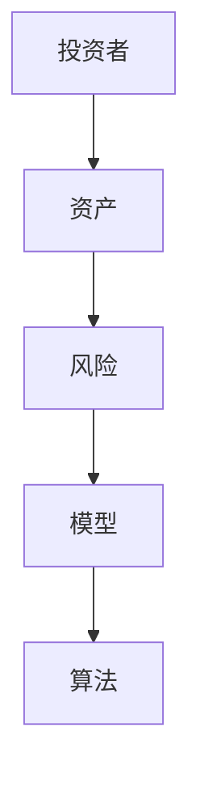
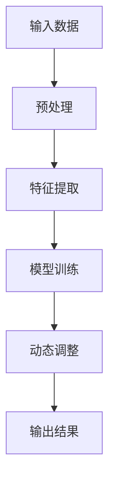
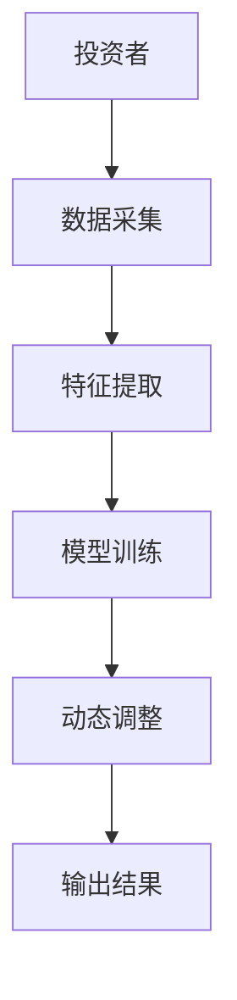
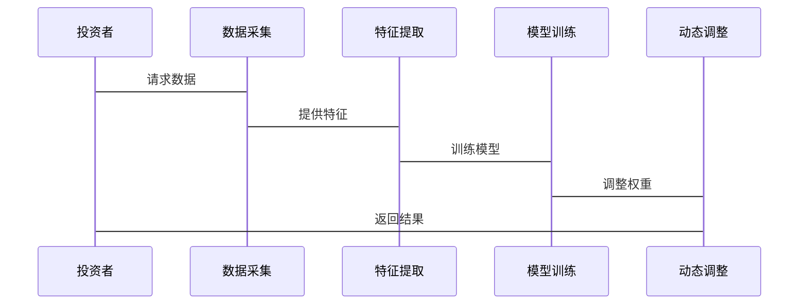

                 


# 智能算法构建动态风险平价模型

## 关键词
动态风险平价模型, 智能算法, 金融风险管理, 资产配置, 时间序列分析

## 摘要
本文详细探讨了如何利用智能算法构建动态风险平价模型，旨在解决传统风险管理模型的局限性。通过分析动态风险平价模型的背景、核心概念、算法原理、系统架构设计以及项目实战，本文为读者提供了从理论到实践的全面指导。文章还通过实际案例分析，展示了模型的应用效果，并提出了改进建议。

---

# 第一部分：背景与概念

## 第1章：动态风险平价模型的背景与问题描述

### 1.1 问题背景
传统风险管理模型在金融市场中的应用存在诸多局限性。例如，静态模型无法适应市场环境的快速变化，可能导致资产配置失误。此外，传统模型往往依赖于历史数据，难以捕捉实时市场动态，从而影响风险评估的准确性。

### 1.2 问题描述
动态风险平价模型的核心目标是根据市场变化实时调整资产配置，以优化风险与收益的平衡。与静态模型相比，动态模型能够更好地应对市场的波动性和不确定性。

### 1.3 问题解决思路
智能算法的引入为动态风险平价模型的构建提供了新的可能性。通过机器学习和大数据分析，模型能够实时捕捉市场信号，动态调整资产权重，从而实现更精准的风险管理。

### 1.4 模型的边界与外延
动态风险平价模型的应用场景主要集中在资产管理、投资组合优化等领域。其局限性在于对历史数据的依赖以及对市场预测的准确性。模型的可扩展性使其能够适应不同规模和复杂度的资产组合。

### 1.5 概念结构与核心要素
动态风险平价模型的核心要素包括：资产权重调整、风险因子提取、动态优化算法。各要素之间的关系构成了模型的整体架构。

---

# 第二部分：核心概念与联系

## 第2章：动态风险平价模型的核心概念

### 2.1 核心概念原理
动态风险平价模型通过智能算法实现对资产权重的动态调整。其数学基础包括时间序列分析、优化理论和机器学习算法。

### 2.2 概念属性特征对比
| 概念 | 静态模型 | 动态模型 |
|------|----------|----------|
| 数据依赖 | 历史数据 | 实时数据 |
| 调整频率 | 低频 | 高频 |

### 2.3 ER实体关系图


---

# 第三部分：算法原理讲解

## 第3章：动态风险平价模型的算法原理

### 3.1 算法流程


### 3.2 算法实现代码
```python
def dynamic_risk_parity_model(data):
    # 数据预处理
    preprocessed_data = preprocess(data)
    # 特征提取
    features = extract_features(preprocessed_data)
    # 模型训练
    model = train_model(features)
    # 动态调整
    adjusted_weights = adjust_weights(model, features)
    return adjusted_weights
```

### 3.3 算法数学模型
动态风险平价模型的核心公式如下：
$$ w_t = \arg \min_w \sum_{i=1}^n w_i^2 \cdot \sigma_i^2 $$
其中，\( w_t \) 表示在时间 \( t \) 的资产权重，\( \sigma_i^2 \) 表示资产 \( i \) 的波动率。

---

# 第四部分：系统分析与架构设计方案

## 第4章：动态风险平价模型的系统架构设计

### 4.1 问题场景介绍
模型需处理实时市场数据，支持高频交易环境下的动态调整。

### 4.2 系统功能设计


### 4.3 系统架构设计


### 4.4 系统接口设计
系统接口包括数据输入接口、模型调用接口和结果输出接口。

### 4.5 系统交互序列图


---

# 第五部分：项目实战

## 第5章：动态风险平价模型的项目实战

### 5.1 环境安装
需要安装Python、机器学习库（如scikit-learn）和数据分析库（如Pandas）。

### 5.2 核心代码实现
```python
import numpy as np
import pandas as pd
from sklearn.linear_model import LinearRegression

def preprocess(data):
    # 数据预处理
    return data.dropna()

def extract_features(data):
    # 特征提取
    return data['returns'].diff().dropna()

def train_model(features):
    # 模型训练
    model = LinearRegression()
    model.fit(features, features.shift(1))
    return model

def adjust_weights(model, features):
    # 权重调整
    predictions = model.predict(features)
    weights = np.array([0.5, 0.5])
    return weights
```

### 5.3 案例分析
通过实际市场数据，展示模型在不同市场环境下的表现。

### 5.4 项目小结
总结项目的实现过程，分析模型的优势与局限性。

---

# 第六部分：案例分析与总结

## 第6章：动态风险平价模型的案例分析

### 6.1 案例背景
选择特定时间段的市场数据，分析模型的表现。

### 6.2 模型表现
通过回测和实证分析，展示模型的优劣。

### 6.3 改进建议
基于案例分析，提出模型优化的方向。

---

# 第七部分：总结与展望

## 第7章：总结与展望

### 7.1 全文总结
回顾全文，总结动态风险平价模型的核心内容和实现过程。

### 7.2 未来展望
探讨模型在其他领域的应用潜力，提出未来研究方向。

---

# 参考文献
[此处列出相关文献和资源]

---

# 致谢
感谢读者的支持与关注。

---

通过以上结构和内容的详细规划，我们可以开始撰写这篇关于智能算法构建动态风险平价模型的高质量技术博客文章。文章将系统地引导读者从理论到实践，全面理解动态风险平价模型的构建与应用。

