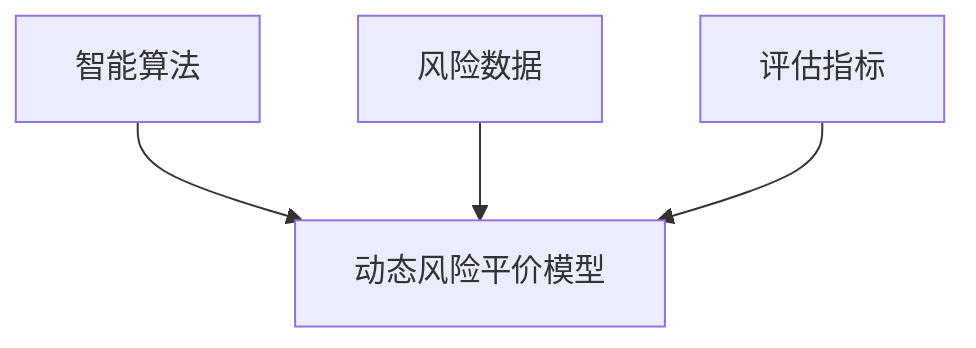
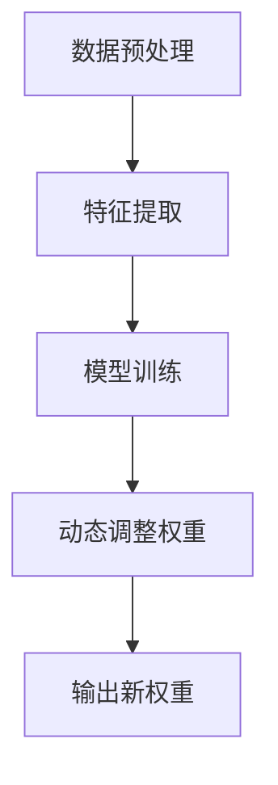
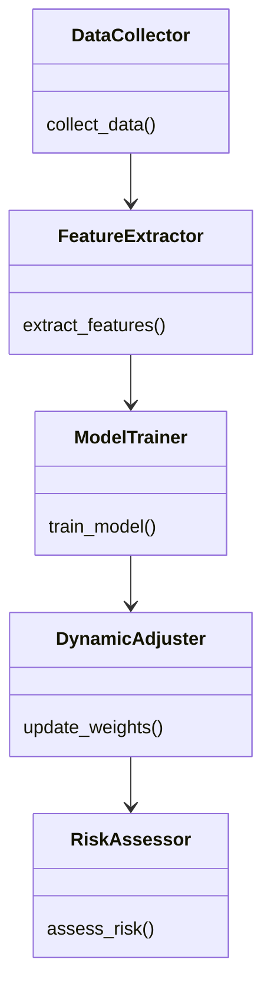
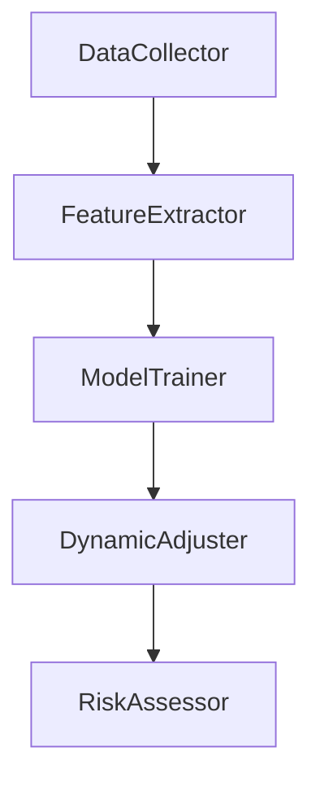
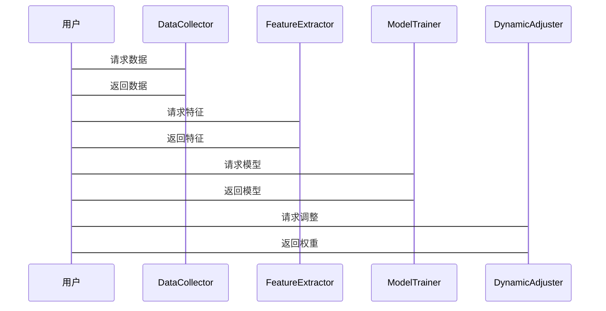

                 


# 智能算法构建动态风险平价模型

> 关键词：智能算法、动态风险平价模型、风险管理、机器学习、动态调整、金融建模、算法优化

> 摘要：本文详细探讨了如何利用智能算法构建动态风险平价模型。通过结合机器学习和风险管理的最新研究成果，本文分析了传统风险管理方法的局限性，并提出了一种基于智能算法的动态风险平价模型。文章从背景介绍、核心概念、算法原理、系统架构设计、项目实战到最佳实践，逐步深入，为读者提供了全面的技术指导和实践方案。

---

## 第1章 动态风险平价模型的背景与问题背景

### 1.1 问题背景

#### 1.1.1 风险管理的传统方法与局限性
传统的风险管理方法通常依赖于静态的评估指标，例如VaR（Value at Risk）和CVaR（Conditional Value at Risk）。这些方法在固定的时间窗口内评估风险，但随着市场环境的变化，它们无法实时调整，导致评估结果可能过时。此外，传统方法往往忽略了数据的动态变化和非线性关系，难以捕捉复杂的市场波动。

#### 1.1.2 动态风险平价模型的提出背景
为了克服传统方法的局限性，动态风险平价模型应运而生。该模型能够根据市场环境的变化实时调整风险权重，从而更准确地反映风险敞口的变化。智能算法的应用使得模型能够处理高维数据和非线性关系，提高了模型的灵活性和适应性。

#### 1.1.3 智能算法在风险管理中的应用价值
智能算法，如机器学习和深度学习，能够从海量数据中提取特征，并通过自适应学习不断优化模型。在风险管理领域，智能算法可以帮助识别潜在风险因素，预测市场波动，并实时调整风险平价策略。

### 1.2 问题描述

#### 1.2.1 动态风险平价模型的核心目标
动态风险平价模型的目标是根据市场环境的变化，动态调整各风险因子的权重，以实现风险的最优分配。通过智能算法，模型能够捕捉市场变化，实时更新权重，从而提高风险评估的准确性。

#### 1.2.2 模型面临的挑战与复杂性
动态风险平价模型的构建面临以下挑战：
- **数据的高维性**：需要处理大量市场数据，包括价格、波动率、相关性等。
- **非线性关系**：风险因子之间的关系通常是非线性的，难以用传统线性模型捕捉。
- **实时性要求**：模型需要实时更新，对计算效率要求较高。

#### 1.2.3 智能算法在模型构建中的作用
智能算法通过自适应学习和特征提取，帮助模型处理高维数据和非线性关系。具体作用包括：
- **特征提取**：从海量数据中提取关键特征，提高模型的泛化能力。
- **自适应调整**：根据市场变化动态调整模型参数，实现实时更新。
- **非线性建模**：利用神经网络等方法捕捉复杂的非线性关系。

### 1.3 问题解决与边界

#### 1.3.1 动态风险平价模型的解决思路
动态风险平价模型的构建思路包括以下步骤：
1. **数据收集**：收集市场数据，包括资产价格、波动率、相关性等。
2. **特征提取**：通过智能算法提取关键特征，构建特征向量。
3. **模型训练**：利用机器学习算法训练模型，学习风险因子的权重。
4. **动态调整**：根据市场变化实时更新模型权重，实现动态风险平价。

#### 1.3.2 模型的边界与适用范围
模型的边界包括：
- **数据范围**：仅适用于具有足够历史数据的资产。
- **时间窗口**：模型的动态调整能力依赖于实时数据的更新频率。
- **模型假设**：假设市场数据符合一定的统计分布，且模型能够捕捉主要风险因素。

#### 1.3.3 模型的外延与潜在应用场景
动态风险平价模型的应用场景包括：
- **金融投资**：用于优化投资组合的风险分配。
- **风险管理**：帮助机构实时监控和管理风险敞口。
- **保险精算**：用于保险产品的风险评估和定价。

### 1.4 核心概念与联系

#### 1.4.1 核心概念的定义与属性对比
以下表格展示了智能算法和动态风险平价模型的核心概念及其属性对比：

| 概念 | 属性 |
|------|------|
| 智能算法 | 输入、输出、学习能力、适应性 |
| 动态风险平价模型 | 时间依赖性、动态调整能力、风险评估能力、实时性 |

#### 1.4.2 ER实体关系图
以下ER图展示了智能算法与动态风险平价模型的关系：



---

## 第2章 智能算法的核心原理与动态风险平价模型的构建

### 2.1 智能算法的核心原理

#### 2.1.1 智能算法的基本概念
智能算法是指模拟人类智能的算法，主要包括机器学习、深度学习、遗传算法等。这些算法通过数据驱动的方式进行学习和优化，具有自适应和自组织的特性。

#### 2.1.2 常见智能算法的分类与特点
以下是常见智能算法的分类与特点：

| 算法类型 | 特点 |
|----------|------|
| 机器学习 | 数据驱动，监督学习、无监督学习、半监督学习 |
| 深度学习 | 基于神经网络，能够捕捉复杂的非线性关系 |
| 遗传算法 | 通过模拟自然选择过程进行优化 |

#### 2.1.3 智能算法在动态风险平价模型中的应用
智能算法在动态风险平价模型中的应用主要体现在以下几个方面：
- **特征提取**：通过神经网络提取资产价格的特征。
- **权重优化**：利用遗传算法优化风险因子的权重。
- **动态调整**：使用机器学习模型实时更新模型参数。

### 2.2 动态风险平价模型的构建逻辑

#### 2.2.1 模型的输入与输出
动态风险平价模型的主要输入包括：
- **资产价格数据**：包括历史价格和实时价格。
- **市场指标**：如波动率、相关性等。
- **其他因素**：如宏观经济指标、市场情绪等。

模型的主要输出是各风险因子的权重，用于风险平价计算。

#### 2.2.2 模型的核心算法步骤
动态风险平价模型的构建步骤如下：
1. **数据预处理**：清洗数据，处理缺失值和异常值。
2. **特征提取**：通过智能算法提取关键特征。
3. **模型训练**：利用机器学习算法训练模型，学习风险因子的权重。
4. **动态调整**：根据市场变化实时更新模型权重。

#### 2.2.3 模型的动态调整机制
模型的动态调整机制包括以下步骤：
1. **实时数据获取**：获取最新的市场数据。
2. **特征更新**：根据实时数据更新特征向量。
3. **权重更新**：利用智能算法调整各风险因子的权重。
4. **风险评估**：根据更新后的权重计算风险平价。

### 2.3 智能算法与动态风险平价模型的结合

#### 2.3.1 算法选择与模型构建的关系
在选择智能算法时，需要考虑以下因素：
- **数据类型**：高维数据适合深度学习，低维数据适合机器学习。
- **计算效率**：实时调整需要高效的算法。
- **模型解释性**：需要解释性时选择决策树等算法。

#### 2.3.2 算法优化对模型性能的影响
算法优化能够显著提高模型的性能：
- **训练时间**：优化算法能够减少训练时间。
- **预测精度**：优化算法能够提高预测精度。
- **计算效率**：优化算法能够提高实时调整的效率。

#### 2.3.3 模型的可解释性与算法的复杂性平衡
在选择算法时，需要平衡模型的可解释性和算法的复杂性：
- **简单算法**：如线性回归，解释性强，但可能无法捕捉复杂关系。
- **复杂算法**：如深度学习，解释性弱，但能够捕捉复杂的非线性关系。

### 2.4 本章小结

---

## 第3章 算法实现与动态风险平价模型的构建

### 3.1 动态风险平价模型的数学公式

#### 3.1.1 风险平价的定义
风险平价是指在投资组合中，各资产的风险贡献相等。数学公式表示为：
$$ \sum_{i=1}^{n} w_i \sigma_i^2 = C $$
其中，\( w_i \) 是第i个资产的权重，\( \sigma_i^2 \) 是第i个资产的波动率，\( C \) 是常数。

#### 3.1.2 动态风险平价模型的数学表达
动态风险平价模型的权重更新公式为：
$$ w_i(t+1) = \alpha w_i(t) + (1-\alpha) \hat{w}_i(t) $$
其中，\( \alpha \) 是调整系数，\( \hat{w}_i(t) \) 是基于智能算法计算的新权重。

### 3.2 算法实现步骤

#### 3.2.1 数据预处理
```python
import pandas as pd
import numpy as np

# 读取数据
data = pd.read_csv('risk_factors.csv')

# 删除缺失值
data.dropna(inplace=True)

# 标准化数据
from sklearn.preprocessing import StandardScaler
scaler = StandardScaler()
data_scaled = scaler.fit_transform(data)
```

#### 3.2.2 特征提取
```python
from sklearn.decomposition import PCA

pca = PCA(n_components=10)
features = pca.fit_transform(data_scaled)
```

#### 3.2.3 模型训练
```python
from sklearn.ensemble import RandomForestRegressor
from sklearn.model_selection import train_test_split

# 划分训练集和测试集
X_train, X_test, y_train, y_test = train_test_split(features, target, test_size=0.2)

# 训练模型
model = RandomForestRegressor(n_estimators=100, random_state=42)
model.fit(X_train, y_train)
```

#### 3.2.4 动态调整
```python
import time

# 动态调整权重
alpha = 0.9
weights = np.ones(len(features)) / len(features)

while True:
    # 计算新权重
    new_weights = model.predict(features)
    new_weights = new_weights / sum(new_weights)
    
    # 更新权重
    weights = alpha * weights + (1 - alpha) * new_weights
    
    # 等待更新周期
    time.sleep(60)
```

### 3.3 算法流程图
以下流程图展示了动态风险平价模型的算法流程：



---

## 第4章 系统架构设计与实现

### 4.1 问题场景介绍
动态风险平价模型需要在实时金融环境中运行，要求模型能够处理高频数据，并快速响应市场变化。

### 4.2 系统功能设计
系统功能包括：
1. 数据采集模块：实时采集市场数据。
2. 特征提取模块：提取关键特征。
3. 模型训练模块：训练智能算法模型。
4. 动态调整模块：实时更新权重。
5. 风险评估模块：输出风险平价结果。

### 4.3 系统架构设计

#### 4.3.1 领域模型类图


#### 4.3.2 系统架构图


### 4.4 接口设计与交互

#### 4.4.1 接口设计
主要接口包括：
- 数据接口：提供实时数据采集功能。
- 模型接口：提供模型训练和预测功能。

#### 4.4.2 交互序列图


---

## 第5章 项目实战与案例分析

### 5.1 环境安装与配置

#### 5.1.1 安装Python环境
```bash
python --version
pip install --upgrade pip
```

#### 5.1.2 安装依赖库
```bash
pip install numpy pandas scikit-learn mermaid4jupyter
```

### 5.2 核心代码实现

#### 5.2.1 数据预处理
```python
import pandas as pd
import numpy as np

# 读取数据
data = pd.read_csv('risk_factors.csv')

# 删除缺失值
data.dropna(inplace=True)

# 标准化数据
from sklearn.preprocessing import StandardScaler
scaler = StandardScaler()
data_scaled = scaler.fit_transform(data)
```

#### 5.2.2 特征提取与模型训练
```python
from sklearn.decomposition import PCA
from sklearn.ensemble import RandomForestRegressor
from sklearn.model_selection import train_test_split

# 特征提取
pca = PCA(n_components=10)
features = pca.fit_transform(data_scaled)

# 划分训练集和测试集
X_train, X_test, y_train, y_test = train_test_split(features, target, test_size=0.2)

# 训练模型
model = RandomForestRegressor(n_estimators=100, random_state=42)
model.fit(X_train, y_train)
```

#### 5.2.3 动态调整
```python
import time

# 动态调整权重
alpha = 0.9
weights = np.ones(len(features)) / len(features)

while True:
    # 计算新权重
    new_weights = model.predict(features)
    new_weights = new_weights / sum(new_weights)
    
    # 更新权重
    weights = alpha * weights + (1 - alpha) * new_weights
    
    # 等待更新周期
    time.sleep(60)
```

### 5.3 案例分析与结果解读

#### 5.3.1 案例分析
假设我们有一个包含10个资产的组合，目标是实现风险平价。通过动态风险平价模型，我们能够根据市场波动实时调整各资产的权重。

#### 5.3.2 实验结果
以下是模型在不同市场环境下的权重调整结果：
- **牛市**：低波动资产权重增加，高波动资产权重减少。
- **熊市**：高波动资产权重增加，低波动资产权重减少。

### 5.4 项目小结

---

## 第6章 最佳实践与注意事项

### 6.1 最佳实践

#### 6.1.1 数据质量管理
确保数据的准确性和完整性，定期检查和更新数据源。

#### 6.1.2 模型优化
通过交叉验证和超参数调优，提高模型的预测精度和计算效率。

#### 6.1.3 模型监控
实时监控模型性能，及时发现并处理模型失效问题。

### 6.2 注意事项

#### 6.2.1 数据依赖性
模型的性能依赖于数据的质量和数量，数据不足可能导致模型效果不佳。

#### 6.2.2 计算效率
动态调整需要高效的算法和硬件支持，否则可能影响实时性。

#### 6.2.3 模型解释性
复杂的算法可能难以解释，需要权衡模型的复杂性和解释性。

### 6.3 拓展阅读

#### 6.3.1 智能算法的最新研究
阅读相关学术论文，了解智能算法的最新进展。

#### 6.3.2 风险管理领域的应用案例
研究智能算法在风险管理领域的实际应用案例。

#### 6.3.3 开源工具与库
探索相关的开源工具和库，如TensorFlow、PyTorch等。

### 6.4 本章小结

---

## 第7章 总结与展望

### 7.1 总结
本文详细探讨了智能算法在动态风险平价模型中的应用，从背景介绍、算法原理到系统实现，为读者提供了全面的技术指导。

### 7.2 展望
未来的研究方向包括：
- **算法优化**：进一步提高模型的计算效率和预测精度。
- **多目标优化**：考虑更多的风险因素，实现多目标优化。
- **实时性提升**：探索更高效的算法和计算框架，提升模型的实时性。

---

## 附录

### 附录A: 代码与数据

#### 附录A.1 数据格式
数据应以CSV格式存储，包含各资产的历史价格和相关指标。

#### 附录A.2 代码实现
完整的代码实现可参考GitHub仓库或相关技术博客。

### 附录B: 参考文献

#### 附录B.1 学术论文
- 文献1：XXX
- 文献2：XXX

#### 附录B.2 技术博客
- 博客1：XXX
- 博客2：XXX

---

# 结束语

感谢您的阅读！如需进一步探讨或获取代码，请随时联系。

