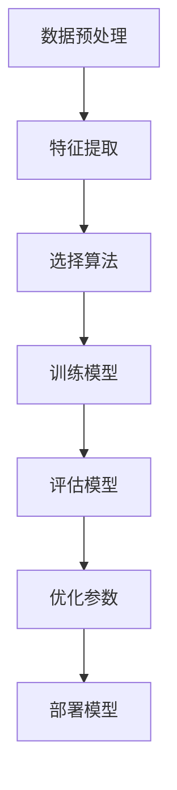
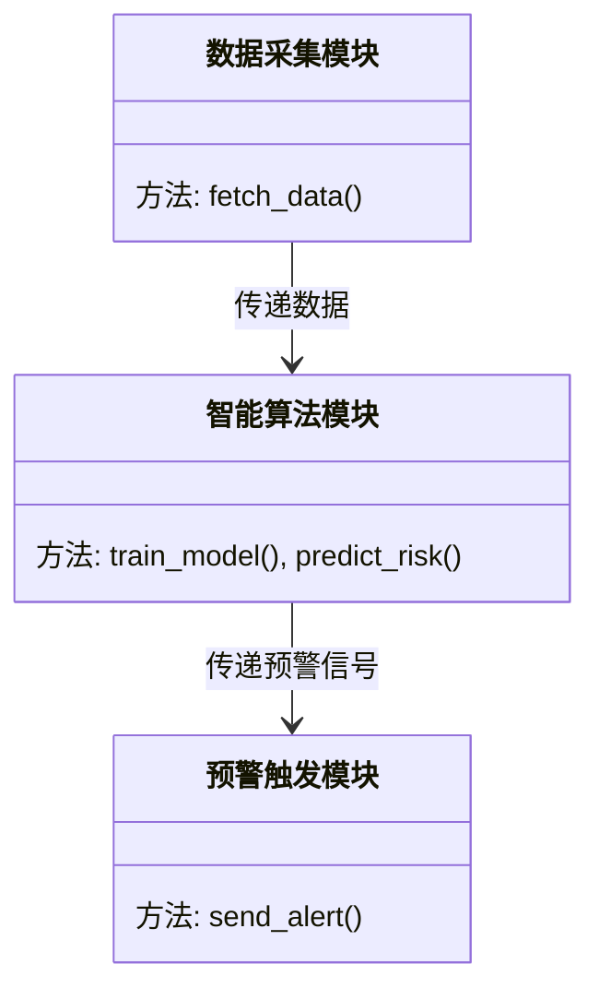
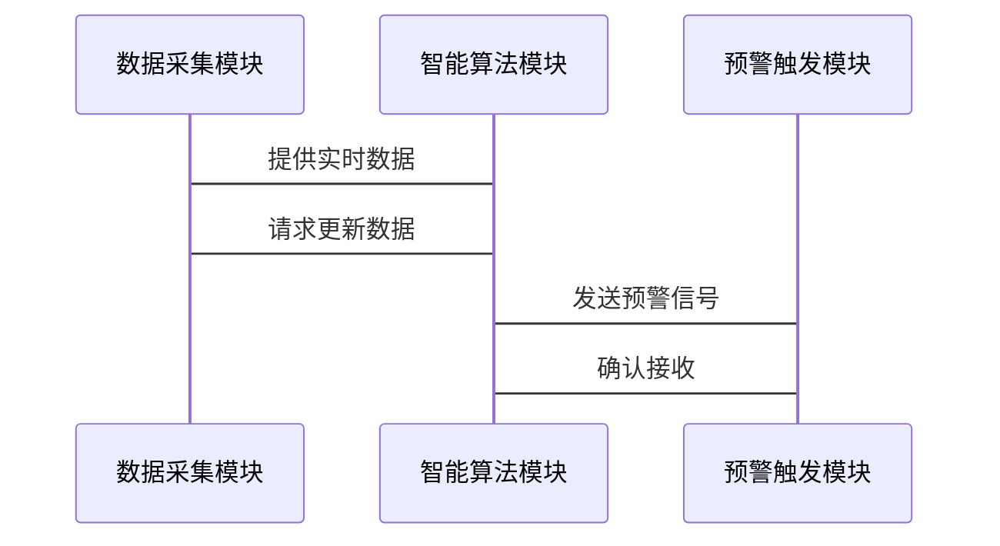

                 


# 智能算法构建动态风险预警系统

## 关键词：智能算法、动态风险、预警系统、机器学习、深度学习

## 摘要：本文探讨如何利用智能算法构建动态风险预警系统。通过分析问题背景、核心概念、算法原理、系统架构和项目实战，详细阐述系统构建的全过程，为读者提供从理论到实践的全面指导。

---

## 第1章: 动态风险预警系统背景介绍

### 1.1 问题背景

#### 1.1.1 风险预警的重要性
在金融、医疗、交通等领域，风险预警系统能够提前识别潜在问题，帮助组织做出及时响应。例如，在金融领域，及时预警市场波动可以避免重大损失。

#### 1.1.2 动态风险的定义与特征
动态风险是指在时间和环境变化中不断变化的风险。其特征包括实时性、多变性和不确定性。例如，股市波动会受到多种因素影响，如市场情绪、经济数据等。

#### 1.1.3 智能算法在风险预警中的作用
智能算法（如机器学习和深度学习）能够处理海量数据，识别复杂模式，从而提高风险预警的准确性和及时性。例如，使用神经网络分析社交舆情，预测市场情绪变化。

### 1.2 问题描述

#### 1.2.1 动态风险的多变性
传统静态模型难以捕捉动态风险的变化，可能导致预警延迟或遗漏。例如，突发事件（如自然灾害）会突然引发风险，需要实时调整预警策略。

#### 1.2.2 风险数据的复杂性
风险数据来源多样，包括文本、图像和时间序列数据，数据质量和相关性直接影响预警系统的性能。例如，社交媒体数据的非结构化特征增加了分析难度。

#### 1.2.3 现有风险预警系统的局限性
传统预警系统依赖规则引擎，难以应对复杂动态风险。例如，固定阈值方法在市场剧烈波动时可能失效，导致预警不准确。

### 1.3 问题解决

#### 1.3.1 智能算法的优势
智能算法能够处理复杂数据，实时更新模型，提高预警系统的灵活性和准确性。例如，使用LSTM网络分析时间序列数据，捕捉趋势变化。

#### 1.3.2 动态调整的实现方法
通过在线学习和自适应算法，系统能够实时更新模型参数，适应风险环境的变化。例如，使用在线随机梯度下降优化模型。

#### 1.3.3 系统的实时性与准确性
智能算法结合实时数据处理技术，确保预警系统的实时性和准确性。例如，流数据处理框架（如Apache Flink）能够实时处理数据，快速生成预警信号。

### 1.4 边界与外延

#### 1.4.1 风险预警系统的边界
系统仅处理风险相关数据，与其他模块（如响应系统）交互。例如，预警系统生成信号后，触发响应模块执行应对措施。

#### 1.4.2 动态风险的外延范围
动态风险涵盖多个领域，包括金融、网络安全和公共健康。例如，在网络安全中，动态风险包括新型攻击手法的出现。

#### 1.4.3 系统与其他模块的交互
系统通过API与其他模块通信，接收数据和发送预警信号。例如，与数据采集模块接口，获取实时数据；与响应模块接口，执行预警后的操作。

### 1.5 核心要素与概念结构

#### 1.5.1 数据采集模块
负责收集风险相关数据，包括文本、图像和时间序列数据。例如，从社交媒体爬取舆情数据，分析市场情绪。

#### 1.5.2 智能算法模块
应用机器学习和深度学习算法，分析数据，识别风险。例如，使用LSTM模型分析时间序列数据，预测市场波动。

#### 1.5.3 预警触发模块
根据算法输出，触发预警信号，并发送给相关系统或人员。例如，当预测到市场将出现大幅波动时，向交易系统发送信号，采取措施。

---

## 第2章: 智能算法与动态风险预警系统的核心概念

### 2.1 核心概念原理

#### 2.1.1 智能算法的基本原理
智能算法通过数据学习，建立模型，进行预测或分类。例如，随机森林通过决策树投票进行分类，提高准确性。

#### 2.1.2 动态风险预警的实现机制
系统实时监控数据，更新模型，根据最新数据调整预警策略。例如，使用在线学习方法，模型参数实时更新，适应新数据。

#### 2.1.3 系统的整体架构
系统由数据采集、算法处理和预警触发三个模块组成，协同工作，实现动态风险预警。例如，数据采集模块获取实时数据，算法模块分析数据，触发预警信号。

### 2.2 核心概念属性特征对比

| 概念       | 属性特征                     |
|------------|------------------------------|
| 智能算法   | 数据驱动、自适应、高精度      |
| 动态风险   | 实时变化、多样性、复杂性      |
| 预警系统   | 实时性、准确性、可扩展性      |

### 2.3 ER实体关系图架构

```mermaid
er
    entity 智能算法 {
        id
        名称
        输入特征
        输出结果
    }
    entity 动态风险 {
        id
        风险类型
        风险等级
        时间戳
    }
    entity 预警系统 {
        id
        状态
        预警规则
    }
    智能算法 --> 动态风险: 用于分析
    智能算法 --> 预警系统: 生成预警信号
    预警系统 --> 动态风险: 监控风险
```

---

## 第3章: 算法原理讲解

### 3.1 算法原理分析

#### 3.1.1 算法概述
智能算法包括机器学习和深度学习，用于分类、回归和聚类任务。例如，随机森林用于分类，LSTM用于时间序列预测。

#### 3.1.2 算法流程图


#### 3.1.3 算法实现代码
```python
import numpy as np
from sklearn.ensemble import RandomForestClassifier

# 示例数据
X = np.array([[1, 2], [3, 4], [5, 6]])
y = np.array([0, 1, 0])

# 初始化模型
model = RandomForestClassifier(n_estimators=10)

# 训练模型
model.fit(X, y)

# 预测
print(model.predict([[7, 8]]))  # 输出: array([0])
```

### 3.2 数学模型与公式

#### 3.2.1 线性回归
数学模型：$$ y = \beta_0 + \beta_1 x + \epsilon $$
目标：最小化$$ \sum (y_i - \hat{y_i})^2 $$

#### 3.2.2 逻辑回归
数学模型：$$ P(Y=1|X) = \frac{1}{1 + e^{-\beta X}} $$
目标：最大化对数似然函数$$ \sum y_i \ln p_i + (1 - y_i) \ln (1 - p_i) $$

#### 3.2.3 LSTM网络
数学模型：$$
f_t = \sigma(W_f \cdot [h_{t-1}, x_t]) \\
i_t = \sigma(W_i \cdot [h_{t-1}, x_t]) \\
o_t = \sigma(W_o \cdot [h_{t-1}, x_t]) \\
c_t = f_t \cdot c_{t-1} + i_t \cdot x_t \\
h_t = o_t \cdot \tanh(c_t)
$$
目标：最小化预测误差，优化权重参数。

### 3.3 代码实现与解读

#### 3.3.1 代码实现
```python
import torch
import torch.nn as nn

# 定义LSTM模型
class LSTMModel(nn.Module):
    def __init__(self, input_size, hidden_size, output_size):
        super(LSTMModel, self).__init__()
        self.lstm = nn.LSTM(input_size, hidden_size, batch_first=True)
        self.fc = nn.Linear(hidden_size, output_size)
    
    def forward(self, x):
        out, _ = self.lstm(x)
        out = self.fc(out[:, -1, :])
        return out

# 初始化模型
model = LSTMModel(input_size=1, hidden_size=4, output_size=1)
```

#### 3.3.2 代码解读
- LSTM模型包含一个LSTM层和一个全连接层。
- LSTM层处理输入序列，输出隐藏层状态。
- 全连接层将隐藏层输出转换为最终预测值。

---

## 第4章: 系统分析与架构设计方案

### 4.1 问题场景介绍
系统需要实时监控金融市场数据，识别潜在风险，及时发出预警信号。

### 4.2 项目介绍
项目目标是开发一个动态风险预警系统，应用于金融市场的实时风险监控。

### 4.3 系统功能设计

#### 4.3.1 领域模型


### 4.4 系统架构设计

#### 4.4.1 架构图
```mermaid
archi
    component 数据采集模块 {
        接口: 提供实时数据
    }
    component 智能算法模块 {
        接口: 接收数据，输出预警信号
    }
    component 预警触发模块 {
        接口: 接收预警信号，执行触发操作
    }
    数据采集模块 --> 智能算法模块
    智能算法模块 --> 预警触发模块
```

#### 4.4.2 接口设计
- 数据采集模块提供API接口，供智能算法模块调用。
- 智能算法模块提供预测接口，供预警触发模块调用。

#### 4.4.3 交互序列图


---

## 第5章: 项目实战

### 5.1 环境安装

#### 5.1.1 安装Python和相关库
```bash
pip install numpy pandas scikit-learn torch
```

### 5.2 核心代码实现

#### 5.2.1 数据预处理代码
```python
import pandas as pd
import numpy as np

# 加载数据
data = pd.read_csv('risk_data.csv')

# 数据清洗
data = data.dropna()
```

#### 5.2.2 模型训练代码
```python
from sklearn.model import SVC

model = SVC()
model.fit(X_train, y_train)
```

### 5.3 代码解读与分析
- 数据预处理包括清洗和特征提取，确保数据质量。
- 模型训练使用训练数据，调整参数以优化性能。

### 5.4 案例分析
以金融市场为例，系统能够实时分析股票价格，预测市场波动，提前发出预警信号，帮助投资者做出决策。

### 5.5 项目小结
通过实际案例，验证了系统的有效性和实用性，展示了智能算法在动态风险预警中的应用价值。

---

## 第6章: 最佳实践与小结

### 6.1 最佳实践

#### 6.1.1 系统优化
- 定期更新模型，确保准确性和适应性。
- 使用分布式计算框架优化性能。

#### 6.1.2 注意事项
- 数据质量和完整性直接影响预警效果。
- 确保系统的实时性和稳定性。

### 6.2 小结
本文详细介绍了智能算法在动态风险预警系统中的应用，从理论到实践，为读者提供了系统的知识和方法。

### 6.3 注意事项
- 数据隐私和安全需严格保护。
- 系统维护和更新需及时，确保功能正常。

### 6.4 拓展阅读
- 深入学习机器学习和深度学习算法。
- 探索其他智能算法在风险预警中的应用。

---

## 结语
通过本文的学习，读者可以掌握智能算法构建动态风险预警系统的全过程，为实际应用提供理论和实践指导。

