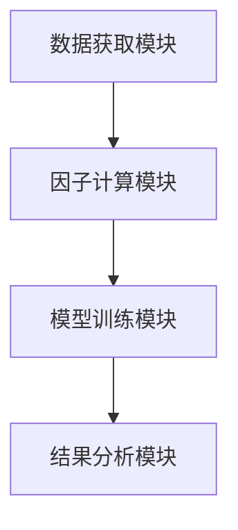
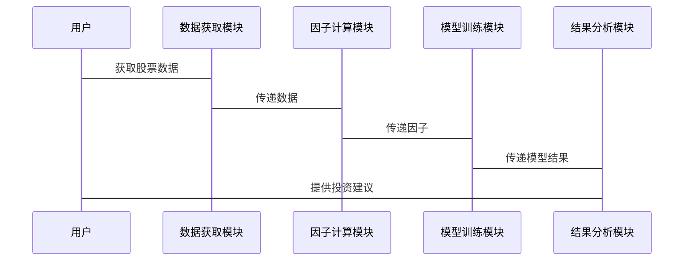

                 

# 智能算法构建多因子选股模型

## 关键词：
智能算法、多因子选股模型、机器学习、深度学习、金融数据分析

## 摘要：
本文将详细探讨如何利用智能算法构建多因子选股模型，从金融数据分析的基本概念到智能算法的核心原理，再到系统的架构设计与项目实战，全面解析多因子选股模型的构建过程。通过本文，读者可以深入了解多因子选股模型的理论基础、算法实现以及实际应用。

---

## 第一部分: 背景与核心概念

### 第1章: 背景与核心概念

#### 1.1 金融数据分析与智能算法
##### 1.1.1 金融数据分析的基本概念
金融数据分析是通过收集和分析金融市场中的各种数据（如股票价格、成交量、财务指标等），以发现潜在的规律和投资机会。传统的金融分析方法依赖于经验和技术分析，但随着大数据和人工智能技术的发展，智能算法逐渐成为金融分析的重要工具。

##### 1.1.2 智能算法在金融领域的应用
智能算法（如机器学习和深度学习）在金融领域的应用非常广泛，包括股票价格预测、风险评估、投资组合优化等。多因子选股模型是一种基于多个因子（如市盈率、市净率、收益增长率等）来筛选优质股票的投资策略，而智能算法可以有效提升因子筛选和模型构建的效率和准确性。

##### 1.1.3 多因子选股模型的背景与意义
多因子选股模型通过综合考虑多个因子来评估股票的投资价值，克服了单一因子选股的局限性。智能算法的应用使得多因子选股模型更加高效和灵活，能够适应市场的动态变化，为投资者提供更精准的投资决策支持。

#### 1.2 多因子选股模型的基本概念
##### 1.2.1 多因子模型的定义与特点
多因子模型是一种基于多个因子对股票进行评分和排序的选股方法。其特点包括：多维度性、数据驱动性、动态适应性等。

##### 1.2.2 多因子模型的核心要素
- **因子选择**：选择与股票收益相关的因子。
- **因子权重**：确定每个因子在模型中的重要性。
- **因子组合**：优化因子组合以提高模型的预测能力。

##### 1.2.3 多因子模型的分类与应用场景
多因子模型可以分为基本面因子模型、技术因子模型和混合因子模型。其应用场景包括股票筛选、投资组合优化、风险控制等。

#### 1.3 智能算法与多因子选股的结合
##### 1.3.1 智能算法在金融选股中的优势
智能算法能够处理海量数据，发现传统方法难以捕捉的模式和关系，从而提高选股的准确性和效率。

##### 1.3.2 多因子模型与机器学习的结合
机器学习算法（如随机森林、支持向量机）可以用于因子筛选、因子权重优化以及模型预测。

##### 1.3.3 深度学习在多因子选股中的潜力
深度学习算法（如神经网络、LSTM）可以通过非线性关系捕捉复杂的市场动态，进一步提升选股模型的性能。

---

## 第二部分: 多因子选股模型的核心概念

### 第2章: 多因子选股模型的核心概念

#### 2.1 因子分析与因子选择
##### 2.1.1 因子分析的基本原理
因子分析是一种统计方法，用于识别数据中的潜在因子（如市场风险、流动性风险等），并量化这些因子对股票收益的影响。

##### 2.1.2 因子选择的标准与方法
- **相关性分析**：选择与股票收益高度相关的因子。
- **信息量准则**：使用信息准则（如AIC、BIC）进行因子选择。
- **特征重要性分析**：基于机器学习模型的特征重要性进行因子筛选。

##### 2.1.3 常见因子类型与属性对比
| 因子类型 | 定义 | 特性 |
|----------|------|------|
| 市盈率（P/E） | 市价与每股收益的比率 | 反映市场对股票盈利能力的预期 |
| 市净率（P/B） | 市价与每股净资产的比率 | 反映市场对股票资产质量的评估 |
| 收益增长率 | 净利润增长率 | 衡量公司的盈利能力提升速度 |

#### 2.2 数据预处理与特征工程
##### 2.2.1 数据清洗与标准化
- 数据清洗：处理缺失值、异常值。
- 数据标准化：将数据归一化，便于模型训练。

##### 2.2.2 因子构造与转换
- 因子构造：基于原始数据构建新的因子（如动量因子、质量因子）。
- 因子转换：对因子进行变换（如对数变换、标准化变换）以提高模型性能。

##### 2.2.3 数据特征选择与降维
- 特征选择：使用LASSO回归或随机森林进行特征重要性排序。
- 降维方法：主成分分析（PCA）用于降低数据维度。

#### 2.3 多因子模型的构建与评估
##### 2.3.1 模型构建的基本流程
1. 数据获取与预处理
2. 因子选择与构造
3. 模型训练与优化
4. 模型评估与验证

##### 2.3.2 模型评估的指标与方法
- 回测收益：模型在历史数据上的表现。
- 最大回撤：模型在极端情况下的风险。
- 信息比率：衡量模型收益与风险的比值。

##### 2.3.3 模型优化与调参
- 参数优化：使用网格搜索或随机搜索优化模型参数。
- 模型组合：结合多个模型的结果进行投票或加权。

---

## 第三部分: 智能算法原理与数学模型

### 第3章: 智能算法原理与数学模型

#### 3.1 机器学习算法基础
##### 3.1.1 线性回归模型
- 线性回归模型用于预测股票收益。
- 模型公式：
  $$ y = \beta_0 + \beta_1x_1 + \beta_2x_2 + ... + \beta_nx_n + \epsilon $$
  其中，$y$ 是目标变量，$x_i$ 是因子，$\beta_i$ 是系数，$\epsilon$ 是误差项。

##### 3.1.2 支持向量机（SVM）
- SVM用于分类和回归问题。
- 核心思想：通过构建超平面将数据点分到不同的类别中。

##### 3.1.3 随机森林与梯度提升树
- 随机森林是一种基于决策树的集成学习方法。
- 梯度提升树通过不断优化模型的损失函数来提升性能。

#### 3.2 深度学习算法基础
##### 3.2.1 神经网络模型
- 神经网络通过多层非线性变换捕捉数据的复杂关系。
- 模型结构：输入层、隐藏层、输出层。

##### 3.2.2 卷积神经网络（CNN）
- CNN用于处理图像数据，但在金融时间序列分析中也有应用。

##### 3.2.3 循环神经网络（RNN）
- RNN用于处理时间序列数据，适合股票价格预测。

#### 3.3 多因子模型的数学公式
##### 3.3.1 线性回归模型公式
$$ y = \beta_0 + \beta_1x_1 + \beta_2x_2 + ... + \beta_nx_n + \epsilon $$

##### 3.3.2 随机森林模型公式
$$ y = \sum_{i=1}^{n} \text{Tree}(x_i) $$

---

## 第四部分: 系统分析与架构设计

### 第4章: 系统分析与架构设计

#### 4.1 问题场景介绍
##### 4.1.1 多因子选股系统的目标
- 实现多因子选股模型的自动化构建与优化。
- 提供股票筛选、投资组合优化等功能。

##### 4.1.2 系统的输入与输出
- 输入：历史股票数据、财务数据、市场数据。
- 输出：股票评分、投资组合建议。

##### 4.1.3 系统的约束条件与边界
- 数据源的限制：数据质量和完整性。
- 计算资源限制：模型训练的时间和计算成本。

#### 4.2 系统功能设计
##### 4.2.1 数据获取模块
- 从数据源获取股票数据。
- 数据清洗与预处理。

##### 4.2.2 因子计算模块
- 计算各个因子的值。
- 进行因子筛选和优化。

##### 4.2.3 模型训练模块
- 基于机器学习或深度学习算法训练模型。
- 模型优化与调参。

##### 4.2.4 结果分析模块
- 对模型的输出结果进行分析。
- 提供股票评分和投资建议。

#### 4.3 系统架构设计
##### 4.3.1 模块化架构图

##### 4.3.2 系统交互图

---

## 第五部分: 项目实战

### 第5章: 项目实战

#### 5.1 环境安装与配置
##### 5.1.1 安装Python环境
- 使用Anaconda安装Python 3.8以上版本。

##### 5.1.2 安装相关库
- `pandas`、`numpy`、`scikit-learn`、`xgboost`、`lightgbm`。

#### 5.2 系统核心实现
##### 5.2.1 因子分析与选择
- 使用`pandas`进行数据清洗。
- 使用`scikit-learn`进行因子筛选。

##### 5.2.2 模型训练与优化
- 使用随机森林和梯度提升树进行模型训练。
- 使用网格搜索优化模型参数。

##### 5.2.3 模型评估与分析
- 使用回测收益、最大回撤等指标评估模型性能。

#### 5.3 实际案例分析
##### 5.3.1 数据来源与处理
- 数据来源：股票历史数据、财务数据。
- 数据处理：清洗、标准化、因子构造。

##### 5.3.2 模型训练与结果展示
- 训练随机森林模型。
- 模型结果展示：股票评分、投资组合建议。

##### 5.3.3 案例分析与小结
- 对比不同模型的性能。
- 总结多因子选股模型的优势与局限性。

---

## 第六部分: 最佳实践

### 第6章: 最佳实践

#### 6.1 小结
- 多因子选股模型通过综合考虑多个因子，提高了选股的准确性和稳定性。
- 智能算法的应用使得模型更加高效和灵活。

#### 6.2 注意事项
- 数据质量对模型性能影响重大，需注意数据清洗和预处理。
- 模型调参和优化需要结合实际情况，避免过拟合。

#### 6.3 拓展阅读
- 《机器学习实战》
- 《Python机器学习》
- 《量化交易中的因子投资》

---

通过本文的详细讲解，读者可以全面了解智能算法在多因子选股模型中的应用，从理论到实践，掌握构建和优化多因子选股模型的关键步骤和技术要点。

