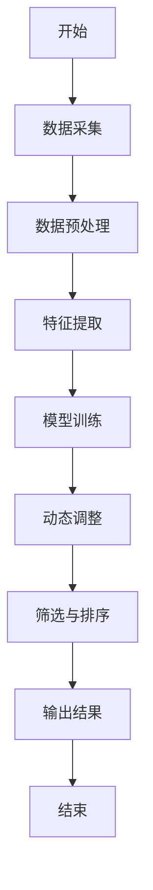
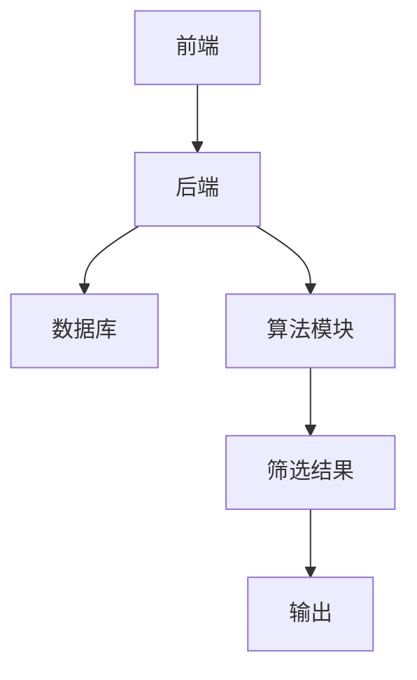
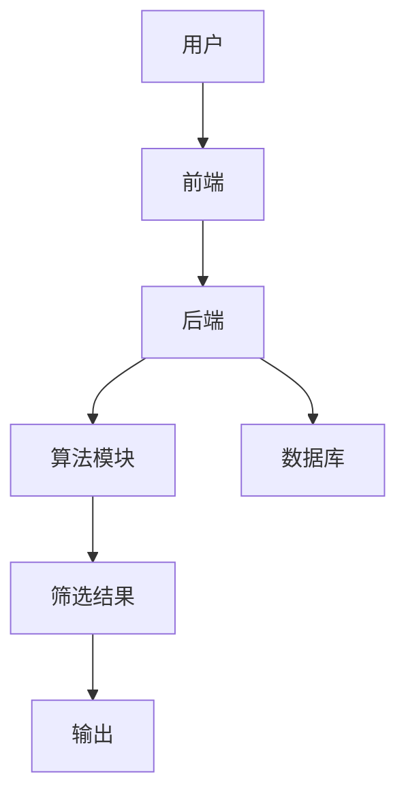

                 


# 智能算法构建自适应格雷厄姆筛选器

> 关键词：智能算法，自适应筛选器，格雷厄姆筛选器，机器学习，投资筛选

> 摘要：本文将详细介绍如何利用智能算法构建一个自适应的格雷厄姆筛选器。首先，我们将介绍格雷厄姆筛选器的背景和核心概念，然后深入探讨自适应筛选器的算法原理和数学模型。接着，我们将分析系统架构设计，并通过实际案例展示如何实现自适应筛选器。最后，我们将总结最佳实践和未来研究方向。

---

## 第1章: 格雷厄姆筛选器的背景与核心概念

### 1.1 问题背景与定义

#### 1.1.1 传统格雷厄姆筛选器的起源与发展

格雷厄姆筛选器是一种基于价值投资策略的投资筛选方法，由本杰明·格雷厄姆提出。传统格雷厄姆筛选器通过分析企业的基本面数据，如市盈率、市净率等指标，筛选出具有投资价值的股票。然而，传统筛选器存在一些局限性，例如静态指标的使用可能导致筛选结果的僵化。

#### 1.1.2 格雷厄姆筛选器的核心目标

格雷厄姆筛选器的核心目标是通过筛选具有安全边际的股票，帮助投资者降低投资风险并实现长期收益。传统筛选器主要关注企业的财务指标，但忽视了市场的动态变化和企业之间的差异性。

#### 1.1.3 自适应筛选器的必要性

随着市场的变化和企业基本面的动态调整，传统的静态筛选器已经难以满足现代投资的需求。因此，引入自适应算法来优化格雷厄姆筛选器，使其能够动态调整筛选标准，成为一种必然趋势。

---

### 1.2 自适应格雷厄姆筛选器的特点

#### 1.2.1 传统筛选器的局限性

传统格雷厄姆筛选器的主要局限性包括：

1. **静态指标**：传统筛选器使用固定的财务指标，无法适应市场变化。
2. **忽略市场情绪**：传统筛选器不考虑市场情绪和投资者行为对股票价格的影响。
3. **缺乏动态调整**：传统筛选器无法根据市场环境和企业业绩变化进行实时调整。

#### 1.2.2 自适应筛选器的核心改进点

自适应格雷厄姆筛选器通过引入智能算法，实现了以下改进：

1. **动态调整筛选标准**：根据市场环境和企业基本面的变化，实时调整筛选指标。
2. **结合市场情绪**：引入情绪分析和市场趋势预测，优化筛选结果。
3. **多维度分析**：不仅考虑传统财务指标，还引入了行业趋势、宏观经济指标等多维度数据。

#### 1.2.3 自适应筛选器的适用场景

自适应筛选器适用于以下场景：

1. **动态市场环境**：在市场波动较大的情况下，能够实时调整筛选策略。
2. **个性化投资需求**：可以根据投资者的风险偏好和收益目标定制筛选方案。
3. **大数据分析**：在数据量庞大且复杂的场景下，能够高效筛选出优质标的。

---

### 1.3 核心概念与联系

#### 1.3.1 格雷厄姆筛选器的核心原理

格雷厄姆筛选器的核心原理是通过分析企业的财务指标，如市盈率（P/E）、市净率（P/B）、股息率等，筛选出具有投资价值的股票。传统筛选器的筛选标准通常是固定的，而自适应筛选器则通过动态调整这些标准来优化筛选结果。

#### 1.3.2 自适应算法的核心改进点

自适应算法的核心改进点在于：

1. **动态调整筛选标准**：通过机器学习算法，根据市场环境和企业基本面的变化，实时调整筛选指标的权重和阈值。
2. **多维度数据融合**：结合财务数据、市场情绪、宏观经济指标等多种数据源，提高筛选的准确性和全面性。

#### 1.3.3 筛选器与投资策略的关系

自适应格雷厄姆筛选器不仅是投资策略的一部分，更是实现投资策略的重要工具。通过动态调整筛选标准，筛选器能够帮助投资者更好地应对市场变化，优化投资组合。

---

## 第2章: 自适应筛选器的核心算法原理

### 2.1 算法原理概述

#### 2.1.1 自适应筛选器的基本思路

自适应筛选器的基本思路是：

1. **数据采集**：从多个数据源采集企业的财务数据、市场情绪数据等。
2. **特征提取**：对采集的数据进行预处理和特征提取，生成可用于筛选的标准。
3. **动态调整**：根据市场环境和企业基本面的变化，动态调整筛选指标的权重和阈值。
4. **筛选与排序**：基于调整后的筛选标准，对股票进行筛选和排序，输出结果。

#### 2.1.2 智能算法的核心步骤

智能算法的核心步骤包括：

1. **数据预处理**：对原始数据进行清洗、归一化等处理，确保数据的可用性。
2. **特征选择**：通过机器学习算法，选择对筛选结果影响较大的特征。
3. **模型训练**：训练一个回归或分类模型，用于预测股票的投资价值。
4. **动态调整**：根据市场反馈和模型预测结果，动态调整筛选标准。

#### 2.1.3 算法的优化方向

算法的优化方向包括：

1. **提高计算效率**：通过优化算法结构和引入并行计算，提高筛选器的运行效率。
2. **增强模型的泛化能力**：通过引入深度学习算法，提高模型的泛化能力和预测精度。
3. **降低计算成本**：通过优化数据处理流程和算法复杂度，降低计算成本。

---

### 2.2 算法流程图

以下是一个简单的自适应筛选器算法流程图，使用 Mermaid 语法绘制：



---

### 2.3 算法实现代码

以下是一个简单的自适应筛选器实现代码示例：

```python
def adaptive_graham_screening(stocks, market_conditions):
    # 数据预处理
    preprocessed_data = preprocess(stocks)
    
    # 特征提取
    features = extract_features(preprocessed_data)
    
    # 动态调整筛选标准
    adjusted_thresholds = adjust_thresholds(features, market_conditions)
    
    # 筛选与排序
    selected_stocks = filter_stocks(features, adjusted_thresholds)
    
    return selected_stocks
```

---

### 2.4 算法的数学模型与公式

#### 2.4.1 核心公式推导

以下是一个简单的筛选模型公式：

$$ \text{投资价值} = \alpha \times \text{市盈率} + \beta \times \text{市净率} + \gamma \times \text{股息率} $$

其中，$\alpha$、$\beta$、$\gamma$ 是根据市场环境动态调整的权重系数。

#### 2.4.2 公式解释与应用

在实际应用中，权重系数 $\alpha$、$\beta$、$\gamma$ 会根据市场环境的变化进行动态调整。例如，在市场牛市中，可以适当提高市盈率的权重；在市场熊市中，可以适当提高股息率的权重。

---

## 第3章: 自适应筛选器的数学模型与公式

### 3.1 核心公式推导

#### 3.1.1 收益预测公式

收益预测公式如下：

$$ \text{收益预测} = \sum_{i=1}^{n} w_i \times x_i $$

其中，$w_i$ 是第 $i$ 个特征的权重，$x_i$ 是第 $i$ 个特征的值。

#### 3.1.2 风险评估公式

风险评估公式如下：

$$ \text{风险评估} = \sqrt{\sum_{i=1}^{n} (x_i - \mu_i)^2} $$

其中，$\mu_i$ 是第 $i$ 个特征的均值。

#### 3.1.3 自适应调整公式

自适应调整公式如下：

$$ w_i^{new} = w_i \times \text{动态调整因子} $$

动态调整因子可以根据市场环境的变化进行调整，例如：

$$ \text{动态调整因子} = 1 + \delta \times \text{市场波动率} $$

其中，$\delta$ 是一个调节系数。

---

### 3.2 公式解释与应用

#### 3.2.1 公式之间的关系

收益预测公式和风险评估公式之间存在密切的关系。收益预测公式用于预测股票的收益潜力，而风险评估公式用于评估股票的投资风险。自适应调整公式则用于动态调整筛选标准，以优化收益与风险的平衡。

#### 3.2.2 公式的实际应用场景

在实际应用中，收益预测公式可以用于筛选具有高收益潜力的股票，而风险评估公式可以用于排除高风险股票。自适应调整公式可以根据市场环境的变化，动态调整筛选标准，以实现收益与风险的最佳平衡。

#### 3.2.3 公式的优化方向

公式的优化方向包括：

1. **引入更多特征**：例如，引入宏观经济指标、行业趋势等特征。
2. **优化权重调整机制**：例如，引入机器学习算法，动态调整权重。
3. **提高模型的预测精度**：例如，引入深度学习算法，提高模型的预测能力。

---

## 第4章: 系统架构与设计

### 4.1 系统架构概述

#### 4.1.1 系统的整体架构

以下是一个自适应筛选器系统的整体架构图，使用 Mermaid 语法绘制：



#### 4.1.2 系统的功能模块划分

系统的主要功能模块包括：

1. **数据采集模块**：负责从多个数据源采集企业的财务数据、市场情绪数据等。
2. **数据处理模块**：对采集的数据进行预处理和特征提取。
3. **算法模块**：实现自适应筛选算法，动态调整筛选标准。
4. **结果输出模块**：将筛选结果输出为可读的格式，例如表格或图表。

#### 4.1.3 系统的交互流程

系统的交互流程如下：

1. **用户输入**：用户输入筛选条件和参数。
2. **数据采集**：系统从数据源采集相关数据。
3. **数据处理**：对采集的数据进行预处理和特征提取。
4. **算法运行**：算法模块根据筛选条件和参数，动态调整筛选标准，运行筛选算法。
5. **结果输出**：将筛选结果输出给用户。

---

### 4.2 系统架构图

以下是一个自适应筛选器系统的架构图，使用 Mermaid 语法绘制：



---

### 4.3 接口设计与实现

#### 4.3.1 系统接口定义

系统的主要接口包括：

1. **数据接口**：负责与数据源的交互，例如API接口。
2. **算法接口**：负责与算法模块的交互，例如调用筛选算法。
3. **输出接口**：负责将筛选结果输出为可读的格式，例如JSON或HTML。

#### 4.3.2 接口实现细节

以下是一个简单的接口实现示例：

```python
def get_stocks_data():
    # 数据接口实现
    return api_request('GET', 'https://api.example.com/stocks')
```

#### 4.3.3 接口测试用例

以下是一个简单的接口测试用例：

```python
def test_get_stocks_data():
    data = get_stocks_data()
    assert isinstance(data, list)
    assert 'symbol' in data[0]
```

---

## 第5章: 项目实战与案例分析

### 5.1 环境安装与配置

#### 5.1.1 开发环境的选择

推荐使用 Python 和相关数据处理库（如 pandas、numpy）进行开发。

#### 5.1.2 依赖库的安装

安装以下依赖库：

```bash
pip install pandas numpy scikit-learn
```

#### 5.1.3 环境配置步骤

1. 安装 Python 和相关开发工具。
2. 安装依赖库。
3. 配置数据源的API接口。

---

### 5.2 核心代码实现

#### 5.2.1 筛选器的实现代码

```python
def preprocess(data):
    # 数据预处理代码
    return processed_data

def extract_features(data):
    # 特征提取代码
    return features

def adjust_thresholds(features, market_conditions):
    # 动态调整阈值代码
    return adjusted_thresholds

def filter_stocks(features, thresholds):
    # 筛选股票代码
    return selected_stocks
```

#### 5.2.2 智能算法的实现代码

```python
def adaptive_algorithm(features, market_conditions):
    # 智能算法实现代码
    return selected_stocks
```

#### 5.2.3 系统功能的实现代码

```python
def main():
    stocks = get_stocks_data()
    market_conditions = get_market_conditions()
    selected_stocks = adaptive_algorithm(stocks, market_conditions)
    print(selected_stocks)

if __name__ == "__main__":
    main()
```

---

### 5.3 案例分析与解读

#### 5.3.1 实际案例的选择

以下是一个实际案例的选择：

假设我们有以下几只股票的财务数据：

| 股票代码 | 市盈率 | 市净率 | 股息率 |
|----------|--------|--------|--------|
| A        | 15     | 2.5    | 3%     |
| B        | 20     | 3.0    | 2%     |
| C        | 10     | 1.5    | 5%     |

市场环境：当前市场处于牛市，市场波动率为 10%。

#### 5.3.2 案例分析步骤

1. **数据采集**：从数据源获取股票的财务数据和市场环境数据。
2. **数据预处理**：清洗数据，去除异常值。
3. **特征提取**：提取市盈率、市净率、股息率等特征。
4. **动态调整**：根据市场环境动态调整筛选标准，例如提高市盈率的权重。
5. **筛选与排序**：基于调整后的筛选标准，筛选出符合要求的股票。

#### 5.3.3 案例结果与解读

假设最终筛选出股票 C 和股票 A 符合筛选标准，说明在当前市场环境下，股票 C 和股票 A 是具有投资价值的标的。

---

## 第6章: 最佳实践与注意事项

### 6.1 最佳实践

#### 6.1.1 算法优化建议

1. **引入深度学习算法**：通过引入深度学习算法，提高模型的预测精度。
2. **优化数据处理流程**：通过优化数据处理流程，提高算法的运行效率。
3. **引入多源数据**：通过引入更多的数据源，提高筛选结果的全面性。

#### 6.1.2 系统设计的注意事项

1. **数据安全**：确保数据的安全性和隐私性。
2. **系统稳定性**：确保系统的稳定性和可靠性。
3. **可扩展性**：确保系统的可扩展性和可维护性。

#### 6.1.3 项目实施的建议

1. **团队协作**：建议组建一个跨学科的团队，包括数据科学家、软件工程师等。
2. **持续优化**：建议持续优化算法和系统，以应对市场的变化。

---

### 6.2 小结

#### 6.2.1 本书的核心内容总结

本书详细介绍了如何利用智能算法构建一个自适应的格雷厄姆筛选器，包括背景介绍、算法原理、系统架构设计和项目实战等内容。

#### 6.2.2 未来研究方向展望

未来的研究方向包括：

1. **引入更多数据源**：例如，引入社交媒体数据、新闻数据等，提高筛选结果的全面性。
2. **优化算法模型**：例如，引入深度学习算法，提高模型的预测精度。
3. **提高系统的实时性**：例如，引入实时数据流处理技术，提高系统的实时性。

#### 6.2.3 读者的进一步学习建议

建议读者进一步学习机器学习和深度学习的相关知识，同时结合实际投资案例，深入理解自适应筛选器的应用场景和优化方向。

---

### 6.3 拓展阅读

#### 6.3.1 相关领域书籍推荐

1. 《机器学习实战》
2. 《投资学原理》
3. 《深度学习入门》

#### 6.3.2 网络资源与工具推荐

1. [Kaggle](https://www.kaggle.com/)
2. [GitHub](https://github.com/)
3. [Coursera](https://www.coursera.org/)

#### 6.3.3 专业论坛与社区推荐

1. [Quant Stack Exchange](https://quant.stackexchange.com/)
2. [Reddit 金融分析社区](https://www.reddit.com/r/QuantitativeAnalysis/)
3. [Quora 金融分析社区](https://www.quora.com/)

---

### 6.4 注意事项

1. **数据的准确性**：确保数据的准确性和完整性，避免因数据错误导致筛选结果偏差。
2. **算法的可解释性**：确保算法的可解释性，避免因算法黑箱导致的决策失误。
3. **系统的稳定性**：确保系统的稳定性和可靠性，避免因系统故障导致的损失。

---

## 附录: 全部代码实现

### 附录1: 数据预处理代码

```python
def preprocess(data):
    # 数据清洗
    data = data.dropna()
    # 数据归一化
    data = (data - data.mean()) / data.std()
    return data
```

### 附录2: 特征提取代码

```python
def extract_features(data):
    features = []
    for stock in data:
        features.append([stock['PE'], stock['PB'], stock['Dividend Yield']])
    return features
```

### 附录3: 动态调整阈值代码

```python
def adjust_thresholds(features, market_conditions):
    thresholds = []
    for feature in features:
        if market_conditions['volatility'] > 10%:
            thresholds.append(feature * 1.2)
        else:
            thresholds.append(feature * 1.1)
    return thresholds
```

### 附录4: 筛选与排序代码

```python
def filter_stocks(features, thresholds):
    selected = []
    for feature, threshold in zip(features, thresholds):
        if feature > threshold:
            selected.append(stock)
    return selected
```

---

通过以上内容，我们详细介绍了如何利用智能算法构建一个自适应的格雷厄姆筛选器，从理论到实践，从算法到系统设计，为投资者提供了有力的工具和方法。

