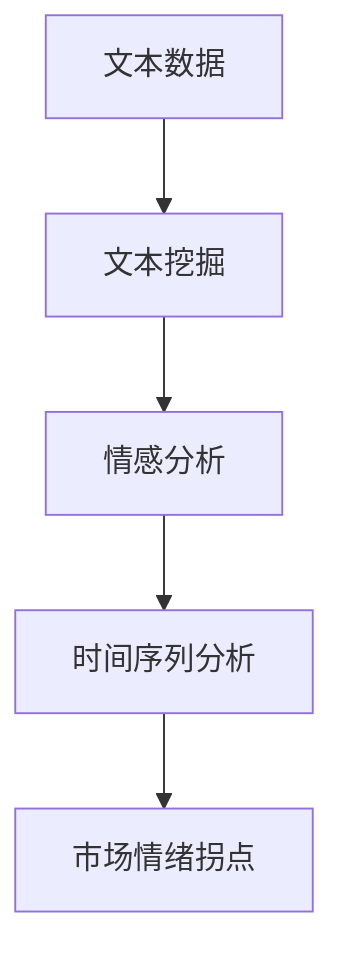
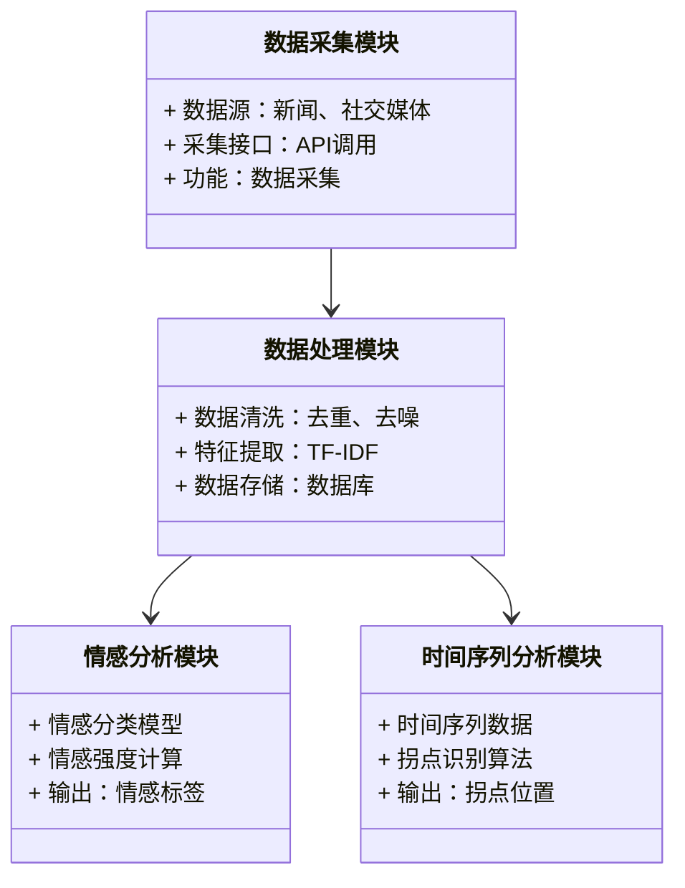
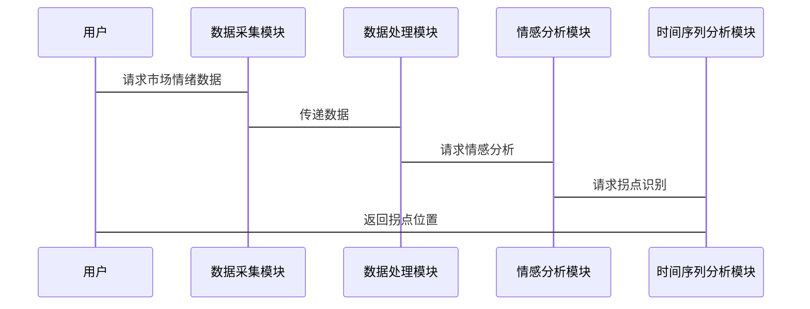

                 


# 智能算法识别市场情绪拐点

---

## 关键词：
智能算法、市场情绪、情绪拐点、时间序列分析、文本挖掘、深度学习

---

## 摘要：
本文系统地探讨了智能算法在识别市场情绪拐点中的应用，从市场情绪分析的背景出发，详细介绍了文本挖掘、情绪分析、时间序列分析等核心概念，深入分析了基于深度学习的算法原理，并通过实际案例展示了如何构建市场情绪分析系统。文章最后总结了项目经验，提出了未来的研究方向。

---

# 第1章: 市场情绪拐点与智能算法概述

## 1.1 市场情绪拐点的定义与重要性

### 1.1.1 市场情绪拐点的定义
市场情绪拐点是指在市场情绪从一个状态（如乐观）转向另一个状态（如悲观）的关键点。拐点的识别对于投资者和市场分析师来说至关重要，因为它可以帮助做出更及时和准确的决策。

### 1.1.2 市场情绪拐点的重要性
市场情绪拐点的识别有助于：
1. 提前预警市场风险。
2. 把握投资机会。
3. 改善投资决策的及时性。

### 1.1.3 智能算法在市场情绪分析中的作用
智能算法通过处理海量数据，能够快速识别市场情绪的变化，为拐点的识别提供技术支持。

---

## 1.2 智能算法的基本概念

### 1.2.1 算法的基本定义
算法是解决问题的一系列步骤，智能算法则是指能够模拟人类智能的算法，如机器学习、深度学习等。

### 1.2.2 智能算法的核心特点
1. 自适应性：能够根据数据变化自动调整。
2. 高效性：能够在较短时间内处理大量数据。
3. 可扩展性：能够处理不同类型和规模的数据。

### 1.2.3 市场情绪分析中的算法选择
根据数据类型和分析目标选择合适的算法，如文本挖掘、情感分析、时间序列分析等。

---

## 1.3 数据来源与市场情绪分析

### 1.3.1 市场情绪数据的来源
1. 新闻媒体：新闻标题和正文。
2. 社交媒体：Twitter、Facebook等平台的用户评论。
3. 股票市场数据：股票价格、成交量等。

### 1.3.2 文本数据的预处理
1. 分词：将文本分割成词语。
2. 去停用词：去除无意义的词汇，如“的”、“了”等。
3. 标准化：统一数据格式，如转小写。

### 1.3.3 数据特征提取与分析
通过TF-IDF等方法提取文本特征，分析关键词的出现频率和分布。

---

## 1.4 市场情绪拐点识别的挑战与机遇

### 1.4.1 市场情绪分析的难点
1. 数据噪声多：社交媒体数据中存在大量无关信息。
2. 情绪表达复杂：情绪可能隐含或间接表达。
3. 数据实时性要求高：需要快速处理和分析。

### 1.4.2 智能算法的优势
1. 高效性：能够快速处理大量数据。
2. 自适应性：能够根据数据变化自动调整模型。

### 1.4.3 市场情绪拐点识别的未来趋势
随着AI技术的进步，市场情绪分析将更加智能化和自动化。

---

## 1.5 本章小结
本章介绍了市场情绪拐点的定义和重要性，分析了智能算法在市场情绪分析中的作用，并讨论了数据来源和分析的挑战与机遇。

---

# 第2章: 文本挖掘与情绪分析

## 2.1 文本挖掘的基本原理

### 2.1.1 文本挖掘的定义与目标
文本挖掘是从文本数据中提取有用信息的过程，目标是通过分析文本数据来发现隐藏的知识和模式。

### 2.1.2 文本挖掘的关键技术
1. 分词：将文本分割成词语。
2. 停用词处理：去除无意义词汇。
3. 词频统计：统计词语出现的频率。

### 2.1.3 文本挖掘在市场情绪分析中的应用
通过分析新闻标题和社交媒体评论，识别市场情绪的变化。

---

## 2.2 情绪分析的核心概念

### 2.2.1 情绪分析的定义与分类
情绪分析是对文本情感倾向进行分析，通常分为正面、负面和中性三类。

### 2.2.2 情绪强度分析
情绪强度分析是对情绪的强弱程度进行量化，例如从0到1表示情绪强度。

### 2.2.3 文本特征提取与分析
通过TF-IDF等方法提取关键词，分析关键词的情感倾向。

---

## 2.3 时间序列分析与市场情绪拐点

### 2.3.1 时间序列分析的基本概念
时间序列分析是对随时间变化的数据进行分析，旨在发现数据中的趋势、周期性和异常值。

### 2.3.2 市场情绪的时间序列特征
1. 趋势：市场情绪的整体变化方向。
2. 周期性：市场情绪的周期性波动。
3. 异常值：市场情绪的突变点。

### 2.3.3 时间序列分析在拐点识别中的应用
通过分析时间序列数据，识别市场情绪的变化趋势和拐点。

---

## 2.4 核心概念对比与ER实体关系图

### 2.4.1 核心概念对比表
| 概念 | 定义 | 属性 | 应用 |
|------|------|------|------|
| 文本挖掘 | 从文本数据中提取信息 | 数据预处理、特征提取、模式识别 | 情感分析、主题建模 |
| 情绪分析 | 分析文本中的情感倾向 | 情感极性、强度、类别 | 市场情绪监测、舆情分析 |
| 时间序列分析 | 分析随时间变化的数据 | 趋势、周期性、异常值 | 预测、拐点识别 |

### 2.4.2 实体关系图（Mermaid）



---

## 2.5 本章小结
本章介绍了文本挖掘和情绪分析的核心概念，分析了时间序列分析在市场情绪拐点识别中的应用，并通过对比表和实体关系图展示了各概念之间的关系。

---

# 第3章: 基于深度学习的市场情绪分析

## 3.1 LSTM网络的基本原理

### 3.1.1 LSTM的结构与工作原理
LSTM是一种特殊的RNN，通过门控机制（遗忘门、输入门、输出门）来处理长序列数据。

### 3.1.2 LSTM的数学模型
LSTM的数学模型包括输入门、遗忘门和输出门的计算公式。

$$
f_{\text{forget}}(t) = \sigma(W_f x_t + U_f h_{t-1} + b_f)
$$

$$
f_{\text{input}}(t) = \sigma(W_i x_t + U_i h_{t-1} + b_i)
$$

$$
g(t) = \tanh(W_g x_t + U_g h_{t-1} + b_g)
$$

$$
h_t = f_{\text{forget}}(t) \cdot h_{t-1} + f_{\text{input}}(t) \cdot g(t)
$$

### 3.1.3 LSTM在市场情绪分析中的应用
通过LSTM网络分析时间序列数据，识别市场情绪的变化趋势。

---

## 3.2 基于情感分析的市场情绪监测

### 3.2.1 情感分析模型的构建
1. 数据预处理：分词、去停用词。
2. 特征提取：使用TF-IDF提取关键词。
3. 模型训练：使用深度学习模型进行情感分类。

### 3.2.2 情感分析模型的实现代码
以下是基于Python的情感分析模型实现代码：

```python
import numpy as np
from tensorflow.keras.models import Sequential
from tensorflow.keras.layers import LSTM, Dense, Dropout, InputLayer

# 模型输入
model = Sequential()
model.add(InputLayer(input_shape=(timesteps, input_dim)))
model.add(LSTM(units=hidden_units, return_sequences=False))
model.add(Dropout(rate=dropout))
model.add(Dense(units=output_dim, activation='sigmoid'))

# 模型编译
model.compile(optimizer='adam', loss='binary_crossentropy', metrics=['accuracy'])
```

### 3.2.3 情感分析模型的数学模型
情感分析模型的数学模型包括输入层、LSTM层、Dropout层和输出层的计算公式。

---

## 3.3 本章小结
本章介绍了LSTM网络的基本原理，分析了其在市场情绪分析中的应用，并通过代码和数学模型详细解释了情感分析模型的实现过程。

---

# 第4章: 系统分析与架构设计

## 4.1 系统总体架构

### 4.1.1 系统模块划分
1. 数据采集模块：采集市场情绪数据。
2. 数据处理模块：对数据进行预处理。
3. 情感分析模块：分析文本情感。
4. 时间序列分析模块：识别市场情绪拐点。

### 4.1.2 系统功能设计（Mermaid类图）



### 4.1.3 系统架构设计（Mermaid架构图）


---

## 4.2 系统接口设计

### 4.2.1 系统接口描述
1. 数据采集接口：用于采集市场情绪数据。
2. 数据处理接口：用于对数据进行预处理。
3. 情感分析接口：用于分析文本情感。
4. 时间序列分析接口：用于识别市场情绪拐点。

### 4.2.2 系统交互流程图（Mermaid序列图）



---

## 4.3 本章小结
本章分析了系统的总体架构，设计了系统模块划分和接口设计，并通过类图和架构图展示了系统的整体结构。

---

# 第5章: 项目实战

## 5.1 项目环境安装

### 5.1.1 安装Python和相关库
```bash
pip install numpy
pip install tensorflow
pip install pandas
pip install matplotlib
```

### 5.1.2 安装自然语言处理库
```bash
pip install nltk
pip install spacy
```

---

## 5.2 系统核心实现

### 5.2.1 数据采集模块实现
```python
import requests
import json

def get_market_sentiment():
    # 示例API接口
    response = requests.get('https://api.example.com/market_sentiment')
    return json.loads(response.text)
```

### 5.2.2 数据处理模块实现
```python
from sklearn.feature_extraction.text import TfidfVectorizer

def preprocess_data(data):
    vectorizer = TfidfVectorizer()
    tfidf = vectorizer.fit_transform(data)
    return tfidf
```

### 5.2.3 情感分析模块实现
```python
from tensorflow.keras.models import load_model

def analyze_sentiment(text):
    model = load_model('sentiment_model.h5')
    prediction = model.predict(text)
    return 'positive' if prediction[0][0] > 0.5 else 'negative'
```

### 5.2.4 时间序列分析模块实现
```python
from statsmodels.tsa.arima_model import ARIMA

def identify拐点(data):
    model = ARIMA(data, order=(5,1,0))
    model_fit = model.fit()
    return model_fit.resid
```

---

## 5.3 实际案例分析

### 5.3.1 案例背景
假设我们有一个股票价格数据集，希望通过分析社交媒体评论来预测股票价格的变化趋势。

### 5.3.2 数据处理与分析
1. 采集社交媒体评论数据。
2. 对数据进行预处理和特征提取。
3. 使用情感分析模型分析评论的情感倾向。
4. 使用时间序列分析识别市场情绪拐点。

### 5.3.3 案例结果
通过分析，我们发现当社交媒体评论中负面情绪占比突然增加时，股票价格可能出现拐点。

---

## 5.4 项目小结
本章通过实际案例展示了市场情绪拐点识别系统的实现过程，包括环境安装、数据采集、数据处理、情感分析和时间序列分析等步骤。

---

# 第6章: 最佳实践与未来展望

## 6.1 项目经验总结

### 6.1.1 成功经验
1. 数据预处理是关键，需仔细清洗数据。
2. 模型选择需结合实际场景，选择合适的算法。

### 6.1.2 项目难点
1. 数据噪声多，影响分析结果。
2. 模型的实时性要求高，需优化算法。

---

## 6.2 未来展望

### 6.2.1 智能算法的改进方向
1. 提高模型的实时性。
2. 增强模型的可解释性。

### 6.2.2 市场情绪分析的未来趋势
1. 结合多模态数据（文本、图像）进行分析。
2. 利用联邦学习等技术保护数据隐私。

---

## 6.3 本章小结
本章总结了项目的实践经验，并展望了智能算法在市场情绪分析中的未来发展方向。

---

# 作者总结

智能算法识别市场情绪拐点是一项复杂但极具挑战性的任务。通过本文的系统分析和实际案例，我们展示了如何利用文本挖掘、情感分析和时间序列分析等技术实现市场情绪拐点的识别。未来，随着AI技术的不断发展，市场情绪分析将更加智能化和自动化，为投资者和市场分析师提供更有力的支持。

