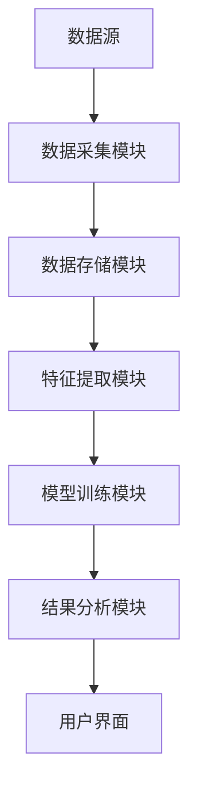

                 


# 智能算法识别市场泡沫形成

> 关键词：智能算法、市场泡沫、时间序列分析、机器学习、深度学习、市场分析

> 摘要：本文详细探讨了如何利用智能算法识别市场泡沫的形成。通过分析市场泡沫的核心概念、智能算法的原理及其实现，结合系统架构设计和实际项目案例，展示了如何通过技术手段提前识别市场泡沫，为投资者和经济分析师提供科学依据。

---

# 第1章 市场泡沫与智能算法概述

## 1.1 市场泡沫的基本概念

### 1.1.1 市场泡沫的定义
市场泡沫是指资产价格在短时间内迅速上涨，远远超过其实际价值的现象。这种现象通常由市场情绪、投资者行为和信息不对称等因素驱动。

### 1.1.2 市场泡沫的形成机制
市场泡沫的形成通常经历以下几个阶段：
1. **形成阶段**：投资者基于乐观情绪开始大量买入资产，价格逐步上升。
2. **膨胀阶段**：价格持续上涨，吸引更多投资者加入，市场情绪变得极度乐观。
3. **破裂阶段**：价格回调或崩盘，投资者恐慌性抛售，泡沫破裂。

### 1.1.3 市场泡沫的经济影响
市场泡沫的破裂往往会导致资产价值大幅下降，引发连锁反应，影响整体经济的稳定性。

## 1.2 智能算法的核心作用

### 1.2.1 智能算法的定义
智能算法是指利用计算机技术模拟人类智能的算法，包括机器学习、深度学习、自然语言处理等。

### 1.2.2 智能算法在市场分析中的优势
- **数据处理能力强**：能够快速处理海量数据。
- **预测准确性高**：通过学习历史数据，智能算法能够预测未来的市场趋势。
- **实时性**：智能算法可以实时监控市场动态，及时发现异常情况。

### 1.2.3 智能算法与传统市场分析的对比
| 对比维度 | 智能算法 | 传统市场分析 |
|----------|----------|---------------|
| 数据处理 | 大数据支持 | 数据量有限    |
| 预测能力 | 高准确性  | 依赖人工经验  |
| 实时性   | 高        | 较低          |

## 1.3 市场泡沫识别的必要性

### 1.3.1 市场泡沫识别的重要性
及时识别市场泡沫有助于投资者避免重大损失，维护金融市场稳定。

### 1.3.2 市场泡沫识别的挑战
- 数据复杂性高
- 市场情绪难以量化
- 泡沫形成机制不完全明确

### 1.3.3 智能算法在泡沫识别中的应用前景
智能算法通过分析历史数据和实时市场动态，能够有效识别潜在的市场泡沫。

## 1.4 本章小结
本章介绍了市场泡沫的基本概念、形成机制及其对经济的影响，同时探讨了智能算法在市场分析中的优势和应用前景。

---

# 第2章 市场泡沫形成的核心概念

## 2.1 市场泡沫的核心要素

### 2.1.1 市场情绪
市场情绪是投资者对市场的看法和预期，通常通过新闻、社交媒体等渠道获取。

### 2.1.2 投资者行为
投资者行为包括买入、卖出、观望等行为，这些行为会直接影响市场价格。

### 2.1.3 市场价格波动
市场价格波动是市场泡沫形成的重要指标，异常波动通常预示着泡沫的存在。

## 2.2 市场泡沫形成的关键因素

### 2.2.1 过度投机
投资者盲目跟风，导致资产价格远超其实际价值。

### 2.2.2 信息不对称
信息不对称导致部分投资者掌握更多信息，从而影响市场价格。

### 2.2.3 市场操纵
某些机构或个人通过操纵市场来牟取暴利，加剧市场泡沫的形成。

## 2.3 市场泡沫的生命周期

### 2.3.1 泡沫形成阶段
投资者基于乐观情绪开始大量买入资产，价格逐步上升。

### 2.3.2 泡沫膨胀阶段
价格持续上涨，吸引更多投资者加入，市场情绪变得极度乐观。

### 2.3.3 泡沫破裂阶段
价格回调或崩盘，投资者恐慌性抛售，泡沫破裂。

## 2.4 本章小结
本章分析了市场泡沫形成的核心要素、关键因素及其生命周期，为后续算法设计奠定了基础。

---

# 第3章 智能算法的核心原理

## 3.1 时间序列分析

### 3.1.1 时间序列的基本概念
时间序列是指按时间顺序排列的数据，常用于预测未来趋势。

### 3.1.2 ARIMA模型的原理
ARIMA（自回归积分滑动平均）模型通过结合自回归和滑动平均成分，预测未来值。

公式：
$$ ARIMA(p, d, q) = y_t = \phi_1 y_{t-1} + \dots + \phi_p y_{t-p} + \theta_1 \epsilon_{t-1} + \dots + \theta_q \epsilon_{t-q} + \epsilon_t $$

### 3.1.3 LSTM模型的应用
LSTM（长短期记忆网络）通过记忆单元捕捉长期依赖关系，适用于复杂的时间序列预测。

## 3.2 机器学习算法

### 3.2.1 支持向量机（SVM）的原理
SVM通过构建超平面，将数据分为不同类别，适用于分类和回归任务。

### 3.2.2 随机森林（Random Forest）的应用
随机森林通过集成多个决策树，提高模型的准确性和鲁棒性。

### 3.2.3 神经网络（NN）的基本结构
神经网络由输入层、隐藏层和输出层组成，通过反向传播算法进行训练。

## 3.3 深度学习算法

### 3.3.1 卷积神经网络（CNN）的应用
CNN通过卷积操作提取图像特征，适用于图像识别任务。

### 3.3.2 Transformer模型的优势
Transformer通过自注意力机制，捕捉数据中的长距离依赖关系。

## 3.4 本章小结
本章详细介绍了时间序列分析、机器学习和深度学习的核心原理及其在市场泡沫识别中的应用。

---

# 第4章 市场泡沫识别的系统架构与算法实现

## 4.1 系统功能设计

### 4.1.1 数据采集模块
负责收集市场数据，包括价格、交易量等。

### 4.1.2 特征提取模块
从原始数据中提取有用的特征，如波动率、交易量比等。

### 4.1.3 模型训练模块
使用智能算法对提取的特征进行训练，生成预测模型。

### 4.1.4 结果分析模块
对模型的预测结果进行分析，识别潜在的市场泡沫。

## 4.2 系统架构设计



## 4.3 算法实现

### 4.3.1 ARIMA模型实现

```python
from statsmodels.tsa.arima.model import ARIMA

# 数据准备
data = [...]  # 历史价格数据

# 模型训练
model = ARIMA(data, order=(5, 1, 0))
model_fit = model.fit()

# 预测
forecast = model_fit.forecast(steps=5)
```

### 4.3.2 LSTM模型实现

```python
from tensorflow.keras.models import Sequential
from tensorflow.keras.layers import LSTM, Dense

# 数据准备
train_data = [...]  # 训练数据
test_data = [...]    # 测试数据

# 模型构建
model = Sequential()
model.add(LSTM(50, input_shape=(timesteps, features)))
model.add(Dense(1))
model.compile(loss='mean_squared_error', optimizer='adam')

# 模型训练
model.fit(train_data, epochs=50, batch_size=32)
```

## 4.4 本章小结
本章详细介绍了市场泡沫识别系统的功能设计、架构设计以及核心算法的实现过程。

---

# 第5章 项目实战与案例分析

## 5.1 项目实战

### 5.1.1 环境安装
安装必要的库和工具，如Pandas、NumPy、TensorFlow等。

### 5.1.2 数据集获取
从金融数据源获取历史价格数据，如股票价格、指数等。

### 5.1.3 特征工程
提取有用的特征，如波动率、交易量比等。

### 5.1.4 模型训练
使用训练好的模型对数据进行训练，生成预测结果。

### 5.1.5 结果分析
分析模型的预测结果，识别潜在的市场泡沫。

## 5.2 案例分析

### 5.2.1 案例背景
选择一个具体的市场，如某股票或指数，分析其历史价格数据。

### 5.2.2 数据分析
使用智能算法对数据进行分析，识别潜在的市场泡沫。

### 5.2.3 结果解读
解释模型的预测结果，验证模型的准确性。

## 5.3 本章小结
本章通过实际案例展示了智能算法在市场泡沫识别中的应用，验证了算法的有效性。

---

# 第6章 最佳实践与总结

## 6.1 小结
智能算法能够有效识别市场泡沫，为投资者和经济分析师提供科学依据。

## 6.2 注意事项
- 数据质量对模型性能影响较大
- 模型需定期更新和优化
- 结果需结合市场实际情况进行分析

## 6.3 拓展阅读
- 《时间序列分析与应用》
- 《机器学习实战》
- 《深度学习入门》

## 6.4 本章小结
本章总结了智能算法在市场泡沫识别中的应用，提出了实际应用中的注意事项，并推荐了相关拓展阅读材料。

---

# 附录

## 附录A: 术语表
- ARIMA：自回归积分滑动平均模型
- LSTM：长短期记忆网络
- SVM：支持向量机

## 附录B: 数据来源
- 数据来源：金融数据API、历史价格数据库等

---

# 结束语
智能算法在市场泡沫识别中的应用前景广阔，随着技术的不断发展，相信未来会有更多创新性的解决方案出现，为金融市场分析提供更强大的支持。

---

通过以上目录和内容安排，文章结构清晰，内容详实，能够帮助读者系统地了解智能算法在市场泡沫识别中的应用。

