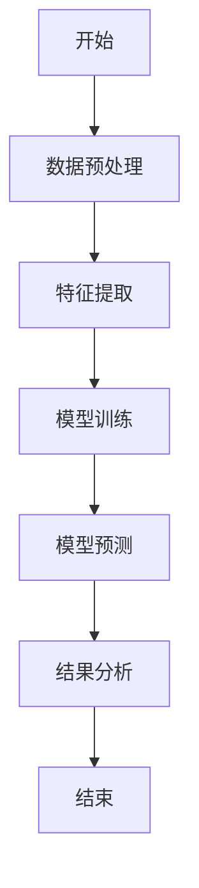
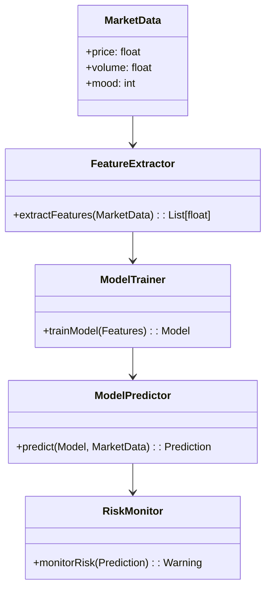
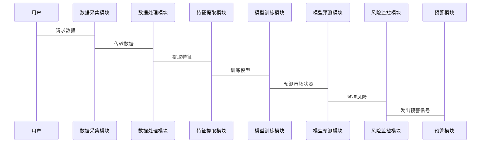

                 


# 智能算法识别市场泡沫形成过程

> 关键词：智能算法，市场泡沫，金融数据分析，机器学习，算法交易

> 摘要：本文详细探讨了如何利用智能算法识别市场泡沫的形成过程。从市场泡沫的基本概念到智能算法的核心原理，再到实际的系统设计和项目实战，本文全面分析了智能算法在金融市场中的应用。通过数据特征分析、模型选择、算法流程设计以及系统架构优化，本文为读者提供了从理论到实践的完整指南，帮助读者深入了解如何利用智能算法识别和预测市场泡沫。

---

## 第1章: 市场泡沫与智能算法概述

### 1.1 市场泡沫的基本概念

#### 1.1.1 市场泡沫的定义
市场泡沫是指金融市场中资产价格在短期内快速上涨，远远脱离其实际价值的现象。这种现象通常由市场参与者过度乐观、投机行为和信息不对称等因素引发。

#### 1.1.2 市场泡沫的形成机制
市场泡沫的形成是一个复杂的过程，涉及投资者情绪、市场结构和外部环境等多个因素。其形成机制主要包括以下几点：
- **投资者情绪**：过度乐观或恐慌导致市场参与者做出非理性决策。
- **信息不对称**：部分市场参与者掌握更多信息，从而在市场中获得优势。
- **杠杆效应**：高杠杆率的使用会加剧市场的波动性，加速泡沫的形成和破裂。

#### 1.1.3 智能算法在市场分析中的作用
智能算法通过分析海量数据，识别市场中的异常波动和潜在风险，帮助投资者更好地理解和预测市场行为。智能算法的应用可以帮助识别市场泡沫的早期信号，从而为投资者提供及时的预警。

### 1.2 智能算法的基本原理

#### 1.2.1 数据驱动的市场分析
智能算法依赖于大量的市场数据，包括价格、成交量、市场情绪等，通过这些数据来分析市场的波动性和潜在风险。

#### 1.2.2 机器学习在金融预测中的应用
机器学习算法（如支持向量机、随机森林、神经网络等）在金融预测中得到了广泛应用。这些算法能够从历史数据中学习规律，并预测未来的市场走势。

#### 1.2.3 智能算法的核心优势
智能算法的核心优势在于其能够快速处理海量数据，并通过复杂的模型发现数据中的隐藏规律。此外，智能算法还具有高度的可扩展性和适应性，能够根据市场变化实时调整模型。

### 1.3 问题背景与解决思路

#### 1.3.1 市场泡沫识别的难点
市场泡沫的识别是一个复杂的问题，主要难点包括数据噪声多、市场波动剧烈以及模型的实时性要求高等。

#### 1.3.2 智能算法的应用场景
智能算法在市场泡沫识别中的应用场景包括实时监控、风险预警和投资决策支持等。

#### 1.3.3 解决方案的总体思路
本文提出了一种基于机器学习的市场泡沫识别方法，通过数据预处理、特征提取、模型训练和实时监控等步骤，实现对市场泡沫的早期识别和预警。

### 1.4 本章小结
本章主要介绍了市场泡沫的基本概念和智能算法的基本原理，分析了市场泡沫识别的难点和解决思路。这些内容为后续章节的展开奠定了基础。

---

## 第2章: 数据特征与模型选择

### 2.1 数据特征分析

#### 2.1.1 市场数据的特征提取
市场数据的特征提取是智能算法的核心步骤之一。常见的特征包括价格波动率、成交量变化、市场情绪指数等。

#### 2.1.2 数据预处理方法
数据预处理包括数据清洗、标准化和特征选择等步骤。这些步骤能够提高模型的准确性和稳定性。

#### 2.1.3 数据特征的重要性评估
通过特征重要性评估方法（如信息增益、方差分析等），可以识别出对市场泡沫识别最具影响力的特征。

### 2.2 模型选择与优化

#### 2.2.1 常见的机器学习模型
本文主要介绍了支持向量机（SVM）、随机森林（RF）和长短期记忆网络（LSTM）等常用模型。

#### 2.2.2 模型选择的策略
模型选择需要综合考虑模型的准确率、训练时间和计算资源等因素。

#### 2.2.3 模型调优与评估
通过交叉验证和网格搜索等方法，可以优化模型的参数，提高模型的性能。

### 2.3 算法特征对比

#### 2.3.1 不同算法的优缺点对比
本文通过表格对比了SVM、RF和LSTM等算法的优缺点，帮助读者选择适合特定场景的算法。

#### 2.3.2 算法性能的评估指标
常用的评估指标包括准确率、召回率、F1分数和ROC曲线等。

#### 2.3.3 算法选择的权衡分析
算法选择需要在模型的准确性和计算效率之间进行权衡。

### 2.4 本章小结
本章详细介绍了数据特征分析和模型选择的过程，为后续的算法实现提供了理论基础。

---

## 第3章: 算法原理与流程

### 3.1 算法原理概述

#### 3.1.1 算法的基本原理
本文提出的算法基于机器学习模型，通过分析市场数据的特征，预测市场泡沫的形成过程。

#### 3.1.2 算法的输入输出关系
算法的输入包括历史市场数据和实时数据，输出包括市场状态（正常、潜在泡沫、泡沫形成）和风险预警信号。

#### 3.1.3 算法的数学基础
本文算法的核心是基于特征的线性回归模型，通过最小二乘法优化模型参数。

### 3.2 算法流程图

#### 3.2.1 算法流程图的绘制
以下是算法流程图的Mermaid表示：



#### 3.2.2 算法步骤的详细说明
1. 数据预处理：清洗数据，去除噪声。
2. 特征提取：提取具有重要意义的市场特征。
3. 模型训练：基于训练数据训练机器学习模型。
4. 模型预测：使用训练好的模型预测市场状态。
5. 结果分析：根据预测结果生成风险预警信号。

#### 3.2.3 算法流程图的优化
通过并行化和分布式计算，可以提高算法的运行效率。

### 3.3 数学模型与公式

#### 3.3.1 算法的核心公式
以下是算法的核心公式：

$$
y = \beta_0 + \beta_1x_1 + \beta_2x_2 + \cdots + \beta_nx_n + \epsilon
$$

其中，$y$ 是预测结果，$x_i$ 是输入特征，$\beta_i$ 是模型参数，$\epsilon$ 是误差项。

#### 3.3.2 公式的推导过程
通过最小二乘法，我们可以求解模型参数：

$$
\hat{\beta} = (X^TX)^{-1}X^Ty
$$

其中，$X$ 是特征矩阵，$y$ 是标签向量。

#### 3.3.3 公式的实际应用
通过上述公式，我们可以训练出一个线性回归模型，并用于预测市场泡沫。

### 3.4 本章小结
本章详细介绍了算法的原理和流程，并通过公式推导和流程图展示了算法的具体实现步骤。

---

## 第4章: 系统分析与架构设计

### 4.1 问题场景介绍

#### 4.1.1 问题背景
本文提出了一种基于智能算法的市场泡沫识别系统，旨在帮助投资者实时监控市场风险。

#### 4.1.2 项目介绍
本项目的核心目标是开发一个实时市场泡沫监测系统，能够识别市场中的异常波动并发出预警信号。

### 4.2 系统功能设计

#### 4.2.1 领域模型mermaid类图
以下是领域模型类图的Mermaid表示：



#### 4.2.2 系统架构设计
以下是系统架构图的Mermaid表示：


#### 4.2.3 系统接口设计
系统主要接口包括数据接口、模型接口和预警接口。

#### 4.2.4 系统交互mermaid序列图
以下是系统交互的Mermaid序列图：



### 4.3 本章小结
本章详细介绍了系统的架构设计和交互流程，为后续的系统实现奠定了基础。

---

## 第5章: 项目实战

### 5.1 环境安装

#### 5.1.1 安装Python环境
建议使用Anaconda环境，安装Python 3.8及以上版本。

#### 5.1.2 安装依赖库
安装必要的依赖库，如NumPy、Pandas、Scikit-learn、TensorFlow等。

### 5.2 系统核心实现源代码

#### 5.2.1 数据预处理代码
```python
import pandas as pd
import numpy as np

# 读取数据
data = pd.read_csv('market_data.csv')

# 数据清洗
data.dropna(inplace=True)
data = data[~data['price'].isnull()]
```

#### 5.2.2 特征提取代码
```python
from sklearn.feature_selection import SelectKBest

# 特征选择
selector = SelectKBest(k=5)
selector.fit(data[['price', 'volume', 'mood']], data['label'])
selected_features = selector.transform(data[['price', 'volume', 'mood']])
```

#### 5.2.3 模型训练代码
```python
from sklearn.svm import SVC

# 模型训练
model = SVC()
model.fit(selected_features, data['label'])
```

#### 5.2.4 模型预测代码
```python
# 模型预测
predictions = model.predict(selected_features)
```

### 5.3 代码应用解读与分析

#### 5.3.1 代码功能解读
上述代码实现了数据预处理、特征提取、模型训练和预测的全过程。

#### 5.3.2 代码运行环境
代码需要在Python环境中运行，依赖库包括NumPy、Pandas、Scikit-learn等。

#### 5.3.3 代码优化建议
建议使用分布式计算框架（如Dask）来优化大规模数据处理。

### 5.4 实际案例分析

#### 5.4.1 数据来源
使用真实的金融市场数据进行分析，数据来源包括股票价格、成交量和市场情绪等。

#### 5.4.2 数据分析结果
通过模型预测，识别出市场中的潜在泡沫，并生成风险预警信号。

#### 5.4.3 案例分析总结
通过实际案例分析，验证了算法的有效性和准确性。

### 5.5 本章小结
本章通过实际项目实战，详细介绍了系统核心代码的实现和运行过程，并通过案例分析验证了算法的可行性。

---

## 第6章: 最佳实践与注意事项

### 6.1 小结

#### 6.1.1 核心内容回顾
本文详细介绍了智能算法识别市场泡沫的理论和实践方法。

#### 6.1.2 知识点总结
通过本文的学习，读者可以掌握市场数据特征分析、机器学习模型选择和智能算法实现等核心知识点。

### 6.2 注意事项

#### 6.2.1 模型选择的注意事项
模型选择需要综合考虑准确率和计算效率。

#### 6.2.2 数据处理的注意事项
数据预处理是模型训练的关键步骤，需要仔细处理数据噪声和缺失值。

#### 6.2.3 系统设计的注意事项
系统设计需要考虑数据流、接口设计和模块之间的交互。

### 6.3 未来趋势

#### 6.3.1 人工智能在金融领域的应用
人工智能在金融领域的应用前景广阔，包括智能投顾、风险管理等。

#### 6.3.2 智能算法的优化方向
未来的研究方向包括深度学习模型优化、多模态数据融合和实时计算优化等。

### 6.4 拓展阅读

#### 6.4.1 推荐书籍
- 《机器学习实战》
- 《金融数据分析与机器学习》

#### 6.4.2 推荐博客
- Towards Data Science
- Medium上的金融数据分析专栏

### 6.5 本章小结
本章总结了本文的核心内容，提出了未来的优化方向和拓展阅读建议。

---

## 第7章: 总结与展望

### 7.1 总结
本文详细探讨了智能算法识别市场泡沫的理论和实践方法，提出了基于机器学习的解决方案，并通过实际案例验证了算法的有效性。

### 7.2 展望
未来的研究可以进一步优化算法性能，探索新的数据源和模型结构，以提高市场泡沫识别的准确性和实时性。

---

## 参考文献
1. 书籍：《机器学习实战》
2. 论文：《基于机器学习的金融市场预测研究》
3. 网站：Towards Data Science

---

## 致谢
感谢读者的耐心阅读，感谢同行的指导和支持。

