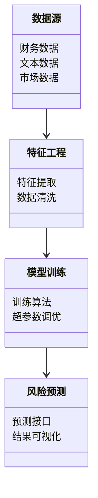
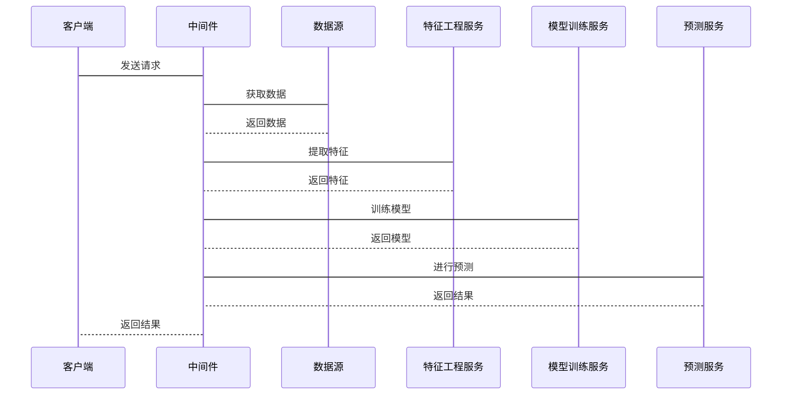

                 


# 《智能算法识别隐藏的财务风险》

## 关键词：智能算法，财务风险管理，隐藏风险，机器学习，深度学习，风险建模

## 摘要：  
本文深入探讨了智能算法在识别隐藏财务风险中的应用，结合机器学习和深度学习技术，分析隐藏风险的核心概念、算法原理、系统架构设计及实际案例，帮助读者掌握如何利用智能算法提升财务风险管理能力。

---

# 第1章: 隐藏的财务风险与智能算法概述

## 1.1 财务风险管理的背景与挑战

### 1.1.1 传统财务风险管理的局限性  
传统的财务风险管理方法依赖于人工分析和简单的统计模型，难以捕捉隐藏在数据中的复杂风险。例如，传统的回归分析和线性模型在面对非线性关系和高维数据时表现有限。

### 1.1.2 隐藏财务风险的定义与特征  
隐藏财务风险是指那些未被显式记录或难以通过传统方法识别的潜在风险。这些风险可能隐藏在文本数据、非结构化数据或时间序列中，具有隐秘性、复杂性和动态变化的特点。

### 1.1.3 智能算法在财务风险管理中的作用  
智能算法通过机器学习和深度学习技术，能够从大量数据中提取隐藏模式，识别潜在风险点，从而帮助企业和投资者做出更明智的决策。

## 1.2 智能算法的核心概念

### 1.2.1 智能算法的基本原理  
智能算法通过数据驱动的方式，利用特征提取、模型训练和预测推理，识别隐藏的财务风险。例如，使用随机森林算法进行特征重要性分析，或利用LSTM网络捕捉时间序列中的潜在风险信号。

### 1.2.2 机器学习与深度学习在财务风险管理中的应用  
- **机器学习**：用于分类、回归和聚类分析，帮助识别异常交易和欺诈行为。  
- **深度学习**：通过神经网络结构，捕捉复杂的非线性关系，如使用卷积神经网络（CNN）分析文本数据中的情绪指标。

### 1.2.3 数据挖掘与自然语言处理的结合  
自然语言处理（NLP）技术用于分析财务报告、新闻和社交媒体中的文本数据，提取潜在的财务风险信号。例如，使用BERT模型分析公司财报中的关键词，预测财务危机。

## 1.3 本书的核心目标与结构

### 1.3.1 识别隐藏财务风险的算法框架  
本文将介绍从数据收集、特征工程到模型训练和部署的完整流程，构建一个智能算法框架，用于识别隐藏的财务风险。

### 1.3.2 本书的主要内容与章节安排  
- 第1章：介绍隐藏财务风险和智能算法的基础知识。  
- 第2章：详细讲解隐藏风险的识别与建模方法。  
- 第3章：分析智能算法的核心原理与数学模型。  
- 第4章：讨论系统分析与架构设计方案。  
- 第5章：通过实际案例展示项目实战。

### 1.3.3 学习本书的必要性与方法  
通过本书，读者可以掌握智能算法的核心技术，并将其应用于实际的财务风险管理中。建议读者在阅读过程中结合代码实现和实际案例，加深理解。

## 1.4 本章小结  
本章介绍了隐藏财务风险的背景、定义及其识别的挑战，阐述了智能算法在其中的作用，并概述了本书的结构和学习方法。

---

# 第2章: 隐藏财务风险的识别与建模

## 2.1 财务风险的多维度分析

### 2.1.1 财务风险的分类与层次  
财务风险可以分为市场风险、信用风险、流动性风险等。隐藏风险可能存在于这些风险的交叉区域，例如供应链中断引发的多维度风险。

### 2.1.2 隐藏风险的特征与表现形式  
隐藏风险通常表现为数据中的异常值、模式缺失或非线性关系。例如，某些公司财报中的隐藏负债可能通过文本描述间接体现。

### 2.1.3 风险识别的复杂性与挑战  
识别隐藏风险需要处理高维数据、非结构化数据和动态变化的市场环境，传统方法难以应对这些复杂性。

## 2.2 智能算法在风险建模中的应用

### 2.2.1 数据驱动的建模方法  
通过机器学习算法，从历史数据中提取特征，构建风险预测模型。例如，使用XGBoost算法对财务数据进行特征重要性分析。

### 2.2.2 基于机器学习的风险预测模型  
- **监督学习**：使用历史数据训练分类模型，预测公司是否会违约。  
- **无监督学习**：通过聚类分析发现潜在的财务异常。

### 2.2.3 深度学习在复杂风险识别中的优势  
深度学习能够捕捉复杂的非线性关系，例如使用LSTM网络分析时间序列数据，识别隐藏的市场波动风险。

## 2.3 风险建模的核心要素

### 2.3.1 数据来源与特征选择  
数据来源包括财务报表、新闻文本、市场数据等。特征选择需要结合业务知识和算法推荐的特征。

### 2.3.2 模型选择与优化策略  
选择合适的算法，并通过交叉验证和网格搜索优化模型参数。例如，使用网格搜索找到最优的随机森林模型参数。

### 2.3.3 模型的可解释性与鲁棒性  
模型需要具备可解释性，以便业务人员理解。同时，模型需要具有鲁棒性，能够应对数据分布的变化。

## 2.4 本章小结  
本章分析了隐藏财务风险的特征，探讨了智能算法在风险建模中的应用，并强调了数据来源、模型选择和可解释性的重要性。

---

# 第3章: 智能算法的核心原理与数学模型

## 3.1 机器学习算法基础

### 3.1.1 监督学习与无监督学习  
- **监督学习**：已知输入和输出，训练模型进行预测。  
- **无监督学习**：通过数据本身发现隐藏的结构。

### 3.1.2 分类算法与回归算法  
- **分类算法**：如逻辑回归、支持向量机（SVM）、随机森林。  
- **回归算法**：如线性回归、岭回归。

### 3.1.3 聚类分析与降维技术  
- **聚类分析**：如K-means、DBSCAN。  
- **降维技术**：如主成分分析（PCA）、t-SNE。

## 3.2 深度学习算法原理

### 3.2.1 神经网络的结构与训练过程  
神经网络包括输入层、隐藏层和输出层，通过反向传播算法更新权重。

### 3.2.2 卷积神经网络（CNN）与循环神经网络（RNN）  
- **CNN**：适用于图像数据，常用于文本情感分析。  
- **RNN**：适用于序列数据，如时间序列分析。

### 3.2.3 图神经网络（GNN）的应用  
GNN用于处理图结构数据，如社交网络中的风险传播分析。

## 3.3 数学模型与公式

### 3.3.1 机器学习的损失函数与优化算法  
$$ L(y, \hat{y}) = \frac{1}{2m}\sum_{i=1}^{m}(y_i - \hat{y}_i)^2 $$  
优化算法如梯度下降：$$ w = w - \eta \frac{\partial L}{\partial w} $$

### 3.3.2 深度学习的前向传播与反向传播  
前向传播：$$ a^{(l+1)} = \sigma(w^{(l)}a^{(l)} + b^{(l)}) $$  
反向传播：$$ \frac{\partial L}{\partial w} = \frac{\partial L}{\partial a} \cdot \frac{\partial a}{\partial w} $$

### 3.3.3 模型评估指标与公式  
F1分数：$$ F1 = 2 \cdot \frac{Precision \cdot Recall}{Precision + Recall} $$

## 3.4 本章小结  
本章详细介绍了机器学习和深度学习的核心原理，并通过数学公式展示了算法的实现过程。

---

# 第4章: 系统分析与架构设计方案

## 4.1 问题场景介绍  
隐藏财务风险识别系统的应用场景包括企业财务监控、投资决策支持和金融监管。

## 4.2 系统功能设计

### 4.2.1 领域模型（Mermaid类图）  


## 4.3 系统架构设计（Mermaid架构图）  


## 4.4 系统接口设计与交互（Mermaid序列图）  


## 4.5 本章小结  
本章通过系统架构设计和接口交互设计，展示了如何构建一个完整的隐藏财务风险识别系统。

---

# 第5章: 项目实战

## 5.1 环境安装与配置

### 5.1.1 安装Python环境  
使用Anaconda安装Python 3.8及以上版本。

### 5.1.2 安装依赖库  
安装NumPy、Pandas、Scikit-learn、TensorFlow、Keras、NLTK、Plotly等库。

## 5.2 核心代码实现

### 5.2.1 数据清洗与特征工程  
```python
import pandas as pd
import numpy as np

# 数据加载
data = pd.read_csv('financial_data.csv')

# 数据清洗
data.dropna(inplace=True)
data = pd.get_dummies(data)
```

### 5.2.2 模型训练与预测  
```python
from sklearn.ensemble import RandomForestClassifier
from sklearn.model_selection import GridSearchCV
from sklearn.metrics import accuracy_score

# 参数调优
param_grid = {'n_estimators': [100, 200], 'max_depth': [None, 10]}
grid_search = GridSearchCV(RandomForestClassifier(), param_grid)
grid_search.fit(X_train, y_train)

# 最佳模型
best_model = grid_search.best_estimator_
best_model.predict(X_test)
```

### 5.2.3 文本数据处理（NLP）  
```python
from sklearn.feature_extraction.text import TfidfVectorizer
from sklearn.pipeline import Pipeline

# 文本特征提取
pipeline = Pipeline([('tfidf', TfidfVectorizer()), ('clf', RandomForestClassifier())])
pipeline.fit(text_train, y_train)
pipeline.predict(text_test)
```

## 5.3 实际案例分析

### 5.3.1 数据来源与预处理  
使用2019-2023年的公司财报、新闻和社交媒体数据，清洗和预处理后进行建模。

### 5.3.2 模型训练与评估  
训练随机森林模型，评估准确率、精确率、召回率和F1分数。

## 5.4 本章小结  
本章通过实际案例展示了如何利用智能算法识别隐藏的财务风险，并提供了完整的代码实现和评估方法。

---

# 总结

通过本文的详细介绍，读者可以掌握智能算法在识别隐藏财务风险中的应用，从基础概念到系统设计，再到实际项目实现，全面了解如何利用这些技术提升财务风险管理能力。最佳实践包括选择合适的算法、注重数据质量、保持模型更新和结合领域知识。

---

# 注意事项

- 数据隐私和合规性是关键，确保数据处理符合相关法律法规。  
- 模型的可解释性是业务应用的基础，避免过于复杂的模型。  
- 定期更新模型，适应市场环境的变化。

---

# 拓展阅读

推荐阅读《机器学习实战》、《深度学习入门：基于Python》和《自然语言处理入门》等书籍，以进一步深入学习相关技术。

---

# 附录

## 附录A: 常用机器学习算法总结  
| 算法名称       | 主要用途                     | 优点                           | 缺点                           |
|----------------|------------------------------|--------------------------------|--------------------------------|
| 支持向量机（SVM）| 分类                         | 高维数据表现好                 | 参数敏感性高                   |
| 随机森林       | 分类、回归                   | 抗过拟合、特征重要性分析         | 对弱分类器依赖                   |
| LSTM           | 时间序列预测                 | 长期依赖关系捕捉                 | 训练时间长                     |

## 附录B: 数据预处理代码示例  
```python
import pandas as pd
import numpy as np

data = pd.read_csv('data.csv')
data = data.dropna()
data = pd.get_dummies(data)
```

## 附录C: 模型调优代码示例  
```python
from sklearn.model_selection import GridSearchCV

param_grid = {
    'n_estimators': [100, 200],
    'max_depth': [None, 10]
}

grid_search = GridSearchCV(RandomForestClassifier(), param_grid)
grid_search.fit(X_train, y_train)
print(grid_search.best_params_)
```

---

通过以上内容，读者可以全面掌握智能算法在识别隐藏财务风险中的应用，并能够实际操作相关技术。

