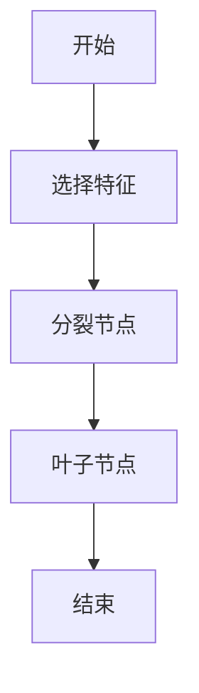
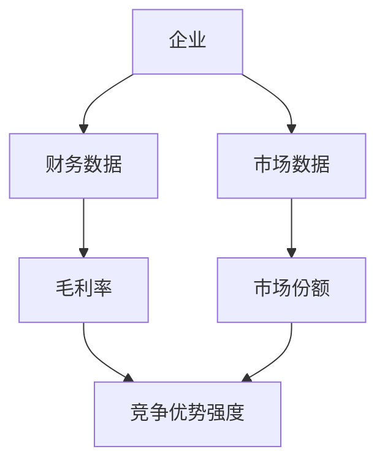
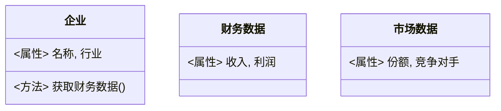
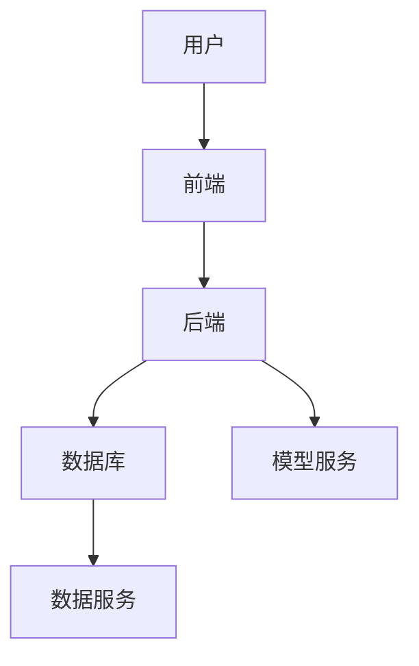

                 


# 智能算法辅助巴菲特护城河分析

## 关键词：智能算法，巴菲特，护城河分析，机器学习，数据分析

## 摘要：  
巴菲特的“护城河”分析是投资决策中的核心方法，而智能算法通过数据分析和机器学习的强大能力，为护城河分析提供了新的视角和工具。本文将从背景、原理、算法、系统设计、项目实战等方面，全面解析智能算法如何辅助巴菲特护城河分析，为投资决策提供科学依据。

---

## 第一部分: 智能算法与巴菲特护城河分析的背景介绍

### 第1章: 智能算法概述

#### 1.1 智能算法的基本概念
智能算法是一种基于人工智能技术的算法，能够从数据中学习并做出决策或预测。它通过机器学习、自然语言处理、深度学习等技术，模拟人类的思维方式，实现对复杂问题的自动化分析。

**数学公式：**  
$$ \text{智能算法} = f(\text{数据}, \text{模型}, \text{参数}) $$

**代码示例：**  
```python
# 智能算法的简单实现（线性回归）
import numpy as np
from sklearn.linear_model import LinearRegression

model = LinearRegression()
model.fit(X, y)
print(model.predict(X_new))
```

#### 1.2 智能算法的应用场景
智能算法广泛应用于金融、医疗、交通等领域。在金融领域，它常用于股票预测、风险评估和投资组合优化。

### 第2章: 巴菲特护城河分析理论

#### 2.1 巴菲特投资理论概述
巴菲特的投资理念强调长期价值投资，核心在于寻找具有持久竞争优势的公司。他提出的“护城河”概念，用于识别那些能够抵御竞争并保持长期盈利能力的企业。

**护城河分类：**  
1. **成本优势**：企业通过规模化生产降低成本，形成价格优势。  
2. **品牌优势**：强大的品牌影响力吸引消费者。  
3. **技术优势**：拥有独特的专利或技术。  
4. **网络效应**：用户越多，产品价值越高。  

#### 2.2 护城河分析的流程
1. 收集企业数据（财务报表、市场数据等）。  
2. 识别企业的竞争优势。  
3. 评估竞争环境和潜在风险。  
4. 综合分析得出护城河的强弱程度。

### 第3章: 智能算法与巴菲特护城河分析的结合

#### 3.1 结合的必要性与优势
传统的护城河分析依赖人工判断，存在主观性强、效率低、覆盖面窄等问题。智能算法通过数据驱动的方式，能够快速处理大量信息，提供客观、精准的分析结果。

**优势对比表：**

| 对比维度         | 传统分析         | 智能算法分析       |
|------------------|------------------|-------------------|
| 数据处理能力     | 有限            | 强大              |
| 分析效率         | 低               | 高                |
| 结果准确性       | 主观            | 客观              |
| 适用范围         | 窄              | 宽                |

---

## 第二部分: 智能算法辅助护城河分析的核心概念与联系

### 第4章: 智能算法与护城河分析的原理

#### 4.1 智能算法的原理
智能算法通过机器学习模型从历史数据中提取特征，识别模式，并预测未来的趋势。例如，使用决策树算法分析企业的财务数据，判断其盈利能力的变化趋势。

**决策树算法流程图：**


#### 4.2 护城河分析的原理
护城河分析通过对企业内外部环境的综合评估，判断企业的竞争优势。例如，使用财务指标（如ROE、毛利率）和市场数据（如市场份额）进行分析。

### 第5章: 核心概念的联系与对比

#### 5.1 核心概念的属性特征对比
智能算法与护城河分析在多个维度上存在显著差异，但也有一些共同点。

**对比表：**

| 对比维度         | 智能算法         | 护城河分析         |
|------------------|------------------|-------------------|
| 输入数据         | 结构化数据       | 结构化+非结构化数据 |
| 分析目标         | 预测与分类       | 竞争优势识别       |
| 输出结果         | 概率或标签       | 竞争优势强度       |

#### 5.2 实体关系图（ER图）


---

## 第三部分: 智能算法辅助护城河分析的系统设计与实现

### 第6章: 系统分析与架构设计

#### 6.1 问题场景介绍
假设我们希望构建一个智能算法辅助护城河分析的系统，用于评估科技企业的竞争优势。

#### 6.2 系统功能设计
- 数据采集模块：收集企业的财务数据和市场数据。  
- 数据预处理模块：清洗和转换数据。  
- 模型训练模块：使用机器学习算法训练模型。  
- 结果展示模块：可视化分析结果。

**领域模型类图：**


#### 6.3 系统架构设计
采用微服务架构，分为数据层、业务逻辑层和展示层。

**系统架构图：**


#### 6.4 系统接口设计
- 前端接口：GET /api/company/{id}  
- 后端接口：POST /api/train-model  

#### 6.5 系统交互流程
用户输入企业ID，系统返回分析结果。

---

## 第四部分: 智能算法辅助护城河分析的项目实战

### 第7章: 项目实战

#### 7.1 环境安装
安装Python、Scikit-learn、Pandas等库。

```bash
pip install numpy pandas scikit-learn
```

#### 7.2 核心代码实现

```python
# 数据预处理
import pandas as pd

data = pd.read_csv('企业数据.csv')
X = data[['收入', '利润']]
y = data['竞争优势强度']

# 模型训练
from sklearn.tree import DecisionTreeClassifier

model = DecisionTreeClassifier()
model.fit(X, y)

# 模型预测
new_data = [[100, 20]]  # 示例数据
print(model.predict(new_data))
```

#### 7.3 案例分析
以某科技公司为例，分析其毛利率和市场份额的变化趋势，判断其竞争优势强度。

#### 7.4 项目总结
通过智能算法辅助护城河分析，能够快速、准确地识别企业的竞争优势，为投资决策提供有力支持。

---

## 第五部分: 智能算法辅助护城河分析的最佳实践与总结

### 第8章: 总结与展望

#### 8.1 最佳实践 tips
- 数据质量是关键，确保数据的完整性和准确性。  
- 结合领域知识，优化算法模型。  
- 定期更新模型，适应市场变化。  

#### 8.2 项目小结
本文详细介绍了智能算法在巴菲特护城河分析中的应用，通过理论分析和实践案例，展示了其在投资决策中的巨大潜力。

#### 8.3 注意事项
- 智能算法的结果仅供参考，需结合人工判断。  
- 注意数据隐私和合规性问题。  

#### 8.4 拓展阅读
建议读者进一步学习机器学习和投资分析的相关知识，深入理解智能算法的应用场景和优化方法。

---

通过以上内容，我们可以看到，智能算法为巴菲特的护城河分析提供了强大的技术支持，能够显著提升投资决策的效率和准确性。未来，随着人工智能技术的不断发展，智能算法在金融领域的应用将更加广泛和深入。

