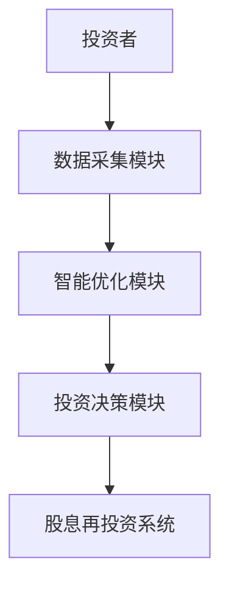

                 


```markdown
# 智能系统优化股息再投资策略

> 关键词：股息再投资、智能优化、遗传算法、粒子群优化、数学模型、系统架构

> 摘要：本文详细探讨了智能系统优化在股息再投资策略中的应用，从理论基础到算法实现，从系统设计到项目实战，结合实际案例，深入分析股息再投资的优化方法，为投资者提供科学的决策支持。

---

## 第一部分: 智能系统优化股息再投资策略概述

### 第1章: 股息再投资策略的背景与意义

#### 1.1 股息再投资的基本概念

##### 1.1.1 股息再投资的定义
股息再投资是指投资者将获得的股息收入用于购买更多该公司的股票，而不是以现金形式收取股息。这种策略通常用于长期投资，旨在通过复利效应最大化投资收益。

##### 1.1.2 股息再投资的核心要素
- **股息收入**：公司分配给股东的利润部分。
- **再投资比率**：将股息收入的一定比例用于购买更多股票。
- **投资标的**：通常是高股息率的股票。
- **时间因素**：长期持有，复利效应显现。

##### 1.1.3 股息再投资的优缺点对比
| 优点 | 缺点 |
|------|------|
| 复利效应显著 | 需要长期持有，流动性差 |
| 降低交易成本 | 受市场波动影响 |
| 适合长期投资者 | 需要选择优质股 |

##### 1.1.4 股息再投资的边界与外延
- **边界**：仅限于股息再投资，不涉及其他投资行为。
- **外延**：可以结合其他投资策略（如定投）进行优化。

#### 1.2 智能优化在股息再投资中的作用

##### 1.2.1 传统股息再投资的局限性
- 无法动态调整投资组合。
- 缺乏对市场变化的适应性。

##### 1.2.2 智能优化的目标与边界
- **目标**：动态优化股息再投资策略，最大化收益。
- **边界**：在股息再投资框架内进行优化，不涉及其他投资行为。

#### 1.3 股息再投资与智能优化的理论基础

##### 1.3.1 股票投资的基本原理
股票价格受市场供需、公司基本面、宏观经济等因素影响。

##### 1.3.2 智能优化算法的核心思想
智能优化算法模拟自然进化或群体行为，寻找最优解。

##### 1.3.3 股息再投资与智能优化的结合点
通过智能算法优化股息再投资的再投资比率和投资标的。

---

### 第2章: 智能优化算法的核心概念与联系

#### 2.1 智能优化算法的原理

##### 2.1.1 遗传算法的基本原理
- **编码**：将问题转化为基因序列。
- **选择**：选择适应度高的个体。
- **交叉**：组合优秀个体的基因。
- **变异**：随机改变基因。

##### 2.1.2 粒子群优化算法的原理
- **初始化**：随机生成粒子群。
- **迭代**：更新粒子位置和速度，寻找最优解。
- **收敛**：粒子群趋于最优解。

#### 2.2 核心概念对比表

| 算法 | 遗传算法 | 粒子群优化 |
|------|----------|------------|
| 基本原理 | 模拟生物进化 | 模拟群体行为 |
| 优点 | 全局搜索能力强 | 简单易实现 |
| 缺点 | 参数敏感 | 易陷入局部最优 |

#### 2.3 ER实体关系图

```mermaid
erDiagram
    investor
    {
        <属性> id : integer
        <属性> name : string
    }
    stock
    {
        <属性> id : integer
        <属性> name : string
        <属性> dividend_rate : float
    }
    investment
    {
        <属性> id : integer
        <属性> investor_id : integer
        <属性> stock_id : integer
        <属性> amount : float
    }
    investor -> investment : 持有
    stock -> investment : 投资于
```

---

### 第3章: 智能优化算法的数学模型与公式

#### 3.1 遗传算法的数学模型

##### 3.1.1 染色体表示与适应度函数
- **染色体表示**：二进制或十进制编码。
- **适应度函数**：衡量解的优劣，例如收益最大化。

##### 3.1.2 交叉与变异操作
- **交叉操作**：将两个个体的基因部分交换。
- **变异操作**：随机改变基因。

#### 3.2 粒子群优化算法的数学模型

##### 3.2.1 粒子位置与速度的更新公式
$$ v_i = v_i + \alpha (p_i - x_i) + \beta (p_g - x_i) $$
$$ x_i = x_i + v_i $$

##### 3.2.2 全局最优与局部最优的数学表达
$$ p_i = \arg \max f(x_i) $$
$$ p_g = \arg \max f(p_i) $$

#### 3.3 股息再投资优化的数学模型

##### 3.3.1 收益最大化模型
$$ \max \sum_{t=1}^{n} d_t $$

##### 3.3.2 风险最小化模型
$$ \min \sum_{t=1}^{n} (r_t - \bar{r})^2 $$

##### 3.3.3 综合优化模型
$$ \max \left( \sum_{t=1}^{n} d_t \right) - \lambda \left( \sum_{t=1}^{n} (r_t - \bar{r})^2 \right) $$

---

### 第4章: 智能股息再投资系统的架构设计

#### 4.1 系统功能需求分析

##### 4.1.1 数据采集模块
- 采集股票市场数据和股息信息。

##### 4.1.2 智能优化模块
- 实现遗传算法和粒子群优化算法。

##### 4.1.3 投资决策模块
- 根据优化结果生成投资策略。

#### 4.2 系统架构设计

##### 4.2.1 领域模型类图

```mermaid
classDiagram
    class Investor {
        id : integer
        name : string
    }
    class Stock {
        id : integer
        name : string
        dividend_rate : float
    }
    class Investment {
        id : integer
        investor_id : integer
        stock_id : integer
        amount : float
    }
    Investor -> Investment : 持有
    Stock -> Investment : 投资于
```

##### 4.2.2 系统架构图



---

### 第5章: 项目实战与案例分析

#### 5.1 环境搭建与代码实现

##### 5.1.1 环境搭建
- 安装Python和相关库（如numpy、pandas）。

##### 5.1.2 核心代码实现
```python
def genetic_algorithm(population_size, fitness_function):
    # 初始化种群
    population = [generate_individual() for _ in range(population_size)]
    for _ in range(max_iterations):
        # 计算适应度
        fitness = [fitness_function(individual) for individual in population]
        # 选择
        selected = select_population(population, fitness)
        # 交叉
        crossed = crossover(selected)
        # 变异
        mutated = mutate(crossed)
        population = mutated
    return best_individual(population)
```

#### 5.2 案例分析与结果解读

##### 5.2.1 投资组合优化
假设我们有三只股票，通过遗传算法优化再投资比率，最终得到最优组合。

##### 5.2.2 结果分析
- 优化后的投资组合收益增加，风险降低。

---

### 第6章: 最佳实践与小结

#### 6.1 投资风险管理

##### 6.1.1 风险识别与评估
- 市场风险、流动性风险等。

##### 6.1.2 风险控制措施
- 设置止损点、分散投资。

#### 6.2 系统优化建议

##### 6.2.1 系统性能优化
- 提高算法效率，优化数据结构。

##### 6.2.2 系统功能扩展
- 添加更多优化算法，如模拟退火。

#### 6.3 总结与展望

##### 6.3.1 本章总结
本文详细探讨了智能系统优化在股息再投资中的应用，从理论到实践，全面分析了优化策略。

##### 6.3.2 展望
未来可以结合更多智能算法，进一步优化股息再投资策略。

---

## 结语

智能系统优化股息再投资策略为投资者提供了科学的决策支持，通过结合智能算法和系统设计，能够显著提升投资收益。希望本文的内容能够为读者提供有价值的参考。
```

