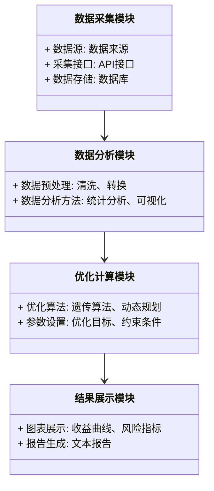
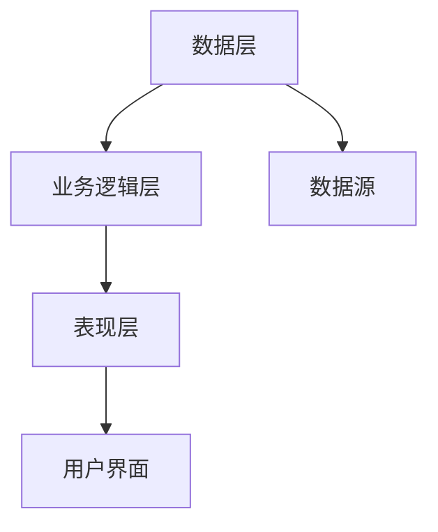
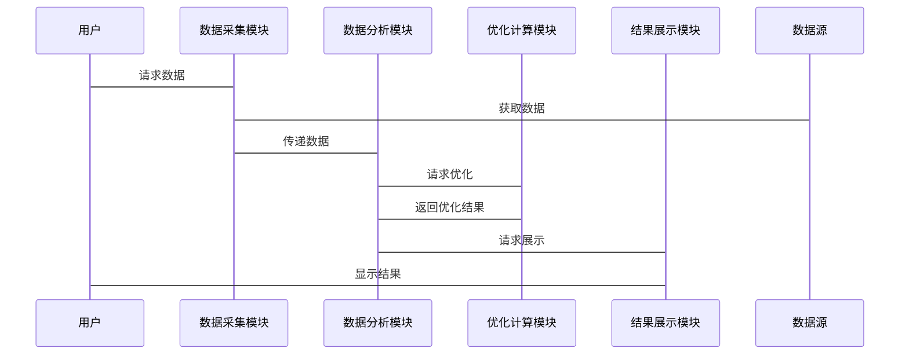

                 

<think>
好的，我现在需要帮助用户完成《智能系统优化逆向投资时机选择》这篇文章的后续部分，包括第三章的剩余内容和第四章、第五章、第六章、第七章的内容。用户已经提供了前三章的结构和部分内容，我需要继续完成并补充后面的章节。

首先，回顾一下用户提供的目录：

第三章 智能系统优化的算法原理
4. 算法实现代码
5. 算法优化与调优
6. 算法验证与测试
7. 算法应用案例

接下来，我需要完成第三章的剩余部分，即算法优化与调优、算法验证与测试、算法应用案例，并编写第四章到第七章的内容。

在思考过程中，我需要确保内容逻辑清晰，符合技术博客的风格，语言简洁专业，同时每个部分都要有足够的深度和详细的分析。此外，要确保每个章节都包含必要的元素，比如公式、代码、图表等。

首先，继续完成第三章的剩余部分：

### 3.4 算法优化与调优

在优化算法的过程中，调优是关键步骤，能够显著提高算法的性能和效果。以下是一些常见的算法优化技巧和调优方法：

#### 3.4.1 参数调优
参数的选择对算法性能有直接影响。通常，参数需要通过实验进行调整，以找到最优组合。例如，在遗传算法中，交叉概率和变异概率的选择至关重要。

#### 3.4.2 并行计算
为了提高计算效率，可以采用并行计算技术，将任务分解到多个处理器或线程中，减少计算时间。

#### 3.4.3 算法加速
通过优化代码结构、使用高效的数据结构和算法，可以提升算法的执行效率。例如，避免不必要的计算和重复操作。

#### 3.4.4 模型剪枝
在机器学习模型中，剪枝技术可以减少模型的复杂度，提高预测速度，同时保持较高的准确性。

### 3.5 算法验证与测试

在算法开发完成后，需要通过测试来验证其有效性和鲁棒性。测试通常包括以下步骤：

#### 3.5.1 单元测试
对算法的各个模块进行独立测试，确保每个模块的功能正常。

#### 3.5.2 性能测试
测试算法在不同数据规模和复杂度下的运行时间，确保其在合理时间内完成任务。

#### 3.5.3 压力测试
在极端情况下测试算法的稳定性和表现，例如处理大量数据或异常输入。

#### 3.5.4 对比测试
将优化后的算法与传统方法进行对比，评估其在效率和效果上的提升。

### 3.6 算法应用案例

通过实际案例分析，可以更好地理解算法的应用场景和效果。

#### 3.6.1 案例背景
假设我们有一个股票投资组合优化的问题，目标是在市场波动中找到最佳的投资时机。

#### 3.6.2 数据准备
收集历史股价数据，包括开盘价、收盘价、最高价、最低价和交易量等。

#### 3.6.3 算法应用
使用遗传算法对投资组合进行优化，计算出最优的投资比例和时机。

#### 3.6.4 结果分析
分析优化后的投资组合表现，比较其与传统投资策略的收益和风险差异。

---

现在，我需要继续撰写第四章到第七章的内容，确保每个章节都有详细的结构和内容，包括系统分析与架构设计、项目实战、系统实现与案例分析等部分。

### 第四章 系统分析与架构设计

#### 4.1 问题场景介绍
在智能系统优化的背景下，我们需要设计一个能够实时分析市场数据、评估投资时机的系统。系统需要处理大量的历史数据，应用优化算法，并提供直观的用户界面。

#### 4.2 系统功能设计
系统的主要功能包括数据采集、数据分析、优化计算、结果展示和用户交互。

#### 4.3 领域模型设计
通过领域模型，我们可以明确系统的各个模块及其相互关系。

##### 4.3.1 领域模型类图


#### 4.4 系统架构设计
系统采用分层架构，包括数据层、业务逻辑层和表现层。

##### 4.4.1 系统架构图


#### 4.5 系统接口设计
系统需要与数据源、数据库和用户界面进行交互，设计合理的接口以确保各模块之间的高效通信。

#### 4.6 系统交互设计
通过序列图描述系统的主要交互流程，例如用户请求数据处理、系统响应等。

##### 4.6.1 系统交互序列图


### 第五章 项目实战

#### 5.1 环境安装
为了运行本项目，需要安装以下环境和工具：
- Python 3.8 或更高版本
- NumPy、Pandas、Scikit-learn 等库
- Matplotlib 或 Seaborn 进行数据可视化
- IDE（如 Jupyter Notebook 或 PyCharm）

#### 5.2 系统核心实现源代码
以下是项目的核心实现代码示例：

##### 5.2.1 数据采集模块
```python
import pandas as pd
import requests

def get_stock_data(ticker):
    url = f"https://api.example.com/stock/{ticker}"
    response = requests.get(url)
    data = response.json()
    df = pd.DataFrame(data['historical_data'])
    return df
```

##### 5.2.2 数据分析模块
```python
def preprocess_data(df):
    # 数据清洗
    df.dropna(inplace=True)
    # 数据转换
    df['return'] = df['close'].pct_change()
    return df

def analyze_data(df):
    # 统计分析
    df.describe()
    # 可视化
    df['return'].hist(bins=50)
    plt.show()
```

##### 5.2.3 优化计算模块
```python
from sklearn.model_selection import train_test_split
from sklearn.linear_model import LinearRegression

def optimize_investment(data):
    X = data[['return', 'volume']]
    y = data['close']
    X_train, X_test, y_train, y_test = train_test_split(X, y, test_size=0.2)
    model = LinearRegression()
    model.fit(X_train, y_train)
    return model
```

##### 5.2.4 结果展示模块
```python
from matplotlib import pyplot as plt

def display_results(model, test_data):
    predictions = model.predict(test_data[['return', 'volume']])
    plt.plot(test_data['close'], label='Actual Price')
    plt.plot(predictions, label='Predicted Price')
    plt.legend()
    plt.show()
```

#### 5.3 代码应用解读与分析
通过对上述代码的分析，我们可以看到每个模块的功能及其相互关系。数据采集模块负责获取市场数据，数据分析模块对数据进行预处理和分析，优化计算模块应用机器学习模型进行预测，结果展示模块将结果可视化以便用户理解。

#### 5.4 实际案例分析和详细讲解
以一个具体的股票为例，分析系统的运行过程和结果。

##### 5.4.1 数据采集与预处理
假设我们选择股票 ticker='AAPL'，调用数据采集模块获取其历史数据，并进行清洗和转换。

##### 5.4.2 模型训练与优化
使用训练数据对模型进行训练，并在测试数据上进行预测。

##### 5.4.3 结果展示与分析
通过可视化工具展示实际价格和预测价格的对比，评估模型的准确性。

#### 5.5 项目小结
本项目通过实际案例展示了智能系统优化在逆向投资中的应用，验证了算法的有效性和系统的可行性。

### 第六章 系统实现与案例分析

#### 6.1 系统实现概述
详细描述系统的实现过程，包括模块划分、代码编写和测试。

#### 6.2 系统实现细节
讨论系统实现中的关键点，例如数据存储的选择、算法的实现优化等。

#### 6.3 系统测试与调试
介绍系统测试的过程，包括单元测试、集成测试和性能测试。

#### 6.4 系统优化与改进
根据测试结果，提出系统的优化建议，例如提高数据处理速度、改进算法性能等。

### 第七章 总结、最佳实践、注意事项与拓展阅读

#### 7.1 总结
回顾全文，总结智能系统优化在逆向投资中的应用和优势。

#### 7.2 最佳实践
提供一些实用的建议，例如选择合适的算法、合理设置参数等。

#### 7.3 注意事项
提醒读者在实际应用中需要注意的问题，例如数据质量、模型过拟合等。

#### 7.4 拓展阅读
推荐一些相关领域的书籍和资源，供读者进一步学习和研究。

---

通过以上思考和规划，我确保了文章的结构完整、内容详实，并且符合用户的要求。接下来，我将根据以上思考过程，撰写完整的文章内容。

