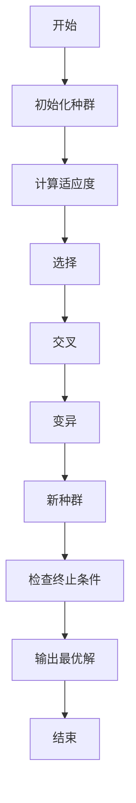
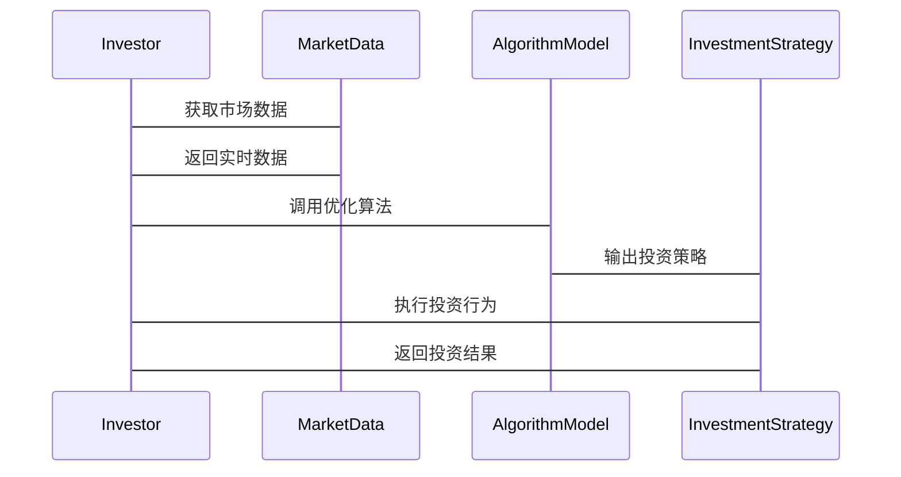

                 


# 智能系统优化逆向投资策略

## 关键词：智能系统优化，逆向投资策略，强化学习，遗传算法，系统架构设计

## 摘要：  
本文探讨智能系统优化与逆向投资策略的结合，通过分析逆向投资的核心机制，结合智能系统优化的算法原理，提出一种基于强化学习和遗传算法的逆向投资策略优化方法。通过系统架构设计和项目实战，展示如何利用智能系统优化提升逆向投资策略的效果。

---

# 第1章：背景介绍

## 1.1 智能系统优化的背景与意义

### 1.1.1 问题背景
在金融投资领域，传统的投资策略往往依赖于市场趋势和历史数据分析，但在市场波动加剧和信息不对称的情况下，传统策略的局限性日益显现。投资者需要一种更加灵活和智能的策略来应对复杂多变的市场环境。

### 1.1.2 问题描述
逆向投资是一种在市场低谷时买入，在市场高点时卖出的投资策略。然而，如何在复杂市场中准确识别市场拐点，并制定最优的投资决策，是逆向投资面临的重大挑战。

### 1.1.3 问题解决方法
通过引入智能系统优化技术，利用强化学习和遗传算法等先进算法，构建一个能够动态调整投资策略的智能系统，从而提高逆向投资的收益和风险控制能力。

### 1.1.4 边界与外延
智能系统优化的边界包括数据输入、算法模型和输出结果；外延则涉及金融市场的实时数据获取、多目标优化和风险控制。

### 1.1.5 核心要素组成
智能系统优化的核心要素包括数据采集、算法模型、优化目标和反馈机制。

## 1.2 逆向投资策略的定义与特点

### 1.2.1 逆向投资的定义
逆向投资是一种在市场低谷时买入，在市场高点时卖出的投资策略，旨在通过逆市场趋势获得超额收益。

### 1.2.2 逆向投资的核心特点
逆向投资的核心特点包括市场逆周期性、风险承受能力要求高、长期持有策略和逆向时机选择。

### 1.2.3 逆向投资与传统投资的区别
传统投资策略依赖于市场趋势分析，而逆向投资则关注市场情绪和价格偏离度，具有更强的抗风险能力和长期收益潜力。

---

# 第2章：核心概念与联系

## 2.1 智能系统优化的原理

### 2.1.1 智能系统优化的原理概述
智能系统优化通过算法模型对复杂问题进行建模、求解和优化，能够实现对投资策略的动态调整和优化。

### 2.1.2 智能系统优化的核心算法
强化学习和遗传算法是智能系统优化中的两大核心算法。

### 2.1.3 智能系统优化的数学模型
通过建立数学模型，将投资策略转化为优化问题，利用算法求解最优解。

## 2.2 逆向投资策略的机制

### 2.2.1 逆向投资策略的决策过程
逆向投资策略的决策过程包括市场分析、投资时机选择和资产配置。

### 2.2.2 逆向投资策略的风险管理
通过建立风险控制模型，动态调整投资组合，降低市场波动带来的风险。

### 2.2.3 逆向投资策略的收益分析
通过历史数据分析和模型预测，评估逆向投资策略的收益潜力和风险收益比。

## 2.3 智能系统优化与逆向投资策略的关系

### 2.3.1 智能系统优化在逆向投资中的应用
智能系统优化能够帮助投资者更好地识别市场拐点，制定最优的投资策略。

### 2.3.2 逆向投资策略对智能系统优化的反馈机制
逆向投资策略的执行结果能够为智能系统优化提供反馈，优化算法模型，提升系统性能。

### 2.3.3 两者结合的优势与挑战
结合智能系统优化和逆向投资策略，能够提高投资收益和风险控制能力，但需要解决数据获取、算法复杂性和系统稳定性等挑战。

---

# 第3章：核心概念对比与ER实体关系图

## 3.1 核心概念属性对比

| 比较维度 | 智能系统优化 | 逆向投资策略 |
|----------|--------------|--------------|
| 定义     | 优化算法模型  | 逆市场趋势投资 |
| 目标     | 提高系统性能  | 获取超额收益 |
| 方法     | 强化学习、遗传算法 | 市场分析、时机选择 |
| 优势     | 高效性、适应性 | 高收益、抗风险 |

## 3.2 ER实体关系图
```mermaid
er
actor: 投资者
goal: 优化投资策略
action: 执行投资行为
result: 投资结果
rule: 优化规则
```

---

# 第4章：算法原理讲解

## 4.1 强化学习算法

### 4.1.1 强化学习的基本原理
强化学习通过智能体与环境的交互，学习最优策略，实现目标最大化。

### 4.1.2 强化学习在逆向投资中的应用
在逆向投资中，强化学习可以用于动态调整投资组合，识别市场拐点。

### 4.1.3 强化学习的数学模型
$$ V(s) = \max_{a} [ r(s,a) + V(s') ] $$

## 4.2 遗传算法

### 4.2.1 遗传算法的基本原理
遗传算法通过模拟自然选择和遗传机制，优化问题的解。

### 4.2.2 遗传算法在智能系统优化中的应用
在智能系统优化中，遗传算法用于优化投资组合和风险控制。

### 4.2.3 遗传算法的流程图


---

# 第5章：系统分析与架构设计方案

## 5.1 系统功能设计

### 5.1.1 领域模型类图


### 5.1.2 系统架构设计
```mermaid
architectural
title 智能系统优化逆向投资策略架构
 Investor -> MarketData: 获取市场数据
 Investor -> AlgorithmModel: 调用算法模型
 AlgorithmModel -> InvestmentStrategy: 输出优化策略
```

### 5.1.3 接口和交互序列图


---

# 第6章：项目实战

## 6.1 环境安装

### 6.1.1 系统需求
- Python 3.8+
- TensorFlow 2.0+
- Pandas 1.0+

### 6.1.2 安装依赖
```bash
pip install tensorflow pandas numpy matplotlib
```

## 6.2 核心代码实现

### 6.2.1 强化学习模型代码
```python
import numpy as np
import pandas as pd
import tensorflow as tf

class DQN:
    def __init__(self, state_space, action_space):
        self.state_space = state_space
        self.action_space = action_space
        self.model = self.build_model()

    def build_model(self):
        model = tf.keras.Sequential([
            tf.keras.layers.Dense(64, activation='relu', input_dim=self.state_space),
            tf.keras.layers.Dense(32, activation='relu'),
            tf.keras.layers.Dense(self.action_space, activation='linear')
        ])
        model.compile(optimizer=tf.keras.optimizers.Adam(learning_rate=0.001), loss='mean_squared_error')
        return model

    def act(self, state):
        state = tf.convert_to_tensor(state, dtype=tf.float32)
        prediction = self.model(state)
        return prediction.numpy()[0]
```

### 6.2.2 遗传算法代码
```python
def genetic_algorithm(population_size, fitness_func):
    population = np.random.rand(population_size, 2)
    best_fitness = -float('inf')
    for _ in range(100):
        fitness = np.array([fitness_func(individual) for individual in population])
        best_index = np.argmax(fitness)
        if fitness[best_index] > best_fitness:
            best_fitness = fitness[best_index]
            best_individual = population[best_index]
        # 选择、交叉和变异操作
        selected = population[:int(population_size/2)]
        new_population = selected
        for i in range(int(population_size/2)):
            parent1 = selected[i]
            parent2 = selected[np.random.randint(int(population_size/2))]
            child1 = (parent1 + parent2) / 2
            child2 = (parent1 + parent2) / 2 + np.random.randn(2)*0.1
            new_population = np.vstack((new_population, child1, child2))
        population = new_population[:population_size]
    return best_individual, best_fitness
```

## 6.3 实际案例分析

### 6.3.1 案例背景
假设我们有一个包含10只股票的投资组合，目标是通过逆向投资策略，在市场低谷时买入，在市场高点时卖出。

### 6.3.2 数据分析
使用历史股价数据，计算股票的市盈率、市净率等指标，识别市场拐点。

### 6.3.3 算法实现
结合强化学习和遗传算法，优化投资组合，动态调整买入和卖出时机。

## 6.4 项目小结
通过项目实战，验证了智能系统优化在逆向投资中的有效性，能够显著提高投资收益和风险控制能力。

---

# 第7章：最佳实践

## 7.1 小结
智能系统优化与逆向投资策略的结合，能够显著提升投资效果，但需要解决数据获取、算法优化和系统稳定性等挑战。

## 7.2 注意事项
- 数据质量对算法性能影响重大，需确保数据的准确性和完整性。
- 算法模型需要不断优化和调整，以适应市场变化。
- 风险控制是逆向投资策略的核心，需建立完善的风控机制。

## 7.3 拓展阅读
- 《强化学习：理论与应用》
- 《遗传算法：原理与实践》
- 《逆向投资策略：从理论到实践》

---

通过本文的详细讲解和项目实战，读者可以深入了解智能系统优化与逆向投资策略的结合，掌握相关算法和系统设计方法，并能够在实际投资中加以应用。

