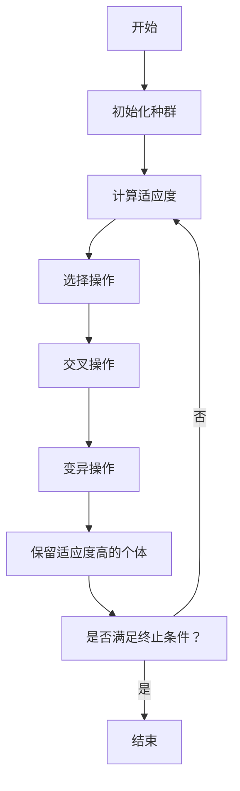
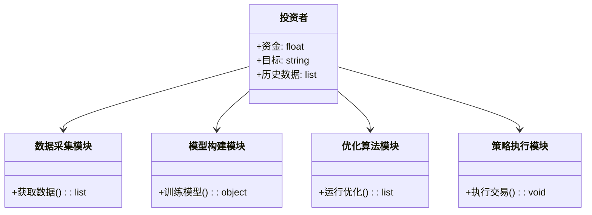

                 


# 智能系统优化逆向投资策略执行

> **关键词**：智能系统优化、逆向投资策略、优化算法、系统架构设计、项目实战

> **摘要**：本文详细探讨了智能系统优化在逆向投资策略执行中的应用，从核心概念、算法原理、系统架构到项目实战，系统地分析了如何利用智能优化算法提升投资决策的科学性和效率性。通过实际案例分析和代码实现，为读者提供了一套完整的解决方案。

---

## 第1章 智能系统优化与逆向投资策略概述

### 1.1 背景介绍

#### 1.1.1 问题背景
传统投资策略依赖于人工分析和经验判断，存在主观性强、效率低下的问题。在金融市场快速波动的背景下，投资者需要更高效的工具来优化决策过程。

#### 1.1.2 问题描述
逆向投资策略强调在市场低谷时买入，在市场高点时卖出，但如何准确识别市场拐点是关键挑战。

#### 1.1.3 问题解决
通过智能系统优化算法，可以建立数学模型，量化分析市场趋势，辅助投资者做出科学决策。

#### 1.1.4 边界与外延
- **边界**：限定于量化投资领域，不涉及基本面分析。
- **外延**：可扩展至其他领域，如资产配置和风险管理。

#### 1.1.5 核心要素
- 数据采集：历史价格、成交量等。
- 模型构建：时间序列分析、回归模型。
- 算法实现：优化算法选择与实现。

### 1.2 核心概念与联系

#### 1.2.1 概念结构


## 第2章 智能系统优化的核心概念与数学模型

### 2.1 算法原理

#### 2.1.1 基本原理
智能系统优化算法通过模拟生物进化或物理过程，寻找最优解。常用算法包括遗传算法（GA）、粒子群优化（PSO）和模拟退火（SA）。

#### 2.1.2 优化问题的数学表达
目标函数：$$f(x) = \min$$  
约束条件：$$g(x) \leq 0$$

#### 2.1.3 算法流程图


## 第3章 逆向投资策略的数学模型与公式

### 3.1 投资组合优化

#### 3.1.1 数学模型
$$\text{目标函数: } \min_w \sum_{i=1}^n w_i^2$$  
$$\text{约束条件: } \sum_{i=1}^n w_i = 1$$

#### 3.1.2 风险-收益平衡
$$\text{收益: } r = w^T \mu$$  
$$\text{风险: } \sigma^2 = w^T \Sigma w$$

### 3.2 算法实现

#### 3.2.1 遗传算法实现
```python
def fitness(w, mu, Sigma):
    return w.T.dot(mu) - 0.5 * w.T.dot(Sigma).dot(w)

def evolve(w, fitness_func, mu, Sigma, pop_size=100, generations=50):
    for _ in range(generations):
        population = [w + np.random.randn(1, len(w)) * 0.1 for _ in range(pop_size)]
        fitnesses = [fitness(wi, mu, Sigma) for wi in population]
        best = max(population, key=lambda x: fitness(x, mu, Sigma))
        w = best
    return w
```

## 第4章 系统分析与架构设计

### 4.1 问题场景

#### 4.1.1 需求分析
- 数据采集：实时获取股票价格。
- 模型构建：建立量化交易模型。
- 系统实现：设计优化算法。

### 4.2 系统架构

#### 4.2.1 功能模块


## 第5章 项目实战

### 5.1 环境安装

#### 5.1.1 工具安装
- Python 3.8+
- NumPy、Pandas、Scikit-learn
- Matplotlib

### 5.2 核心代码实现

#### 5.2.1 数据采集与预处理
```python
import pandas as pd
import numpy as np

def get_data(tickers, start, end):
    data = pd.DataFrame()
    for ticker in tickers:
        df = pd.read_csv(f'data/{ticker}.csv', parse_dates=['Date'], index_col='Date')
        data[ticker] = df['Close']
    return data
```

#### 5.2.2 模型构建
```python
from sklearn.linear_model import LinearRegression

def build_model(data, window=10):
    X = data.shift(1)
    y = data.values[window:]
    model = LinearRegression().fit(X[:-window], y)
    return model
```

## 第6章 总结与展望

### 6.1 总结

#### 6.1.1 核心内容回顾
- 理解智能系统优化与逆向投资策略的核心概念。
- 掌握相关数学模型和优化算法的实现。
- 学习系统架构设计和项目实战经验。

#### 6.1.2 实践意义
通过优化算法辅助投资决策，提高投资效率和收益。

### 6.2 展望

#### 6.2.1 拓展阅读
建议深入学习强化学习在金融中的应用，如Deep Q-Learning。

#### 6.2.2 未来方向
探索多目标优化，结合实时数据和市场情绪分析，提升投资策略的动态适应性。

---

通过以上步骤，您可以系统地理解并实现智能系统优化在逆向投资策略中的应用。

