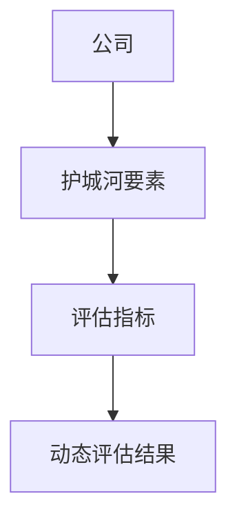
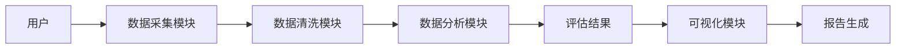
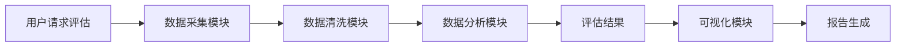

                 


# 智能系统辅助公司护城河动态评估

---

## 关键词：
智能系统，护城河，动态评估，企业竞争优势，数据驱动，算法模型

---

## 摘要：
本文将详细探讨如何利用智能系统辅助公司护城河的动态评估。护城河是企业维持竞争优势的关键，但在快速变化的商业环境中，传统的静态评估方法已难以满足需求。通过引入智能系统，企业可以实时、动态地评估和优化其护城河。本文从护城河的定义与动态评估的重要性入手，结合智能系统的算法原理、系统架构设计和实际案例，详细分析智能系统在护城河动态评估中的应用。通过本文，读者将深入了解如何利用数据驱动的方法，构建动态评估模型，优化企业竞争优势。

---

## 第一部分：智能系统辅助公司护城河动态评估的背景与概念

### 第1章：公司护城河的定义与动态评估的重要性

#### 1.1 公司护城河的定义与核心要素

##### 1.1.1 什么是公司护城河
公司护城河是指企业在市场竞争中形成的独特优势，使其能够抵御竞争对手的侵蚀并保持长期的竞争优势。护城河的核心在于企业的资源、能力、市场地位和创新能力的综合表现。

##### 1.1.2 护城河的核心要素
- **资源**：包括资金、技术、人才、数据等。
- **能力**：包括研发能力、生产效率、服务能力等。
- **市场地位**：包括市场份额、品牌影响力、客户忠诚度等。
- **创新能力**：包括产品创新、技术创新、商业模式创新等。

##### 1.1.3 动态评估的必要性
- **市场环境变化**：行业竞争格局、技术发展、政策法规等都在不断变化。
- **企业自身调整**：企业战略调整、组织优化、技术创新等都会影响护城河。
- **实时反馈需求**：企业需要快速响应市场变化，及时调整策略。

#### 1.2 护城河动态评估的背景与问题背景

##### 1.2.1 企业竞争环境的变化
- 全球化竞争加剧，新兴技术和商业模式不断涌现。
- 客户需求日益多样化，对企业响应速度提出更高要求。
- 政策法规变化对企业经营环境的影响日益显著。

##### 1.2.2 护城河评估的动态性
- 企业护城河并非一成不变，需要定期评估和优化。
- 动态评估可以帮助企业在变化中及时发现问题并调整策略。

##### 1.2.3 传统评估方法的局限性
- **静态评估**：传统方法通常基于固定指标，难以捕捉动态变化。
- **数据不足**：缺乏实时数据支持，评估结果可能滞后。
- **主观性**：依赖人工判断，存在主观偏差。

#### 1.3 智能系统辅助评估的优势

##### 1.3.1 数据驱动的评估方法
- 利用大数据技术，实时采集和分析企业内外部数据，提供动态评估依据。

##### 1.3.2 智能算法的应用
- 通过机器学习算法，自动识别护城河的关键指标和权重，优化评估结果。

##### 1.3.3 实时动态评估的实现
- 利用智能系统，实现护城河评估的实时更新和可视化展示。

---

## 第二部分：智能系统辅助护城河动态评估的核心概念与联系

### 第2章：智能系统辅助护城河动态评估的核心概念与联系

#### 2.1 核心概念原理

##### 2.1.1 数据流与评估模型
- **数据流**：从企业内外部数据源实时采集数据，经过清洗、转换和建模，生成评估结果。
- **评估模型**：基于机器学习算法，构建动态评估模型，实现护城河的实时监控和预警。

##### 2.1.2 智能算法与评估指标
- **智能算法**：包括聚类分析、回归分析、神经网络等，用于识别护城河的关键指标和权重。
- **评估指标**：包括市场份额、利润率、客户满意度等，用于量化企业竞争优势。

##### 2.1.3 动态评估的数学模型
- **动态评估模型**：通过时间序列分析和动态规划算法，实现护城河的动态评估。

#### 2.2 核心概念属性特征对比表

| 评估指标 | 动态性 | 数据依赖性 | 评估复杂性 | 应用场景 |
|----------|--------|------------|------------|----------|
| 市场份额 | 高 | 高 | 中 | 竞争分析 |
| 利润率 | 中 | 中 | 高 | 财务分析 |
| 客户满意度 | 高 | 中 | 高 | 服务质量优化 |

#### 2.3 ER实体关系图


---

## 第三部分：护城河动态评估的算法原理与数学模型

### 第3章：护城河动态评估的算法原理与数学模型

#### 3.1 算法原理

##### 3.1.1 层次分析法（AHP）的应用
- **层次分析法**：将复杂问题分解为多个层次，通过专家评分确定各指标的权重。
- **动态权重调整**：根据市场变化实时调整指标权重，确保评估结果的动态性。

##### 3.1.2 动态权重调整机制
- **动态权重计算**：基于时间序列分析，实时调整各指标的权重。
- **自适应优化**：利用机器学习算法，自动优化权重分配。

##### 3.1.3 聚类分析与评估结果预测
- **聚类分析**：将企业护城河要素进行分类，识别关键因素。
- **评估结果预测**：基于历史数据和当前数据，预测未来护城河的变化趋势。

#### 3.2 数学模型与公式

##### 3.2.1 权重计算公式
$$ w_i = \frac{\sum_{j} a_{ij}}{\sum_{i} \sum_{j} a_{ij}} } $$

##### 3.2.2 动态评估模型
$$ E(t) = \sum_{i=1}^{n} w_i(t) \cdot x_i(t) $$

---

## 第四部分：智能系统辅助护城河动态评估的系统架构设计

### 第4章：智能系统辅助护城河动态评估的系统架构设计

#### 4.1 系统功能设计

##### 4.1.1 数据采集模块
- **数据源**：企业内部数据（财务数据、销售数据）、外部数据（市场数据、行业报告）。
- **数据清洗**：去除噪声数据，确保数据质量。

##### 4.1.2 数据分析模块
- **数据建模**：构建机器学习模型，进行动态评估。
- **结果输出**：生成评估报告和预警信息。

##### 4.1.3 可视化模块
- **数据可视化**：通过图表展示护城河的动态变化。
- **实时监控**：提供实时监控界面，方便企业管理人员查看。

#### 4.2 系统架构设计

##### 4.2.1 系统架构图


##### 4.2.2 接口设计
- **API接口**：提供RESTful API，方便与其他系统集成。
- **数据接口**：支持多种数据格式，如CSV、JSON等。

#### 4.3 系统交互设计

##### 4.3.1 系统交互流程图


---

## 第五部分：智能系统辅助护城河动态评估的项目实战

### 第5章：智能系统辅助护城河动态评估的项目实战

#### 5.1 项目背景

##### 5.1.1 项目介绍
- **项目目标**：构建一个智能系统，辅助某互联网公司动态评估其护城河。

##### 5.1.2 项目需求
- **数据采集**：实时采集公司内外部数据。
- **动态评估**：基于机器学习算法，实现护城河的动态评估。
- **可视化展示**：提供直观的评估结果和预警信息。

#### 5.2 项目实现

##### 5.2.1 环境安装
- **工具安装**：安装Python、Jupyter Notebook、TensorFlow、Pandas等工具。
- **数据源**：获取公司内外部数据，清洗并存储。

##### 5.2.2 核心代码实现

###### 5.2.2.1 数据预处理代码
```python
import pandas as pd
import numpy as np

# 读取数据
data = pd.read_csv('data.csv')

# 数据清洗
data.dropna(inplace=True)
data = data.drop_duplicates()
```

###### 5.2.2.2 动态评估模型代码
```python
import tensorflow as tf
from sklearn.model_selection import train_test_split
from sklearn.metrics import accuracy_score

# 数据分割
X_train, X_test, y_train, y_test = train_test_split(data.drop('label', axis=1), data['label'], test_size=0.2)

# 模型构建
model = tf.keras.Sequential([
    tf.keras.layers.Dense(64, activation='relu'),
    tf.keras.layers.Dense(1, activation='sigmoid')
])

model.compile(optimizer='adam', loss='binary_crossentropy', metrics=['accuracy'])

# 模型训练
model.fit(X_train, y_train, epochs=10, batch_size=32)

# 模型评估
y_pred = model.predict(X_test)
print("准确率：", accuracy_score(y_test, np.round(y_pred)))
```

##### 5.2.3 代码解读与分析
- **数据预处理**：清洗数据，去除缺失值和重复值。
- **动态评估模型**：构建一个简单的神经网络模型，用于分类任务。
- **模型评估**：计算准确率，评估模型性能。

#### 5.3 实际案例分析

##### 5.3.1 案例介绍
- **公司背景**：某互联网公司，主要业务为在线教育。
- **护城河要素**：市场份额、用户活跃度、课程质量等。

##### 5.3.2 评估结果分析
- **市场份额**：通过动态评估模型，发现市场份额呈上升趋势。
- **用户活跃度**：用户活跃度较高，但存在波动。
- **课程质量**：课程质量稳定，但竞争对手推出新产品，可能影响市场份额。

##### 5.3.3 结果可视化


#### 5.4 项目小结
通过该项目，我们成功构建了一个智能系统，能够实时动态评估公司的护城河。系统不仅能够提供准确的评估结果，还能通过可视化界面展示数据变化趋势，帮助企业管理人员及时调整策略。

---

## 第六部分：智能系统辅助护城河动态评估的最佳实践与总结

### 第6章：智能系统辅助护城河动态评估的最佳实践

#### 6.1 最佳实践

##### 6.1.1 数据质量的重要性
- 确保数据的准确性和完整性，避免因数据问题导致评估结果偏差。

##### 6.1.2 模型优化
- 定期更新模型参数，确保评估结果的准确性。

##### 6.1.3 系统维护
- 定期检查系统运行状态，及时修复问题。

#### 6.2 小结
智能系统辅助护城河动态评估，不仅能够提高评估效率，还能通过实时数据分析，帮助企业更好地应对市场变化。

#### 6.3 注意事项
- **数据隐私**：注意数据隐私保护，避免数据泄露。
- **模型解释性**：确保模型的可解释性，便于调整和优化。
- **系统稳定性**：确保系统的稳定运行，避免因系统故障导致评估中断。

#### 6.4 拓展阅读
- **推荐书籍**：《数据驱动的决策》、《机器学习实战》。
- **推荐阅读**：行业报告、学术论文，了解最新的研究成果和应用案例。

---

## 总结

通过本文的详细讲解，我们了解了如何利用智能系统辅助公司护城河的动态评估。从理论到实践，从算法到系统设计，我们展示了如何通过数据驱动的方法，构建动态评估模型，优化企业竞争优势。未来，随着人工智能技术的不断发展，智能系统在护城河动态评估中的应用将更加广泛和深入。

