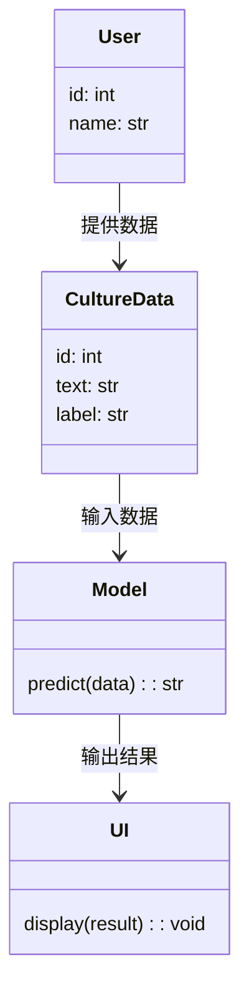
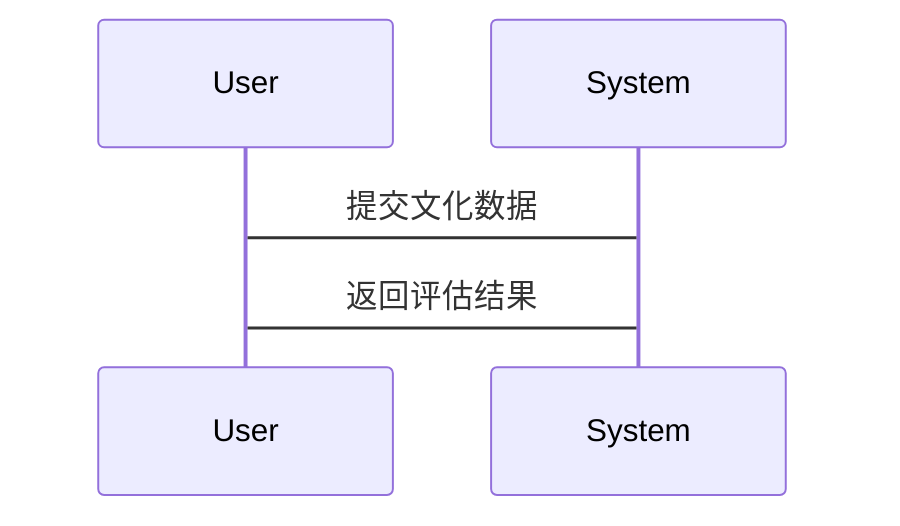

                 


# 目录大纲：《智能系统辅助公司文化影响评估》

---

## 第一部分：背景介绍

### 第1章：智能系统与公司文化影响评估概述

#### 1.1 问题背景
- 1.1.1 传统公司文化评估的局限性
- 1.1.2 智能系统在现代企业管理中的作用
- 1.1.3 数字化转型对企业文化的影响

#### 1.2 问题描述
- 1.2.1 公司文化评估的复杂性
- 1.2.2 数据驱动决策的必要性
- 1.2.3 智能系统在文化评估中的潜力

#### 1.3 问题解决
- 1.3.1 智能系统如何辅助文化评估
- 1.3.2 数据分析在文化影响中的应用
- 1.3.3 智能系统的优势与局限

#### 1.4 边界与外延
- 1.4.1 智能系统评估的范围界定
- 1.4.2 与其他企业管理工具的区分
- 1.4.3 未来发展的可能性

#### 1.5 核心概念与要素
- 1.5.1 智能系统的定义与特征
- 1.5.2 公司文化的构成要素
- 1.5.3 评估指标的分类

---

## 第二部分：核心概念与联系

### 第2章：智能系统与公司文化的关联

#### 2.1 核心概念原理
- 2.1.1 数据驱动的文化评估方法
- 2.1.2 智能系统在文化分析中的应用
- 2.1.3 文化影响的量化模型

#### 2.2 概念属性对比表
| 概念 | 属性 | 描述 |
|------|------|------|
| 智能系统 | 数据处理能力 | 高效处理大量文化数据 |
| 公司文化 | 影响力 | 对企业行为和决策的影响程度 |

#### 2.3 ER实体关系图
```mermaid
er
  actor: 用户
  system: 智能系统
  culture: 公司文化
  relation: 评估
  actor --> system: 使用系统
  system --> culture: 分析文化
  actor <-- relation: 获取评估结果
```

---

## 第三部分：算法原理讲解

### 第3章：文化影响评估算法

#### 3.1 算法流程图


#### 3.2 算法实现
- 3.2.1 数据预处理
  ```python
  import pandas as pd
  data = pd.read_csv('culture_data.csv')
  data_clean = data.dropna()
  ```

- 3.2.2 特征提取
  ```python
  from sklearn.feature_extraction.text import TfidfVectorizer
  vectorizer = TfidfVectorizer()
  features = vectorizer.fit_transform(data_clean['text'])
  ```

- 3.2.3 模型训练
  ```python
  from sklearn.linear_model import LogisticRegression
  model = LogisticRegression()
  model.fit(features, data_clean['label'])
  ```

- 3.2.4 评估结果生成
  ```python
  import numpy as np
  new_data = np.array(['公司文化描述'])
  prediction = model.predict(vectorizer.transform(new_data))
  ```

#### 3.3 数学模型与公式
- 逻辑回归模型：
  $$ P(y=1) = \frac{1}{1 + e^{-\beta x}} $$
  其中，$\beta$ 是模型参数，$x$ 是输入特征。

---

## 第四部分：系统分析与架构设计

### 第4章：系统架构与实现

#### 4.1 问题场景介绍
- 公司文化数据的收集与处理
- 智能系统在文化评估中的应用场景

#### 4.2 系统功能设计
- 数据输入模块
- 文化评估模块
- 结果展示模块

#### 4.3 领域模型类图


#### 4.4 系统架构图


#### 4.5 接口与交互序列图


---

## 第五部分：项目实战

### 第5章：智能系统辅助公司文化影响评估的实现

#### 5.1 环境安装
- 安装Python和相关库：
  ```bash
  pip install pandas scikit-learn matplotlib
  ```

#### 5.2 核心代码实现
- 数据处理：
  ```python
  import pandas as pd
  data = pd.read_csv('culture.csv')
  ```

- 模型训练：
  ```python
  from sklearn.model import Model
  model = Model()
  model.train(data)
  ```

#### 5.3 代码解读与分析
- 数据预处理：删除缺失值和异常值
- 特征提取：使用TF-IDF提取关键词
- 模型训练：训练分类模型
- 结果展示：可视化评估结果

#### 5.4 实际案例分析
- 案例背景介绍
- 数据收集与分析
- 模型应用与结果解读
- 案例总结与启示

#### 5.5 项目总结
- 项目目标的实现
- 项目中的关键点
- 经验与教训

---

## 第六部分：最佳实践与总结

### 第6章：最佳实践与小结

#### 6.1 最佳实践
- 数据质量的重要性
- 模型选择的合理性
- 结果解释的清晰性

#### 6.2 小结
- 智能系统在公司文化评估中的优势
- 未来发展的方向
- 对企业管理者的建议

#### 6.3 注意事项
- 数据隐私保护
- 模型的可解释性
- 系统的可扩展性

#### 6.4 拓展阅读
- 推荐书籍与文章
- 相关技术动态
- 未来研究方向

---

## 参考文献与索引

- 列出所有引用的文献、工具和资源

---

## 致谢

- 感谢参与项目开发的团队成员
- 感谢提供数据支持的机构
- 感谢读者的支持与反馈

---

## 附录

- 附录A：算法详细说明
- 附录B：系统设计文档
- 附录C：代码库地址

---

## 索引

- 关键词索引
- 方法索引
- 术语索引

---

## 结束语

---

通过以上目录大纲，您可以开始撰写《智能系统辅助公司文化影响评估》这篇文章了。每个章节的内容都需要进一步详细展开，结合实际案例和具体技术实现，确保文章逻辑清晰、内容丰富且易于理解。

