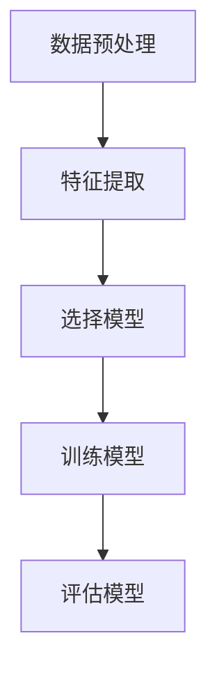
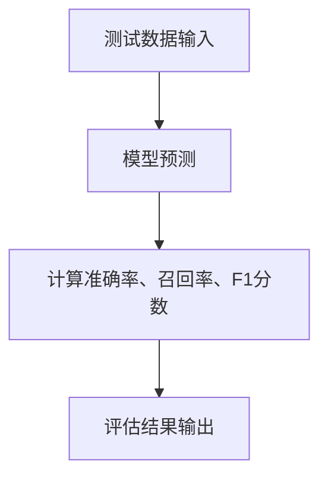
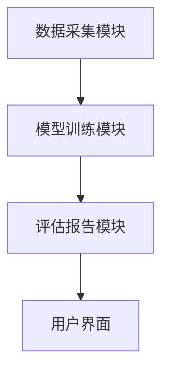
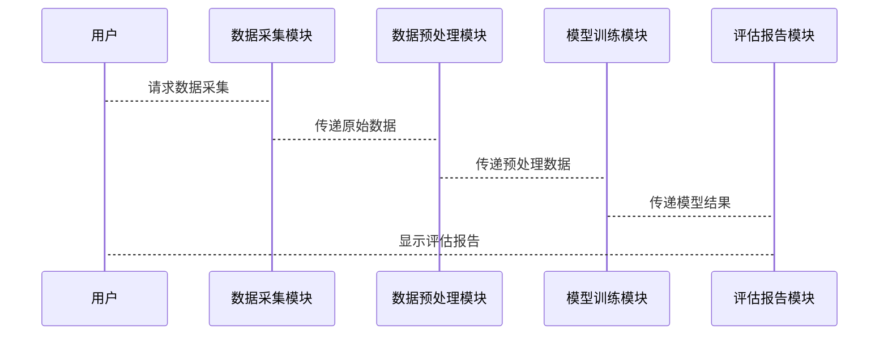

                 


# 智能系统辅助公司治理评估

## 关键词：智能系统，公司治理，评估，机器学习，数据分析

## 摘要：本文探讨了智能系统如何辅助公司治理评估，从概念、算法、系统架构到实际案例，全面解析智能技术在公司治理中的应用，提供深度的技术分析与实践指导。

---

## 第一部分：智能系统辅助公司治理评估概述

### 第1章：智能系统与公司治理评估概述

#### 1.1 智能系统的定义与特点
智能系统是指能够感知环境、处理信息并做出决策的计算机系统。其核心特点包括数据驱动、自动化决策、自适应学习和实时反馈。智能系统在企业管理中的作用主要体现在优化决策流程、提高效率和增强风险控制能力。

#### 1.2 公司治理评估的基本概念
公司治理是指通过合理的组织结构和制度，确保企业有效运作和利益相关者权益得到保护。公司治理评估是对企业治理结构、机制和效果进行全面评价的过程，通常包括治理结构的合理性、管理效率和风险控制能力等方面。

#### 1.3 智能系统辅助公司治理评估的背景
传统公司治理评估主要依赖人工分析和经验判断，存在效率低、主观性强和覆盖面有限等问题。随着大数据和人工智能技术的发展，智能系统能够通过数据挖掘和机器学习算法，提供更加客观、全面和高效的评估结果，从而推动公司治理的优化。

#### 1.4 本章小结
本章介绍了智能系统的定义和特点，阐述了公司治理评估的基本概念，并分析了智能系统在公司治理评估中的重要性。

---

## 第二部分：智能系统辅助公司治理评估的核心概念与联系

### 第2章：智能系统与公司治理评估的核心概念

#### 2.1 智能系统的核心原理
智能系统的原理主要包括数据采集、特征提取、模型训练和决策输出。数据驱动的决策是智能系统的核心，通过机器学习算法对海量数据进行分析，提取有用信息并生成决策建议。

#### 2.2 公司治理评估的关键要素
公司治理评估的关键要素包括治理结构、绩效指标和风险管理。治理结构涉及董事会、管理层和股东的职责划分；绩效指标包括财务指标、运营效率和创新能力；风险管理则是评估企业应对不确定性的能力。

#### 2.3 智能系统与公司治理评估的关联性
智能系统通过数据挖掘和机器学习技术，能够从大量企业数据中提取关键指标，建立评估模型，并自动生成评估结果。这种数据驱动的评估方法能够提高评估的客观性和准确性，同时降低评估成本。

#### 2.4 核心概念对比与ER实体关系图
以下是智能系统与公司治理评估的核心概念对比表：

| 比较维度 | 智能系统 | 公司治理评估 |
|----------|----------|--------------|
| 核心目标 | 数据驱动的决策支持 | 优化公司治理结构和效果 |
| 输入 | 结构化数据、非结构化数据 | 企业运营数据、财务数据 |
| 输出 | 决策建议、预测结果 | 评估报告、改进建议 |

以下是公司治理评估的ER实体关系图：

```mermaid
erDiagram
    actor 公司治理评估系统{}{
        company 企业
        governance_structure 治理结构
        performance_indicator 绩效指标
        risk_management 风险管理
    }
    company --> governance_structure : 包含
    company --> performance_indicator : 包含
    company --> risk_management : 包含
```

---

## 第三部分：智能系统辅助公司治理评估的算法原理

### 第3章：智能系统辅助公司治理评估的算法原理

#### 3.1 数据预处理与特征提取
数据预处理是智能系统辅助公司治理评估的第一步，包括数据清洗、数据标准化和数据转换。特征提取则是从原始数据中提取能够反映公司治理状况的关键特征，例如财务指标、管理效率和创新能力。

#### 3.2 机器学习模型的选择
在公司治理评估中，常用的机器学习模型包括逻辑回归、支持向量机（SVM）和随机森林。以下是机器学习模型选择的流程图：



#### 3.3 模型训练与评估
模型训练是通过历史数据训练机器学习模型，提取特征与目标变量之间的关系。模型评估则是通过测试数据验证模型的准确性和稳定性。以下是模型评估的流程图：



#### 3.4 数学模型与公式
以下是机器学习模型的数学公式示例：

- 逻辑回归模型：$$P(y=1|x) = \frac{1}{1 + e^{-\beta x}}$$
- 支持向量机（SVM）模型：$$y = \text{sign}(\sum_{i=1}^{n} \alpha_i y_i x_i \cdot x + b)$$

---

## 第四部分：智能系统辅助公司治理评估的系统架构设计

### 第4章：智能系统辅助公司治理评估的系统架构设计

#### 4.1 系统功能设计
以下是系统功能设计的领域模型类图：

```mermaid
classDiagram
    class 数据采集模块{}{
        采集企业数据
        数据预处理
    }
    class 模型训练模块{}{
        特征提取
        模型训练
    }
    class 评估报告模块{}{
        生成评估报告
        提出改进建议
    }
    数据采集模块 --> 模型训练模块 : 传递预处理数据
    模型训练模块 --> 评估报告模块 : 传递模型结果
```

#### 4.2 系统架构设计
以下是系统架构设计的架构图：



#### 4.3 系统接口设计
系统接口设计包括数据接口和用户接口。数据接口用于与企业数据源对接，用户接口用于显示评估结果和提供交互功能。

#### 4.4 系统交互设计
以下是系统交互的序列图：



---

## 第五部分：智能系统辅助公司治理评估的项目实战

### 第5章：智能系统辅助公司治理评估的项目实战

#### 5.1 环境安装
以下是项目环境安装步骤：

1. 安装Python：```bash
    pip install python
```
2. 安装必要的库：```bash
    pip install numpy pandas scikit-learn
```

#### 5.2 系统核心代码实现
以下是核心代码实现：

```python
import pandas as pd
from sklearn.model import LogisticRegression
from sklearn.metrics import accuracy_score

# 数据加载
data = pd.read_csv('company_governance.csv')

# 数据预处理
data = data.dropna()
data = pd.get_dummies(data)

# 特征提取
X = data.drop('target', axis=1)
y = data['target']

# 模型训练
model = LogisticRegression()
model.fit(X, y)

# 模型评估
y_pred = model.predict(X)
print(f"准确率: {accuracy_score(y, y_pred)}")
```

#### 5.3 案例分析与解读
以某企业为例，分析其治理结构、绩效指标和风险管理，通过智能系统生成评估报告并提出改进建议。

---

## 第六部分：智能系统辅助公司治理评估的总结与展望

### 第6章：智能系统辅助公司治理评估的总结与展望

#### 6.1 本章总结
智能系统通过数据驱动的方法，能够有效辅助公司治理评估，提高评估的客观性和效率。通过机器学习算法和系统架构设计，智能系统能够为企业提供全面的评估结果和改进建议。

#### 6.2 未来展望
未来，随着人工智能和大数据技术的进一步发展，智能系统在公司治理评估中的应用将更加广泛和深入。可能出现的新趋势包括更加个性化的评估模型、实时动态评估和多维度综合评估。

---

## 第七部分：最佳实践与注意事项

### 7.1 最佳实践
1. 数据质量是关键：确保数据的完整性和准确性。
2. 模型选择要合适：根据具体问题选择合适的算法。
3. 系统设计要合理：确保系统的可扩展性和可维护性。

### 7.2 注意事项
1. 数据隐私保护：确保数据的安全性和合规性。
2. 模型解释性：确保模型结果能够被理解和解释。
3. 系统稳定性：确保系统的稳定运行和故障恢复能力。

### 7.3 拓展阅读
推荐阅读以下书籍和论文：
- 《机器学习实战》
- 《企业治理与风险管理》
- 《智能系统与数据科学》

---

通过以上内容，我们系统地探讨了智能系统辅助公司治理评估的各个方面，从理论到实践，从概念到实现，为读者提供了全面的技术指导和实践参考。

