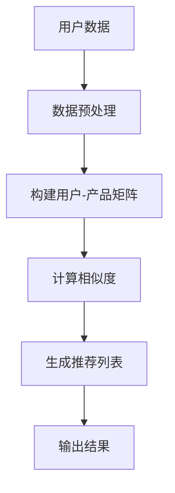
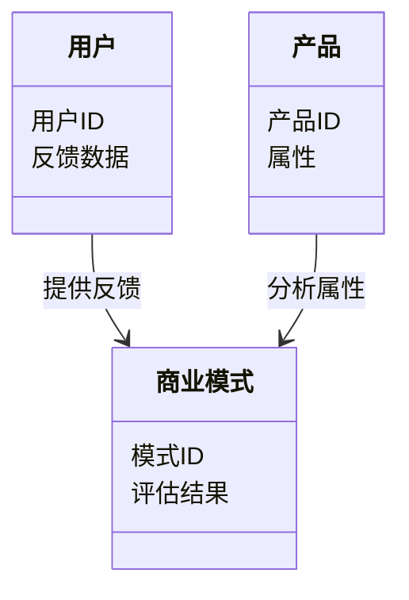
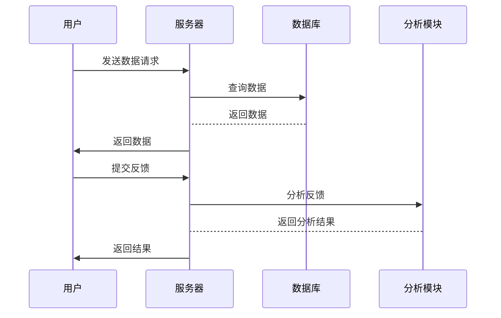

                 


# 智能系统辅助商业模式创新评估

## 关键词：智能系统，商业模式创新，机器学习，数据分析，系统架构

## 摘要：智能系统通过数据分析和机器学习技术，能够有效辅助商业模式的创新评估。本文从背景、核心概念、算法原理、系统架构到项目实战，详细阐述了智能系统在商业模式创新中的应用，为读者提供全面的理论和实践指导。

---

## 第一部分：智能系统与商业模式创新概述

### 第1章：智能系统与商业模式创新概述

#### 1.1 智能系统的基本概念
- **智能系统的定义**：智能系统是指能够感知环境、处理信息、做出决策并执行动作的系统，具备学习和自适应能力。
- **商业模式创新的定义**：商业模式是指企业如何创造价值、传递价值和获取价值的方式，商业模式创新则是指通过改变这些方式来提升企业竞争力。
- **智能系统与商业模式创新的关系**：智能系统通过数据驱动和自动化决策，能够显著提升商业模式的创新效率和效果。

#### 1.2 商业模式创新的背景与意义
- **背景**：传统商业模式面临数据不足、决策缓慢等问题，难以适应快速变化的市场环境。
- **意义**：智能系统能够通过数据分析和机器学习，帮助企业在竞争激烈的市场中快速找到新的商业模式。

### 第2章：智能系统辅助商业模式创新的核心概念

#### 2.1 智能系统辅助商业模式创新的原理
- **数据驱动的商业模式优化**：通过收集和分析大量数据，发现市场趋势和用户需求，从而优化商业模式。
- **人工智能在商业模式创新中的应用**：利用机器学习算法预测市场趋势，识别潜在的商业机会。
- **智能系统辅助创新的流程**：数据收集→数据分析→模式识别→创新建议→实施与优化。

#### 2.2 核心概念与联系
- **实体关系图（ER图）**：
```mermaid
erDiagram
    actor 用户
    actor 企业
    actor 市场
    actor 创新方案
    用户 --> 创新方案: 提供反馈
    企业 --> 创新方案: 应用测试
    市场 --> 创新方案: 数据收集
    创新方案 --> 用户: 输出结果
```
- **属性特征对比表格**：
| 比较维度 | 传统模式 | 智能系统模式 |
|----------|----------|--------------|
| 数据来源 | 结构化数据 | 结构化+非结构化数据 |
| 分析方式 | 统计分析 | 统计分析+机器学习 |
| 决策速度 | 人工决策 | 自动化决策 |

---

## 第二部分：智能系统辅助商业模式创新的算法原理

### 第3章：算法原理讲解

#### 3.1 算法选择与优化
- **协同过滤推荐算法**：基于用户行为数据，推荐相似产品的算法。
- **算法优化**：通过网格搜索优化模型参数，提升推荐准确率。

#### 3.2 算法实现
- **流程图**：

- **Python代码示例**：
```python
import numpy as np
from sklearn.metrics.pairwise import cosine_similarity

# 示例数据：用户-产品评分矩阵
users = ['User1', 'User2', 'User3']
products = ['Product1', 'Product2', 'Product3']
ratings = pd.DataFrame({
    'Product1': [4, 3, 2],
    'Product2': [2, 5, 4],
    'Product3': [1, 4, 5]
})

# 数据预处理
X = ratings.values

# 计算余弦相似度
similarity = cosine_similarity(X)

# 找出最相似的产品
def recommend_product(similarity_matrix, user_index, top_n=3):
    similar_indices = np.argsort(similarity_matrix[user_index])[::-1]
    recommendations = []
    for i in similar_indices:
        if i != user_index:
            recommendations.append((i, similarity_matrix[user_index][i]))
            if len(recommendations) == top_n:
                break
    return recommendations

# 示例用户索引
user_index = 0
recommendations = recommend_product(similarity, user_index)
print(recommendations)
```

#### 3.3 数学模型与公式
- **余弦相似度公式**：
$$ \text{similarity}(u, v) = \frac{\sum_{i=1}^{n} u_i v_i}{\sqrt{\sum_{i=1}^{n} u_i^2} \cdot \sqrt{\sum_{i=1}^{n} v_i^2}} $$
- **协同过滤预测公式**：
$$ \hat{r}_{u,i} = \bar{r} + \sum_{k=1}^{K} b_k (r_{u,k} - \bar{r}) $$

---

## 第三部分：智能系统辅助商业模式创新的系统架构

### 第4章：系统分析与架构设计

#### 4.1 问题场景介绍
- **问题场景**：企业需要通过智能系统快速评估新的商业模式。
- **项目介绍**：构建一个基于机器学习的商业模式评估系统。

#### 4.2 系统功能设计
- **领域模型类图**：


#### 4.3 系统架构设计
- **架构图**：


#### 4.4 系统接口设计
- **API接口**：
  - `/api/data/upload`：上传数据接口。
  - `/api/model/train`：训练模型接口。
  - `/api/predict/execute`：执行预测接口。

#### 4.5 系统交互序列图
- **交互流程**：


---

## 第四部分：项目实战与案例分析

### 第5章：项目实战

#### 5.1 环境安装
- **安装依赖**：
  - Python 3.8+
  - numpy, pandas, scikit-learn
  - mermaid CLI

#### 5.2 核心代码实现
- **推荐系统实现**：
```python
from sklearn.metrics.pairwise import cosine_similarity

def calculate_similarity(matrix):
    return cosine_similarity(matrix)

# 示例数据
data = [[4, 3, 2], [2, 5, 4], [1, 4, 5]]
similarity_matrix = calculate_similarity(data)
print(similarity_matrix)
```

#### 5.3 代码解读与分析
- **代码功能**：
  - 读取用户输入数据。
  - 计算相似度矩阵。
  - 输出相似度结果。

#### 5.4 实际案例分析
- **案例分析**：
  - 数据收集：从电商平台收集用户行为数据。
  - 数据分析：使用协同过滤算法分析数据，识别出用户的偏好。
  - 模式识别：基于分析结果，推荐新的商业模式。

#### 5.5 项目小结
- **项目总结**：
  - 成功实现了基于协同过滤的推荐系统。
  - 系统能够有效辅助商业模式的创新评估。

---

## 第五部分：最佳实践与总结

### 第6章：总结与展望

#### 6.1 最佳实践 tips
- **数据质量**：确保数据的准确性和完整性。
- **模型优化**：定期更新模型，避免过时。
- **用户隐私**：保护用户数据隐私，遵守相关法律法规。

#### 6.2 小结
- 智能系统通过数据分析和机器学习，能够有效辅助商业模式的创新评估。
- 本文详细介绍了算法原理、系统架构和项目实战，为读者提供了全面的指导。

#### 6.3 注意事项
- **数据隐私**：确保数据的安全性和隐私性。
- **模型可解释性**：提升模型的可解释性，便于用户理解和信任。

#### 6.4 拓展阅读
- 《机器学习实战》
- 《商业模式创新方法论》
- 《系统架构设计的艺术》

---

## 结语
智能系统辅助商业模式创新评估是一个复杂但极具潜力的领域。通过本文的详细讲解，读者可以掌握从理论到实践的全过程，为未来的创新和发展提供有力的技术支持。

