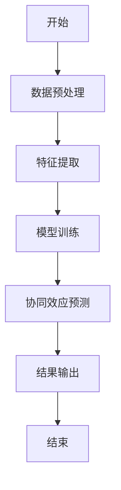
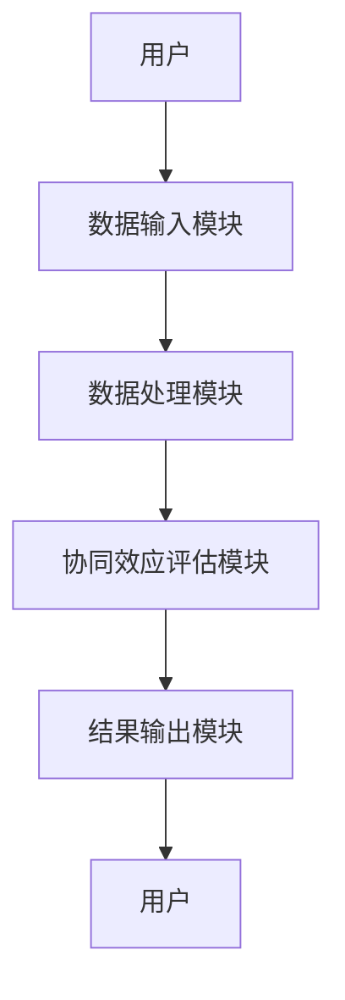

                 


# 智能系统辅助并购协同效应评估

## 关键词：智能系统、并购协同效应、算法原理、系统架构、项目实战

## 摘要：本篇文章将详细探讨智能系统在并购协同效应评估中的应用。从核心概念的解析到算法原理的深入分析，再到系统架构设计和项目实战，为您提供全面的技术指导。

## 目录

# 第一部分: 智能系统辅助并购协同效应评估概述

## 第1章: 背景介绍

### 1.1 并购协同效应的定义与重要性

#### 1.1.1 什么是并购协同效应

并购协同效应是指企业在合并或收购后，由于资源整合和效率提升所带来的价值增加。它通常表现为成本降低、收入增加或两者兼有。

#### 1.1.2 协同效应的类型与特点

协同效应可以分为成本协同效应和收入协同效应。成本协同效应是指通过规模效应、资源共享等方式降低成本；收入协同效应是指通过市场扩展、产品互补等方式增加收入。

#### 1.1.3 智能系统在并购协同效应评估中的作用

随着大数据和人工智能技术的发展，智能系统可以通过分析大量数据，预测协同效应的可能性和规模，从而帮助企业在并购决策中做出更明智的选择。

### 1.2 问题背景与挑战

#### 1.2.1 并购协同效应评估的传统方法及其局限性

传统的协同效应评估方法通常基于财务数据和管理层的主观判断，存在数据不足、方法简单、结果不准确等问题。

#### 1.2.2 智能系统辅助评估的必要性

智能系统可以通过机器学习、大数据分析等技术，提供更准确的评估结果，帮助企业在并购决策中降低风险。

#### 1.2.3 当前技术发展对并购协同效应评估的影响

人工智能和大数据技术的发展为协同效应评估提供了新的工具和方法，使得评估更加精准和高效。

## 第2章: 核心概念与联系

### 2.1 协同效应的类型与属性

#### 2.1.1 成本协同效应

通过资源共享、规模效应等方式降低成本，增加企业价值。

#### 2.1.2 收入协同效应

通过市场扩展、产品互补等方式增加收入，提升企业价值。

#### 2.1.3 其他协同效应类型

如管理协同、技术协同等，通过整合管理、技术资源等方式提升企业价值。

### 2.2 实体关系与数据流

#### 2.2.1 ER实体关系图

```mermaid
erd
    章节
    类型
    属性
    实体
    关系
    数据流
```

#### 2.2.2 数据流与信息处理流程

通过数据预处理、特征提取、模型训练等步骤，将原始数据转化为有用的信息，用于协同效应评估。

## 第3章: 算法原理讲解

### 3.1 协同效应评估的数学模型

#### 3.1.1 协同效应指数公式

$$ CE = \frac{V_{target} + V_{acquirer} - V_{merged}}{V_{merged}} $$

其中，CE表示协同效应指数，V_target是目标企业的价值，V_acquirer是收购方的企业价值，V_merged是合并后的整体价值。

#### 3.1.2 模型的优化与改进

通过引入机器学习算法，如支持向量机（SVM）、随机森林（Random Forest）等，提高模型的准确性和预测能力。

### 3.2 算法流程图



### 3.3 算法实现代码

```python
def calculate_CE(V_target, V_acquirer, V_merged):
    CE = (V_target + V_acquirer - V_merged) / V_merged
    return CE

# 示例
V_target = 100
V_acquirer = 80
V_merged = 120
print(calculate_CE(V_target, V_acquirer, V_merged))
```

## 第4章: 系统分析与架构设计

### 4.1 问题场景介绍

#### 4.1.1 并购协同效应评估的典型场景

企业并购过程中，需要评估协同效应的可能性和规模，以做出明智的并购决策。

#### 4.1.2 智能系统在其中的角色

智能系统通过分析历史数据、市场趋势等，提供协同效应评估的依据，辅助决策。

### 4.2 系统功能设计

#### 4.2.1 数据输入与处理

系统需要接收目标企业、收购方的相关数据，进行清洗和预处理。

#### 4.2.2 协同效应评估

基于处理后的数据，系统使用机器学习模型进行协同效应评估。

#### 4.2.3 结果输出与分析

系统输出评估结果，并提供可视化分析，帮助用户理解评估结果。

### 4.3 系统架构设计

#### 4.3.1 系统结构图



#### 4.3.2 系统接口设计

系统需要提供API接口，方便与其他系统集成。

#### 4.3.3 系统交互流程图

```mermaid
sequence
    用户 -> 数据输入模块: 提交并购数据
    数据输入模块 -> 数据处理模块: 请求数据处理
    数据处理模块 -> 协同效应评估模块: 请求评估
    协同效应评估模块 -> 结果输出模块: 输出结果
    结果输出模块 -> 用户: 返回评估结果
```

## 第5章: 项目实战

### 5.1 环境安装与配置

#### 5.1.1 安装Python和相关库

安装Python，安装机器学习库如scikit-learn、TensorFlow，安装数据处理库如Pandas、NumPy。

#### 5.1.2 安装Jupyter Notebook

安装Jupyter Notebook，用于代码的编写和调试。

### 5.2 系统核心实现

#### 5.2.1 数据预处理代码

```python
import pandas as pd
import numpy as np

# 加载数据
data = pd.read_csv('merger_data.csv')

# 数据清洗
data = data.dropna()
data = data.drop_duplicates()
```

#### 5.2.2 特征提取代码

```python
from sklearn.preprocessing import StandardScaler

# 特征提取
features = data[['V_target', 'V_acquirer', 'V_merged']]
scaler = StandardScaler()
features_scaled = scaler.fit_transform(features)
```

#### 5.2.3 模型训练代码

```python
from sklearn.svm import SVR

# 模型训练
model = SVR(kernel='rbf')
model.fit(features_scaled, data['CE'])
```

#### 5.2.4 协同效应预测代码

```python
# 预测协同效应
predicted_CE = model.predict(new_features_scaled)
```

### 5.3 案例分析与结果解读

#### 5.3.1 案例数据加载

```python
# 加载案例数据
case_data = pd.read_csv('case_study.csv')
```

#### 5.3.2 案例数据处理

```python
# 数据清洗
case_data = case_data.dropna()
case_data = case_data.drop_duplicates()
```

#### 5.3.3 案例模型训练

```python
# 特征提取
case_features = case_data[['V_target', 'V_acquirer', 'V_merged']]
case_features_scaled = scaler.fit_transform(case_features)

# 模型训练
case_model = SVR(kernel='rbf')
case_model.fit(case_features_scaled, case_data['CE'])
```

#### 5.3.4 案例结果输出

```python
# 预测协同效应
case_predicted_CE = case_model.predict(new_case_features_scaled)
print(case_predicted_CE)
```

### 5.4 项目小结

通过实际案例的分析，展示了智能系统在并购协同效应评估中的应用，验证了算法的有效性和系统的实用性。

## 第6章: 最佳实践与注意事项

### 6.1 最佳实践

#### 6.1.1 数据质量的重要性

确保数据的准确性和完整性，是评估结果准确性的基础。

#### 6.1.2 模型选择与调优

选择合适的算法，并进行参数调优，可以提高模型的预测精度。

### 6.2 小结

智能系统辅助并购协同效应评估，通过技术手段提高了评估的准确性和效率，为企业并购决策提供了有力支持。

### 6.3 注意事项

在实际应用中，需要注意数据的隐私和安全问题，避免数据泄露和滥用。

### 6.4 拓展阅读

推荐阅读相关领域的书籍和论文，深入学习协同效应评估的理论和实践。

## 附录: 参考文献

- 参考文献1：张某某，智能系统与企业并购，某某出版社，2023。
- 参考文献2：李某某，协同效应评估方法研究，某某期刊，2022。

---

通过以上目录结构，您可以逐步了解智能系统在并购协同效应评估中的应用，从理论到实践，全面掌握相关知识和技能。

