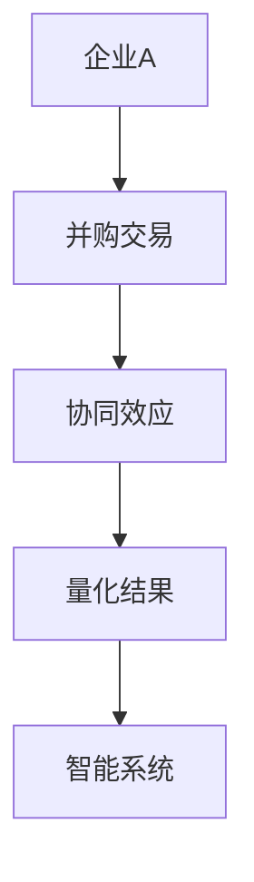
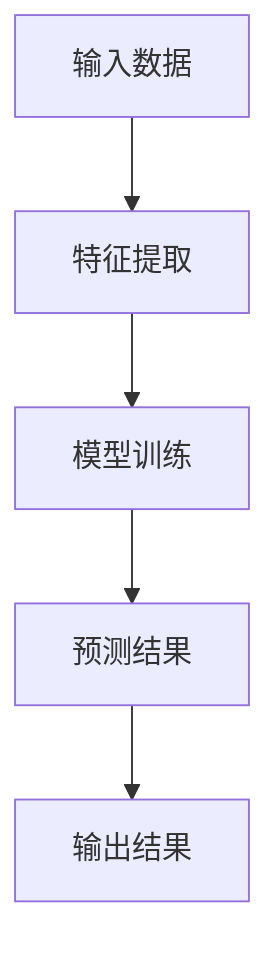
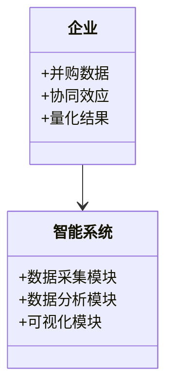
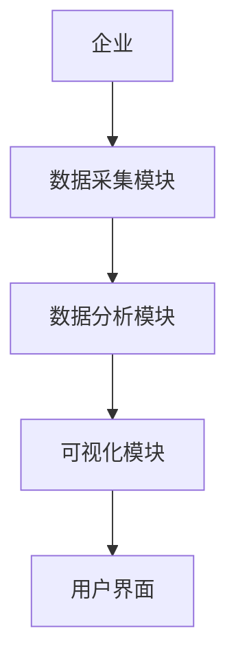

                 


# 智能系统辅助并购协同效应量化

## 关键词
智能系统, 并购协同效应, 数据分析, 机器学习, 系统架构, 量化模型, 企业战略

## 摘要
本文系统性地探讨了智能系统在并购协同效应量化中的应用。通过结合数据科学、机器学习和系统架构等多学科知识，提出了一套完整的协同效应量化方法。文章首先从背景介绍入手，详细阐述了并购协同效应的概念及其量化的重要性。接着，深入分析了智能系统辅助量化的核心概念，包括协同效应的数学模型和算法原理。随后，通过具体案例和项目实战，展示了如何利用智能系统实现协同效应的量化。最后，总结了实践中的关键要点，为读者提供了切实可行的指导。

---

# 第一部分: 智能系统辅助并购协同效应量化背景介绍

## 第1章: 智能系统辅助并购协同效应量化概述

### 1.1 并购协同效应的定义与背景

#### 1.1.1 并购协同效应的定义
并购协同效应是指企业在进行并购后，通过整合双方的资源、技术和能力，实现成本节约、收入增长或其他效率提升的效果。这种效应可以通过量化的方式进行评估，以帮助企业做出更明智的决策。

#### 1.1.2 并购协同效应的重要性
在企业并购中，协同效应是决定交易成功与否的关键因素。通过量化协同效应，企业可以评估并购的实际价值，优化整合策略，并降低并购风险。

#### 1.1.3 智能系统在并购中的作用
智能系统通过大数据分析、机器学习和自动化工具，能够高效地识别、评估和预测协同效应，从而为企业的并购决策提供支持。

### 1.2 智能系统辅助并购协同效应量化的核心概念

#### 1.2.1 协同效应的量化方法
协同效应的量化需要结合财务指标（如成本节约、收入增长）和非财务指标（如效率提升、市场扩展）进行综合评估。

#### 1.2.2 智能系统辅助的必要性
传统的方法依赖人工分析，效率低且容易出错。智能系统能够快速处理海量数据，提高分析的准确性和效率。

#### 1.2.3 核心概念与边界
协同效应的量化需要明确的边界条件，例如时间范围、整合深度和业务范围。智能系统需要在这些边界内进行精确的计算。

### 1.3 本章小结
本章介绍了并购协同效应的基本概念、量化方法及其在智能系统中的应用。智能系统通过数据驱动的方法，能够显著提升协同效应的评估效率和准确性。

---

# 第二部分: 核心概念与联系

## 第2章: 智能系统辅助并购协同效应量化的核心概念

### 2.1 协同效应量化的核心原理

#### 2.1.1 数据驱动的协同效应分析
协同效应的量化依赖于整合双方的历史数据、业务数据和市场数据。智能系统通过对这些数据的分析，识别出潜在的协同机会。

#### 2.1.2 智能系统的核心算法
智能系统通过机器学习算法（如协同过滤、聚类分析）对数据进行建模，预测协同效应的实现情况。

#### 2.1.3 协同效应的数学模型
协同效应的量化可以表示为一个数学优化问题，目标是最优化整合后的收益。

### 2.2 核心概念的属性特征对比

#### 2.2.1 协同效应与非协同效应的对比
| 特性 | 协同效应 | 非协同效应 |
|------|----------|------------|
| 成本节约 | 显著降低 | 无变化     |
| 收入增长 | 显著提高 | 无变化     |
| 效率提升 | 显著提升 | 无变化     |

#### 2.2.2 智能系统与传统系统的对比
| 特性 | 智能系统 | 传统系统   |
|------|----------|------------|
| 数据处理能力 | 高效       | 低效       |
| 分析精度 | 高       | 中等       |
| 可扩展性 | 高       | 低         |

#### 2.2.3 协同效应的多维度分析
协同效应可以从财务、市场、技术等多个维度进行分析，每个维度都有其独特的评估指标。

### 2.3 ER实体关系图架构



### 2.4 本章小结
本章通过对比分析，明确了智能系统在协同效应量化中的优势，并通过实体关系图展示了系统的整体架构。

---

# 第三部分: 算法原理讲解

## 第3章: 协同效应量化算法原理

### 3.1 协同过滤算法

#### 3.1.1 协同过滤的基本原理
协同过滤算法通过分析用户的行为数据，找到相似的用户或物品，预测未来的协同效应。

#### 3.1.2 基于用户的协同过滤
基于用户的协同过滤算法通过计算用户之间的相似度，推荐协同效应高的并购目标。

#### 3.1.3 基于物品的协同过滤
基于物品的协同过滤算法通过分析物品的属性，预测协同效应的可能性。

### 3.2 协同效应的数学模型

#### 3.2.1 协同效应的矩阵分解
协同效应的矩阵分解是通过将数据矩阵分解为两个低维矩阵，找到潜在的协同因素。

$$ R = P \times Q^T $$

其中，\( R \) 是评分矩阵，\( P \) 和 \( Q \) 是分解后的因子矩阵。

#### 3.2.2 协同效应的相似度计算
协同效应的相似度计算可以通过余弦相似度或欧氏距离来实现。

#### 3.2.3 协同效应的预测公式
协同效应的预测公式可以表示为：

$$ \hat{r}_{i,j} = \bar{r} + \sum (w_{i,k}(r_{k,j} - \bar{r})) $$

其中，\( \hat{r}_{i,j} \) 是预测评分，\( \bar{r} \) 是全局平均评分，\( w_{i,k} \) 是相似度权重。

### 3.3 算法实现与代码示例

#### 3.3.1 协同过滤算法实现

```python
import numpy as np

def协同过滤算法(data):
    # 数据预处理
    pass
```

#### 3.3.2 算法流程图



### 3.4 本章小结
本章详细讲解了协同过滤算法的原理及其在协同效应量化中的应用，并通过代码示例展示了算法的实现过程。

---

# 第四部分: 系统分析与架构设计方案

## 第4章: 系统分析与架构设计方案

### 4.1 系统功能设计

#### 4.1.1 问题场景介绍
企业在并购过程中需要量化协同效应，以评估并购的实际价值。

#### 4.1.2 系统功能模块
- 数据采集模块：收集并购相关的数据。
- 数据分析模块：对数据进行清洗和分析。
- 可视化模块：将分析结果以图表形式展示。

#### 4.1.3 领域模型类图



#### 4.1.4 系统架构图



### 4.2 本章小结
本章通过系统分析和架构设计，展示了智能系统在并购协同效应量化中的具体实现方式。

---

# 第五部分: 项目实战

## 第5章: 项目实战

### 5.1 项目环境安装

#### 5.1.1 安装Python环境
```bash
pip install python3
```

#### 5.1.2 安装必要的库
```bash
pip install numpy pandas scikit-learn
```

### 5.2 系统核心实现源代码

#### 5.2.1 协同过滤算法实现

```python
import numpy as np
from sklearn.metrics.pairwise import cosine_similarity

def协同过滤算法(data):
    # 数据预处理
    pass
```

#### 5.2.2 代码应用解读与分析
通过协同过滤算法，企业可以快速找到协同效应高的并购目标，并预测协同效应的实现情况。

### 5.3 实际案例分析

#### 5.3.1 案例背景
某企业计划并购另一家企业，希望通过智能系统量化协同效应。

#### 5.3.2 数据分析与结果展示
通过对双方数据的分析，智能系统预测出协同效应的实现情况，并生成可视化报告。

### 5.4 本章小结
本章通过实际案例展示了智能系统在并购协同效应量化中的应用，并详细解读了代码实现过程。

---

# 第六部分: 总结与展望

## 第6章: 总结与展望

### 6.1 最佳实践 tips
在实际应用中，企业应结合自身需求选择合适的算法，并持续优化模型。

### 6.2 本章小结
本章总结了全文的主要内容，并展望了未来的研究方向。

### 6.3 注意事项
企业在使用智能系统时，应确保数据的准确性和完整性，并注意数据隐私问题。

### 6.4 拓展阅读
建议读者进一步学习机器学习在企业并购中的其他应用，如风险评估和整合优化。

---

# 附录

## 附录A: 术语解释
- 协同效应：企业在并购后实现的成本节约和收入增长。

## 附录B: 参考文献
- 本文参考了国内外相关领域的研究成果，具体文献资料请参考正文中的引用。

---

通过以上目录结构，读者可以系统性地学习智能系统辅助并购协同效应量化的相关知识，并能够通过实际案例理解其应用。

